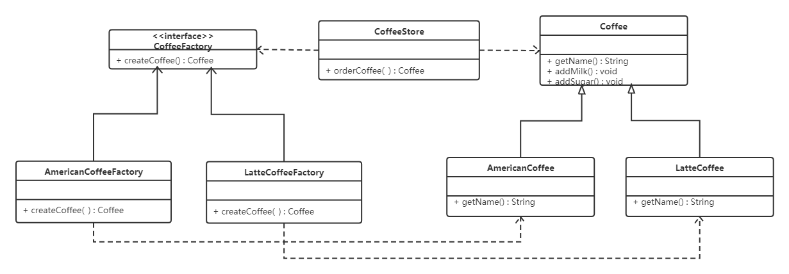
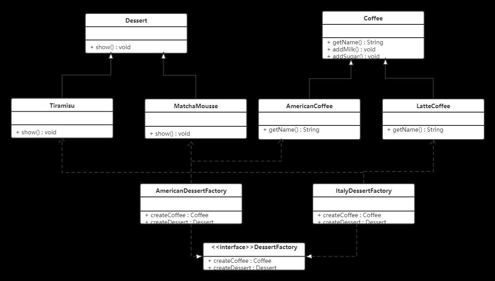
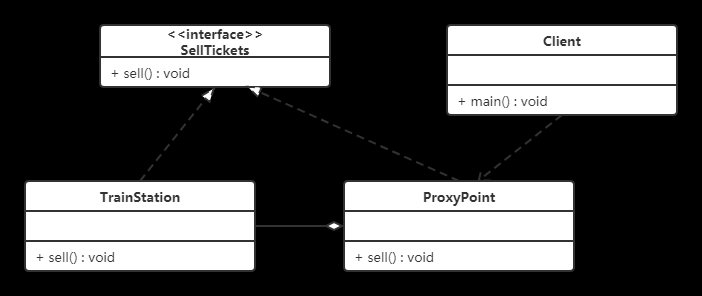
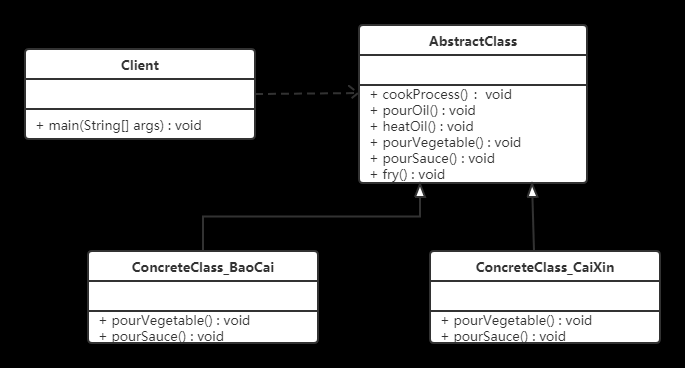
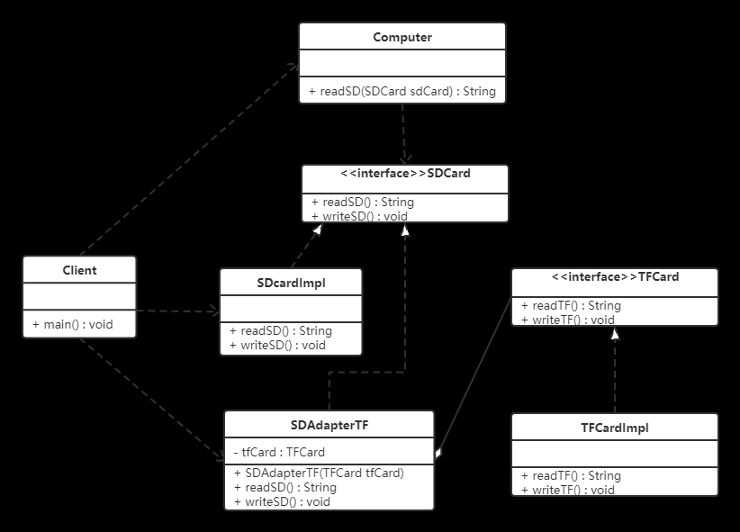

# 1. Spring 中的设计模式

设计模式(Design Patterns) 表示面向对象软件开发中最好的计算机编程实践.

软件设计模式（Software Design Pattern），又称设计模式，是一套被反复使用、多数人知晓的、经过分类编目的、代码设计经验的总结。它描述了在软件设计过程中的一些不断重复发生的问题，以及该问题的解决方案。也就是说，它是解决特定问题的一系列套路，是前辈们的代码设计经验的总结，具有一定的普遍性，可以反复使用。

## 1.1. 设计模式分类

### 1.1.1. 创建型模式

用于描述"怎样创建对象",它的主要特点是"将对象的创建与使用分离".GoF(四人组)书中提供了单例,原型,工厂方法,抽象工厂,建造者等 5 种创建型模式.

### 1.1.2. 结构型模式

用于描述如何将类或对象按某种布局组成更大的结构,GoF(四人组)书中提供了代理,适配器,桥接,装饰,外观,享元,组合等 7 种结构型模式.

### 1.1.3. 行为型模式

用于描述类或对象之间怎样相互协作共同完成单个对象无法单独完成的任务,以及怎样分配职责.GoF(四人组)书中提供了模板方法,策略,命令,职责链,状态,观察者,中介者,迭代器,访问者,备忘录,解释器等 11 种行为型模式.

## 1.2. 控制反转(IoC)和依赖注入(DI)

IoC(Inversion of Control,控制反转) 是一种解耦的设计思想.它使用 Spring 中的 IOC 容器实现具有依赖关系的对象之间的解耦,从而降低代码之间的耦合度.IOC 是一个原则,而不是一个模式,以下模式(但不限于)实现了IoC原则.


Spring IOC 容器就像是一个工厂一样,当我们需要创建一个对象的时候,只需要配置好配置文件/注解即可,完全不用考虑对象是如何被创建出来的. IOC 容器负责创建对象,将对象连接在一起,配置这些对象,并从创建中处理这些对象的整个生命周期,直到它们被完全销毁.

DI(Dependecy Inject,依赖注入)是实现控制反转的一种设计模式,依赖注入就是将实例变量传入到一个对象中去.

## 1.3. 工厂设计模式

Spring使用工厂模式可以通过 BeanFactory 或 ApplicationContext(常用) 创建 bean 对象.

1. BeanFactory :延迟注入(使用到某个 bean 的时候才会注入),相比于ApplicationContext 来说会占用更少的内存,程序启动速度更快.
1. ApplicationContext :容器启动的时候,一次性创建所有 bean .BeanFactory 仅提供了最基本的依赖注入支持,ApplicationContext 扩展了 BeanFactory ,除了有BeanFactory的功能还有额外更多功能,所以一般开发人员使用ApplicationContext会更多.

### 1.3.1. ApplicationContext的三个实现类

1. ClassPathXmlApplication:把上下文文件当成类路径资源.
2. FileSystemXmlApplication:从文件系统中的 XML 文件载入上下文定义信息.
3. XmlWebApplicationContext:从Web系统中的XML文件载入上下文定义信息.

Example:

```java
import org.springframework.context.ApplicationContext;
import org.springframework.context.support.FileSystemXmlApplicationContext;
 
public class App {
 public static void main(String[] args) {
  ApplicationContext context = new FileSystemXmlApplicationContext(
    "C:/work/IOC Containers/springframework.applicationcontext/src/main/resources/bean-factory-config.xml");
 
  HelloApplicationContext obj = (HelloApplicationContext) context.getBean("helloApplicationContext");
  obj.getMsg();
 }
}
```

### 1.3.2. 简单工厂模式(Simple Factory Pattern), 又称为静态工厂方法(Static Factory Method)模式

在简单工厂模式中，可以根据参数的不同返回不同类的实例。简单工厂模式专门定义一个类来负责创建其他类的实例，被创建的实例通常都具有共同的父类。

  

```java
public class SimpleCoffeeFactory {
​    public Coffee createCoffee(String type) {
        Coffee coffee = null;
        if("americano".equals(type)) {
            coffee = new AmericanoCoffee();
        } else if("latte".equals(type)) {
            coffee = new LatteCoffee();
        }
        return coffee;
    }
}
```

> 工厂（factory）处理创建对象的细节，一旦有了SimpleCoffeeFactory，CoffeeStore类中的orderCoffee()就变成此对象的客户，后期如果需要Coffee对象直接从工厂中获取即可。这样也就解除了和Coffee实现类的耦合，同时又产生了新的耦合，CoffeeStore对象和SimpleCoffeeFactory工厂对象的耦合，工厂对象和商品对象的耦合。后期如果再加新品种的咖啡，我们势必要需求修改SimpleCoffeeFactory的代码，违反了开闭原则。工厂类的客户端可能有很多，比如创建美团外卖等，这样只需要修改工厂类的代码，省去其他的修改操作。

### 1.3.3. 优缺点

#### 1.3.3.1. 优点

封装了创建对象的过程，可以通过参数直接获取对象。把对象的创建和业务逻辑层分开，这样以后就避免了修改客户代码，如果要实现新产品直接修改工厂类，而不需要在原代码中修改，这样就降低了客户代码修改的可能性，更加容易扩展。

#### 1.3.3.2. 缺点

增加新产品时还是需要修改工厂类的代码，违背了“开闭原则”。

### 1.3.4. 工厂方法模式

针对上例中的缺点，使用工厂方法模式就可以完美的解决，完全遵循开闭原则。

#### 1.3.4.1. 概念

定义一个用于创建对象的接口，让子类决定实例化哪个产品类对象。工厂方法使一个产品类的实例化延迟到其工厂的子类。

#### 1.3.4.2. 工厂方法模式的主要角色

1. 抽象工厂（Abstract Factory）：提供了创建产品的接口，调用者通过它访问具体工厂的工厂方法来创建产品。
1. 具体工厂（ConcreteFactory）：主要是实现抽象工厂中的抽象方法，完成具体产品的创建。
1. 抽象产品（Product）：定义了产品的规范，描述了产品的主要特性和功能。
1. 具体产品（ConcreteProduct）：实现了抽象产品角色所定义的接口，由具体工厂来创建，它同具体工厂之间一一对应。

#### 1.3.4.3. 实现

  

```java
// 抽象工厂：
public interface CoffeeFactory {
​
    Coffee createCoffee();
}
// 具体工厂：
public class LatteCoffeeFactory implements CoffeeFactory {
​
    public Coffee createCoffee() {
        return new LatteCoffee();
    }
}
​
public class AmericanCoffeeFactory implements CoffeeFactory {
​
    public Coffee createCoffee() {
        return new AmericanCoffee();
    }
}
// 咖啡店类：
public class CoffeeStore {
​
    private CoffeeFactory factory;
​
    public CoffeeStore(CoffeeFactory factory) {
        this.factory = factory;
    }
​
    public Coffee orderCoffee(String type) {
        Coffee coffee = factory.createCoffee();
        coffee.addMilk();
        coffee.addsugar();
        return coffee;
    }
}
```

从以上的编写的代码可以看到，要增加产品类时也要相应地增加工厂类，不需要修改工厂类的代码了，这样就解决了简单工厂模式的缺点。
工厂方法模式是简单工厂模式的进一步抽象。由于使用了多态性，工厂方法模式保持了简单工厂模式的优点，而且克服了它的缺点。

#### 1.3.4.4. 优缺点

1. 优点：
用户只需要知道具体工厂的名称就可得到所要的产品，无须知道产品的具体创建过程；
在系统增加新的产品时只需要添加具体产品类和对应的具体工厂类，无须对原工厂进行任何修改，满足开闭原则；
1. 缺点：
每增加一个产品就要增加一个具体产品类和一个对应的具体工厂类，这增加了系统的复杂度。

### 1.3.5. 抽象工厂模式

抽象工厂模式将考虑多等级产品的生产，将同一个具体工厂所生产的位于不同等级的一组产品称为一个产品族

#### 1.3.5.1. 概念

是一种为访问类提供一个创建一组相关或相互依赖对象的接口，且访问类无须指定所要产品的具体类就能得到同族的不同等级的产品的模式结构。

抽象工厂模式是工厂方法模式的升级版本，工厂方法模式只生产一个等级的产品，而抽象工厂模式可生产多个等级的产品。

#### 1.3.5.2. 结构

抽象工厂模式的主要角色如下：

1. 抽象工厂（Abstract Factory）：提供了创建产品的接口，它包含多个创建产品的方法，可以创建多个不同等级的产品。
1. 具体工厂（Concrete Factory）：主要是实现抽象工厂中的多个抽象方法，完成具体产品的创建。
1. 抽象产品（Product）：定义了产品的规范，描述了产品的主要特性和功能，抽象工厂模式有多个抽象产品。
1. 具体产品（ConcreteProduct）：实现了抽象产品角色所定义的接口，由具体工厂来创建，它 同具体工厂之间是多对一的关系。

#### 1.3.5.3. 实现

  

```java
// 抽象工厂：
public interface DessertFactory {
​
    Coffee createCoffee();
​
    Dessert createDessert();
}
// 具体工厂：
//美式甜点工厂
public class AmericanDessertFactory implements DessertFactory {
​
    public Coffee createCoffee() {
        return new AmericanCoffee();
    }
​
    public Dessert createDessert() {
        return new MatchaMousse();
    }
}
//意大利风味甜点工厂
public class ItalyDessertFactory implements DessertFactory {
​
    public Coffee createCoffee() {
        return new LatteCoffee();
    }
​
    public Dessert createDessert() {
        return new Tiramisu();
    }
}
```

如果要加同一个产品族的话，只需要再加一个对应的工厂类即可，不需要修改其他的类。

#### 1.3.5.4. 优缺点

1. 优点：
当一个产品族中的多个对象被设计成一起工作时，它能保证客户端始终只使用同一个产品族中的对象。
1. 缺点：
当产品族中需要增加一个新的产品时，所有的工厂类都需要进行修改。

#### 1.3.5.5. 使用场景

当需要创建的对象是一系列相互关联或相互依赖的产品族时，如电器工厂中的电视机、洗衣机、空调等。
系统中有多个产品族，但每次只使用其中的某一族产品。如有人只喜欢穿某一个品牌的衣服和鞋。
系统中提供了产品的类库，且所有产品的接口相同，客户端不依赖产品实例的创建细节和内部结构。
如：输入法换皮肤，一整套一起换。生成不同操作系统的程序。

## 1.4. 单例设计模式

在我们的系统中,有一些对象其实我们只需要一个,比如说:线程池,缓存,对话框,注册表,日志对象,充当打印机,显卡等设备驱动程序的对象.事实上,这一类对象只能有一个实例,如果制造出多个实例就可能会导致一些问题的产生,比如:程序的行为异常,资源使用过量,或者不一致性的结果.

使用单例模式的好处:

- 对于频繁使用的对象,可以省略创建对象所花费的时间,这对于那些重量级对象而言,是非常可观的一笔系统开销;
- 由于 new 操作的次数减少,因而对系统内存的使用频率也会降低,这将减轻 GC 压力,缩短 GC 停顿时间.

Spring 中 bean 的默认作用域就是 singleton(单例)的. 除了 singleton 作用域,Spring 中 bean 还有下面几种作用域:

- prototype : 每次请求都会创建一个新的 bean 实例.
- request : 每一次HTTP请求都会产生一个新的bean,该bean仅在当前HTTP request内有效.
- session : 每一次HTTP请求都会产生一个新的 bean,该bean仅在当前 HTTP session 内有效.
- global-session: 全局session作用域,仅仅在基于portlet的web应用中才有意义,Spring5已经没有了.Portlet是能够生成语义代码(例如:HTML)片段的小型Java Web插件.它们基于portlet容器,可以像servlet一样处理HTTP请求.但是,与 servlet 不同,每个 portlet 都有不同的会话

Spring 实现单例的方式:

- xml : <bean id="userService" class="top.snailclimb.UserService" scope="singleton"/>
- 注解:@Scope(value = "singleton")

Spring 通过 ConcurrentHashMap 实现单例注册表的特殊方式实现单例模式.Spring 实现单例的核心代码如下

```java
// 通过 ConcurrentHashMap(线程安全) 实现单例注册表
private final Map<String, Object> singletonObjects = new ConcurrentHashMap<String, Object>(64);

public Object getSingleton(String beanName, ObjectFactory<?> singletonFactory) {
        Assert.notNull(beanName, "'beanName' must not be null");
        synchronized (this.singletonObjects) {
            // 检查缓存中是否存在实例  
            Object singletonObject = this.singletonObjects.get(beanName);
            if (singletonObject == null) {
                //...省略了很多代码
                try {
                    singletonObject = singletonFactory.getObject();
                }
                //...省略了很多代码
                // 如果实例对象在不存在,我们注册到单例注册表中.
                addSingleton(beanName, singletonObject);
            }
            return (singletonObject != NULL_OBJECT ? singletonObject : null);
        }
    }
    //将对象添加到单例注册表
    protected void addSingleton(String beanName, Object singletonObject) {
            synchronized (this.singletonObjects) {
                this.singletonObjects.put(beanName, (singletonObject != null ? singletonObject : NULL_OBJECT));

            }
        }
```

### 1.4.1. 定义

单例模式（Singleton Pattern）是 Java 中最简单的设计模式之一。这种类型的设计模式属于创建型模式，它提供了一种创建对象的最佳方式

这种模式涉及到一个单一的类，该类负责创建自己的对象，同时确保只有单个对象被创建。这个类提供了一种访问其唯一的对象的方式，可以直接访问，不需要实例化该类的对象

### 1.4.2. 单例模式的主要有以下角色

1. 单例类。只能创建一个实例的类
1. 访问类。使用单例类

### 1.4.3. 单例模式的实现

#### 1.4.3.1. 单例设计模式分饿汉式和懒汉式

1. 饿汉式：类加载就会导致该单实例对象被创建
1. 懒汉式：类加载不会导致该单实例对象被创建，而是首次使用该对象时才会创建

### 1.4.4. 饿汉式-方式1（静态变量创建类的对象）

```java
public class Singleton {
    //私有构造方法
    private Singleton() {}
​
    //在成员位置创建该类的对象
    private static Singleton instance = new Singleton();
​
    //对外提供静态方法获取该对象
    public static Singleton getInstance() {
        return instance;
    }
}
```

该方式在成员位置声明Singleton类型的静态变量，并创建Singleton类的对象instance。instance对象是随着类的加载而创建的。如果该对象足够大的话，而一直没有使用就会造成内存的浪费。

### 1.4.5. 饿汉式-方式2（在静态代码块中创建该类对象）

```java
public class Singleton {
​
    //私有构造方法
    private Singleton() {}
​
    //在成员位置创建该类的对象
    private static Singleton instance;
​
    static {
        instance = new Singleton();
    }
​
    //对外提供静态方法获取该对象
    public static Singleton getInstance() {
        return instance;
    }
}
```

该方式在成员位置声明Singleton类型的静态变量，而对象的创建是在静态代码块中，也是对着类的加载而创建。所以和饿汉式的方式1基本上一样，当然该方式也存在内存浪费问题。

### 1.4.6. 懒汉式-方式1（线程不安全）

```java
public class Singleton {
    //私有构造方法
    private Singleton() {}
​
    //在成员位置创建该类的对象
    private static Singleton instance;
​
    //对外提供静态方法获取该对象
    public static Singleton getInstance() {
​
        if(instance == null) {
            instance = new Singleton();
        }
        return instance;
    }
}
```

从上面代码我们可以看出该方式在成员位置声明Singleton类型的静态变量，并没有进行对象的赋值操作，那么什么时候赋值的呢？当调用getInstance()方法获取Singleton类的对象的时候才创建Singleton类的对象，这样就实现了懒加载的效果。但是，如果是多线程环境，会出现线程安全问题。

### 1.4.7. 懒汉式-方式2（线程安全）

public class Singleton {
    //私有构造方法
    private Singleton() {}
​
    //在成员位置创建该类的对象
    private static Singleton instance;
​
    //对外提供静态方法获取该对象
    public static synchronized Singleton getInstance() {
​
        if(instance == null) {
            instance = new Singleton();
        }
        return instance;
    }
}
该方式也实现了懒加载效果，同时又解决了线程安全问题。但是在getInstance()方法上添加了synchronized关键字，导致该方法的执行效果特别低。从上面代码我们可以看出，其实就是在初始化instance的时候才会出现线程安全问题，一旦初始化完成就不存在了。

### 1.4.8. 懒汉式-方式3（双重检查锁）

再来讨论一下懒汉模式中加锁的问题，对于 getInstance() 方法来说，绝大部分的操作都是读操作，读操作是线程安全的，所以我们没必让每个线程必须持有锁才能调用该方法，我们需要调整加锁的时机。由此也产生了一种新的实现模式：双重检查锁模式

```java
public class Singleton {
​
    //私有构造方法
    private Singleton() {}
​
    private static volatile Singleton instance;
​
   //对外提供静态方法获取该对象
    public static Singleton getInstance() {
        //第一次判断，如果instance不为null，不进入抢锁阶段，直接返回实际
        if(instance == null) {
            synchronized (Singleton.class) {
                //抢到锁之后再次判断是否为空
                if(instance == null) {
                    instance = new Singleton();
                }
            }
        }
        return instance;
    }
}

```

添加 volatile 关键字之后的双重检查锁模式是一种比较好的单例实现模式，能够保证在多线程的情况下线程安全也不会有性能问题。

### 1.4.9. 懒汉式-方式4（静态内部类方式）

静态内部类单例模式中实例由内部类创建，由于 JVM 在加载外部类的过程中, 是不会加载静态内部类的, 只有内部类的属性/方法被调用时才会被加载, 并初始化其静态属性。静态属性由于被 static 修饰，保证只被实例化一次，并且严格保证实例化顺序。

```java
public class Singleton {
​
    //私有构造方法
    private Singleton() {}
​
    private static class SingletonHolder {
        private static final Singleton INSTANCE = new Singleton();
    }
​
    //对外提供静态方法获取该对象
    public static Singleton getInstance() {
        return SingletonHolder.INSTANCE;
    }
}
```

第一次加载Singleton类时不会去初始化INSTANCE，只有第一次调用getInstance，虚拟机加载SingletonHolder, 并初始化INSTANCE，这样不仅能确保线程安全，也能保证 Singleton 类的唯一性。

静态内部类单例模式是一种优秀的单例模式，是开源项目中比较常用的一种单例模式。在没有加任何锁的情况下，保证了多线程下的安全，并且没有任何性能影响和空间的浪费。

### 1.4.10. 枚举方式

枚举类实现单例模式是极力推荐的单例实现模式，因为枚举类型是线程安全的，并且只会装载一次，设计者充分的利用了枚举的这个特性来实现单例模式，枚举的写法非常简单，而且枚举类型是所用单例实现中唯一一种不会被破坏的单例实现模式。


```java
public enum Singleton {

    INSTANCE;

}
```

枚举方式属于恶汉式方式。

## 1.5. 代理设计模式

### 1.5.1. 代理模式在 AOP 中的应用

AOP(Aspect-Oriented Programming:面向切面编程)能够将那些与业务无关,却为业务模块所共同调用的逻辑或责任(例如事务处理,日志管理,权限控制等)封装起来,便于减少系统的重复代码,降低模块间的耦合度,并有利于未来的可拓展性和可维护性.

Spring AOP 就是基于动态代理的,如果要代理的对象,实现了某个接口,那么Spring AOP会使用JDK Proxy,去创建代理对象,而对于没有实现接口的对象,就无法使用 JDK Proxy 去进行代理了,这时候Spring AOP会使用Cglib ,这时候Spring AOP会使用 Cglib 生成一个被代理对象的子类来作为代理,如下图所示:


当然你也可以使用 AspectJ ,Spring AOP 已经集成了AspectJ  ,AspectJ  应该算的上是 Java 生态系统中最完整的 AOP 框架了.

使用 AOP 之后我们可以把一些通用功能抽象出来,在需要用到的地方直接使用即可,这样大大简化了代码量.我们需要增加新功能时也方便,这样也提高了系统扩展性.日志功能,事务管理等等场景都用到了 AOP .

### 1.5.2. Spring AOP 和 AspectJ AOP 有什么区别?

Spring AOP 属于运行时增强,而 AspectJ 是编译时增强. Spring AOP 基于代理(Proxying),而 AspectJ 基于字节码操作(Bytecode Manipulation).

 Spring AOP 已经集成了 AspectJ  ,AspectJ  应该算的上是 Java 生态系统中最完整的 AOP 框架了.AspectJ  相比于 Spring AOP 功能更加强大,但是 Spring AOP 相对来说更简单,

如果我们的切面比较少,那么两者性能差异不大.但是,当切面太多的话,最好选择 AspectJ ,它比Spring AOP 快很多.

### 1.5.3. 概述

由于某些原因需要给某对象提供一个代理以控制对该对象的访问。这时，访问对象不适合或者不能直接引用目标对象，代理对象作为访问对象和目标对象之间的中介。

Java中的代理按照代理类生成时机不同又分为静态代理和动态代理。静态代理代理类在编译期就生成，而动态代理代理类则是在Java运行时动态生成。动态代理又有JDK代理和CGLib代理两种。

### 1.5.4. 代理（Proxy）模式分为三种角色

1. 抽象主题（Subject）类： 通过接口或抽象类声明真实主题和代理对象实现的业务方法。
1. 真实主题（Real Subject）类： 实现了抽象主题中的具体业务，是代理对象所代表的真实对象，是最终要引用的对象。
1. 代理（Proxy）类 ： 提供了与真实主题相同的接口，其内部含有对真实主题的引用，它可以访问、控制或扩展真实主题的功能。

### 1.5.5. 静态代理

  

案例: 如果要买火车票的话，需要去火车站买票，坐车到火车站，排队等一系列的操作，显然比较麻烦。而火车站在多个地方都有代售点，我们去代售点买票就方便很多了。这个例子其实就是典型的代理模式，火车站是目标对象，代售点是代理对象

```java
//卖票接口
public interface SellTickets {
    void sell();
}
​
//火车站  火车站具有卖票功能，所以需要实现SellTickets接口
public class TrainStation implements SellTickets {
    public void sell() {
        System.out.println("火车站卖票");
    }
}
​
//代售点
public class ProxyPoint implements SellTickets {
    private TrainStation station = new TrainStation();
    public void sell() {
        System.out.println("代理点收取一些服务费用");
        station.sell();
    }
}
​
//测试类
public class Client {
    public static void main(String[] args) {
        ProxyPoint pp = new ProxyPoint();
        pp.sell();
    }
}
```

测试类直接访问的是ProxyPoint类对象，也就是说ProxyPoint作为访问对象和目标对象的中介。同时也对sell方法进行了增强（代理点收取一些服务费用）。

### 1.5.6. JDK动态代理

Java中提供了一个动态代理类Proxy，Proxy并不是我们上述所说的代理对象的类，而是提供了一个创建代理对象的静态方法（newProxyInstance方法）来获取代理对象。

```java
//卖票接口

public interface SellTickets {
    void sell();
}
​
//火车站  火车站具有卖票功能，所以需要实现SellTickets接口
public class TrainStation implements SellTickets {
    public void sell() {
        System.out.println("火车站卖票");
    }
}
​
//代理工厂，用来创建代理对象
public class ProxyFactory {
    private TrainStation station = new TrainStation();
​    public SellTickets getProxyObject() {
        //使用Proxy获取代理对象
        /*
            newProxyInstance()方法参数说明：
                ClassLoader loader ： 类加载器，用于加载代理类，使用真实对象的类加载器即可
                Class<?>[] interfaces ： 真实对象所实现的接口，代理模式真实对象和代理对象实现相同的接口
                InvocationHandler h ： 代理对象的调用处理程序
         */
        SellTickets sellTickets = (SellTickets) Proxy.newProxyInstance(station.getClass().getClassLoader(),
                station.getClass().getInterfaces(),
                new InvocationHandler() {
                    /*
                        InvocationHandler中invoke方法参数说明：
                            proxy ： 代理对象
                            method ： 对应于在代理对象上调用的接口方法的 Method 实例
                            args ： 代理对象调用接口方法时传递的实际参数
                     */
                    public Object invoke(Object proxy, Method method, Object[] args) throws Throwable {
​
                        System.out.println("代理点收取一些服务费用(JDK动态代理方式)");
                        //执行真实对象
                        Object result = method.invoke(station, args);
                        return result;
                    }
                });
        return sellTickets;
    }
}
​
//测试类
public class Client {
    public static void main(String[] args) {
        //获取代理对象
        ProxyFactory factory = new ProxyFactory();
        SellTickets proxyObject = factory.getProxyObject();
        proxyObject.sell();
    }
}
```

### 1.5.7. 优缺点

#### 1.5.7.1. 优点

1. 代理模式在客户端与目标对象之间起到一个中介作用和保护目标对象的作用；
1. 代理对象可以扩展目标对象的功能；
1. 代理模式能将客户端与目标对象分离，在一定程度上降低了系统的耦合度；

#### 1.5.7.2. 缺点

1. 增加了系统的复杂度；

## 1.6. 模板方法

模板方法模式是一种行为设计模式,它定义一个操作中的算法的骨架,而将一些步骤延迟到子类中. 模板方法使得子类可以不改变一个算法的结构即可重定义该算法的某些特定步骤的实现方式.

```java
public abstract class Template {
    //这是我们的模板方法
    public final void TemplateMethod(){
        PrimitiveOperation1();  
        PrimitiveOperation2();
        PrimitiveOperation3();
    }
    protected void  PrimitiveOperation1(){
        //当前类实现
    }
    //被子类实现的方法
    protected abstract void PrimitiveOperation2();
    protected abstract void PrimitiveOperation3();
}
public class TemplateImpl extends Template {
    @Override
    public void PrimitiveOperation2() {
        //当前类实现
    }
    @Override
    public void PrimitiveOperation3() {
        //当前类实现
    }
}
```

Spring 中 jdbcTemplate,hibernateTemplate 等以 Template 结尾的对数据库操作的类,它们就使用到了模板模式.一般情况下,我们都是使用继承的方式来实现模板模式,但是 Spring 并没有使用这种方式,而是使用Callback 模式与模板方法模式配合,既达到了代码复用的效果,同时增加了灵活性.

### 1.6.1. 模板方法（Template Method）模式包含以下主要角色

#### 1.6.1.1. 抽象类（Abstract Class）

负责给出一个算法的轮廓和骨架。它由一个模板方法和若干个基本方法构成

##### 1.6.1.1.1. 模板方法：定义了算法的骨架，按某种顺序调用其包含的基本方法

##### 1.6.1.1.2. 基本方法：是实现算法各个步骤的方法，是模板方法的组成部分。基本方法又可以分为三种

1. 抽象方法(Abstract Method) ：一个抽象方法由抽象类声明、由其具体子类实现。
1. 具体方法(Concrete Method) ：一个具体方法由一个抽象类或具体类声明并实现，其子类可以进行覆盖也可以直接继承。
1. 钩子方法(Hook Method) ：在抽象类中已经实现，包括用于判断的逻辑方法和需要子类重写的空方法两种。
一般钩子方法是用于判断的逻辑方法，这类方法名一般为isXxx，返回值类型为boolean类型。

#### 1.6.1.2. 具体子类（Concrete Class）

实现抽象类中所定义的抽象方法和钩子方法，它们是一个顶级逻辑的组成步骤

  

案例: 炒菜的步骤是固定的，分为倒油、热油、倒蔬菜、倒调料品、翻炒等步骤。现通过模板方法模式来用代码模拟。

```java
public abstract class AbstractClass {
    public final void cookProcess() {
        //第一步：倒油
        this.pourOil();
        //第二步：热油
        this.heatOil();
        //第三步：倒蔬菜
        this.pourVegetable();
        //第四步：倒调味料
        this.pourSauce();
        //第五步：翻炒
        this.fry();
    }
​
    public void pourOil() {
        System.out.println("倒油");
    }
​
    //第二步：热油是一样的，所以直接实现
    public void heatOil() {
        System.out.println("热油");
    }
​
    //第三步：倒蔬菜是不一样的（一个下包菜，一个是下菜心）
    public abstract void pourVegetable();
​
    //第四步：倒调味料是不一样
    public abstract void pourSauce();
​
    //第五步：翻炒是一样的，所以直接实现
    public void fry(){
        System.out.println("炒啊炒啊炒到熟啊");
    }
}
​
public class ConcreteClass_BaoCai extends AbstractClass {
​
    @Override
    public void pourVegetable() {
        System.out.println("下锅的蔬菜是包菜");
    }
​
    @Override
    public void pourSauce() {
        System.out.println("下锅的酱料是辣椒");
    }
}
​
public class ConcreteClass_CaiXin extends AbstractClass {
    @Override
    public void pourVegetable() {
        System.out.println("下锅的蔬菜是菜心");
    }
​
    @Override
    public void pourSauce() {
        System.out.println("下锅的酱料是蒜蓉");
    }
}
​
public class Client {
    public static void main(String[] args) {
        //炒手撕包菜
        ConcreteClass_BaoCai baoCai = new ConcreteClass_BaoCai();
        baoCai.cookProcess();
​
        //炒蒜蓉菜心
        ConcreteClass_CaiXin caiXin = new ConcreteClass_CaiXin();
        caiXin.cookProcess();
    }
}
// 注意：为防止恶意操作，一般模板方法都加上 final 关键词。
```

### 1.6.2. 优缺点

#### 1.6.2.1. 优点

1. 提高代码复用性: 将相同部分的代码放在抽象的父类中，而将不同的代码放入不同的子类中。
1. 实现了反向控制: 通过一个父类调用其子类的操作，通过对子类的具体实现扩展不同的行为，实现了反向控制 ，并符合“开闭原则”。

#### 1.6.2.2. 缺点

1. 对每个不同的实现都需要定义一个子类，这会导致类的个数增加，系统更加庞大，设计也更加抽象。
1. 父类中的抽象方法由子类实现，子类执行的结果会影响父类的结果，这导致一种反向的控制结构，它提高了代码阅读的难度。

### 1.6.3. 适用场景

1. 算法的整体步骤很固定，但其中个别部分易变时，这时候可以使用模板方法模式，将容易变的部分抽象出来，供子类实现。
1. 需要通过子类来决定父类算法中某个步骤是否执行，实现子类对父类的反向控制。

## 1.7. 观察者模式

观察者模式是一种对象行为型模式.它表示的是一种对象与对象之间具有依赖关系,当一个对象发生改变的时候,这个对象所依赖的对象也会做出反应.Spring 事件驱动模型就是观察者模式很经典的一个应用.Spring 事件驱动模型非常有用,在很多场景都可以解耦我们的代码.比如我们每次添加商品的时候都需要重新更新商品索引,这个时候就可以利用观察者模式来解决这个问题.

### 1.7.1. Spring 的事件流程总结

1. 定义一个事件: 实现一个继承自 ApplicationEvent,并且写相应的构造函数;
2. 定义一个事件监听者:实现 ApplicationListener 接口,重写 onApplicationEvent() 方法;
3. 使用事件发布者发布消息:  可以通过 ApplicationEventPublisher 的 publishEvent() 方法发布消息.

Example:

```java
// 定义一个事件,继承自ApplicationEvent并且写相应的构造函数
public class DemoEvent extends ApplicationEvent{
    private static final long serialVersionUID = 1L;
    private String message;
    public DemoEvent(Object source,String message){
        super(source);
        this.message = message;
    }
    public String getMessage() {
         return message;
          }
// 定义一个事件监听者,实现ApplicationListener接口,重写 onApplicationEvent() 方法;
@Component
public class DemoListener implements ApplicationListener<DemoEvent>{
    //使用onApplicationEvent接收消息
    @Override
    public void onApplicationEvent(DemoEvent event) {
        String msg = event.getMessage();
        System.out.println("接收到的信息是:"+msg);
    }
}
// 发布事件,可以通过ApplicationEventPublisher  的 publishEvent() 方法发布消息.
@Component
public class DemoPublisher {
    @Autowired
    ApplicationContext applicationContext;
    public void publish(String message){
        //发布事件
        applicationContext.publishEvent(new DemoEvent(this, message));
    }
}

```

当调用 DemoPublisher 的 publish() 方法的时候,比如 demoPublisher.publish("你好") ,控制台就会打印出:接收到的信息是:你好 .

### 1.7.2. 在观察者模式中有如下角色

1. Subject：抽象主题（抽象被观察者），抽象主题角色把所有观察者对象保存在一个集合里，每个主题都可以有任意数量的观察者，抽象主题提供一个接口，可以增加和删除观察者对象。
1. ConcreteSubject：具体主题（具体被观察者），该角色将有关状态存入具体观察者对象，在具体主题的内部状态发生改变时，给所有注册过的观察者发送通知。
1. Observer：抽象观察者，是观察者的抽象类，它定义了一个更新接口，使得在得到主题更改通知时更新自己。
1. ConcrereObserver：具体观察者，实现抽象观察者定义的更新接口，以便在得到主题更改通知时更新自身的状态。

### 1.7.3. 6.6.4 优缺点

#### 1.7.3.1. 优点

1. 降低了目标与观察者之间的耦合关系，两者之间是抽象耦合关系。
1. 被观察者发送通知，所有注册的观察者都会收到信息【可以实现广播机制】

#### 1.7.3.2. 缺点

1. 如果观察者非常多的话，那么所有的观察者收到被观察者发送的通知会耗时
1. 如果被观察者有循环依赖的话，那么被观察者发送通知会使观察者循环调用，会导致系统崩溃

### 1.7.4. 使用场景

1. 对象间存在一对多关系，一个对象的状态发生改变会影响其他对象。
1. 当一个抽象模型有两个方面，其中一个方面依赖于另一方面时。

## 1.8. 适配器模式

适配器模式(Adapter Pattern) 将一个接口转换成客户希望的另一个接口,适配器模式使接口不兼容的那些类可以一起工作. e.g. 插座转换器

适配器模式分为类适配器模式和对象适配器模式，前者类之间的耦合度比后者高，且要求程序员了解现有组件库中的相关组件的内部结构，所以应用相对较少些。

### 1.8.1. spring AOP中的适配器模式

我们知道 Spring AOP 的实现是基于代理模式,但是 Spring AOP 的增强或通知(Advice)使用到了适配器模式,与之相关的接口是AdvisorAdapter .Advice 常用的类型有:BeforeAdvice(目标方法调用前,前置通知),AfterAdvice(目标方法调用后,后置通知),AfterReturningAdvice(目标方法执行结束后,return之前)等等.每个类型Advice(通知)都有对应的拦截器:MethodBeforeAdviceInterceptor,AfterReturningAdviceAdapter,AfterReturningAdviceInterceptor.Spring预定义的通知要通过对应的适配器,适配成 MethodInterceptor接口(方法拦截器)类型的对象(如:MethodBeforeAdviceInterceptor 负责适配 MethodBeforeAdvice).

### 1.8.2. spring MVC中的适配器模式

在Spring MVC中,DispatcherServlet 根据请求信息调用 HandlerMapping,解析请求对应的 Handler.解析到对应的 Handler(也就是我们平常说的 Controller 控制器)后,开始由HandlerAdapter 适配器处理.HandlerAdapter 作为期望接口,具体的适配器实现类用于对目标类进行适配,Controller 作为需要适配的类.

为什么要在 Spring MVC 中使用适配器模式? Spring MVC 中的 Controller 种类众多,不同类型的 Controller 通过不同的方法来对请求进行处理.如果不利用适配器模式的话,DispatcherServlet 直接获取对应类型的 Controller,需要的自行来判断,像下面这段代码一样:

```java
if(mappedHandler.getHandler() instanceof MultiActionController){  
   ((MultiActionController)mappedHandler.getHandler()).xxx  
}else if(mappedHandler.getHandler() instanceof XXX){  
    ...  
}else if(...){  
   ...  
}  
```

假如我们再增加一个 Controller类型就要在上面代码中再加入一行 判断语句,这种形式就使得程序难以维护,也违反了设计模式中的开闭原则 – 对扩展开放,对修改关闭.

### 1.8.3. 适配器模式（Adapter）包含以下主要角色

1. 目标（Target）接口：当前系统业务所期待的接口，它可以是抽象类或接口。
1. 适配者（Adaptee）类：它是被访问和适配的现存组件库中的组件接口。
1. 适配器（Adapter）类：它是一个转换器，通过继承或引用适配者的对象，把适配者接口转换成目标接口，让客户按目标接口的格式访问适配者。

### 1.8.4. 对象适配器模式

实现方式：对象适配器模式可釆用将现有组件库中已经实现的组件引入适配器类中，该类同时实现当前系统的业务接口。

  

```java
//创建适配器对象（SD兼容TF）
public class SDAdapterTF  implements SDCard {
    private TFCard tfCard;
​
    public SDAdapterTF(TFCard tfCard) {
        this.tfCard = tfCard;
    }
​
    public String readSD() {
        System.out.println("adapter read tf card ");
        return tfCard.readTF();
    }
​
    public void writeSD(String msg) {
        System.out.println("adapter write tf card");
        tfCard.writeTF(msg);
    }
}
​
//测试类
public class Client {
    public static void main(String[] args) {
        Computer computer = new Computer();
        SDCard sdCard = new SDCardImpl();
        System.out.println(computer.readSD(sdCard));
​
        System.out.println("------------");
​
        TFCard tfCard = new TFCardImpl();
        SDAdapterTF adapter = new SDAdapterTF(tfCard);
        System.out.println(computer.readSD(adapter));
    }
}
```

### 1.8.5. 应用场景

1. 以前开发的系统存在满足新系统功能需求的类，但其接口同新系统的接口不一致。
1. 使用第三方提供的组件，但组件接口定义和自己要求的接口定义不同。

## 1.9. 装饰者模式(包装器设计模式)

装饰者模式可以动态地给对象添加一些额外的属性或行为.相比于使用继承,装饰者模式更加灵活.简单点儿说就是当我们需要修改原有的功能,但我们又不愿直接去修改原有的代码时,设计一个Decorator套在原有代码外面.其实在 JDK 中就有很多地方用到了装饰者模式,比如 InputStream家族,InputStream 类下有 FileInputStream (读取文件),BufferedInputStream (增加缓存,使读取文件速度大大提升)等子类都在不修改InputStream 代码的情况下扩展了它的功能.


Spring 中配置 DataSource 的时候,DataSource 可能是不同的数据库和数据源.我们能否根据客户的需求在少修改原有类的代码下动态切换不同的数据源?这个时候就要用到装饰者模式(这一点我自己还没太理解具体原理).Spring 中用到的包装器模式在类名上含有 Wrapper或者 Decorator.这些类基本上都是动态地给一个对象添加一些额外的职责

### 1.9.1. 定义

指在不改变现有对象结构的情况下，动态地给该对象增加一些职责（即增加其额外功能）的模式。

### 1.9.2. 装饰（Decorator）模式中的角色

1. 抽象构件（Component）角色 ：定义一个抽象接口以规范准备接收附加责任的对象。
1. 具体构件（Concrete Component）角色 ：实现抽象构件，通过装饰角色为其添加一些职责。
1. 抽象装饰（Decorator）角色 ： 继承或实现抽象构件，并包含具体构件的实例，可以通过其子类扩展具体构件的功能。
1. 具体装饰（ConcreteDecorator）角色 ：实现抽象装饰的相关方法，并给具体构件对象添加附加的责任。

```java
//快餐接口
public abstract class FastFood {
    private float price;
    private String desc;
​
    public FastFood() {
    }
​
    public FastFood(float price, String desc) {
        this.price = price;
        this.desc = desc;
    }
​
    public void setPrice(float price) {
        this.price = price;
    }
​
    public float getPrice() {
        return price;
    }
​
    public String getDesc() {
        return desc;
    }
​
    public void setDesc(String desc) {
        this.desc = desc;
    }
​
    public abstract float cost();  //获取价格
}
​
//炒饭
public class FriedRice extends FastFood {
​
    public FriedRice() {
        super(10, "炒饭");
    }
​
    public float cost() {
        return getPrice();
    }
}
​
//炒面
public class FriedNoodles extends FastFood {
​
    public FriedNoodles() {
        super(12, "炒面");
    }
​
    public float cost() {
        return getPrice();
    }
}
​
//配料类
public abstract class Garnish extends FastFood {
​
    private FastFood fastFood;
​
    public FastFood getFastFood() {
        return fastFood;
    }
​
    public void setFastFood(FastFood fastFood) {
        this.fastFood = fastFood;
    }
​
    public Garnish(FastFood fastFood, float price, String desc) {
        super(price,desc);
        this.fastFood = fastFood;
    }
}
​
//鸡蛋配料
public class Egg extends Garnish {
​
    public Egg(FastFood fastFood) {
        super(fastFood,1,"鸡蛋");
    }
​
    public float cost() {
        return getPrice() + getFastFood().getPrice();
    }
​
    @Override
    public String getDesc() {
        return super.getDesc() + getFastFood().getDesc();
    }
}
​
//培根配料
public class Bacon extends Garnish {
​
    public Bacon(FastFood fastFood) {
​
        super(fastFood,2,"培根");
    }
​
    @Override
    public float cost() {
        return getPrice() + getFastFood().getPrice();
    }
​
    @Override
    public String getDesc() {
        return super.getDesc() + getFastFood().getDesc();
    }
}
​
//测试类
public class Client {
    public static void main(String[] args) {
        //点一份炒饭
        FastFood food = new FriedRice();
        //花费的价格
        System.out.println(food.getDesc() + " " + food.cost() + "元");
​
        System.out.println("========");
        //点一份加鸡蛋的炒饭
        FastFood food1 = new FriedRice();
​
        food1 = new Egg(food1);
        //花费的价格
        System.out.println(food1.getDesc() + " " + food1.cost() + "元");
​
        System.out.println("========");
        //点一份加培根的炒面
        FastFood food2 = new FriedNoodles();
        food2 = new Bacon(food2);
        //花费的价格
        System.out.println(food2.getDesc() + " " + food2.cost() + "元");
    }
}
```

### 1.9.3. 好处

1. 饰者模式可以带来比继承更加灵活性的扩展功能，使用更加方便，可以通过组合不同的装饰者对象来获取具有不同行为状态的多样化的结果。装饰者模式比继承更具良好的扩展性，完美的遵循开闭原则，继承是静态的附加责任，装饰者则是动态的附加责任。
1. 装饰类和被装饰类可以独立发展，不会相互耦合，装饰模式是继承的一个替代模式，装饰模式可以动态扩展一个实现类的功能。

### 1.9.4. 使用场景

1. 在不影响其他对象的情况下，以动态、透明的方式给单个对象添加职责。
1. 当对象的功能要求可以动态地添加，也可以再动态地撤销时。

1. 当以下情况不能采用继承的方式对系统进行扩充或者采用继承不利于系统扩展和维护时。

    - 第一类是系统中存在大量独立的扩展，为支持每一种组合将产生大量的子类，使得子类数目呈爆炸性增长；
    - 第二类是因为类定义不能继承（如final类）

## 1.10. 总结

Spring 框架中常用的设计模式

1. 工厂设计模式 : Spring使用工厂模式通过 BeanFactory,ApplicationContext 创建 bean 对象.
1. 代理设计模式 : Spring AOP 功能的实现.
1. 单例设计模式 : Spring 中的 Bean 默认都是单例的.
1. 模板方法模式 : Spring 中 jdbcTemplate,hibernateTemplate 等以 Template 结尾的对数据库操作的类,它们就使用到了模板模式.
1. 包装器设计模式 : 项目需要连接多个数据库,而且不同的客户在每次访问中根据需要会去访问不同的数据库.这种模式让我们可以根据客户的需求能够动态切换不同的数据源.
1. 观察者模式: Spring 事件驱动模型就是观察者模式很经典的一个应用.
1. 适配器模式 :Spring AOP 的增强或通知(Advice)使用到了适配器模式,spring MVC 中也是用到了适配器模式适配Controller.
