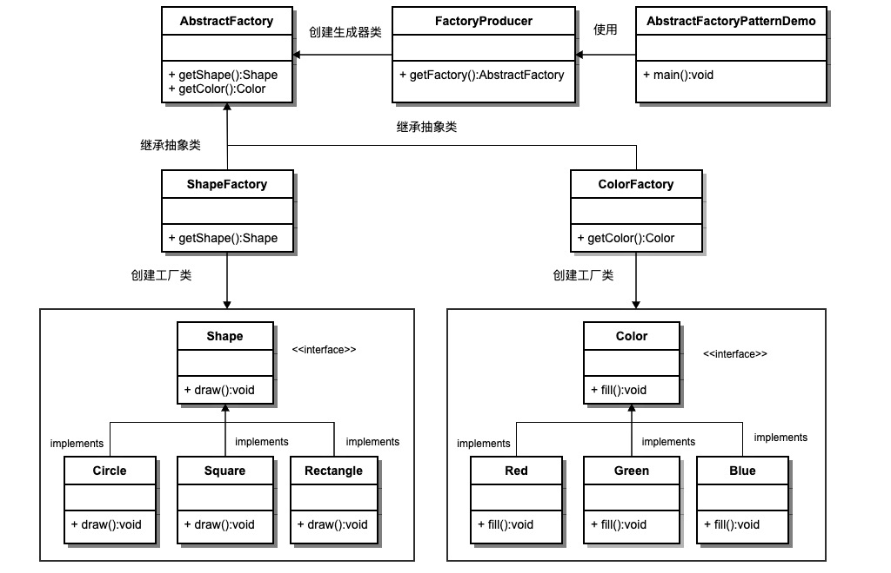

# 1. Spring 中的设计模式

设计模式(Design Patterns) 表示面向对象软件开发中最好的计算机编程实践.

## 1.2. Spring 框架中常用的设计模式

1. 工厂设计模式 : Spring使用工厂模式通过 BeanFactory,ApplicationContext 创建 bean 对象.
1. 代理设计模式 : Spring AOP 功能的实现.
1. 单例设计模式 : Spring 中的 Bean 默认都是单例的.
1. 模板方法模式 : Spring 中 jdbcTemplate,hibernateTemplate 等以 Template 结尾的对数据库操作的类,它们就使用到了模板模式.
1. 包装器设计模式 : 项目需要连接多个数据库,而且不同的客户在每次访问中根据需要会去访问不同的数据库.这种模式让我们可以根据客户的需求能够动态切换不同的数据源.
1. 观察者模式: Spring 事件驱动模型就是观察者模式很经典的一个应用.
1. 适配器模式 :Spring AOP 的增强或通知(Advice)使用到了适配器模式,spring MVC 中也是用到了适配器模式适配Controller.

## 1.1. 设计模式分类

  

### 1.1.1. 创建型模式

用于描述"怎样创建对象",它的主要特点是"将对象的创建与使用分离", 包括单例,原型,工厂方法,抽象工厂,建造者等 5 种创建型模式.

### 1.1.2. 结构型模式

用于描述如何将类或对象按某种布局组成更大的结构,包括代理,适配器,桥接,装饰,外观,享元,组合等 7 种结构型模式.

### 1.1.3. 行为型模式

用于描述类或对象之间怎样相互协作共同完成单个对象无法单独完成的任务,以及怎样分配职责.包括模板方法,策略,命令,职责链,状态,观察者,中介者,迭代器,访问者,备忘录,解释器等 11 种行为型模式.

## 1.3. 控制反转(IoC)和依赖注入(DI)

IoC(Inversion of Control,控制反转) 是一种解耦的设计思想.它使用 Spring 中的 IOC 容器实现具有依赖关系的对象之间的解耦,从而降低代码之间的耦合度.

当需要创建一个对象的时候,只需要配置好配置文件/注解即可,完全不用考虑对象是如何被创建出来的. IOC 容器负责创建对象,将对象连接在一起,配置这些对象,并从创建中处理这些对象的整个生命周期,直到它们被完全销毁.

DI(Dependecy Inject,依赖注入)是控制反转的实现,依赖注入就是将实例变量传入到一个对象中去.

## 1.4. 工厂模式(Factory Pattern)

### 1.4.1. 定义

定义一个创建对象的接口,让其子类自己决定实例化哪一个工厂类,工厂模式使其创建过程延迟到子类进行.

### 1.4.2. 使用场景

1. 日志记录器:记录可能记录到本地硬盘,系统事件,远程服务器等,用户可以选择记录日志到什么地方.
1. 数据库访问,当用户不知道最后系统采用哪一类数据库,以及数据库可能有变化时.
1. 设计一个连接服务器的框架,需要三个协议,"POP3","IMAP","HTTP",可以把这三个作为产品类,共同实现一个接口.

### 1.4.3. 优点

1. 一个调用者想创建一个对象,只要知道其名称就可以了.
1. 扩展性高,如果想增加一个产品,只要扩展一个工厂类就可以.
1. 屏蔽产品的具体实现,调用者只关心产品的接口.

### 1.4.4. 缺点

每次增加一个产品时,都需要增加一个具体类和对象实现工厂,使得系统中类的个数成倍增加,在一定程度上增加了系统的复杂度,同时也增加了系统具体类的依赖.这并不是什么好事.

### 1.4.5. demo

  

```java
// 步骤 1
// 创建一个接口:
// Shape.java
public interface Shape {
   void draw();
}
// 步骤 2
// 创建实现接口的实体类.
// Rectangle.java
public class Rectangle implements Shape {
   @Override
   public void draw() {
      System.out.println("Inside Rectangle::draw() method.");
   }
}
// Square.java
public class Square implements Shape {
   @Override
   public void draw() {
      System.out.println("Inside Square::draw() method.");
   }
}
// Circle.java
public class Circle implements Shape {
   @Override
   public void draw() {
      System.out.println("Inside Circle::draw() method.");
   }
}
// 步骤 3
// 创建一个工厂,生成基于给定信息的实体类的对象.
// ShapeFactory.java
public class ShapeFactory {
   // 使用 getShape 方法获取形状类型的对象
    public Shape getShape(String shapeType){
      if(shapeType == null){
         return null;
      }        
      if(shapeType.equalsIgnoreCase("CIRCLE")){
         return new Circle();
      } else if(shapeType.equalsIgnoreCase("RECTANGLE")){
         return new Rectangle();
      } else if(shapeType.equalsIgnoreCase("SQUARE")){
         return new Square();
      }
      return null;
   }
}
// 步骤 4
// 使用该工厂,通过传递类型信息来获取实体类的对象.
// FactoryPatternDemo.java
public class FactoryPatternDemo {
   public static void main(String[] args) {
      ShapeFactory shapeFactory = new ShapeFactory();
      // 获取 Circle 的对象,并调用它的 draw 方法
       Shape shape1 = shapeFactory.getShape("CIRCLE");
      // 调用 Circle 的 draw 方法
       shape1.draw();
      // 获取 Rectangle 的对象,并调用它的 draw 方法
       Shape shape2 = shapeFactory.getShape("RECTANGLE");
      // 调用 Rectangle 的 draw 方法
       shape2.draw();
      // 获取 Square 的对象,并调用它的 draw 方法
       Shape shape3 = shapeFactory.getShape("SQUARE");
      // 调用 Square 的 draw 方法
       shape3.draw();
   }
}
// 步骤 5
// 执行程序,输出结果:
Inside Circle::draw() method.
Inside Rectangle::draw() method.
Inside Square::draw() method.
```

## 1.5. 抽象工厂模式 (Abstract Factory Pattern)

### 1.5.1. 定义

抽象工厂模式是围绕一个超级工厂创建其他工厂.该超级工厂又称为其他工厂的工厂. 提供一个创建一系列相关或相互依赖对象的接口,而无需指定它们具体的类.

### 1.5.2. 优点

当一个产品族中的多个对象被设计成一起工作时,它能保证客户端始终只使用同一个产品族中的对象.

### 1.5.3. 缺点

产品族扩展非常困难,要增加一个系列的某一产品,既要在抽象的 Creator 里加代码,又要在具体的里面加代码

### 1.5.4. 使用场景

1. telegram 表情包,一整套一起换.
1. 生成不同操作系统的程序.

### 1.5.5. demo

  

```java
// 步骤 1
// 为形状创建一个接口.
// Shape.java
public interface Shape {
   void draw();
}
// 步骤 2
// 创建实现接口的实体类.
// Rectangle.java
public class Rectangle implements Shape {
   @Override
   public void draw() {
      System.out.println("Inside Rectangle::draw() method.");
   }
}
// Square.java
public class Square implements Shape {
   @Override
   public void draw() {
      System.out.println("Inside Square::draw() method.");
   }
}
// Circle.java
public class Circle implements Shape {
   @Override
   public void draw() {
      System.out.println("Inside Circle::draw() method.");
   }
}
// 步骤 3
// 为颜色创建一个接口.
// Color.java
public interface Color {
   void fill();
}
// 步骤 4
// 创建实现接口的实体类.
// Red.java
public class Red implements Color {
   @Override
   public void fill() {
      System.out.println("Inside Red::fill() method.");
   }
}
// Green.java
public class Green implements Color {
   @Override
   public void fill() {
      System.out.println("Inside Green::fill() method.");
   }
}
// Blue.java
public class Blue implements Color {
   @Override
   public void fill() {
      System.out.println("Inside Blue::fill() method.");
   }
}
// 步骤 5
// 为 Color 和 Shape 对象创建抽象类来获取工厂.
// AbstractFactory.java
public abstract class AbstractFactory {
   public abstract Color getColor(String color);
   public abstract Shape getShape(String shape);
}
// 步骤 6
// 创建扩展了 AbstractFactory 的工厂类,基于给定的信息生成实体类的对象.
// ShapeFactory.java
public class ShapeFactory extends AbstractFactory {
   @Override
   public Shape getShape(String shapeType){
      if(shapeType == null){
         return null;
      }        
      if(shapeType.equalsIgnoreCase("CIRCLE")){
         return new Circle();
      } else if(shapeType.equalsIgnoreCase("RECTANGLE")){
         return new Rectangle();
      } else if(shapeType.equalsIgnoreCase("SQUARE")){
         return new Square();
      }
      return null;
   }
   @Override
   public Color getColor(String color) {
      return null;
   }
}
// ColorFactory.java
public class ColorFactory extends AbstractFactory {
   @Override
   public Shape getShape(String shapeType){
      return null;
   }
   @Override
   public Color getColor(String color) {
      if(color == null){
         return null;
      }        
      if(color.equalsIgnoreCase("RED")){
         return new Red();
      } else if(color.equalsIgnoreCase("GREEN")){
         return new Green();
      } else if(color.equalsIgnoreCase("BLUE")){
         return new Blue();
      }
      return null;
   }
}
// 步骤 7
// 创建一个工厂创造器 / 生成器类,通过传递形状或颜色信息来获取工厂.
// FactoryProducer.java
public class FactoryProducer {
   public static AbstractFactory getFactory(String choice){
      if(choice.equalsIgnoreCase("SHAPE")){
         return new ShapeFactory();
      } else if(choice.equalsIgnoreCase("COLOR")){
         return new ColorFactory();
      }
      return null;
   }
}
// 步骤 8
// 使用 FactoryProducer 来获取 AbstractFactory,通过传递类型信息来获取实体类的对象.
// AbstractFactoryPatternDemo.java
public class AbstractFactoryPatternDemo {
   public static void main(String[] args) {
      // 获取形状工厂
       AbstractFactory shapeFactory = FactoryProducer.getFactory("SHAPE");
      // 获取形状为 Circle 的对象
       Shape shape1 = shapeFactory.getShape("CIRCLE");
      // 调用 Circle 的 draw 方法
       shape1.draw();
      // 获取形状为 Rectangle 的对象
       Shape shape2 = shapeFactory.getShape("RECTANGLE");
      // 调用 Rectangle 的 draw 方法
       shape2.draw();
      // 获取形状为 Square 的对象
       Shape shape3 = shapeFactory.getShape("SQUARE");
      // 调用 Square 的 draw 方法
       shape3.draw();
      // 获取颜色工厂
       AbstractFactory colorFactory = FactoryProducer.getFactory("COLOR");
      // 获取颜色为 Red 的对象
       Color color1 = colorFactory.getColor("RED");
      // 调用 Red 的 fill 方法
       color1.fill();
      // 获取颜色为 Green 的对象
       Color color2 = colorFactory.getColor("Green");
      // 调用 Green 的 fill 方法
       color2.fill();
      // 获取颜色为 Blue 的对象
       Color color3 = colorFactory.getColor("BLUE");
      // 调用 Blue 的 fill 方法
       color3.fill();
   }
}
// 步骤 9
// 执行程序,输出结果:

// Inside Circle::draw() method.
// Inside Rectangle::draw() method.
// Inside Square::draw() method.
// Inside Red::fill() method.
// Inside Green::fill() method.
// Inside Blue::fill() method.
```

## 1.6. 单例模式 (Singleton Pattern)

单例模式保证一个类仅有一个实例，并提供一个访问它的全局访问点

### 优点

1. 在内存里只有一个实例，减少了内存的开销，尤其是频繁的创建和销毁实例（比如管理学院首页页面缓存）。
1. 避免对资源的多重占用（比如写文件操作）。

### 缺点

没有接口，不能继承，与单一职责原则冲突，一个类应该只关心内部逻辑，而不关心外面怎么样来实例化。

### 使用场景

1. 要求生产唯一序列号。
1. WEB 中的计数器，不用每次刷新都在数据库里加一次，用单例先缓存起来。
1. 创建的一个对象需要消耗的资源过多，比如 I/O 与数据库的连接等。
注意事项：getInstance () 方法中需要使用同步锁 synchronized (Singleton.class) 防止多线程同时进入造成 instance 被多次实例化。

## 1.7. 代理设计模式

### 1.7.1. 代理模式在 AOP 中的应用

AOP(Aspect-Oriented Programming:面向切面编程)能够将那些与业务无关,却为业务模块所共同调用的逻辑或责任(例如事务处理,日志管理,权限控制等)封装起来,便于减少系统的重复代码,降低模块间的耦合度,并有利于未来的可拓展性和可维护性.

Spring AOP 就是基于动态代理的,如果要代理的对象,实现了某个接口,那么Spring AOP会使用JDK Proxy,去创建代理对象,而对于没有实现接口的对象,就无法使用 JDK Proxy 去进行代理了,这时候Spring AOP会使用Cglib ,这时候Spring AOP会使用 Cglib 生成一个被代理对象的子类来作为代理,如下图所示:


当然你也可以使用 AspectJ ,Spring AOP 已经集成了AspectJ  ,AspectJ  应该算的上是 Java 生态系统中最完整的 AOP 框架了.

使用 AOP 之后我们可以把一些通用功能抽象出来,在需要用到的地方直接使用即可,这样大大简化了代码量.我们需要增加新功能时也方便,这样也提高了系统扩展性.日志功能,事务管理等等场景都用到了 AOP .

### 1.7.2. Spring AOP 和 AspectJ AOP 有什么区别?

Spring AOP 属于运行时增强,而 AspectJ 是编译时增强. Spring AOP 基于代理(Proxying),而 AspectJ 基于字节码操作(Bytecode Manipulation).

 Spring AOP 已经集成了 AspectJ  ,AspectJ  应该算的上是 Java 生态系统中最完整的 AOP 框架了.AspectJ  相比于 Spring AOP 功能更加强大,但是 Spring AOP 相对来说更简单,

如果我们的切面比较少,那么两者性能差异不大.但是,当切面太多的话,最好选择 AspectJ ,它比Spring AOP 快很多.

### 1.7.3. 概述

由于某些原因需要给某对象提供一个代理以控制对该对象的访问.这时,访问对象不适合或者不能直接引用目标对象,代理对象作为访问对象和目标对象之间的中介.

Java中的代理按照代理类生成时机不同又分为静态代理和动态代理.静态代理代理类在编译期就生成,而动态代理代理类则是在Java运行时动态生成.动态代理又有JDK代理和CGLib代理两种.

### 1.7.4. 代理(Proxy)模式分为三种角色

1. 抽象主题(Subject)类: 通过接口或抽象类声明真实主题和代理对象实现的业务方法.
1. 真实主题(Real Subject)类: 实现了抽象主题中的具体业务,是代理对象所代表的真实对象,是最终要引用的对象.
1. 代理(Proxy)类 : 提供了与真实主题相同的接口,其内部含有对真实主题的引用,它可以访问,控制或扩展真实主题的功能.

### 1.7.5. 静态代理

  

案例: 如果要买火车票的话,需要去火车站买票,坐车到火车站,排队等一系列的操作,显然比较麻烦.而火车站在多个地方都有代售点,我们去代售点买票就方便很多了.这个例子其实就是典型的代理模式,火车站是目标对象,代售点是代理对象

```java
//卖票接口
public interface SellTickets {
    void sell();
}
​
//火车站  火车站具有卖票功能,所以需要实现SellTickets接口
public class TrainStation implements SellTickets {
    public void sell() {
        System.out.println("火车站卖票");
    }
}
​
//代售点
public class ProxyPoint implements SellTickets {
    private TrainStation station = new TrainStation();
    public void sell() {
        System.out.println("代理点收取一些服务费用");
        station.sell();
    }
}
​
//测试类
public class Client {
    public static void main(String[] args) {
        ProxyPoint pp = new ProxyPoint();
        pp.sell();
    }
}
```

测试类直接访问的是ProxyPoint类对象,也就是说ProxyPoint作为访问对象和目标对象的中介.同时也对sell方法进行了增强(代理点收取一些服务费用).

### 1.7.6. JDK动态代理

Java中提供了一个动态代理类Proxy,Proxy并不是我们上述所说的代理对象的类,而是提供了一个创建代理对象的静态方法(newProxyInstance方法)来获取代理对象.

```java
//卖票接口

public interface SellTickets {
    void sell();
}
​
//火车站  火车站具有卖票功能,所以需要实现SellTickets接口
public class TrainStation implements SellTickets {
    public void sell() {
        System.out.println("火车站卖票");
    }
}
​
//代理工厂,用来创建代理对象
public class ProxyFactory {
    private TrainStation station = new TrainStation();
​    public SellTickets getProxyObject() {
        //使用Proxy获取代理对象
        /*
            newProxyInstance()方法参数说明:
                ClassLoader loader : 类加载器,用于加载代理类,使用真实对象的类加载器即可
                Class<?>[] interfaces : 真实对象所实现的接口,代理模式真实对象和代理对象实现相同的接口
                InvocationHandler h : 代理对象的调用处理程序
         */
        SellTickets sellTickets = (SellTickets) Proxy.newProxyInstance(station.getClass().getClassLoader(),
                station.getClass().getInterfaces(),
                new InvocationHandler() {
                    /*
                        InvocationHandler中invoke方法参数说明:
                            proxy : 代理对象
                            method : 对应于在代理对象上调用的接口方法的 Method 实例
                            args : 代理对象调用接口方法时传递的实际参数
                     */
                    public Object invoke(Object proxy, Method method, Object[] args) throws Throwable {
​
                        System.out.println("代理点收取一些服务费用(JDK动态代理方式)");
                        //执行真实对象
                        Object result = method.invoke(station, args);
                        return result;
                    }
                });
        return sellTickets;
    }
}
​
//测试类
public class Client {
    public static void main(String[] args) {
        //获取代理对象
        ProxyFactory factory = new ProxyFactory();
        SellTickets proxyObject = factory.getProxyObject();
        proxyObject.sell();
    }
}
```

### 1.7.7. 优缺点

#### 1.7.7.1. 优点

1. 代理模式在客户端与目标对象之间起到一个中介作用和保护目标对象的作用;
1. 代理对象可以扩展目标对象的功能;
1. 代理模式能将客户端与目标对象分离,在一定程度上降低了系统的耦合度;

#### 1.7.7.2. 缺点

1. 增加了系统的复杂度;

## 1.8. 模板方法

模板方法模式是一种行为设计模式,它定义一个操作中的算法的骨架,而将一些步骤延迟到子类中. 模板方法使得子类可以不改变一个算法的结构即可重定义该算法的某些特定步骤的实现方式.

```java
public abstract class Template {
    //这是我们的模板方法
    public final void TemplateMethod(){
        PrimitiveOperation1();  
        PrimitiveOperation2();
        PrimitiveOperation3();
    }
    protected void  PrimitiveOperation1(){
        //当前类实现
    }
    //被子类实现的方法
    protected abstract void PrimitiveOperation2();
    protected abstract void PrimitiveOperation3();
}
public class TemplateImpl extends Template {
    @Override
    public void PrimitiveOperation2() {
        //当前类实现
    }
    @Override
    public void PrimitiveOperation3() {
        //当前类实现
    }
}
```

Spring 中 jdbcTemplate,hibernateTemplate 等以 Template 结尾的对数据库操作的类,它们就使用到了模板模式.一般情况下,我们都是使用继承的方式来实现模板模式,但是 Spring 并没有使用这种方式,而是使用Callback 模式与模板方法模式配合,既达到了代码复用的效果,同时增加了灵活性.

### 1.8.1. 模板方法(Template Method)模式包含以下主要角色

#### 1.8.1.1. 抽象类(Abstract Class)

负责给出一个算法的轮廓和骨架.它由一个模板方法和若干个基本方法构成

##### 1.8.1.1.1. 模板方法:定义了算法的骨架,按某种顺序调用其包含的基本方法

##### 1.8.1.1.2. 基本方法:是实现算法各个步骤的方法,是模板方法的组成部分.基本方法又可以分为三种

1. 抽象方法(Abstract Method) :一个抽象方法由抽象类声明,由其具体子类实现.
1. 具体方法(Concrete Method) :一个具体方法由一个抽象类或具体类声明并实现,其子类可以进行覆盖也可以直接继承.
1. 钩子方法(Hook Method) :在抽象类中已经实现,包括用于判断的逻辑方法和需要子类重写的空方法两种.
一般钩子方法是用于判断的逻辑方法,这类方法名一般为isXxx,返回值类型为boolean类型.

#### 1.8.1.2. 具体子类(Concrete Class)

实现抽象类中所定义的抽象方法和钩子方法,它们是一个顶级逻辑的组成步骤

  

案例: 炒菜的步骤是固定的,分为倒油,热油,倒蔬菜,倒调料品,翻炒等步骤.现通过模板方法模式来用代码模拟.

```java
public abstract class AbstractClass {
    public final void cookProcess() {
        //第一步:倒油
        this.pourOil();
        //第二步:热油
        this.heatOil();
        //第三步:倒蔬菜
        this.pourVegetable();
        //第四步:倒调味料
        this.pourSauce();
        //第五步:翻炒
        this.fry();
    }
​
    public void pourOil() {
        System.out.println("倒油");
    }
​
    //第二步:热油是一样的,所以直接实现
    public void heatOil() {
        System.out.println("热油");
    }
​
    //第三步:倒蔬菜是不一样的(一个下包菜,一个是下菜心)
    public abstract void pourVegetable();
​
    //第四步:倒调味料是不一样
    public abstract void pourSauce();
​
    //第五步:翻炒是一样的,所以直接实现
    public void fry(){
        System.out.println("炒啊炒啊炒到熟啊");
    }
}
​
public class ConcreteClass_BaoCai extends AbstractClass {
​
    @Override
    public void pourVegetable() {
        System.out.println("下锅的蔬菜是包菜");
    }
​
    @Override
    public void pourSauce() {
        System.out.println("下锅的酱料是辣椒");
    }
}
​
public class ConcreteClass_CaiXin extends AbstractClass {
    @Override
    public void pourVegetable() {
        System.out.println("下锅的蔬菜是菜心");
    }
​
    @Override
    public void pourSauce() {
        System.out.println("下锅的酱料是蒜蓉");
    }
}
​
public class Client {
    public static void main(String[] args) {
        //炒手撕包菜
        ConcreteClass_BaoCai baoCai = new ConcreteClass_BaoCai();
        baoCai.cookProcess();
​
        //炒蒜蓉菜心
        ConcreteClass_CaiXin caiXin = new ConcreteClass_CaiXin();
        caiXin.cookProcess();
    }
}
// 注意:为防止恶意操作,一般模板方法都加上 final 关键词.
```

### 1.8.2. 优缺点

#### 1.8.2.1. 优点

1. 提高代码复用性: 将相同部分的代码放在抽象的父类中,而将不同的代码放入不同的子类中.
1. 实现了反向控制: 通过一个父类调用其子类的操作,通过对子类的具体实现扩展不同的行为,实现了反向控制 ,并符合"开闭原则".

#### 1.8.2.2. 缺点

1. 对每个不同的实现都需要定义一个子类,这会导致类的个数增加,系统更加庞大,设计也更加抽象.
1. 父类中的抽象方法由子类实现,子类执行的结果会影响父类的结果,这导致一种反向的控制结构,它提高了代码阅读的难度.

### 1.8.3. 适用场景

1. 算法的整体步骤很固定,但其中个别部分易变时,这时候可以使用模板方法模式,将容易变的部分抽象出来,供子类实现.
1. 需要通过子类来决定父类算法中某个步骤是否执行,实现子类对父类的反向控制.

## 1.9. 观察者模式

  

观察者模式是一种对象行为型模式. 定义对象间的一种一对多的依赖关系,当一个对象的状态发生改变时,所有依赖于它的对象都得到通知并被自动更新.

### 1.9.1. 应用实例

1. Spring 事件驱动模型就是观察者模式很经典的一个应用.
1. 拍卖的时候,拍卖师观察最高标价,然后通知给其他竞价者竞价.
1. 我们每次添加商品的时候都需要重新更新商品索引,这个时候就可以利用观察者模式来解决这个问题.

### 1.9.2. 优点

1. 观察者和被观察者是抽象耦合的.
1. 建立一套触发机制.

### 1.9.3. 缺点

1. 如果一个被观察者对象有很多的直接和间接的观察者的话,将所有的观察者都通知到会花费很多时间.
1. 如果在观察者和观察目标之间有循环依赖的话,观察目标会触发它们之间进行循环调用,可能导致系统崩溃.
1. 观察者模式没有相应的机制让观察者知道所观察的目标对象是怎么发生变化的,而仅仅只是知道观察目标发生了变化.

### 1.9.4. demo

```java
// 步骤 1
// 创建 Subject 类.
// Subject.java

import java.util.ArrayList;
import java.util.List;
 
public class Subject {
   
   private List<Observer> observers 
      = new ArrayList<Observer>();
   private int state;
 
   public int getState() {
      return state;
   }
 
   public void setState(int state) {
      this.state = state;
      notifyAllObservers();
   }
 
   public void attach(Observer observer){
      observers.add(observer);      
   }
 
   public void notifyAllObservers(){
      for (Observer observer : observers) {
         observer.update();
      }
   }  
}
// 步骤 2
// 创建 Observer 类.
// Observer.java
public abstract class Observer {
   protected Subject subject;
   public abstract void update();
}
// 步骤 3
// 创建实体观察者类.

// BinaryObserver.java
public class BinaryObserver extends Observer{
 
   public BinaryObserver(Subject subject){
      this.subject = subject;
      this.subject.attach(this);
   }
 
   @Override
   public void update() {
      System.out.println( "Binary String: " 
      + Integer.toBinaryString( subject.getState() ) ); 
   }
}
// OctalObserver.java
public class OctalObserver extends Observer{
 
   public OctalObserver(Subject subject){
      this.subject = subject;
      this.subject.attach(this);
   }
 
   @Override
   public void update() {
     System.out.println( "Octal String: " 
     + Integer.toOctalString( subject.getState() ) ); 
   }
}
// HexaObserver.java
public class HexaObserver extends Observer{
 
   public HexaObserver(Subject subject){
      this.subject = subject;
      this.subject.attach(this);
   }
 
   @Override
   public void update() {
      System.out.println( "Hex String: " 
      + Integer.toHexString( subject.getState() ).toUpperCase() ); 
   }
}
// 步骤 4
// client 使用 Subject 和实体观察者对象.

ObserverPatternDemo.java
public class ObserverPatternDemo {
   public static void main(String[] args) {
      Subject subject = new Subject();
 
      new HexaObserver(subject);
      new OctalObserver(subject);
      new BinaryObserver(subject);
 
      System.out.println("First state change: 15");   
      subject.setState(15);
      System.out.println("Second state change: 10");  
      subject.setState(10);
   }
}
// 步骤 5
// 执行程序,输出结果:

// First state change: 15
// Hex String: F
// Octal String: 17
// Binary String: 1111
// Second state change: 10
// Hex String: A
// Octal String: 12
// Binary String: 1010


```

## 1.10. 适配器模式

适配器模式(Adapter Pattern)是作为两个不兼容的接口之间的桥梁, 适配器继承或依赖已有的对象,实现想要的目标接口, 使接口不兼容的那些类可以一起工作.

### 1.10.1. 应用实例

1. Spring AOP 的增强或通知(Advice)使用到了适配器模式
1. JAVA 中的 jdbc
1. 电压转换器,110v=> 220v
1. 以前开发的系统存在满足新系统功能需求的类,但其接口同新系统的接口不一致.
1. 使用第三方提供的组件,但组件接口定义和自己要求的接口定义不同.

### 1.10.2. 优点

1. 可以让任何两个没有关联的类一起运行.
1. 提高了类的复用.
1. 增加了类的透明度.
1. 灵活性好

### 1.10.3. 缺点

1. 过多地使用适配器,会让系统非常零乱,不易整体进行把握.比如,明明看到调用的是 A 接口,其实内部被适配成了 B 接口的实现
1. 由于JAVA 至多继承一个类,所以至多只能适配一个适配者类,而且目标类必须是抽象类.

  

### 1.10.4. demo

```java
// 步骤 1
// 为媒体播放器和更高级的媒体播放器创建接口.

// MediaPlayer.java
public interface MediaPlayer {
   public void play(String audioType, String fileName);
}
// AdvancedMediaPlayer.java
public interface AdvancedMediaPlayer { 
   public void playVlc(String fileName);
   public void playMp4(String fileName);
}
// 步骤 2
// 创建实现了 AdvancedMediaPlayer 接口的实体类.

// VlcPlayer.java
public class VlcPlayer implements AdvancedMediaPlayer{
   @Override
   public void playVlc(String fileName) {
      System.out.println("Playing vlc file. Name: "+ fileName);      
   }
 
   @Override
   public void playMp4(String fileName) {
      // 什么也不做
   }
}
// Mp4Player.java
public class Mp4Player implements AdvancedMediaPlayer{
 
   @Override
   public void playVlc(String fileName) {
      // 什么也不做
   }
 
   @Override
   public void playMp4(String fileName) {
      System.out.println("Playing mp4 file. Name: "+ fileName);      
   }
}
// 步骤 3
// 创建实现了 MediaPlayer 接口的适配器类.

// MediaAdapter.java
public class MediaAdapter implements MediaPlayer {
 
   AdvancedMediaPlayer advancedMusicPlayer;
 
   public MediaAdapter(String audioType){
      if(audioType.equalsIgnoreCase("vlc") ){
         advancedMusicPlayer = new VlcPlayer();       
      } else if (audioType.equalsIgnoreCase("mp4")){
         advancedMusicPlayer = new Mp4Player();
      }  
   }
 
   @Override
   public void play(String audioType, String fileName) {
      if(audioType.equalsIgnoreCase("vlc")){
         advancedMusicPlayer.playVlc(fileName);
      }else if(audioType.equalsIgnoreCase("mp4")){
         advancedMusicPlayer.playMp4(fileName);
      }
   }
}
// 步骤 4
// 创建实现了 MediaPlayer 接口的实体类.

// AudioPlayer.java
public class AudioPlayer implements MediaPlayer {
   MediaAdapter mediaAdapter; 
 
   @Override
   public void play(String audioType, String fileName) {    
 
      // 播放 mp3 音乐文件的内置支持
       if(audioType.equalsIgnoreCase("mp3")){
         System.out.println("Playing mp3 file. Name: "+ fileName);         
      } 
      //mediaAdapter 提供了播放其他文件格式的支持
       else if(audioType.equalsIgnoreCase("vlc") 
         || audioType.equalsIgnoreCase("mp4")){
         mediaAdapter = new MediaAdapter(audioType);
         mediaAdapter.play(audioType, fileName);
      }
      else{
         System.out.println("Invalid media. "+
            audioType + " format not supported");
      }
   }   
}
// 步骤 5
// 使用 AudioPlayer 来播放不同类型的音频格式.

// AdapterPatternDemo.java
public class AdapterPatternDemo {
   public static void main(String[] args) {
      AudioPlayer audioPlayer = new AudioPlayer();
 
      audioPlayer.play("mp3", "beyond the horizon.mp3");
      audioPlayer.play("mp4", "alone.mp4");
      audioPlayer.play("vlc", "far far away.vlc");
      audioPlayer.play("avi", "mind me.avi");
   }
}
// 步骤 6
// 执行程序,输出结果:

// Playing mp3 file. Name: beyond the horizon.mp3
// Playing mp4 file. Name: alone.mp4
// Playing vlc file. Name: far far away.vlc
// Invalid media. avi format not supported
```

## 1.11. 装饰器模式(包装器模式)

装饰器模式(Decorator Pattern)允许向一个现有的对象添加新的功能,同时又不改变其结构.这种类型的设计模式属于结构型模式,它是作为现有的类的一个包装.

### 1.11.1. 优点

装饰类和被装饰类可以独立发展,不会相互耦合,装饰模式是继承的一个替代模式,装饰模式可以动态扩展一个实现类的功能.

### 1.11.2. 缺点

多层装饰比较复杂

### 1.11.3. 装饰(Decorator)模式中的角色

1. 抽象构件(Component)角色 :定义一个抽象接口以规范准备接收附加责任的对象.
1. 具体构件(Concrete Component)角色 :实现抽象构件,通过装饰角色为其添加一些职责.
1. 抽象装饰(Decorator)角色 : 继承或实现抽象构件,并包含具体构件的实例,可以通过其子类扩展具体构件的功能.
1. 具体装饰(ConcreteDecorator)角色 :实现抽象装饰的相关方法,并给具体构件对象添加附加的责任.

### 1.11.4. 好处

1. 饰者模式可以带来比继承更加灵活性的扩展功能,使用更加方便,可以通过组合不同的装饰者对象来获取具有不同行为状态的多样化的结果.装饰者模式比继承更具良好的扩展性,完美的遵循开闭原则,继承是静态的附加责任,装饰者则是动态的附加责任.
1. 装饰类和被装饰类可以独立发展,不会相互耦合,装饰模式是继承的一个替代模式,装饰模式可以动态扩展一个实现类的功能.

### 1.11.5. 使用场景

1. 在不影响其他对象的情况下,以动态,透明的方式给单个对象添加职责.
1. 当对象的功能要求可以动态地添加,也可以再动态地撤销时.

1. 当以下情况不能采用继承的方式对系统进行扩充或者采用继承不利于系统扩展和维护时.

    - 第一类是系统中存在大量独立的扩展,为支持每一种组合将产生大量的子类,使得子类数目呈爆炸性增长;
    - 第二类是因为类定义不能继承(如final类)
