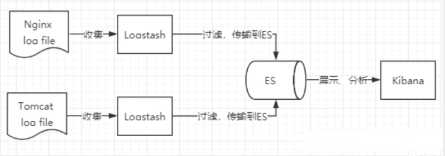
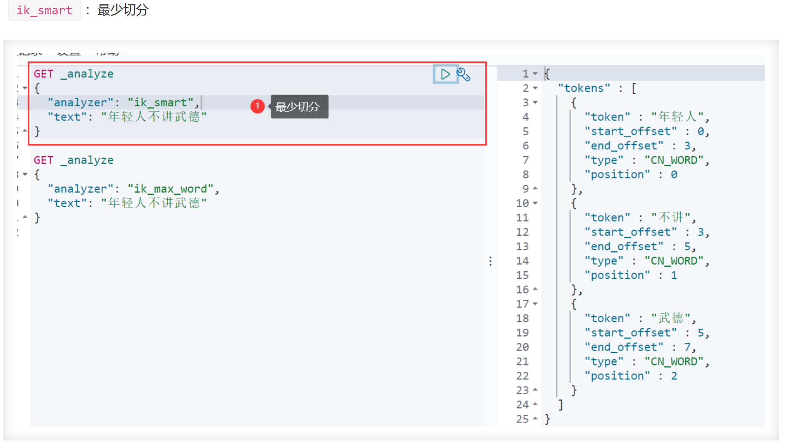

# 1. elasticsearch

<https://www.kuangstudy.com/bbs/1354069127022583809>

## 1.1. 定义

ELK 是Elasticsearch,Logstash, Kibana 三大开源框架首字母大写简称.市面上也被成为 Elastic Stack.

1. Elasticsearch 是基于 Lucene 的 Restful 的分布式实时全文搜索引擎,每个字段都被索引并可被搜索,可以快速存储,搜索,分析海量的数据,  ES 是 面向文档的,一切都是 JSON
1. Kibana 可以将 elasticsearch 的数据通过友好的页面展示出来 ,提供实时分析的功能.
1. Logstash 是 ELK 的中央数据流引擎,用于从不同目标(文件/数据存储/MQ)收集的不同格式数据,经过过滤后支持输出到不同目的地(文件/MQ/redis/elasticsearch/kafka 等).



收集清洗数据(Logstash) ==> 搜索,存储(ElasticSearch) ==> 展示(Kibana)

## 1.2. Elasticsearch 的基本概念

1. index 索引:索引是文档的集合, 索引是存在数据的地方,包含了一堆有相似结构的文档数据.
1. type 类型: type 是 index 中的一个逻辑数据分类
1. document 文档:ES 中的每个文档可以有不同的字段,但是对于通用字段应该具有相同的数据类型,文档是 es 中的最小数据单元,可以认为一个文档就是一条记录.
1. Field 字段:Field 是 Elasticsearch 的最小单位,一个 document 里面有多个 field
1. shard 分片: 当有大量的文档时,由于内存的限制,磁盘处理能力不足,无法足够快的响应客户端的请求等, es 可以将一个索引中的数据切分为多个 shard,分布在多台服务器上存储.有了 shard 就可以横向扩展,存储更多数据,让搜索和分析等操作分布到多台服务器上去执行,提升吞吐量和性能.
1. replic 副本: 为提高查询吞吐量或实现高可用性,可以使用分片副本.replica 可以在 shard 故障时提供备用服务,保证数据不丢失,多个 replica 还可以提升搜索操作的吞吐量和性能.
1. 集群: 一个或多个节点(服务器)的集合,它们共同保存您的整个数据,并提供跨所有节点的联合索引和搜索功能.集群由唯一名称标识,默认情况下为"elasticsearch",为了处理大型数据集,实现容错和高可用性
1. 节点: 形成集群的每个服务器称为节点.它存储数据并参与集群索引和搜索功能.

## 1.3. 倒排索引(Lucene 索引底层)

在搜索引擎中,每个文档都有一个对应的文档 ID,文档内容被表示为一系列关键词的集合. 某个文档经过分词,提取了多个关键词,每个关键词都会记录它在文档中出现的次数和出现位置.那么,倒排索引就是关键词到文档 ID 的映射,每个关键词都对应着一系列的文档,这些文档中都出现了该关键词.有了倒排索引,搜索引擎可以很方便地响应用户的查询.

  

## 1.4. 使用场景

1. 维基百科,类似百度百科,全文检索,高亮,搜索推荐
1. 电商网站,检索商品
1. 日志数据分析, logstash 采集日志, ES 进行复杂的数据分析, ELK 技术 ,elasticsearch+logstash+kibana
1. 商品价格监控网站,用户设定某商品的价格阈值,当低于该阈值的时候,发送通知消息给用户,比如说订阅牙膏的监控,如果高露洁牙膏的家庭套装低于 50 块钱,就通知我,我就去买
1. BI 系统,商业智能, Business Intelligence.比如说有个大型商场集团,BI ,分析一下某某区域最近 3 年的用户消费 金额的趋势以及用户群体的组成构成,产出相关的数张报表, 某地区,最近 3 年,每年消费金额呈现 100%的增长,而且用户群体 85%是高级白领,  开-个新商场.ES 执行数据分析和挖掘, Kibana 进行数据可视化
1. 国内:站内搜索(电商,招聘,门户,等等),IT 系统搜索(OA,CRM,ERP,等等),数据分析(ES热门的一一个使用场景)

## 1.5. ik 分词器

IK 分词器是中文分词器, 把一段中文或者别的划分成一个个的关键字 , 在搜索时候会把自己的信息进行分词,会把数据库中或者索引库中的数据进行分词,然后进行一一个匹配操作

IK 提供了两个分词算法: ik_smart 和 ik_max_word ,其中 ik_smart 为最少切分,ik_max_word 为最细粒度划分!


## 1.6. Rest 风格说明

|method| url地址| 描述|
|--|--|--|
|PUT(创建,修改) |localhost:9200/索引名称/类型名称/文档id | 创建文档(指定文档id)
|POST(创建)| localhost:9200/索引名称/类型名称 | 创建文档(随机文档id)
|POST(修改) | localhost:9200/索引名称/类型名称/文档id/_update | 修改文档
|DELETE(删除)| localhost:9200/索引名称/类型名称/文档id |删除文档
|GET(查询) |localhost:9200/索引名称/类型名称/文档id | 查询文档通过文档ID
|POST(查询)| localhost:9200/索引名称/类型名称/文档id/_search | 查询所有数据

## 1.7. springboot 使用

```java

@Configuration
public class ElasticSearchConfig {
    // 注册 rest高级客户端 
    @Bean
    public RestHighLevelClient restHighLevelClient(){
        RestHighLevelClient client = new RestHighLevelClient(
                RestClient.builder(
                        new HttpHost("127.0.0.1",9200,"http")
                )
        );
        return client;
    }

@Autowired
public RestHighLevelClient restHighLevelClient;


// 索引的操作
// 1,索引的创建
@Test
public void testCreateIndex() throws IOException {
    CreateIndexRequest request = new CreateIndexRequest("liuyou_index");
    CreateIndexResponse response = restHighLevelClient.indices().create(request, RequestOptions.DEFAULT);
    System.out.println(response.isAcknowledged());// 查看是否创建成功
    System.out.println(response);// 查看返回对象
    restHighLevelClient.close();
}
// 2,索引的获取,并判断其是否存在
@Test
public void testIndexIsExists() throws IOException {
    GetIndexRequest request = new GetIndexRequest("index");
    boolean exists = restHighLevelClient.indices().exists(request, RequestOptions.DEFAULT);
    System.out.println(exists);// 索引是否存在
    restHighLevelClient.close();
}
// 3,索引的删除
@Test
public void testDeleteIndex() throws IOException {
    DeleteIndexRequest request = new DeleteIndexRequest("liuyou_index");
    AcknowledgedResponse response = restHighLevelClient.indices().delete(request, RequestOptions.DEFAULT);
    System.out.println(response.isAcknowledged());// 是否删除成功
    restHighLevelClient.close();
}


// 文档的操作

// 1,文档的添加
@Test
public void testAddDocument() throws IOException {
    // 创建一个User对象
    User liuyou = new User("liuyou", 18);
    // 创建请求
    IndexRequest request = new IndexRequest("liuyou_index");
    // 制定规则 PUT /liuyou_index/_doc/1
    request.id("1");// 设置文档ID
    request.timeout(TimeValue.timeValueMillis(1000));// request.timeout("1s")
    // 将我们的数据放入请求中
    request.source(JSON.toJSONString(liuyou), XContentType.JSON);
    // 客户端发送请求,获取响应的结果
    IndexResponse response = restHighLevelClient.index(request, RequestOptions.DEFAULT);
    System.out.println(response.status());// 获取建立索引的状态信息 CREATED
    System.out.println(response);// 查看返回内容 IndexResponse[index=liuyou_index,type=_doc,id=1,version=1,result=created,seqNo=0,primaryTerm=1,shards={"total":2,"successful":1,"failed":0}]
}
// 2,文档信息的获取
@Test
public void testGetDocument() throws IOException {
    GetRequest request = new GetRequest("liuyou_index","1");
    GetResponse response = restHighLevelClient.get(request, RequestOptions.DEFAULT);
    System.out.println(response.getSourceAsString());// 打印文档内容
    System.out.println(request);// 返回的全部内容和命令是一样的
    restHighLevelClient.close();
}
// 3,文档的获取,并判断其是否存在
@Test
public void testDocumentIsExists() throws IOException {
    GetRequest request = new GetRequest("liuyou_index", "1");
    // 不获取返回的 _source的上下文了
    request.fetchSourceContext(new FetchSourceContext(false));
    request.storedFields("_none_");
    boolean exists = restHighLevelClient.exists(request, RequestOptions.DEFAULT);
    System.out.println(exists);
}
// 4,文档的更新
@Test
public void testUpdateDocument() throws IOException {
    UpdateRequest request = new UpdateRequest("liuyou_index", "1");
    User user = new User("lmk",11);
    request.doc(JSON.toJSONString(user),XContentType.JSON);
    UpdateResponse response = restHighLevelClient.update(request, RequestOptions.DEFAULT);
    System.out.println(response.status()); // OK
    restHighLevelClient.close();
}
// 5,文档的删除
@Test
public void testDeleteDocument() throws IOException {
    DeleteRequest request = new DeleteRequest("liuyou_index", "1");
    request.timeout("1s");
    DeleteResponse response = restHighLevelClient.delete(request, RequestOptions.DEFAULT);
    System.out.println(response.status());// OK
}
// 6,文档的查询
// 查询
// SearchRequest 搜索请求
// SearchSourceBuilder 条件构造
// HighlightBuilder 高亮
// TermQueryBuilder 精确查询
// MatchAllQueryBuilder
// xxxQueryBuilder ...
@Test
public void testSearch() throws IOException {
    // 1.创建查询请求对象
    SearchRequest searchRequest = new SearchRequest();
    // 2.构建搜索条件
    SearchSourceBuilder searchSourceBuilder = new SearchSourceBuilder();
    // (1)查询条件 使用QueryBuilders工具类创建
    // 精确查询
    TermQueryBuilder termQueryBuilder = QueryBuilders.termQuery("name", "liuyou");
    //        // 匹配查询
    //        MatchAllQueryBuilder matchAllQueryBuilder = QueryBuilders.matchAllQuery();
    // (2)其他<可有可无>:(可以参考 SearchSourceBuilder 的字段部分)
    // 设置高亮
    searchSourceBuilder.highlighter(new HighlightBuilder());
    //        // 分页
    //        searchSourceBuilder.from();
    //        searchSourceBuilder.size();
    searchSourceBuilder.timeout(new TimeValue(60, TimeUnit.SECONDS));
    // (3)条件投入
    searchSourceBuilder.query(termQueryBuilder);
    // 3.添加条件到请求
    searchRequest.source(searchSourceBuilder);
    // 4.客户端查询请求
    SearchResponse search = restHighLevelClient.search(searchRequest, RequestOptions.DEFAULT);
    // 5.查看返回结果
    SearchHits hits = search.getHits();
    System.out.println(JSON.toJSONString(hits));
    System.out.println("=======================");
    for (SearchHit documentFields : hits.getHits()) {
        System.out.println(documentFields.getSourceAsMap());
    }
}
// 前面的操作都无法批量添加数据
// 上面的这些api无法批量增加数据(只会保留最后一个source)
@Test
public void test() throws IOException {
    IndexRequest request = new IndexRequest("bulk");// 没有id会自动生成一个随机ID
    request.source(JSON.toJSONString(new User("liu",1)),XContentType.JSON);
    request.source(JSON.toJSONString(new User("min",2)),XContentType.JSON);
    request.source(JSON.toJSONString(new User("kai",3)),XContentType.JSON);
    IndexResponse index = restHighLevelClient.index(request, RequestOptions.DEFAULT);
    System.out.println(index.status());// created
}
// 7,批量添加数据
// 特殊的,真的项目一般会 批量插入数据
@Test
public void testBulk() throws IOException {
    BulkRequest bulkRequest = new BulkRequest();
    bulkRequest.timeout("10s");
    ArrayList<User> users = new ArrayList<>();
    users.add(new User("liuyou-1",1));
    users.add(new User("liuyou-2",2));
    users.add(new User("liuyou-3",3));
    users.add(new User("liuyou-4",4));
    users.add(new User("liuyou-5",5));
    users.add(new User("liuyou-6",6));
    // 批量请求处理
    for (int i = 0; i < users.size(); i++) {
        bulkRequest.add(
                // 这里是数据信息
                new IndexRequest("bulk")
                        .id(""+(i + 1)) // 没有设置id 会自定生成一个随机id
                        .source(JSON.toJSONString(users.get(i)),XContentType.JSON)
        );
    }
    BulkResponse bulk = restHighLevelClient.bulk(bulkRequest, RequestOptions.DEFAULT);
    System.out.println(bulk.status());// ok
}

```

## 1.8. 为什么要使用Elasticsearch?

因为在我们商城中的数据,将来会非常多,所以采用以往的模糊查询,模糊查询前置配置,会放弃索引,导致商品查询是全表扫描,在百万级别的数据库中,效率非常低下,而我们使用ES做一个全文索引,我们将经常查询的商品的某些字段,比如说商品名,描述,价格还有id这些字段我们放入我们索引库里,可以提高查询速度.

## 1.9. ES 的写入流程

  

1. 客户端选择一个 node 发送请求过去,这个 node 就是 coordinating node (协调节点)
1. coordinating node 对 document 进行路由,将请求转发给对应的 node(有 primary shard)
1. 实际的 node 上的 primary shard 处理请求,然后将数据同步到 replica node
1. coordinating node 等到 primary node 和所有 replica node 都执行成功之后,就返回响应结果给客户端.

## 1.10. ES 的更新和删除流程

删除和更新都是写操作,但是由于 Elasticsearch 中的文档是不可变的,因此不能被删除或者改动以展示其变更;所以 ES 利用 .del 文件 标记文档是否被删除,磁盘上的每个段都有一个相应的.del 文件

1. 如果是删除操作,文档其实并没有真的被删除,而是在 .del 文件中被标记为 deleted 状态.该文档依然能匹配查询,但是会在结果中被过滤掉.
1. 如果是更新操作,就是将旧的 doc 标识为 deleted 状态,然后创建一个新的 doc.

## 1.11. ES 的搜索流程

搜索被执行成一个两阶段过程,即 Query Then Fetch:

### 1.11.1. Query 阶段

客户端发送请求到 coordinate node,协调节点将搜索请求广播到所有的 primary shard 或 replica shard.每个分片在本地执行搜索并构建一个匹配文档的大小为 from + size 的优先队列. 每个分片返回各自优先队列中 所有文档的 ID 和排序值 给协调节点,由协调节点及逆行数据的合并,排序,分页等操作,产出最终结果.

### 1.11.2. Fetch 阶段

协调节点根据 doc id 去各个节点上查询实际的 document 数据,由协调节点返回结果给客户端.

## 1.12. 在并发情况下,Elasticsearch如果保证读写一致?

### 1.12.1. 对于更新操作

可以通过版本号使用乐观并发控制,以确保新版本不会被旧版本覆盖

每个文档都有一个_version 版本号,这个版本号在文档被改变时加一.Elasticsearch 使用这个_version 保证所有修改都被正确排序.当一个旧版本出现在新版本之后,它会被简单的忽略.

利用_version 的这一优点确保数据不会因为修改冲突而丢失.比如指定文档的 version 来做更改.如果那个版本号不是现在的,我们的请求就失败了.

### 1.12.2. 对于写操作

一致性级别支持 quorum/one/all,默认为 quorum,即只有当大多数分片可用时才允许写操作.但即使大多数可用,也可能存在因为网络等原因导致写入副本失败,这样该副本被认为故障,分片将会在一个不同的节点上重建.

1. one:要求我们这个写操作,只要有一个 primary shard 是 active 活跃可用的,就可以执行
1. all:要求我们这个写操作,必须所有的 primary shard 和 replica shard 都是活跃的,才可以执行这个写操作
1. quorum:默认的值,要求所有的 shard 中,必须是大部分的 shard 都是活跃的,可用的,才可以执行这个写操作

### 1.12.3. 对于读操作

可以设置 replication 为 sync (默认),这使得操作在主分片和副本分片都完成后才会返回;如果设置 replication 为 async 时,也可以通过设置搜索请求参数 _preference 为 primary 来查询主分片,确保文档是最新版本.

## 1.13. ES 的性能优化,  深度分页与滚动搜索 scroll

### 1.13.1. 深度分页

深度分页其实就是搜索的深浅度,比如第 1 页,第 2 页,第 10 页,第 20 页,是比较浅的;第 10000 页,第 20000 页就是很深了.搜索得太深,就会造成性能问题,会耗费内存和占用 cpu.而且 es 为了性能,他不支持超过一万条数据以上的分页查询.那么如何解决深度分页带来的问题,我们应该避免深度分页操作(限制分页页数),比如最多只能提供 100 页的展示,从第 101 页开始就没了,毕竟用户也不会搜的那么深.

### 1.13.2. 滚动搜索

一次性查询 1 万 + 数据,往往会造成性能影响,因为数据量太多了.这个时候可以使用滚动搜索,也就是 scroll. 滚动搜索可以先查询出一些数据,然后再紧接着依次往下查询.在第一次查询的时候会有一个滚动 id,相当于一个锚标记 ,随后再次滚动搜索会需要上一次搜索滚动 id,根据这个进行下一次的搜索请求.每次搜索都是基于一个历史的数据快照,查询数据的期间,如果有数据变更,那么和搜索是没有关系的.

## 1.14. es的数据类型

### 1.14.1. 常用的数据类型

1. keyword 类型
1. text 类型 (支持分词)
1. 数字类型
1. 时间类型

### 1.14.2. 复杂的数据类型

1. 数组类型
1. 对象类型
1. 嵌套类型

## 1.15. 搜索的整体技术架构


## 1.16. 1设计阶段调优

1. 根据业务增量需求，采取基于日期模板创建索引，通过 roll over API 滚动索引；
1. 使用别名进行索引管理；
1. 每天凌晨定时对索引做 force_merge 操作，以释放空间；
1. 采取冷热分离机制，热数据存储到 SSD，提高检索效率；冷数据定期进行 shrink 操作，以缩减存储；
1. 采取 curator 进行索引的生命周期管理；
1. 仅针对需要分词的字段，合理的设置分词器；
1. Mapping 阶段充分结合各个字段的属性，是否需要检索、是否需要存储等。

## 1.17. 写入调优

1. 写入前副本数设置为 0;
1. 写入前关闭 refresh_interval 设置为 -1, 禁用刷新机制;
1. 写入过程中:采取 bulk 批量写入;
1. 写入后恢复副本数和刷新间隔;
1. 尽量使用自动生成的 id.

## 1.18. 查询调优

1. 禁用 wildcard;
1. 禁用批量 terms(成百上千的场景);
1. 充分利用倒排索引机制,能 keyword 类型尽量 keyword;
1. 数据量大时候,可以先基于时间敲定索引再检索;
1. 设置合理的路由机制.

## 1.19. Elasticsearch 对于大数据量（上亿量级）的聚合如何实现？

Elasticsearch 提供的首个近似聚合是 cardinality 度量。它提供一个字段的基数，即该字段的 distinct 或者 unique 值的数目。它是基于 HLL 算法的。HLL 会先对我们的输入作哈希运算，然后根据哈希运算 的结果中的 bits 做概率估算从而得到基数。其特点是：可配置的精度，用来控制内存的使用（更精确 ＝ 更多内存）；小的数据集精度是非常高的；我们可以通过配置参数，来设置去重需要的固定内存使用量。无论数千还是数十亿的唯一值，内存使用量只与你配置的精确度相关。

## 1.20. ES 在数据量很大的情况下（数十亿级别）如何提高查询效率？

  

es 的搜索引擎严重依赖于底层的 filesystem cache(文件系统缓存, 内存)，你如果给 filesystem cache 更多的内存，尽量让内存可以容纳所有的 idx segment file 索引数据文件，那么你搜索的时候就基本都是走内存的，性能会非常高。
你往 ES 里写的数据，实际上都写到磁盘文件里去了，查询的时候，操作系统会将磁盘文件里的数据自动缓存到 Filesystem Cache 里面去。你要让 es 性能要好，最佳的情况下，就是你的机器的内存，至少可以容纳你的总数据量的一半。
数据与热: 对于那些你觉得比较热的、经常会有人访问的数据，对热数据每隔一段时间，就提前访问一下，让数据进入 filesystem cache 里面去。
