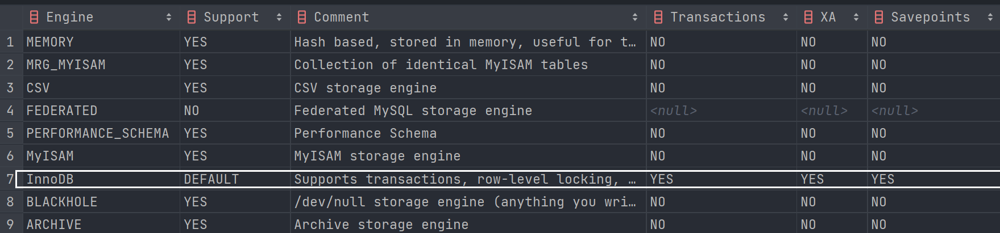
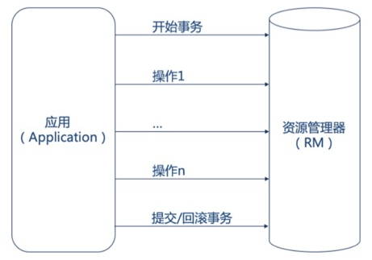
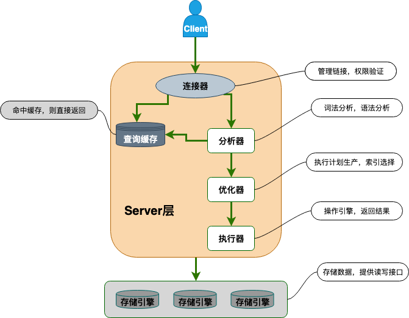

<!-- ---
sidebar: false
--- -->

# 1. mysql

## 1.1. 关系型数据库介绍

关系模型是采用二维表格结构表达实体类型及实体间联系的数据模型.

关系型数据库是一种建立在关系模型基础上的数据库.关系型数据库中,数据都被存放在了各种表中,表中的每一行就存放着一条数据.

大部分关系型数据库都使用 SQL 来操作数据库中的数据.

大部分关系型数据库都支持事务的四大特性 (ACID).

  

### 1.1.1. 有哪些常见的关系型数据库呢?

MySQL, PostgreSQL, Oracle, SQL Server, SQLite

## 1.2. MySQL 介绍

MySQL 是一种开源的关系型数据库,主要用于持久化存储系统中的一些数据,MySQL 的默认端口号是 3306.

## 1.3. 存储引擎

### 1.3.1. 存储引擎相关的命令

查看 MySQL 提供的所有存储引擎

```sql
mysql> show engines;
```



### 1.3.2. MyISAM 和 InnoDB 的区别

MySQL 5.5 之前,MyISAM 引擎是 MySQL 的默认存储引擎,但是,MyISAM 不支持事务和行级锁,而且最大的缺陷就是崩溃后无法安全恢复.

MySQL 5.5 之后,MySQL 默认的存储引擎是 InnoDB, InnoDB 是事务性数据库存储引擎

1. 是否支持行级锁

   MyISAM 只有表级锁 (table-level locking), 而 InnoDB 支持行级锁 (row-level locking) 和表级锁,默认为行级锁.

1. 是否支持事务

   MyISAM 不提供事务支持,InnoDB 提供事务支持,具有提交 (commit) 和回滚 (rollback) 事务的能力.

1. 是否支持外键

   MyISAM 不支持,而 InnoDB 支持,不建议在数据库层面使用外键的,应用层面可以解决

1. 是否支持数据库异常崩溃后的安全恢复

   MyISAM 不支持,而 InnoDB 支持.使用 InnoDB 的数据库在异常崩溃后,数据库重新启动的时候会保证数据库恢复到崩溃前的状态.这个恢复的过程依赖于 redo log

1. 是否支持 MVCC

   MyISAM 不支持,而 InnoDB 支持. MVCC 可以看作是行级锁的一个升级,可以有效减少加锁操作,提供性能.

> MVCC (Multi-Version Concurrency Control,多版本并发控制). MVCC 是在并发访问数据库时,通过对数据进行多版本保存,根据比较版本号来控制数据是否展示,从而达到读取数据时无需加锁就可以实现事务的隔离性,避免因写锁而导致读操作的堵塞

## 1.4. 锁机制

### 1.4.1. MyISAM 和 InnoDB 存储引擎使用的锁

1. MyISAM 采用表级锁 (table-level locking).
1. InnoDB 支持行级锁 (row-level locking) 和表级锁,默认为行级锁

### 1.4.2. 表级锁和行级锁对比

1. 表级锁: MySQL 中锁定粒度最大的一种锁,对当前操作的整张表加锁,实现简单,资源消耗也比较少,加锁快,不会出现死锁.其锁定粒度最大,触发锁冲突的概率最高,并发度最低
1. 行级锁: MySQL 中锁定粒度最小的一种锁,只针对当前操作的行进行加锁.行级锁能大大减少数据库操作的冲突.其加锁粒度最小,并发度高,但加锁的开销也最大,加锁慢,会出现死锁.

## 1.5. 什么是线程死锁?如何避免死锁?

### 1.5.1. 认识线程死锁

  
死锁是指两个或两个以上的线程在执行过程中同时被阻塞, 它们中的一个或者全部都在等待某个资源被释放. 由于线程被无限期地阻塞, 因此程序不可能正常终止.

### 1.5.2. 产生死锁的四个条件

1. 互斥条件: 该资源任意一个时刻只由一个线程占用.
1. 请求与保持条件: 一个线程因请求资源而阻塞时, 对已获得的资源保持不放.
1. 不剥夺条件: 线程已获得的资源在末使用完之前不能被其他线程强行剥夺, 只有自己使用完毕后才释放资源.
1. 循环等待条件: 若干线程之间形成一种头尾相接的循环等待资源关系.

### 1.5.3. 如何避免线程死锁?

为了避免死锁, 只要破坏产生死锁的四个条件中的其中一个就可以

1. 破坏互斥条件: 没有办法破坏, 用锁本来就是想让他们互斥的
1. 破坏请求与保持条件 : 一次性申请所有的资源.
1. 破坏不剥夺条件 : 占用部分资源的线程进一步申请其他资源时, 如果申请不到, 可以主动释放它占有的资源.
1. 破坏循环等待条件 : 靠按序申请资源来预防. 按某一顺序申请资源, 释放资源则反序释放. 破坏循环等待条件.

## 1.6. 查询缓存

MySQL 8.0 版本后移除查询缓存,因为这个功能不太实用

缓存虽然能够提升数据库的查询性能,但是缓存同时也带来了额外的开销,每次查询后都要做一次缓存操作,失效后还要销毁.因此,开启查询缓存要谨慎,尤其对于写密集的应用来说更是如此.

## 1.7. 事务

### 1.7.1. 何为事务?

事务是逻辑上的一组操作,要么全部执行,要么全部不执行.

> 事务最经典也经常被拿出来说例子就是转账了.假如小明要给小红转账 1000 元,这个转账会涉及到两个关键操作就是:
>
> 1. 将小明的余额减少 1000 元
> 2. 将小红的余额增加 1000 元.
>
>    事务会把这两个操作就可以看成逻辑上的一个整体,这个整体包含的操作要么都成功,要么都要失败.这样就不会出现小明余额减少而小红的余额却并没有增加的情况.

### 1.7.2. 何为数据库事务?

  

> 谈论事务的时候,如果没有特指分布式事务, 那么指的就是数据库事务.单体架构项目使用最多的是数据库事务.

数据库事务可以保证多个对数据库的操作构成一个逻辑上的整体.构成这个逻辑上的整体的这些数据库操作遵循:要么全部执行,要么全部不执行.

```sql
# 开启一个事务
START TRANSACTION;
# 多条 SQL 语句
SQL1, SQL2...
## 提交事务
COMMIT;
```

### 1.7.3. 事务的四大特性 (ACID)?

关系型数据库 (例如:MySQL, SQL Server, Oracle 等) 事务都有 ACID 特性:


1. 原子性 (Atomicity) :

   事务是最小的执行单位,不允许分割.事务的原子性确保操作要么全部执行,要么全部不执行

2. 一致性 (Consistency):

   执行事务前后,数据保持一致

   > 例如转账业务中,无论事务是否成功,转账者和收款人的总额应该是不变的;

3. 隔离性 (Isolation):

   并发访问数据库时,一个用户的事务不被其他事务所干扰,各并发事务之间数据是独立的;

4. 持久性 (Durability):

   一个事务被提交之后.它对数据库中数据的改变是持久的,即使数据库发生故障也不应该对其有任何影响.

#### 1.7.3.1. 数据事务的实现原理?

MySQL InnoDB 引擎使用 redo log(重做日志) 保证事务的持久性,使用 undo log(回滚日志) 来保证事务的原子性.

MySQL InnoDB 引擎通过锁机制,MVCC 等手段来保证事务的隔离性 ( 默认支持的隔离级别是 REPEATABLE-READ ).

保证了事务的持久性,原子性,隔离性之后,一致性才能得到保障.

### 1.7.4. 并发事务带来哪些问题?

多个事务并发运行,经常会操作相同的数据来完成各自的任务, 可能会导致以下的问题:

#### 1.7.4.1. 脏读 (Dirty read)

当一个事务正在访问数据并且对数据进行了修改,而这种修改还没有提交到数据库中,这时另外一个事务也访问了这个数据,然后使用了这个数据.因为这个数据是还没有提交的数据,那么另外一个事务读到的这个数据是脏数据,依据脏数据所做的操作可能是不正确的.

#### 1.7.4.2. 丢失修改 (Lost to modify)

在一个事务读取一个数据时,另外一个事务也访问了该数据,那么在第一个事务中修改了这个数据后,第二个事务也修改了这个数据.这样第一个事务内的修改结果就被丢失,因此称为丢失修改.

#### 1.7.4.3. 不可重复读 (Unrepeatable read)

在一个事务内多次读同一数据.在这个事务还没有结束时,另一个事务也访问该数据.那么,在第一个事务中的两次读数据之间,由于第二个事务的修改导致第一个事务两次读取的数据不一致,因此称为不可重复读.

#### 1.7.4.4. 幻读 (Phantom read)

一个事务读取了几行数据,接着另一个并发事务插入 (或删除) 几条数据.在随后的查询中,第一个事务就会发现多了一些原本不存在的记录,就好像发生了幻觉一样,所以称为幻读.

#### 1.7.4.5. 不可重复读和幻读的区别

1. 不可重复读的重点是修改,比如多次读取一条记录发现其中某些列的值被修改
1. 幻读的重点在于新增或者删除,比如多次读取发现记录条数增多或减少

### 1.7.5. 事务隔离级别有哪些?

   |     隔离级别     | 脏读 | 不可重复读 | 幻读 |
   | :--------------: | :--: | :--------: | :--: |
   | READ-UNCOMMITTED |  √   |     √      |  √   |
   |  READ-COMMITTED  |  ×   |     √      |  √   |
   | REPEATABLE-READ  |  ×   |     ×      |  √   |
   |   SERIALIZABLE   |  ×   |     ×      |  ×   |

1. READ-UNCOMMITTED(读取未提交):

   最低的隔离级别,允许读取尚未提交的数据变更,可能会导致脏读,幻读或不可重复读.

1. READ-COMMITTED(读取已提交):

   允许读取并发事务已经提交的数据,可以阻止脏读,但是幻读或不可重复读仍有可能发生.

1. REPEATABLE-READ(可重复读):

   对同一字段的多次读取结果都是一致的,除非数据是被本身事务自己所修改,可以阻止脏读和不可重复读,但幻读仍有可能发生.

1. SERIALIZABLE(可串行化):

   最高的隔离级别,完全服从 ACID 的隔离级别.所有的事务依次逐个执行,这样事务之间就完全不可能产生干扰,也就是说,该级别可以防止脏读,不可重复读以及幻读.

### 1.7.6. MySQL 的默认隔离级别是 REPEATABLE-READ

MySQL InnoDB 存储引擎的默认支持的隔离级别是 REPEATABLE-READ,  InnoDB 存储引擎在分布式事务的情况下一般会用到 SERIALIZABLE 隔离级别.

隔离级别越低,事务请求的锁越少,所以大部分数据库系统的隔离级别都是 READ-COMMITTED,  InnoDB 存储引擎默认使用 REPEATABLE-READ

`SELECT @@transaction_isolation;` 可以查询当前隔离级别

## 1.8. 一条 SQL 语句在 MySQL 中如何被执行的?



### 1.8.1. MySQL 基本架构概览

1. 连接器:身份认证和权限相关 (登录 MySQL 的时候).
1. 查询缓存:执行查询语句的时候,会先查询缓存 (MySQL 8.0 版本后移除).
1. 分析器:没有命中缓存的话,SQL 语句就会经过分析器,分析器看 SQL 语句要干,再检查 SQL 语句语法是否正确.
1. 优化器:按照 MySQL 认为最优的方案去执行

### 1.8.2. MySQL 主要分为 Server 层和存储引擎层

1. Server 层:主要包括连接器,查询缓存,分析器,优化器,执行器等,所有跨存储引擎的功能都在这一层实现,比如存储过程,触发器,视图,函数等,还有一个通用的日志模块 binglog 日志模块.
1. 存储引擎:主要负责数据的存储和读取,采用可以替换的插件式架构,支持 InnoDB, MyISAM, Memory 等多个存储引擎,其中 InnoDB 引擎有自有的日志模块 redolog 模块.现在最常用的存储引擎是 InnoDB,它从 MySQL 5.5.5 版本开始就被当做默认存储引擎了

### 1.8.3. 语句分析 - 查询语句

`select * from tb_student A where A.age='18' and A.name=' 张三 ';`

1. 先检查该语句是否有权限,如果没有权限,直接返回错误信息,如果有权限,执行下一步.~~~在 MySQL8.0 版本以前,会先查询缓存,以这条 sql 语句为 key 在内存中查询是否有结果,如果有直接缓存,如果没有,执行下一步.~~~
1. 通过分析器进行词法分析,提取 sql 语句的关键元素,判断这个 sql 语句是否有语法错误,比如关键词是否正确等等,如果检查没问题就执行下一步.

   比如提取上面这个语句是查询 select,提取需要查询的表名为 tb_student,需要查询所有的列,查询条件是这个表的 id='1'.然后判断这个 sql 语句是否有语法错误,比如关键词是否正确等等,如果检查没问题就执行下一步.

1. 优化器进行确定执行方案

   上面的 sql 语句,可以有两种执行方案:
   a.先查询学生表中姓名为 张三 的学生,然后判断是否年龄是 18.
   b.先找出学生中年龄 18 岁的学生,然后再查询姓名为 张三 的学生.
   优化器根据自己的优化算法进行选择执行效率最好的一个方案 (优化器认为,有时候不一定最好).那么确认了执行计划后就准备开始执行了.

1. 进行权限校验,如果没有权限就会返回错误信息,如果有权限就会调用数据库引擎接口,返回引擎的执行结果.

### 1.8.4. 语句分析 - 更新语句 (增加,更新,删除)

`update tb_student A set A.age='19' where A.name=' 张三 ';`

1. 先根据条件查询到张三这一条数据,如果有缓存,也是会用到缓存.
1. 然后拿到查询的语句,更新数据,把 age 改为 19,然后调用引擎 API 接口,写入这一行数据,InnoDB 引擎把数据保存在内存中,同时记录 redo log(重做日志), 此时 redo log 进入 prepare 状态,然后告诉执行器,执行完成了,随时可以提交.
1. 执行器收到通知后记录 binlog (归档日志), 然后调用引擎接口,提交 redo log 为提交状态.
1. 更新完成.

### 1.8.5. 总结

1. MySQL 主要分为 Server 层和引擎层,Server 层主要包括连接器,查询缓存,分析器,优化器,执行器,同时还有一个日志模块 (binlog), 这个日志模块所有执行引擎都可以共用,redolog 只有 InnoDB 有.
1. 引擎层是插件式的,目前主要包括,MyISAM, InnoDB, Memory 等.
1. 查询语句的执行流程如下:权限校验 (如果命中缓存)--->查询缓存--->分析器--->优化器--->权限校验--->执行器--->引擎
1. 更新语句执行流程如下:分析器---->权限校验---->执行器--->引擎---redo log(prepare 状态)--->binlog--->redo log(commit 状态)

## 1.9. 索引是什么?

索引是关系数据库中对某一列或多列的值进行预排序的数据结构.使用索引可以直接定位到符合条件的记录, 不必扫描整张表, 大大加快了查询速度.

## 1.10. 索引有哪些优缺点?

### 1.10.1. 索引的优点

1. 加快数据的检索速度,这是创建索引的最主要的原因
1. 创建唯一性索引,保证数据库表中每一行数据的唯一性
1. 加速表和表之间的连接,特别是在实现数据的参照完整性方面特别有意义.
1. 在使用分组和排序子句进行数据检索时, 可以显著减少查询中分组和排序的时间.
1. 通过使用索引,可以在查询的过程中使用优化隐藏器,提高系统的性能.

### 1.10.2. 索引的缺点

1. 创建索引和维护索引要耗费时间,这种时间随着数据量的增加而增加
1. 索引需要占物理空间,除了数据表占数据空间之外,每一个索引还要占一定的物理空间,如果要建立聚簇索引,那么需要的空间就会更大
1. 对表中的数据进行增删改的时候,索引也要动态的维护,降低了数据的维护速度

## 1.11. MySQL 有哪几种索引类型?

1. 普通索引:即一个索引只包含单个列,一个表可以有多个单列索引
1. 唯一索引:索引列的值必须唯一,但允许有空值
1. 联合索引:多列值组成一个索引,专门用于组合搜索,其效率大于索引合并

## 1.12. 联合索引是什么?为什么需要注意联合索引中的顺序?

MySQL 可以使用多个字段同时建立一个索引,叫做联合索引.

在联合索引中,如果想要命中索引,需要按照建立索引时的字段顺序使用,否则无法命中索引.一般情况下,将查询需求频繁或者字段选择性高的列放在前面

## 1.13. 讲一讲 MySQL 的最左匹配原则?

最左匹配原则(最左优先),在创建联合索引时,要根据业务需求,where 子句中使用最频繁的一列放在最左边.
mysql 会一直向右匹配直到遇到范围查询 (>, <, between, like) 才停止匹配

> 比如 a = 1 and b = 2 and c > 3 and d = 4 如果建立 (a, b, c, d) 顺序的索引,d 是用不到索引的,如果建立 (a, b, d, c) 的索引则都可以用到,a, b, d 的顺序可以任意调整.

= 和 in 可以乱序,比如 a = 1 and b = 2 and c = 3 建立 (a, b, c) 索引可以任意顺序,mysql 的查询优化器会帮你优化成索引可以识别的形式.

## 1.14. 怎么查看 MySQL 语句有没有用到索引?

使用 explain

`EXPLAIN SELECT * FROM employees.titles WHERE emp_no='10001' AND title='Senior Engineer' AND from_date='1986-06-26';`

| id  | select_type | table  | partitions | type  | possible_keys | key     | key_len | ref               | filtered | rows | Extra |
| --- | ----------- | ------ | ---------- | ----- | ------------- | ------- | ------- | ----------------- | -------- | ---- | ----- |
| 1   | SIMPLE      | titles | null       | const | PRIMARY       | PRIMARY | 59      | const, const, const | 10       | 1    |       |

1. id:在⼀个⼤的查询语句中每个 SELECT 关键字都对应⼀个唯⼀的 id , 如 explain select \* from s1 where id = (select id from s1 where name = 'egon1');第一个 select 的 id 是 1,第二个 select 的 id 是 2.有时候会出现两个 select,但是 id 却都是 1,这是因为优化器把子查询变成了连接查询 .
1. select_type:select 关键字对应的那个查询的类型,如 SIMPLE, PRIMARY, SUBQUERY, DEPENDENT, SNION .
1. table:每个查询对应的表名 .
1. type:type 字段比较重要,它提供了判断查询是否高效的重要依据依据.通过 type 字段,判断此次查询是 全表扫描 还是 索引扫描 等.如 const(主键索引或者唯一二级索引进行等值匹配的情况下), ref(普通的⼆级索引列与常量进⾏等值匹配), index(扫描全表索引的覆盖索引) .
   通常来说,不同的 type 类型的性能关系如下:
   ALL < index < range ~ index_merge < ref < eq_ref < const < system
   ALL 类型因为是全表扫描,因此在相同的查询条件下,它是速度最慢的.
   而 index 类型的查询虽然不是全表扫描,但是它扫描了所有的索引,因此比 ALL 类型的稍快.

1. possible_key:查询中可能用到的索引 (可以把用不到的删掉,降低优化器的优化时间) .
1. key:此字段是 MySQL 在当前查询时所真正使用到的索引.
1. filtered:查询器预测满足下一次查询条件的百分比 .
1. rows 也是一个重要的字段. MySQL 查询优化器根据统计信息,估算 SQL 要查找到结果集需要扫描读取的数据行数.这个值非常直观显示 SQL 的效率好坏,原则上 rows 越少越好.
1. extra:表示额外信息,如 Using where, Start temporary, End temporary, Using temporary 等.

## 1.15. 为什么官方建议使用自增长主键作为索引?

自增主键是连续的,在插入过程中尽量减少页分裂,即使要进行页分裂,也只会分裂很少一部分.并且能减少数据的移动,每次插入都是插入到最后.总之就是减少分裂和移动的频率.

## 1.16. 如何创建索引?

### 1.16.1. 在执行 CREATE TABLE 时创建索引

```sql
CREATE TABLE user_index2 (
   id INT auto_increment PRIMARY KEY, 
   first_name VARCHAR (16), 
   last_name VARCHAR (16), 
   id_card VARCHAR (18), 
   information text, 
   KEY name (first_name,  last_name), 
   FULLTEXT KEY (information), 
   UNIQUE KEY (id_card)
);
```

### 1.16.2. 使用 ALTER TABLE 命令去增加索引

可以创建普通索引,UNIQUE 索引或 PRIMARY KEY 索引.

```sql
ALTER TABLE table_name ADD INDEX index_name (column_list);
```

### 1.16.3. 使用 CREATE INDEX 命令创建

```sql
CREATE INDEX index_name ON table_name (column_list);
```

## 1.17. 索引设计规范

### 1.17.1. 字段非空 (NOT NULL)

只要列中包含有 NULL 值都将不会被包含在索引中,造成索引失效,所以在数据库设计时不要让字段的默认值为 NULL.

### 1.17.2. 限制每张表上的索引数量,建议单张表索引不超过 5 个

索引并不是越多越好!索引可以提高效率同样可以降低效率.索引可以增加查询效率,但同样也会降低插入和更新的效率,甚至有些情况下会降低查询效率.

因为 MySQL 优化器在选择如何优化查询时,会根据统一信息,对每一个可以用到的索引来进行评估,以生成出一个最好的执行计划,如果同时有很多个索引都可以用于查询,就会增加 MySQL 优化器生成执行计划的时间,同样会降低查询性能.

### 1.17.3. 禁止给表中的每一列都建立单独的索引

推荐使用联合索引

### 1.17.4. 每个 Innodb 表必须有个主键

Innodb 是一种索引组织表,Innodb 是按照主键索引的顺序来组织表的,数据的存储的逻辑顺序和索引的顺序是相同的.

### 1.17.5. 常见索引列建议

1. 出现在 SELECT,UPDATE,DELETE 语句的 WHERE 从句中的列
1. 包含在 ORDER BY,GROUP BY,DISTINCT 中的字段
1. 并不要将符合以上情况的字段的列都建立一个索引, 通常将字段建立联合索引效果更好
1. 多表 join 的关联列

### 1.17.6. 如何选择索引列的顺序

建立索引的目的是:希望通过索引进行数据查找,减少随机 IO,增加查询性能 ,索引能过滤出越少的数据,则从磁盘中读入的数据也就越少.

1. 区分度最高的放在联合索引的最左侧(区分度=列中不同值的数量/列的总行数)
1. 尽量把字段长度小的列放在联合索引的最左侧(因为字段长度越小,一页能存储的数据量越大,IO 性能也就越好)
1. 使用最频繁的列放到联合索引的左侧(这样可以比较少的建立一些索引)

### 1.17.7. 避免建立冗余索引和重复索引(增加了查询优化器生成执行计划的时间)

1. 重复索引示例:primary key(id),index(id),unique index(id)
1. 冗余索引示例:index(a,b,c),index(a,b),index(a)

### 1.17.8. 对于频繁的查询优先考虑使用覆盖索引

覆盖索引就是包含了所有查询字段 (where,select,order by,group by 包含的字段) 的索引

#### 1.17.8.1. 覆盖索引的好处

1. 避免 Innodb 表进行索引的二次查询: Innodb 是以聚集索引的顺序来存储的,对于 Innodb 来说,二级索引在叶子节点中所保存的是行的主键信息,如果是用二级索引查询数据的话,在查找到相应的键值后,还要通过主键进行二次查询才能获取我们真实所需要的数据.而在覆盖索引中,二级索引的键值中可以获取所有的数据,避免了对主键的二次查询 ,减少了 IO 操作,提升了查询效率.
1. 可以把随机 IO 变成顺序 IO 加快查询效率:由于覆盖索引是按键值的顺序存储的,对于 IO 密集型的范围查找来说,对比随机从磁盘读取每一行的数据 IO 要少的多,因此利用覆盖索引在访问时也可以把磁盘的随机读取的 IO 转变成索引查找的顺序 IO.

### 1.17.9. 尽量避免使用外键约束

1. 不建议使用外键约束(foreign key),但一定要在表与表之间的关联键上建立索引
1. 外键可用于保证数据的参照完整性,但建议在业务端实现
1. 外键会影响父表和子表的写操作从而降低性能

## 1.18. 使用索引查询一定能提高查询的性能吗?

通常通过索引查询数据比全表扫描要快.但是也必须注意到它的代价.

索引需要空间来存储,也需要定期维护,每当有记录在表中增减或索引列被修改时,索引本身也会被修改.这意味着每条记录的 INSERT, DELETE, UPDATE 将为此多付出 4, 5 次的磁盘 I/O. 因为索引需要额外的存储空间和处理,那些不必要的索引反而会使查询反应时间变慢.

## 1.19. 什么情况下不走索引 (索引失效)?

1. 使用 != 或者 <> 导致索引失效
1. 类型不一致导致的索引失效
1. 函数导致的索引失效

   `SELECT * FROM user WHERE DATE(create_time) = '2020-09-03';`
   如果使用函数在索引列,这是不走索引的.

1. 运算符导致的索引失效

   `SELECT * FROM user WHERE age - 1 = 20;`
   如果你对列进行了 (+, -, \_, /, !),  那么都将不会走索引.

1. OR 引起的索引失效

   `SELECT * FROM user WHERE name = '张三' OR height = '175';`

   OR 导致索引是在特定情况下的,并不是所有的 OR 都是使索引失效,如果 OR 连接的是同一个字段,那么索引不会失效,反之索引失效.

1. 模糊搜索导致的索引失效

   `SELECT * FROM user WHERE name LIKE '%冰';`
   当%放在匹配字段前是不走索引的,放在后面才会走索引.

1. NOT IN, NOT EXISTS 导致索引失效

## 1.20. 什么是JDBC，在什么时候会用到它？

JDBC (Java DataBase Connection，Java数据库连接)，可以用它来操作关系型数据库，执行SQL查询，存储过程，并处理返回的结果。

```java
Connection con = null;
// load the Driver Class
Class.forName("com.mysql.jdbc.Driver");
// create the connection now
con = DriverManager.getConnection("jdbc:mysql://localhost:3306/UserDB", user, password);

```
