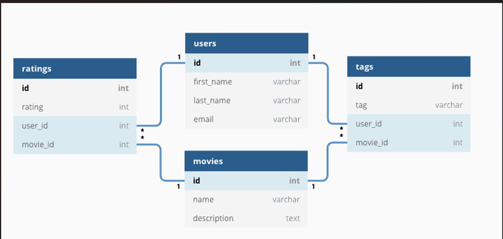

# 1. mysql

## 1.1. MySQL 基础

### 1.1.1. 关系型数据库介绍

关系型数据库就是一种建立在关系模型的基础上的数据库。关系模型表明了数据库中所存储的数据之间的联系 (一对一，一对多，多对多).

大部分关系型数据库都使用 SQL 来操作数据库中的数据。并且，大部分关系型数据库都支持事务的四大特性 (ACID).

关系型数据库中，数据都被存放在了各种表中 (比如用户表),表中的每一行就存放着一条数据 (比如一个用户的信息).

  

#### 1.1.1.1. 有哪些常见的关系型数据库呢？

MySQL,PostgreSQL,Oracle,SQL Server,SQLite

### 1.1.2. MySQL 介绍

MySQL 是一种关系型数据库，主要用于持久化存储系统中的一些数据比如用户信息。

由于 MySQL 是开源免费并且比较成熟的数据库，因此，MySQL 被大量使用在各种系统中.MySQL 的默认端口号是 3306.

## 1.2. 存储引擎

### 1.2.1. 存储引擎相关的命令

查看 MySQL 提供的所有存储引擎

```sql
mysql> show engines;
```


从上图可以查看出 MySQL 当前默认的存储引擎是 InnoDB，并且在 5.7 版本所有的存储引擎中只有 InnoDB 是事务性存储引擎，也就是说只有 InnoDB 支持事务。

查看 MySQL 当前默认的存储引擎

也可以通过下面的命令查看默认的存储引擎。

```sql
mysql> show variables like '%storage_engine%';
```

查看表的存储引擎

```sql
show table status like "table_name" ;
```


### 1.2.2. MyISAM 和 InnoDB 的区别


MySQL 5.5 之前，MyISAM 引擎是 MySQL 的默认存储引擎，但是，MyISAM 不支持事务和行级锁，而且最大的缺陷就是崩溃后无法安全恢复。

MySQL 5.5 版本后默认的存储引擎为 InnoDB(事务性数据库引擎)

1. 是否支持行级锁

   MyISAM 只有表级锁 (table-level locking),而 InnoDB 支持行级锁 (row-level locking) 和表级锁，默认为行级锁。

1. 是否支持事务

   MyISAM 不提供事务支持，InnoDB 提供事务支持，具有提交 (commit) 和回滚 (rollback) 事务的能力。

1. 是否支持外键

   MyISAM 不支持，而 InnoDB 支持，不建议在数据库层面使用外键的，应用层面可以解决

1. 是否支持数据库异常崩溃后的安全恢复
   MyISAM 不支持，而 InnoDB 支持。

   使用 InnoDB 的数据库在异常崩溃后，数据库重新启动的时候会保证数据库恢复到崩溃前的状态。这个恢复的过程依赖于 redo log .

   - MySQL InnoDB 引擎使用 redo log(重做日志) 保证事务的持久性，使用 undo log(回滚日志) 来保证事务的原子性。
   - MySQL InnoDB 引擎通过 锁机制，MVCC 等手段来保证事务的隔离性 ( 默认支持的隔离级别是 REPEATABLE-READ ).
   - 保证了事务的持久性，原子性，隔离性之后，一致性才能得到保障。

1. 是否支持 MVCC

   MyISAM 不支持，而 InnoDB 支持。

   MVCC 可以看作是行级锁的一个升级，可以有效减少加锁操作，提供性能。

## 1.3. 什么是 MVCC

MVCC 是指多版本并发控制 (Multi-Version Concurrency Control).MVCC 是在并发访问数据库时，通过对数据进行多版本控制，避免因写锁而导致读操作的堵塞，从而很好的优化并发堵塞问题。解决并发问题的通用方案有：

1. 对并发访问的数据添加一把排它锁，添加锁之后，其他的读和写操作都需等待锁释放后才能访问。

1. 添加一把共享锁，读读操作不需要等待锁的释放，读写和写写操作需要等待锁的释放。

1. 通过对并发数据进行快照备份，从而达到无锁数据的并发访问。

通俗的讲就是 MVCC 通过对数据进行多版本保存，根据比较版本号来控制数据是否展示，从而达到读取数据时无需加锁就可以实现事务的隔离性。

## 1.4. 锁机制与 InnoDB 锁算法

### 1.4.1. MyISAM 和 InnoDB 存储引擎使用的锁

1. MyISAM 采用表级锁 (table-level locking).
1. InnoDB 支持行级锁 (row-level locking) 和表级锁，默认为行级锁

### 1.4.2. 表级锁和行级锁对比

1. 表级锁：
   MySQL 中锁定 粒度最大 的一种锁，对当前操作的整张表加锁，实现简单，资源消耗也比较少，加锁快，不会出现死锁。其锁定粒度最大，触发锁冲突的概率最高，并发度最低，MyISAM 和 InnoDB 引擎都支持表级锁。
1. 行级锁：
   MySQL 中锁定粒度最小的一种锁，只针对当前操作的行进行加锁。行级锁能大大减少数据库操作的冲突.其加锁粒度最小，并发度高，但加锁的开销也最大，加锁慢，会出现死锁。

InnoDB 存储引擎的锁的算法有三种：

- Record lock:记录锁，单个行记录上的锁
- Gap lock:间隙锁，锁定一个范围，不包括记录本身
- Next-key lock:record+gap 临键锁，锁定一个范围，包含记录本身

## 1.5. 查询缓存

MySQL 8.0 版本后移除查询缓存，因为这个功能不太实用

缓存虽然能够提升数据库的查询性能，但是缓存同时也带来了额外的开销，每次查询后都要做一次缓存操作，失效后还要销毁。因此，开启查询缓存要谨慎，尤其对于写密集的应用来说更是如此。

可以修改配置 MySQL 开启查询缓存

## 1.6. 事务

### 1.6.1. 何为事务？

事务是逻辑上的一组操作，要么都执行，要么都不执行。

> 事务最经典也经常被拿出来说例子就是转账了。假如小明要给小红转账 1000 元，这个转账会涉及到两个关键操作就是：
>
> 1. 将小明的余额减少 1000 元
> 2. 将小红的余额增加 1000 元。
>
>    事务会把这两个操作就可以看成逻辑上的一个整体，这个整体包含的操作要么都成功，要么都要失败。这样就不会出现小明余额减少而小红的余额却并没有增加的情况。

### 1.6.2. 何为数据库事务？


谈论事务的时候，如果没有特指分布式事务，往往指的就是数据库事务。单体架构项目使用最多的是数据库事务。

数据库事务可以保证多个对数据库的操作 (也就是 SQL 语句) 构成一个逻辑上的整体。构成这个逻辑上的整体的这些数据库操作遵循:要么全部执行成功，要么全部不执行。

```sql
# 开启一个事务
START TRANSACTION;
# 多条 SQL 语句
SQL1,SQL2...
## 提交事务
COMMIT;
```

另外，关系型数据库 (例如:MySQL,SQL Server,Oracle 等) 事务都有 ACID 特性：


### 1.6.3. 何为 ACID 特性呢？

1. 原子性 (Atomicity) :

   事务是最小的执行单位，不允许分割。事务的原子性确保动作要么全部完成，要么完全不起作用;

2. 一致性 (Consistency):

   执行事务前后，数据保持一致，例如转账业务中，无论事务是否成功，转账者和收款人的总额应该是不变的;

3. 隔离性 (Isolation):

   并发访问数据库时，一个用户的事务不被其他事务所干扰，各并发事务之间数据库是独立的;

4. 持久性 (Durability):

   一个事务被提交之后。它对数据库中数据的改变是持久的，即使数据库发生故障也不应该对其有任何影响。

#### 1.6.3.1. 数据事务的实现原理呢？

MySQL InnoDB 引擎使用 redo log(重做日志) 保证事务的持久性，使用 undo log(回滚日志) 来保证事务的原子性。

MySQL InnoDB 引擎通过 锁机制，MVCC 等手段来保证事务的隔离性 ( 默认支持的隔离级别是 REPEATABLE-READ ).

保证了事务的持久性，原子性，隔离性之后，一致性才能得到保障。

### 1.6.4. 并发事务带来哪些问题？

在典型的应用程序中，多个事务并发运行，经常会操作相同的数据来完成各自的任务 (多个用户对同一数据进行操作).并发虽然是必须的，但可能会导致以下的问题。

1. 脏读 (Dirty read):

   当一个事务正在访问数据并且对数据进行了修改，而这种修改还没有提交到数据库中，这时另外一个事务也访问了这个数据，然后使用了这个数据。因为这个数据是还没有提交的数据，那么另外一个事务读到的这个数据是"脏数据",依据"脏数据"所做的操作可能是不正确的。

1. 丢失修改 (Lost to modify):

   指在一个事务读取一个数据时，另外一个事务也访问了该数据，那么在第一个事务中修改了这个数据后，第二个事务也修改了这个数据。这样第一个事务内的修改结果就被丢失，因此称为丢失修改。例如:事务 1 读取某表中的数据 A=20，事务 2 也读取 A=20，事务 1 修改 A=A-1，事务 2 也修改 A=A-1，最终结果 A=19，事务 1 的修改被丢失。

1. 不可重复读 (Unrepeatable read):

   指在一个事务内多次读同一数据。在这个事务还没有结束时，另一个事务也访问该数据。那么，在第一个事务中的两次读数据之间，由于第二个事务的修改导致第一个事务两次读取的数据可能不太一样。这就发生了在一个事务内两次读到的数据是不一样的情况，因此称为不可重复读。

1. 幻读 (Phantom read):

   幻读与不可重复读类似。它发生在一个事务 (T1) 读取了几行数据，接着另一个并发事务 (T2) 插入了一些数据时。在随后的查询中，第一个事务 (T1) 就会发现多了一些原本不存在的记录，就好像发生了幻觉一样，所以称为幻读。

#### 1.6.4.1. 不可重复读和幻读区别

不可重复读的重点是修改，比如多次读取一条记录发现其中某些列的值被修改

幻读的重点在于新增或者删除，比如多次读取一条记录发现记录增多或减少了。

### 1.6.5. 事务隔离级别有哪些？

1. READ-UNCOMMITTED(读取未提交):

   最低的隔离级别，允许读取尚未提交的数据变更，可能会导致脏读，幻读或不可重复读。

1. READ-COMMITTED(读取已提交):

   允许读取并发事务已经提交的数据，可以阻止脏读，但是幻读或不可重复读仍有可能发生。

1. REPEATABLE-READ(可重复读):

   对同一字段的多次读取结果都是一致的，除非数据是被本身事务自己所修改，可以阻止脏读和不可重复读，但幻读仍有可能发生。

1. SERIALIZABLE(可串行化):

   最高的隔离级别，完全服从 ACID 的隔离级别。所有的事务依次逐个执行，这样事务之间就完全不可能产生干扰，也就是说，该级别可以防止脏读，不可重复读以及幻读。

|     隔离级别     | 脏读 | 不可重复读 | 幻读 |
| :--------------: | :--: | :--------: | :--: |
| READ-UNCOMMITTED |  √   |     √      |  √   |
|  READ-COMMITTED  |  ×   |     √      |  √   |
| REPEATABLE-READ  |  ×   |     ×      |  √   |
|   SERIALIZABLE   |  ×   |     ×      |  ×   |

### 1.6.6. MySQL 的默认隔离级别是什么？

MySQL InnoDB 存储引擎的默认支持的隔离级别是 REPEATABLE-READ , InnoDB 存储引擎在 分布式事务 的情况下一般会用到 SERIALIZABLE 隔离级别。

隔离级别越低，事务请求的锁越少，所以大部分数据库系统的隔离级别都是 READ-COMMITTED, InnoDB 存储引擎默认使用 REPEATABLE-READ 并不会有任何性能损失。

可以通过 SELECT @@transaction_isolation;命令来查看
| @@transaction_isolation |
| ----------------------- |
| REPEATABLE-READ |

## 1.7. 一条 SQL 语句在 MySQL 中如何被执行的？


### 1.7.1. MySQL 基本架构概览

1. 连接器：身份认证和权限相关 (登录 MySQL 的时候).
1. 查询缓存：执行查询语句的时候，会先查询缓存 (MySQL 8.0 版本后移除).
1. 分析器：没有命中缓存的话，SQL 语句就会经过分析器，分析器看 SQL 语句要干，再检查 SQL 语句语法是否正确。
1. 优化器：按照 MySQL 认为最优的方案去执行

### 1.7.2. MySQL 主要分为 Server 层和存储引擎层

1. Server 层：主要包括连接器，查询缓存，分析器，优化器，执行器等，所有跨存储引擎的功能都在这一层实现，比如存储过程，触发器，视图，函数等，还有一个通用的日志模块 binglog 日志模块。
1. 存储引擎：主要负责数据的存储和读取，采用可以替换的插件式架构，支持 InnoDB,MyISAM,Memory 等多个存储引擎，其中 InnoDB 引擎有自有的日志模块 redolog 模块。现在最常用的存储引擎是 InnoDB，它从 MySQL 5.5.5 版本开始就被当做默认存储引擎了

### 1.7.3. 语句分析 - 查询语句

`select * from tb_student A where A.age='18' and A.name=' 张三 ';`

1. 先检查该语句是否有权限，如果没有权限，直接返回错误信息，如果有权限，执行下一步。~~~在 MySQL8.0 版本以前，会先查询缓存，以这条 sql 语句为 key 在内存中查询是否有结果，如果有直接缓存，如果没有，执行下一步。~~~
1. 通过分析器进行词法分析，提取 sql 语句的关键元素，判断这个 sql 语句是否有语法错误，比如关键词是否正确等等，如果检查没问题就执行下一步。

   比如提取上面这个语句是查询 select，提取需要查询的表名为 tb_student，需要查询所有的列，查询条件是这个表的 id='1'.然后判断这个 sql 语句是否有语法错误，比如关键词是否正确等等，如果检查没问题就执行下一步。

1. 优化器进行确定执行方案

   上面的 sql 语句，可以有两种执行方案：
   a.先查询学生表中姓名为 "张三" 的学生，然后判断是否年龄是 18.
   b.先找出学生中年龄 18 岁的学生，然后再查询姓名为 "张三" 的学生。
   优化器根据自己的优化算法进行选择执行效率最好的一个方案 (优化器认为，有时候不一定最好).那么确认了执行计划后就准备开始执行了。

1. 进行权限校验，如果没有权限就会返回错误信息，如果有权限就会调用数据库引擎接口，返回引擎的执行结果。

### 1.7.4. 语句分析 - 更新语句 (增加，更新，删除)

`update tb_student A set A.age='19' where A.name=' 张三 ';`

1. 先根据条件查询到张三这一条数据，如果有缓存，也是会用到缓存。
1. 然后拿到查询的语句，更新数据，把 age 改为 19，然后调用引擎 API 接口，写入这一行数据，InnoDB 引擎把数据保存在内存中，同时记录 redo log(重做日志),此时 redo log 进入 prepare 状态，然后告诉执行器，执行完成了，随时可以提交。
1. 执行器收到通知后记录 binlog (归档日志),然后调用引擎接口，提交 redo log 为提交状态。
1. 更新完成。

### 1.7.5. 总结

1. MySQL 主要分为 Server 层和引擎层，Server 层主要包括连接器，查询缓存，分析器，优化器，执行器，同时还有一个日志模块 (binlog),这个日志模块所有执行引擎都可以共用，redolog 只有 InnoDB 有。
1. 引擎层是插件式的，目前主要包括，MyISAM,InnoDB,Memory 等。
1. 查询语句的执行流程如下：权限校验 (如果命中缓存)--->查询缓存--->分析器--->优化器--->权限校验--->执行器--->引擎
1. 更新语句执行流程如下：分析器---->权限校验---->执行器--->引擎---redo log(prepare 状态)--->binlog--->redo log(commit 状态)

## 1.8. 索引是什么？

索引是一种特殊的文件 (InnoDB 数据表上的索引是表空间的一个组成部分),它们包含着对数据表里所有记录的引用指针。

索引是一种数据结构。数据库索引，是数据库管理系统中一个排序的数据结构，以协助快速查询，更新数据库表中数据。索引的实现通常使用 B 树及其变种 B+ 树。更通俗的说，索引就相当于目录。为了方便查找书中的内容，通过对内容建立索引形成目录。而且索引是一个文件，它是要占据物理空间的。

MySQL 索引的建立对于 MySQL 的高效运行是很重要的，索引可以大大提高 MySQL 的检索速度。

## 1.9. 索引有哪些优缺点？

### 1.9.1. 索引的优点

1. 可以大大加快数据的检索速度，这也是创建索引的最主要的原因。
1. 通过使用索引，可以在查询的过程中，使用优化隐藏器，提高系统的性能。

### 1.9.2. 索引的缺点

1. 时间方面：创建索引和维护索引要耗费时间，具体地，当对表中的数据进行增加，删除和修改的时候，索引也要动态的维护，会降低增/改/删的执行效率;
1. 空间方面：索引需要占物理空间。

## 1.10. MySQL 有哪几种索引类型？

### 1.10.1. 从存储结构上来划分

BTree 索引 (B-Tree 或 B+Tree 索引),Hash 索引，full-index 全文索引，R-Tree 索引。这里所描述的是索引存储时保存的形式，

### 1.10.2. 从应用层次来分：普通索引，唯一索引，复合索引

1. 普通索引：即一个索引只包含单个列，一个表可以有多个单列索引
1. 唯一索引：索引列的值必须唯一，但允许有空值
1. 复合索引：多列值组成一个索引，专门用于组合搜索，其效率大于索引合并

## 1.11. 联合索引是什么？为什么需要注意联合索引中的顺序？

MySQL 可以使用多个字段同时建立一个索引，叫做联合索引。在联合索引中，如果想要命中索引，需要按照建立索引时的字段顺序挨个使用，否则无法命中索引。一般情况下，将查询需求频繁或者字段选择性高的列放在前面

## 1.12. 讲一讲 MySQL 的最左前缀原则？

最左前缀原则就是最左优先，在创建多列索引时，要根据业务需求，where 子句中使用最频繁的一列放在最左边。
mysql 会一直向右匹配直到遇到范围查询 (>,<,between,like) 就停止匹配

> 比如 a = 1 and b = 2 and c > 3 and d = 4 如果建立 (a,b,c,d) 顺序的索引，d 是用不到索引的，如果建立 (a,b,d,c) 的索引则都可以用到，a,b,d 的顺序可以任意调整。

=和 in 可以乱序，比如 a = 1 and b = 2 and c = 3 建立 (a,b,c) 索引可以任意顺序，mysql 的查询优化器会帮你优化成索引可以识别的形式。

## 1.13. 怎么查看 MySQL 语句有没有用到索引？

使用 explain

`EXPLAIN SELECT * FROM employees.titles WHERE emp_no='10001' AND title='Senior Engineer' AND from_date='1986-06-26';`

| id  | select_type | table  | partitions | type  | possible_keys | key     | key_len | ref               | filtered | rows | Extra |
| --- | ----------- | ------ | ---------- | ----- | ------------- | ------- | ------- | ----------------- | -------- | ---- | ----- |
| 1   | SIMPLE      | titles | null       | const | PRIMARY       | PRIMARY | 59      | const,const,const | 10       | 1    |       |

1. id:在⼀个⼤的查询语句中每个 SELECT 关键字都对应⼀个唯⼀的 id ,如 explain select \* from s1 where id = (select id from s1 where name = 'egon1');第一个 select 的 id 是 1，第二个 select 的 id 是 2.有时候会出现两个 select，但是 id 却都是 1，这是因为优化器把子查询变成了连接查询 .
1. select_type:select 关键字对应的那个查询的类型，如 SIMPLE,PRIMARY,SUBQUERY,DEPENDENT,SNION .
1. table:每个查询对应的表名 .
1. type:type 字段比较重要，它提供了判断查询是否高效的重要依据依据。通过 type 字段，判断此次查询是 全表扫描 还是 索引扫描 等。如 const(主键索引或者唯一二级索引进行等值匹配的情况下),ref(普通的⼆级索引列与常量进⾏等值匹配),index(扫描全表索引的覆盖索引) .
   通常来说，不同的 type 类型的性能关系如下：
   ALL < index < range ~ index_merge < ref < eq_ref < const < system
   ALL 类型因为是全表扫描，因此在相同的查询条件下，它是速度最慢的。
   而 index 类型的查询虽然不是全表扫描，但是它扫描了所有的索引，因此比 ALL 类型的稍快。

1. possible_key:查询中可能用到的索引 (可以把用不到的删掉，降低优化器的优化时间) .
1. key:此字段是 MySQL 在当前查询时所真正使用到的索引。
1. filtered:查询器预测满足下一次查询条件的百分比 .
1. rows 也是一个重要的字段. MySQL 查询优化器根据统计信息，估算 SQL 要查找到结果集需要扫描读取的数据行数。这个值非常直观显示 SQL 的效率好坏，原则上 rows 越少越好。
1. extra:表示额外信息，如 Using where,Start temporary,End temporary,Using temporary 等。

## 1.14. 为什么官方建议使用自增长主键作为索引？

自增主键是连续的，在插入过程中尽量减少页分裂，即使要进行页分裂，也只会分裂很少一部分。并且能减少数据的移动，每次插入都是插入到最后。总之就是减少分裂和移动的频率。

## 1.15. 如何创建索引？

### 1.15.1. 在执行 CREATE TABLE 时创建索引

```sql
CREATE TABLE user_index2 (
   id INT auto_increment PRIMARY KEY,
   first_name VARCHAR (16),
   last_name VARCHAR (16),
   id_card VARCHAR (18),
   information text,
   KEY name (first_name, last_name),
   FULLTEXT KEY (information),
   UNIQUE KEY (id_card)
);
```

### 1.15.2. 使用 ALTER TABLE 命令去增加索引

```sql
ALTER TABLE table_name ADD INDEX index_name (column_list);
ALTER TABLE 用来创建普通索引，UNIQUE 索引或 PRIMARY KEY 索引。
```

### 1.15.3. 使用 CREATE INDEX 命令创建

```sql
CREATE INDEX index_name ON table_name (column_list);
```

## 1.16. 创建索引时需要注意什么？

非空字段：应该指定列为 NOT NUL.在 mysql 中，含有空值的列很难进行查询优化，因为它们使得索引，索引的统计信息以及比较运算更加复杂。你应该用 0，一个特殊的值或者一个空串代替空值;

索引字段越小越好：数据库的数据存储以页为单位一页存储的数据越多一次 IO 操作获取的数据越大效率越高。

## 1.17. 建索引的原则有哪些？

1. 最左前缀匹配原则，非常重要的原则，mysql 会一直向右匹配直到遇到范围查询 (>,<,between,like) 就停止匹配

   比如 a = 1 and b = 2 and c > 3 and d = 4 如果建立 (a,b,c,d) 顺序的索引，d 是用不到索引的，如果建立 (a,b,d,c) 的索引则都可以用到，a,b,d 的顺序可以任意调整。

1. =和 in 可以乱序，比如 a = 1 and b = 2 and c = 3 建立 (a,b,c) 索引可以任意顺序，mysql 的查询优化器会帮你优化成索引可以识别的形式。

1. 尽量选择区分度高的列作为索引，区分度的公式是 count(distinct col)/count(\*),表示字段不重复的比例，比例越大扫描的记录数越少，唯一键的区分度是 1，而一些状态，性别字段可能在大数据面前区分度就是 0，那可能有人会问，这个比例有什么经验值吗？使用场景不同，这个值也很难确定，一般需要 join 的字段都要求是 0.1 以上，即平均 1 条扫描 10 条记录。

1. 索引列不能参与计算，保持列 "干净",比如 from_unixtime(create_time) = '2014-05-29' 就不能使用到索引，原因很简单，b+ 树中存的都是数据表中的字段值，但进行检索时，需要把所有元素都应用函数才能比较，显然成本太大。所以语句应该写成 create_time = unix_timestamp('2014-05-29').

1. 尽量的扩展索引，不要新建索引。比如表中已经有 a 的索引，现在要加 (a,b) 的索引，那么只需要修改原来的索引即可。

## 1.18. 使用索引查询一定能提高查询的性能吗？

通常通过索引查询数据比全表扫描要快。但是也必须注意到它的代价。

索引需要空间来存储，也需要定期维护，每当有记录在表中增减或索引列被修改时，索引本身也会被修改。这意味着每条记录的 INSERT,DELETE,UPDATE 将为此多付出 4,5 次的磁盘 I/O. 因为索引需要额外的存储空间和处理，那些不必要的索引反而会使查询反应时间变慢。

## 1.19. 什么情况下不走索引 (索引失效)?

1. 使用 != 或者 <> 导致索引失效
1. 类型不一致导致的索引失效
1. 函数导致的索引失效

   `SELECT * FROM user WHERE DATE(create_time) = '2020-09-03';`
   如果使用函数在索引列，这是不走索引的。

1. 运算符导致的索引失效

   `SELECT * FROM user WHERE age - 1 = 20;`
   如果你对列进行了 (+,-,\_,/,!), 那么都将不会走索引。

1. OR 引起的索引失效

   `SELECT * FROM user WHERE name = '张三' OR height = '175';`

   OR 导致索引是在特定情况下的，并不是所有的 OR 都是使索引失效，如果 OR 连接的是同一个字段，那么索引不会失效，反之索引失效。

1. 模糊搜索导致的索引失效

   `SELECT * FROM user WHERE name LIKE '%冰';`
   当%放在匹配字段前是不走索引的，放在后面才会走索引。

1. NOT IN,NOT EXISTS 导致索引失效
