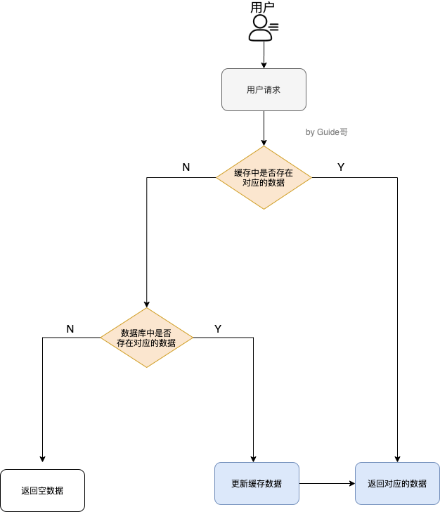
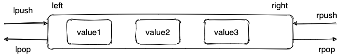
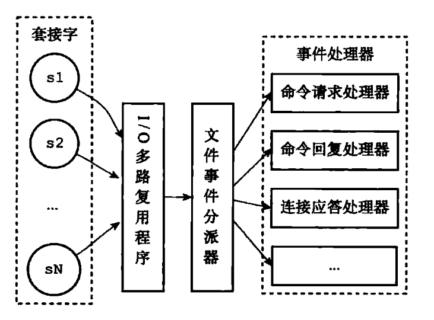
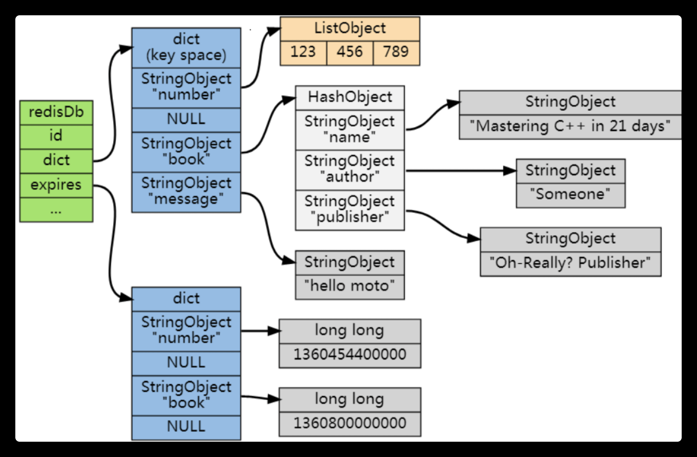
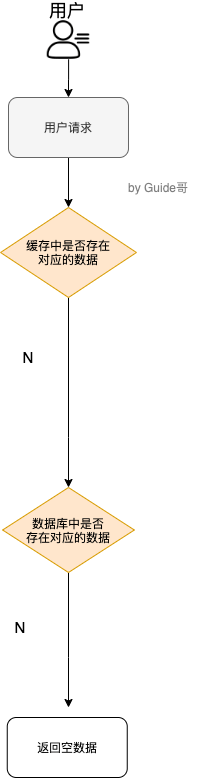
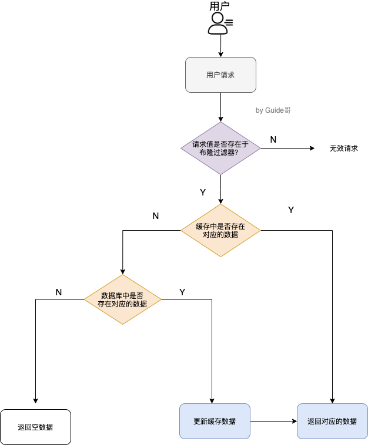

<!-- ---
sidebar:  false
--- -->

# 1. redis

## 1.1. 简单介绍一下 Redis

Redis 是一个使用 C 语言开发的内存数据库数据库，Redis 的数据是存在内存中的，所以读写速度非常快，因此 Redis 被广泛应用于缓存方向。

另外，Redis 除了做缓存之外，也经常用来做分布式锁，甚至是消息队列。

Redis 提供了多种数据类型来支持不同的业务场景. Redis 还支持事务，持久化，Lua 脚本，多种集群方案。

## 1.2. 分布式缓存作用

分布式缓存主要解决的是单机缓存的容量受服务器限制并且无法保存通用信息的问题。

因为，本地缓存只在当前服务里有效，比如部署了两个相同的服务，他们两者之间的缓存数据是无法互通的。

## 1.3. 说一下 Redis 和 Memcached 的区别和共同点

### 1.3.1. 共同点

1. 都是基于内存的数据库，一般都用来当做缓存使用。
2. 都有过期策略。
3. 两者的性能都非常高。

### 1.3.2. 区别

1. Redis 支持更丰富的数据类型 (支持更复杂的应用场景). Redis 不仅仅支持简单的 k/v 类型的数据，同时还提供 list, hash,  set, zset 等数据结构的存储.Memcached 只支持最简单的 k/v 数据类型。
1. Redis 支持数据的持久化，可以将内存中的数据保持在磁盘中，重启的时候可以再次加载进行使用，而 Memecache 把数据全部存在内存之中。
1. Redis 目前是原生支持 cluster 模式的，Memcached 没有原生的集群模式，需要依靠客户端来实现往集群中分片写入数据
1. Redis 使用单线程的多路 IO 复用模型，Memcached 是多线程，非阻塞 IO 复用的网络模型
1. Redis 支持发布订阅模型，Lua 脚本，事务等功能，而 Memcached 不支持。并且，Redis 支持更多的编程语言。
1. Redis 同时使用了惰性删除与定期删除，Memcached 过期数据的删除策略只用了惰性删除

## 1.4. 缓存数据的处理流程是怎样的？



1. 如果用户请求的数据在缓存中就直接返回。
2. 缓存中不存在的话就看数据库中是否存在。
3. 数据库中存在的话就更新缓存中的数据。
4. 数据库中不存在的话就返回空数据。

## 1.5. 为什么要用 Redis/为什么要用缓存？

使用缓存主要是为了提升用户体验以及应对更多的用户。

### 1.5.1. 高性能

用户首次访问数据库中的某些数据是从硬盘中读取的，速度较慢，如果用户访问的数据属于高频数据并且不会经常改变的话，那么可以将用户访问的数据存在缓存中。保证用户下一次再访问这些数据的时候就可以直接从缓存中获取了。操作缓存就是直接操作内存，所以速度相当快。

不过，要保持数据库和缓存中的数据的一致性。如果数据库中的对应数据改变的之后，同步改变缓存中相应的数据

### 1.5.2. 高并发

MySQL 数据库的 QPS 大概都在 1w 左右 (4 核 8g) , 但是使用 Redis 缓存之后很容易达到 10w+, 甚至最高能达到 30w+( 此为 redis 单机的情况，redis 集群的话会更高).

直接操作缓存能够承受的数据库请求数量是远远大于直接访问数据库的，所以可以考虑把数据库中的部分数据转移到缓存中去，这样用户的一部分请求会直接到缓存这里而不用经过数据库。进而，也就提高了系统整体的并发。
> QPS(Query Per Second): 服务器每秒可以执行的查询次数;

## 1.6. Redis 除了做缓存，还能做什么？

1. 分布式锁：通过 Redis 来做分布式锁是一种比较常见的方式。通常情况下，都是基于 Redisson 来实现分布式锁
1. 限流：一般是通过 Redis + Lua 脚本的方式来实现限流
1. 消息队列:  Redis 自带的 list 数据结构可以作为一个简单的队列使用.Redis5.0 中增加的 Stream 类型的数据结构更加适合用来做消息队列。它比较类似于 Kafka，有主题和消费组的概念，支持消息持久化以及 ACK 机制。
1. 复杂业务场景：通过 Redis 以及 Redis 扩展 (比如 Redisson) 提供的数据结构，可以很方便地完成很多复杂的业务场景，比如通过 bitmap 统计活跃用户，通过 sorted set 维护排行榜。

## 1.7. Redis 常见数据结构以及使用场景分析

### 1.7.1. string

1. 介绍 : string 数据结构是简单的 key-value 类型
2. 常用命令：set, get, strlen, exists, decr, incr, setex 等等。
3. 应用场景：存储信息，计数器

#### 1.7.1.1. 普通字符串的基本操作

```bash
127.0.0.1: 6379> set key value #设置 key-value 类型的值
OK
127.0.0.1: 6379> get key # 根据 key 获得对应的 value
value
127.0.0.1: 6379> exists key  # 判断某个 key 是否存在
(integer) 1
127.0.0.1: 6379> strlen key # 返回 key 所储存的字符串值的长度。
(integer) 5
127.0.0.1: 6379> del key # 删除某个 key 对应的值
(integer) 1
127.0.0.1: 6379> get key
(nil)
```

#### 1.7.1.2. 批量设置

```bash
127.0.0.1: 6379> mset key1 value1 key2 value2 # 批量设置 key-value 类型的值
OK
127.0.0.1: 6379> mget key1 key2 # 批量获取多个 key 对应的 value
1) value1
2) value2
```

#### 1.7.1.3. 计数器 (字符串的内容为整数的时候可以使用)

```bash
127.0.0.1: 6379> set number 1
OK
127.0.0.1: 6379> incr number # 将 key 中储存的数字值增一
(integer) 2
127.0.0.1: 6379> get number
2
127.0.0.1: 6379> decr number # 将 key 中储存的数字值减一
(integer) 1
127.0.0.1: 6379> get number
1
```

#### 1.7.1.4. 过期 (默认为永不过期)

```bash
127.0.0.1: 6379> expire key  60 # 数据在 60s 后过期
(integer) 1
127.0.0.1: 6379> setex key 60 value # 数据在 60s 后过期 (setex: [set] + [ex]pire)
OK
127.0.0.1: 6379> ttl key # 查看数据还有多久过期
(integer) 56
```

### 1.7.2. list

1. 介绍 : list 即是 链表。链表是一种非常常见的数据结构，特点是易于数据元素的插入和删除并且可以灵活调整链表长度，但是链表的随机访问困难。
2. 常用命令：rpush, lpop, lpush, rpop, lrange, llen 等。
3. 应用场景：发布与订阅或者说消息队列，慢查询。

#### 1.7.2.1. 通过 rpush/lpop 实现队列

```bash
127.0.0.1: 6379> rpush myList value1 # 向 list 的头部 (右边) 添加元素
(integer) 1
127.0.0.1: 6379> rpush myList value2 value3 # 向 list 的头部 (最右边) 添加多个元素
(integer) 3
127.0.0.1: 6379> lpop myList # 将 list 的尾部 (最左边) 元素取出
value1
127.0.0.1: 6379> lrange myList 0 1 # 查看对应下标的 list 列表，0 为 start, 1 为 end
1) value2
2) value3
127.0.0.1: 6379> lrange myList 0 -1 # 查看列表中的所有元素，-1 表示倒数第一
1) value2
2) value3
```

#### 1.7.2.2. 通过 rpush/rpop 实现栈

```bash
127.0.0.1: 6379> rpush myList2 value1 value2 value3
(integer) 3
127.0.0.1: 6379> rpop myList2 # 将 list 的头部 (最右边) 元素取出
value3
```

  

#### 1.7.2.3. 通过 lrange 查看对应下标范围的列表元素

```bash
127.0.0.1: 6379> rpush myList value1 value2 value3
(integer) 3
127.0.0.1: 6379> lrange myList 0 1 # 查看对应下标的 list 列表，0 为 start, 1 为 end
1) value1
2) value2
127.0.0.1: 6379> lrange myList 0 -1 # 查看列表中的所有元素，-1 表示倒数第一
1) value1
2) value2
3) value3
```

通过 lrange 命令，你可以基于 list 实现分页查询，性能非常高！

#### 1.7.2.4. 通过 llen 查看链表长度

```bash
127.0.0.1: 6379> llen myList
(integer) 3
```

### 1.7.3. hash

1. hash 是一个 string 类型的 field 和 value 的映射表，特别适合用于存储对象
2. 常用命令：hset, hmset, hexists, hget, hgetall, hkeys, hvals 等。

```bash
127.0.0.1: 6379> hmset userInfoKey name guide description dev age 24
OK
127.0.0.1: 6379> hexists userInfoKey name # 查看 key 对应的 value 中指定的字段是否存在。
(integer) 1
127.0.0.1: 6379> hget userInfoKey name # 获取存储在哈希表中指定字段的值。
guide
127.0.0.1: 6379> hget userInfoKey age
24
127.0.0.1: 6379> hgetall userInfoKey # 获取在哈希表中指定 key 的所有字段和值
1) name
2) guide
3) description
4) dev
5) age
6) 24
127.0.0.1: 6379> hkeys userInfoKey # 获取 key 列表
1) name
2) description
3) age
127.0.0.1: 6379> hvals userInfoKey # 获取 value 列表
1) guide
2) dev
3) 24
127.0.0.1: 6379> hset userInfoKey name GuideGeGe # 修改某个字段对应的值
127.0.0.1: 6379> hget userInfoKey name
GuideGeGe
```

### 1.7.4. set

1. 介绍 :  Redis 中的 set 类型是一种无序集合
2. 常用命令：sadd, spop, smembers, sismember, scard, sinterstore, sunion 等。

```bash
127.0.0.1: 6379> sadd mySet value1 value2 # 添加元素进去
(integer) 2
127.0.0.1: 6379> sadd mySet value1 # 不允许有重复元素
(integer) 0
127.0.0.1: 6379> smembers mySet # 查看 set 中所有的元素
1) value1
2) value2
127.0.0.1: 6379> scard mySet # 查看 set 的长度
(integer) 2
127.0.0.1: 6379> sismember mySet value1 # 检查某个元素是否存在 set 中，只能接收单个元素
(integer) 1
127.0.0.1: 6379> sadd mySet2 value2 value3
(integer) 2
127.0.0.1: 6379> sinterstore mySet3 mySet mySet2 # 获取 mySet 和 mySet2 的交集并存放在 mySet3 中
(integer) 1
127.0.0.1: 6379> smembers mySet3
1) value2
```

### 1.7.5. sorted set

1. 介绍：和 set 相比，sorted set 增加了一个权重参数 score，使得集合中的元素能够按 score 进行有序排列，还可以通过 score 的范围来获取元素的列表。
2. 常用命令：zadd, zcard, zscore, zrange, zrevrange, zrem 等。

```bash
127.0.0.1: 6379> zadd myZset 3.0 value1 # 添加元素到 sorted set 中 3.0 为权重
(integer) 1
127.0.0.1: 6379> zadd myZset 2.0 value2 1.0 value3 # 一次添加多个元素
(integer) 2
127.0.0.1: 6379> zcard myZset # 查看 sorted set 中的元素数量
(integer) 3
127.0.0.1: 6379> zscore myZset value1 # 查看某个 value 的权重
3
127.0.0.1: 6379> zrange  myZset 0 -1 # 顺序输出某个范围区间的元素，0 -1 表示输出所有元素
1) value3
2) value2
3) value1
127.0.0.1: 6379> zrange  myZset 0 1 # 顺序输出某个范围区间的元素，0 为 start  1 为 stop
1) value3
2) value2
127.0.0.1: 6379> zrevrange  myZset 0 1 # 逆序输出某个范围区间的元素，0 为 start  1 为 stop
1) value1
2) value2
```

## 1.8. Redis 单线程模型详解

  

Redis 基于 Reactor 模式来设计开发了自己的一套高效的事件处理模型 , 这套事件处理模型对应的是 Redis 中的文件事件处理器 (file event handler).由于文件事件处理器是单线程方式运行的，所以一般都说 Redis 是单线程模型。

### 1.8.1. 文件事件处理器 (file event handler) 主要是包含 4 个部分

1. 多个 socket(客户端连接)
1. IO 多路复用程序 (支持多个客户端连接的关键)
1. 文件事件分派器 (将 socket 关联到相应的事件处理器)
1. 事件处理器 (连接应答处理器，命令请求处理器，命令回复处理器)

### 1.8.2. 单线程怎么监听大量的客户端连接呢？

Redis 通过 IO 多路复用程序来监听来自客户端的大量连接或者说是监听多个 socket，它会将关注的事件及类型 (读，写) 注册到内核中并监听每个事件是否发生。I/O 多路复用技术的使用让 Redis 不需要额外创建多余的线程来监听客户端的大量连接，降低了资源的消耗

## 1.9. Redis 没有使用多线程？为什么不使用多线程？

1. 单线程编程容易并且更容易维护;
2. Redis 的性能瓶颈不在 CPU , 主要在内存和网络;
3. 多线程就会存在死锁，线程上下文切换等问题，甚至会影响性能。

## 1.10. Redis6.0 之后为何引入了多线程？

Redis6.0 引入多线程主要是为了提高网络 IO 读写性能，因为这个算是 Redis 中的一个性能瓶颈 (Redis 的瓶颈主要受限于内存和网络).

虽然，Redis6.0 引入了多线程，但是 Redis 的多线程只是在网络数据的读写这类耗时操作上使用了，执行命令仍然是单线程顺序执行。因此，不需要担心线程安全问题。

Redis6.0 的多线程默认是禁用的

## 1.11. Redis 给缓存数据设置过期时间有啥用？

因为内存是有限的，如果缓存中的所有数据都是一直保存的话，分分钟直接内存不足。

Redis 自带了给缓存数据设置过期时间的功能，比如：

```bash
127.0.0.1: 6379> exp key 60 # 数据在 60s 后过期
(integer) 1
127.0.0.1: 6379> setex key 60 value # 数据在 60s 后过期 (setex: [set] + [ex]pire)
OK
127.0.0.1: 6379> ttl key # 查看数据还有多久过期
(integer) 56
```

注意: Redis 中除了字符串类型有自己独有设置过期时间的命令 setex 外，其他方法都需要依靠 expire 命令来设置过期时间 .另外，persist 命令可以移除一个键的过期时间。

### 1.11.1. 过期时间除了有助于缓解内存的消耗，还有什么其他用么？

很多时候业务场景需要某个数据只在某一时间段内存在，比如的短信验证码可能只在 1 分钟内有效，用户登录的 token 可能只在 1 天内有效。

如果使用传统的数据库来处理的话，一般都是自己判断过期，这样更麻烦并且性能要差很多。

## 1.12. Redis 是如何判断数据是否过期的呢？

  

Redis 通过一个叫做过期字典 (可以看作是 hash 表) 来保存数据过期的时间。过期字典的键指向 Redis 数据库中的某个 key(键), 过期字典的值是一个 long long 类型的整数，这个整数保存了 key 所指向的数据库键的过期时间 (毫秒精度的 UNIX 时间戳).

过期字典是存储在 redisDb 这个结构里的：

```c
typedef struct redisDb {
    ...

    dict *dict;     //数据库键空间，保存着数据库中所有键值对
    dict *expires   // 过期字典，保存着键的过期时间
    ...
} redisDb;
```

## 1.13. 过期的数据的删除策略了解么？

> 如果设置了一批 key 只能存活 1 分钟，那么 1 分钟后，Redis 是怎么对这批 key 进行删除的呢？

### 1.13.1. 常用的过期数据的删除策略

1. 惰性删除：在取出 key 的时候才对数据进行过期检查。这样对 CPU 最友好，但是可能会造成太多过期 key 没有被删除。
2. 定期删除：每隔一段时间抽取一批 key 执行删除过期 key 操作。并且 Redis 底层会通过限制删除操作执行的时长和频率来减少删除操作对 CPU 时间的影响。

定期删除对内存更加友好，惰性删除对 CPU 更加友好。两者各有千秋，所以 Redis 采用的是 定期删除 + 惰性/懒汉式删除 .

> 但是，仅仅通过给 key 设置过期时间还是有问题的。因为还是可能存在定期删除和惰性删除漏掉了很多过期 key 的情况。这样就导致大量过期 key 堆积在内存里，然后就内存不足了。
>
> 怎么解决这个问题呢？答案就是: Redis 内存淘汰机制。

## 1.14. Redis 内存淘汰机制了解么？

> 相关问题: MySQL 里有 2000w 数据，Redis 中只存 20w 的数据，如何保证 Redis 中的数据都是热点数据？

Redis 提供 6 种数据淘汰策略：

1. allkeys-lru(least recently used): 当内存不足以容纳新写入数据时，在键空间中，移除最近最少使用的 key(这个是最常用的)
1. volatile-lru(least recently used): 从已设置过期时间的数据集 (server.db[i].expires) 中挑选最近最少使用的数据淘汰
1. volatile-ttl: 从已设置过期时间的数据集 (server.db[i].expires) 中挑选将要过期的数据淘汰
1. volatile-random: 从已设置过期时间的数据集 (server.db[i].expires) 中任意选择数据淘汰
1. allkeys-random: 从数据集 (server.db[i].dict) 中任意选择数据淘汰
1. no-eviction: 禁止驱逐数据，也就是说当内存不足以容纳新写入数据时，新写入操作会报错。这个应该没人使用吧！

    1 4.0 版本后增加以下两种：

1. volatile-lfu(least frequently used): 从已设置过期时间的数据集 (server.db[i].expires) 中挑选最不经常使用的数据淘汰
1. allkeys-lfu(least frequently used): 当内存不足以容纳新写入数据时，在键空间中，移除最不经常使用的 key

## 1.15. Redis 持久化机制

> 怎么保证 Redis 挂掉之后再重启数据可以进行恢复

持久化数据也就是将内存中的数据写入到硬盘里面，大部分原因是为了之后重用数据 (比如重启机器，机器故障之后恢复数据), 或者是为了防止系统故障而将数据备份到一个远程位置。

Redis 支持持久化，而且支持两种不同的持久化操作. Redis 的一种持久化方式叫快照 (snapshotting, RDB), 另一种方式是只追加文件 (append-only file,  AOF).

### 1.15.1. 快照 (snapshotting) 持久化 (RDB)

Redis 可以通过创建快照来获得存储在内存里面的数据在某个时间点上的副本.Redis 创建快照之后，可以对快照进行备份，可以将快照复制到其他服务器从而创建具有相同数据的服务器副本 (Redis 主从结构，主要用来提高 Redis 性能), 还可以将快照留在原地以便重启服务器的时候使用。

快照持久化是 Redis 默认采用的持久化方式，在 Redis.conf 配置文件中默认有此下配置：

```conf

save 900 1           #在 900 秒 (15 分钟) 之后，如果至少有 1 个 key 发生变化，Redis 就会自动触发 BGSAVE 命令创建快照。

save 300 10          #在 300 秒 (5 分钟) 之后，如果至少有 10 个 key 发生变化，Redis 就会自动触发 BGSAVE 命令创建快照。

save 60 10000        #在 60 秒 (1 分钟) 之后，如果至少有 10000 个 key 发生变化，Redis 就会自动触发 BGSAVE 命令创建快照。
```

### 1.15.2. AOF(append-only file) 持久化 (主流方案)

AOF 持久化的实时性更好，因此已成为主流的持久化方案。默认情况下 Redis 没有开启 AOF(append only file) 方式的持久化，可以通过 appendonly 参数开启：`appendonly yes`

开启 AOF 持久化后每执行一条会更改 Redis 中的数据的命令，Redis 就会将该命令写入到内存缓存 server.aof_buf 中，然后再根据 appendfsync 配置来决定何时将其同步到硬盘中的 AOF 文件。

AOF 文件的保存位置和 RDB 文件的位置相同，都是通过 dir 参数设置的，默认的文件名是 appendonly.aof.

在 Redis 的配置文件中存在三种不同的 AOF 持久化方式，它们分别是：

```conf
appendfsync always    #每次有数据修改发生时都会写入 AOF 文件，这样会严重降低 Redis 的速度
appendfsync everysec  #每秒钟同步一次，显示地将多个写命令同步到硬盘
appendfsync no        #让操作系统决定何时进行同步
```

为了兼顾数据和写入性能，用户可以考虑 appendfsync everysec 选项 , 让 Redis 每秒同步一次 AOF 文件，Redis 性能几乎没受到任何影响。而且这样即使出现系统崩溃，用户最多只会丢失一秒之内产生的数据。当硬盘忙于执行写入操作的时候，Redis 还会优雅的放慢自己的速度以便适应硬盘的最大写入速度。

## 1.16. Redis 事务

Redis 可以通过 MULTI, EXEC, DISCARD 和 WATCH 等命令来实现事务 (transaction) 功能。

```bash
> MULTI
OK
> SET USER Guide 哥
QUEUED
> GET USER
QUEUED
> EXEC
1) OK
2) Guide 哥
```

使用 MULTI 命令后可以输入多个命令. Redis 不会立即执行这些命令，而是将它们放到队列，当调用了 EXEC 命令将执行所有命令。

这个过程是这样的：

1. 开始事务 (MULTI).
2. 命令入队 (批量操作 Redis 的命令，先进先出 (FIFO) 的顺序执行).
3. 执行事务 (EXEC).

你也可以通过 [DISCARD](https: //redis.io/commands/discard) 命令取消一个事务，它会清空事务队列中保存的所有命令。

```bash
> MULTI
OK
> SET USER Guide 哥
QUEUED
> GET USER
QUEUED
> DISCARD
OK
```

[WATCH](https: //redis.io/commands/watch) 命令用于监听指定的键，当调用 EXEC 命令执行事务时，如果一个被 WATCH 命令监视的键被修改的话，整个事务都不会执行，直接返回失败。

```bash
> WATCH USER
OK
> MULTI
> SET USER Guide 哥
OK
> GET USER
Guide 哥
> EXEC
ERR EXEC without MULTI
```

但是，Redis 的事务和关系型数据库的事务不同，Redis 事务提供了一种将多个命令请求打包的功能。然后，再按顺序执行打包的所有命令，并且不会被中途打断

Redis 是不支持 roll back 的，因而不满足原子性的 (而且不满足持久性)

## 1.17. 缓存穿透

### 1.17.1. 什么是缓存穿透？

大量请求的 key 根本不存在于缓存中，导致请求直接到了数据库上，根本没有经过缓存这一层。

> 举个例子：某个黑客故意制造缓存中不存在的 key 发起大量请求，导致大量请求落到数据库。

### 1.17.2. 缓存穿透情况的处理流程是怎样的？

用户的请求最终都要跑到数据库中查询一遍。

  

### 1.17.3. 有哪些解决办法？

最基本的就是首先做好参数校验，一些不合法的参数请求直接抛出异常信息返回给客户端。
> 比如查询的数据库 id 不能小于 0，传入的邮箱格式不对的时候直接返回错误消息给客户端等等。

#### 1.17.3.1. 缓存无效 key

如果缓存和数据库都查不到某个 key 的数据就写一个到 Redis 中去并设置过期时间

可以解决请求的 key 变化不频繁的情况，如果黑客恶意攻击，每次构建不同的请求 key，会导致 Redis 中缓存大量无效的 key. 很明显，这种方案并不能从根本上解决此问题。如果非要用这种方式来解决穿透问题的话，尽量将无效的 key 的过期时间设置短一点比如 1 分钟。

#### 1.17.3.2. 布隆过滤器

  

通过布隆过滤器可以非常方便地判断一个给定数据是否存在于海量数据中。布隆过滤器可能会存在误判的情况，布隆过滤器说某个元素存在，小概率会误判。布隆过滤器说某个元素不在，那么这个元素一定不在。

把所有可能存在的请求的值都存放在布隆过滤器中，当用户请求过来，先判断用户发来的请求的值是否存在于布隆过滤器中。不存在的话，直接返回请求参数错误信息给客户端，存在的话才会继续走流程。

## 1.18. 缓存雪崩

### 1.18.1. 什么是缓存雪崩？

缓存在同一时间大面积的失效，后面的请求都直接落到了数据库上，造成数据库短时间内承受大量请求。

> 举个例子：系统的缓存模块出了问题比如宕机导致不可用。造成系统的所有访问，都要走数据库。
>
> 还有一种缓存雪崩的场景是：有一些被大量访问数据 (热点缓存) 在某一时刻大面积失效，导致对应的请求直接落到了数据库上。
>
> 举个例子 : 秒杀开始 12 个小时之前，统一存放了一批商品到 Redis 中，设置的缓存过期时间也是 12 个小时，那么秒杀开始的时候，这些秒杀的商品的访问直接就失效了。导致的情况就是，相应的请求直接就落到了数据库上，就像雪崩一样可怕。

### 1.18.2. 有哪些解决办法？

#### 1.18.2.1. 针对 Redis 服务不可用的情况

1. 采用 Redis 集群，避免单机出现问题整个缓存服务都没办法使用。
2. 限流，避免同时处理大量的请求。

#### 1.18.2.2. 针对热点缓存失效的情况

1. 设置不同的失效时间比如随机设置缓存的失效时间。
2. 缓存永不失效。

## 1.19. 如何保证缓存和数据库数据的一致性？

Cache Aside Pattern 是平时使用比较多的一个缓存读写模式，比较适合读请求比较多的场景。

### 1.19.1. 读

1. 从 cache 中读取数据，读取到就直接返回
1. cache 中读取不到的话，就从 DB 中读取数据返回
1. 再把数据放到 cache 中。

### 1.19.2. 写

1. 先更新 DB
1. 然后直接删除 cache。

#### 1.19.2.1. 在写数据的过程中，可以先删除 cache ，后更新 DB 么

 不行，因为这样可能会造成数据库（DB）和缓存（Cache）数据不一致的问题

容易产生脏数据，有两个并发操作分别是更新和查询，第一步更新操作先将 redis 中的缓存进行删除，接着第二步查询操作并发进来首先寻找 redis 中有没有缓存，此时因为 redis 中的数据已经被删除了，第三步只能走 DB 进行查询，第四步将查询的数据保存到 redis 当中，此时第五步更新操作属于写操作比较慢才将数据在 DB 中更新成功。这个时候缓存中的数据就成了旧数据，如果后续不再更新的话，那么这个数据将一直在缓存中存在，除非设置过期时间
