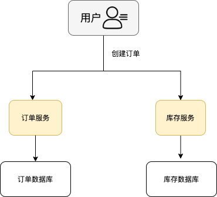
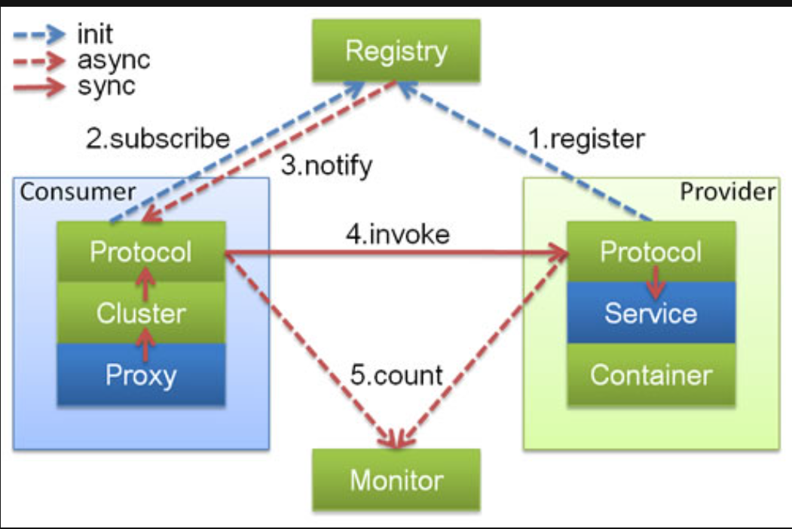
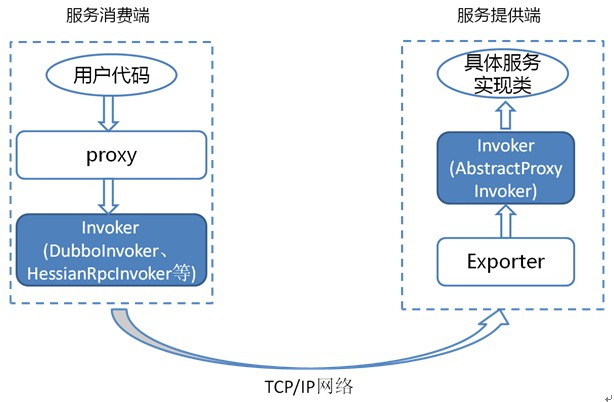
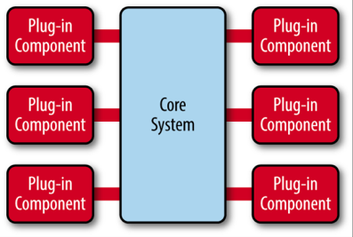
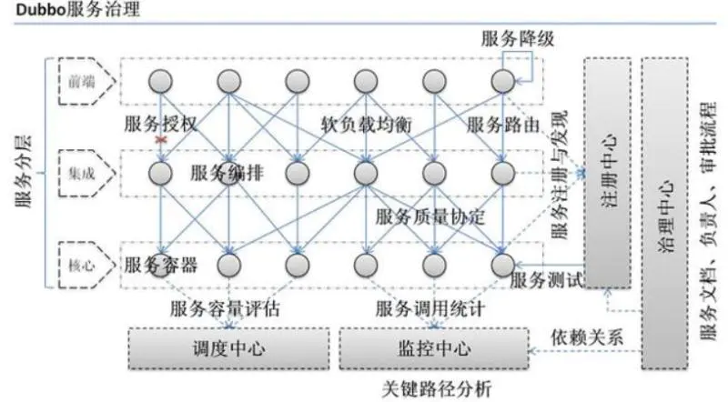

<!-- ---
sidebar: false
---
 -->

# 1. dubbo

## 1.1. 何为 RPC?

RPC(Remote Procedure Call,远程过程调用协议) 是一种通过网络从远程计算机程序上请求服务的协议.

## 1.2. RPC 架构

一个完整的 RPC 架构里面包含了四个核心的组件,分别是 Client,Client Stub,Server 以及 Server Stub,这个 Stub 可以理解为存根.

1. 客户端 (Client),服务的调用方.
1. 客户端存根 (Client Stub),存放服务端的地址消息,再将客户端的请求参数打包成网络消息,然后通过网络远程发送给服务方.
1. 服务端 (Server),真正的服务提供者.
1. 服务端存根 (Server Stub),接收客户端发送过来的消息,将消息解包,并调用本地的方法.

## 1.3. 什么是 Dubbo?

Dubbo 是一个基于 Java 的高性能 RPC 分布式服务框架, 本质上是个远程服务调用的分布式框架,其核心部分包含:

1. 透明化的远程方法调用,就像调用本地方法一样调用远程方法,只需简单配置,没有任何 API 侵入.
1. 服务自动注册与发现:基于注册中心目录服务,不再需要写死服务提供方地址,注册中心基于接口名查询服务提供者的IP地址,并且能够平滑添加或删除服务提供者.
1. 服务调用链路生成:随着系统的发展,服务越来越多,服务间依赖关系变得错踪复杂,甚至分不清多个应用的启动次序,Dubbo 可以为解决服务之间互相是如何调用的.
1. 负载均衡:同一个服务部署在不同的机器时该调用哪一台机器上的服务.

## 1.4. 什么是分布式?

分布式就是把整个系统根据业务拆分成不同的服务,然后将这些服务放在不同的服务器上以便减轻单体服务的压力并提高并发量和性能.

> 比如电商系统可以简单地拆分成订单系统,商品系统,登录系统等等,拆分之后的每个服务可以部署在不同的机器上,如果某一个服务的访问量比较大的话也可以将这个服务同时部署在多台机器上.

## 1.5. Dubbo 架构中的核心角色有哪些?

1. Container:服务运行容器,负责加载,运行服务提供者.必须.
1. Provider:暴露服务的服务提供方,会向注册中心注册自己提供的服务.必须.
1. Consumer:调用远程服务的服务消费方,会向注册中心订阅自己所需的服务.必须.
1. Registry:服务注册与发现的注册中心.注册中心会返回服务提供者地址列表给消费者.非必须.
1. Monitor:统计服务的调用次数和调用时间的监控中心.服务消费者和提供者会定时发送统计数据到监控中心.非必须.

### 1.5.1. 调用流程

1. container容器负责启动,加载,运行provider
1. provider在启动时,向regisitry中心注册自己提供的服务
1. consumer在启动时,向regisitry中心订阅自己所需的服务
1. regisitry返回服务提供者列表给consumer,如果有变更, registry将基于长连接推送变更数据给consumer
1. consumer调用provider服务,基于负载均衡算法进行调用
1. consumer调用provider的统计,基于短连接定时每分钟一次统计monitor

## 1.6. Dubbo 中的 Invoker 概念了解么?

Invoker 就是 Dubbo 对远程调用的抽象.

Invoker 是 Dubbo 中的实体域,也就是真实存在的.其他模型都向它靠拢或转换成它,它也就代表一个可执行体,可向它发起 invoke 调用.在服务提供方,Invoker 用于调用服务提供类.在服务消费方,Invoker 用于执行远程调用.

Invoker 分为服务提供 Invoker,服务消费 Invoker

假如需要调用一个远程方法,需要动态代理来屏蔽远程调用的细节,屏蔽掉的这些细节就依赖对应的 Invoker 实现,Invoker 实现了真正的远程服务调用.

## 1.7. Dubbo 的 SPI 机制了解么?如何扩展 Dubbo 中的默认实现?

SPI(Service Provider Interface,服务提供者接口) 机制被大量用在开源项目中,它可以帮助动态寻找服务/功能 (比如负载均衡策略) 的实现.

将接口的实现类放在配置文件中,在程序运行过程中读取配置文件,通过反射加载实现类.这样,可以在运行的时候,动态替换接口的实现类.和 IoC 的解耦思想是类似的.

## 1.8. Dubbo 的微内核架构了解吗?

微内核架构包含两类组件:核心系统 (core system) 和 插件模块 (plug-in modules).

Dubbo 采用 微内核 (Microkernel) + 插件 (Plugin) 模式,微内核只负责组装插件.

核心系统提供系统所需核心能力,插件模块可以扩展系统的功能.因此,基于微内核架构的系统,非常易于扩展功能.

正是因为 Dubbo 基于微内核架构,才使得可以随心所欲替换 Dubbo 的功能点.

> 比如觉得 Dubbo 的序列化模块实现的不满足自己要求,没关系啊!你自己实现一个序列化模块就好了啊!

## 1.9. dubbo中Zk集群挂掉,发布者和订阅者还能通信么?

可以通信.
当启动dubbo容器时,消费者会去zookeeper拉取注册的生产者地址列表,并将其缓存在本地.每次发起调用时,都会按照本地的地址列表,以负载均衡的策略去进行调用.但是zookeeper挂掉则后续新的生产者无法被消费者发现.

- 注册中心对等集群,任意一台宕掉后,会自动切换到另一台
- 注册中心全部宕掉,服务提供者和消费者仍可以通过本地缓存通讯
- 服务提供者无状态,任一台宕机后,不影响使用
- 服务提供者全部宕机,服务消费者会无法使用,并无限次重连等待服务者恢复

## 1.10. 什么是负载均衡?

系统中的某个服务的访问量特别大,将这个服务部署在了多台服务器上,当客户端发起请求的时候,多台服务器都可以处理这个请求.

负载均衡就是为了避免单个服务器响应同一请求,造成的服务器宕机,崩溃等问题

## 1.11. Dubbo 提供的负载均衡策略有哪些?

1. 随机:从多个服务提供者随机选择一个来处理本次请求,调用量越大则分布越均匀,并支持按权重设置随机概率
1. 轮询:依次选择服务提供者来处理请求, 并支持按权重进行轮询,底层采用的是平滑加权轮询算法
1. 最小活跃调用数:统计服务提供者当前正在处理的请求,下次请求过来则交给活跃数最小的服务器来处理
1. 一致性哈希:相同参数的请求总是发到同一个服务提供者

## 1.12. Dubbo 支持哪些协议,每种协议的应用场景,优缺点?

1. dubbo: (默认协议)

   单一长连接和 NIO 异步通讯,适合大并发小数据量的服务调用,以及消费者远大于提供者.传输协议 TCP,异步,Hessian 序列化;

1. rmi:

   采用 JDK 标准的 rmi 协议实现,传输参数和返回参数对象需要实现 Serializable 接口,使用 java 标准序列化机制,使用阻塞式短连接,传输数据包大小混合,消费者和提供者个数差不多,可传文件,传输协议 TCP.多个短连接,TCP 协议传输,同步传输,适用常规的远程服务调用和 rmi 互操作.在依赖低版本的 Common-Collections 包,java 序列化存在安全漏洞;

1. http:

   基于 Http 表单提交的远程调用协议,使用 Spring 的 HttpInvoke 实现.多个短连接,传输协议 HTTP,传入参数大小混合,提供者个数多于消费者,需要给应用程序和浏览器 JS 调用;

1. webservice:

   基于 WebService 的远程调用协议,集成 CXF 实现,提供和原生 WebService 的互操作.多个短连接,基于 HTTP 传输,同步传输,适用系统集成和跨语言调用;

1. hessian:

   集成 Hessian 服务,基于 HTTP 通讯,采用 Servlet 暴露服务,Dubbo 内嵌 Jetty 作为服务器时默认实现,提供与 Hession 服务互操作.多个短连接,同步 HTTP 传输,Hessian 序列化,传入参数较大,提供者大于消费者,提供者压力较大,可传文件;

1. redis:

   基于 redis 实现的 RPC 协议

## 1.13. Dubbo 超时时间怎样设置?

1. 服务提供者端设置超时时间

   在 Dubbo 的用户文档中,推荐如果能在服务端多配置就尽量多配置,因为服务提供者比消费者更清楚自己提供的服务特性.

1. 服务消费者端设置超时时间

   如果在消费者端设置了超时时间,以消费者端为主,即优先级更高.因为服务调用方设置超时时间控制性更灵活.如果消费方超时,服务端线程不会定制,会产生警告.

## 1.14. Dubbo 有些哪些注册中心?

### 1.14.1. Zookeeper(官方推荐)

1. 优点:支持分布式
1. 缺点: 受限于Zookeeper的特性

### 1.14.2. Multicast

组播协议允许将一台主机发送的数据通过网络路由器和交换机复制到多个加入此组播的主机,是一种一对多的通讯方式.每一台服务提供方和服务消费方都可以看作是注册中心的一部分

1. 优点:去中心化,不需要单独安装软件.
1. 缺点: Provider和Consumer和Registry不能跨机房(路由), 不需要启动任何中心节点,只要广播地址一样,就可以互相发现,组播受网络结构限制,只适合小规模应用或开发阶段使用.

### 1.14.3. Redis

1. 优点:支持集群,性能高,   基于 redis 的发布/订阅模式通知数据变更;
1. 缺点:要求服务器时间同步.否则可能出现集群失败问题

### 1.14.4. Simple 注册中心

1. 优点: 标准RPC服务.没有兼容问题
1. 缺点: 不支持集群

## 1.15. 为什么需要服务治理?

  

1. 过多的服务 URL 配置困难
1. 负载均衡分配节点压力过大的情况下也需要部署集群
1. 服务依赖混乱,启动顺序不清晰
1. 过多服务导致性能指标分析难度较大,需要监控

## 1.16. Dubbo 使用的是什么通信框架?

默认使用 NIO Netty 框架

## 1.17. Dubbo 的集群容错方案有哪些?

1. Failover Cluster (默认)
   失败自动切换,当出现失败,重试其它服务器.通常用于读操作,但重试会带来更长延迟.
1. Failfast Cluster
   快速失败,只发起一次调用,失败立即报错.通常用于非幂等性的写操作,比如新增记录.
1. Failsafe Cluster
   失败安全,出现异常时,直接忽略.通常用于写入审计日志等操作.
1. Failback Cluster
   失败自动恢复,后台记录失败请求,定时重发.通常用于消息通知操作.
1. Forking Cluster
   并行调用多个服务器,只要一个成功即返回.通常用于实时性要求较高的读操作,但需要浪费更多服务资源.可通过 forks="2" 来设置最大并行数.
1. Broadcast Cluster
   广播调用所有提供者,逐个调用,任意一台报错则报错 . 通常用于通知所有提供者更新缓存或日志等本地资源信息

## 1.18. Dubbo 支持哪些序列化方式?

默认使用 Hessian 序列化,还有 Duddo, FastJson, Java 自带序列化.

## 1.19. 服务调用超时问题怎么解决?

dubbo 在调用服务不成功时,默认是会重试两次的.

## 1.20. Dubbo 在安全机制方面是如何解决?

Dubbo 通过 Token 令牌防止用户绕过注册中心直连,然后在注册中心上管理授权. Dubbo 还提供服务黑白名单,来控制服务所允许的调用方.

## 1.21. Dubbo 与 Spring 的关系?

Dubbo 采用全 Spring 配置方式,透明化接入应用,对应用没有任何 API 侵入,只需用 Spring 加载 Dubbo 的配置即可,Dubbo 基于 Spring 的 Schema 扩展进行加载.

## 1.22. Dubbo 和 Spring Cloud 的关系?

1. Dubbo 是 SOA 的产物 (Service Oriented Ambiguity,即面向服务架构),是基于 TCP 协议传输的,配合以 Hession 序列化完成 RPC 通信.主要在于服务的调用,流量分发,流量监控和熔断,定位服务治理
1. Spring Cloud 是基于 Http 协议 + Rest 接口调用远程过程的通信,考虑的是微服务治理

## 1.23. Dubbo是如何完成服务导出的?

1. 首先Dubbo会将程序员所使用的@DubboService注解进行解析得到程序员所定义的服务参数,包括定义的服务名,服务接口,服务超时时间,服务协议等等,得到一个ServiceBean.
1. 然后调用ServiceBean的export方法进行服务导出
1. 然后将服务信息注册到注册中心,如果有多个协议,多个注册中心,那就将服务按单个协议,单个注册中心进行注册
1. 将服务信息注册到注册中心后,还会绑定一些监听器,监听动态配置中心的变更
1. 还会根据服务协议启动对应的Web服务器或网络框架,比如Tomcat,Netty等

## 1.24. Dubbo是如何完成服务引入的?

1. 当程序员使用@Reference注解来引入一个服务时,Dubbo会将注解和服务的信息解析出来,得到当前所引用的服务
1. 然后从注册中心进行查询服务信息,得到服务的提供者信息,并存在消费端的服务目录中
1. 并绑定一些监听器用来监听动态配置中心的变更
1. 然后根据查询得到的服务提供者信息生成一个服务接口的代理对象,并放入Spring容器中作为Bean
