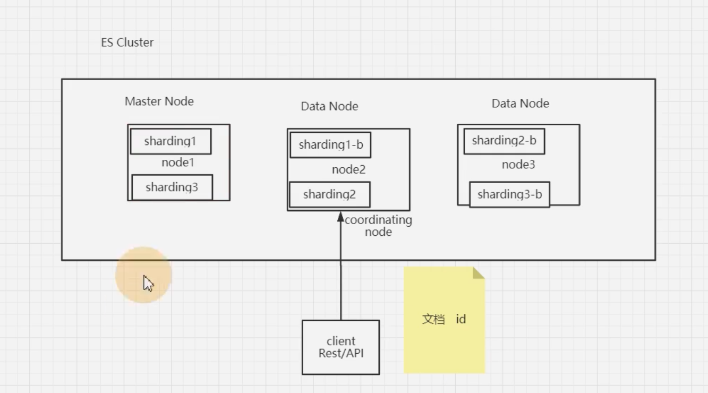

# 1. ElasticSearch

## 1.1. es是什么

### 1.1.1. 定义

es(elasticsearch)是一个基于lucene的 ,  高扩展,开源的全文检索和分析引擎,它可以准实时地快速存储,搜索,分析海量的数据.

### 1.1.2. 核心概念

1. 索引 index:关系型数据库中的 table
1. 文档 document:row
1. 字段 field text\keyword\byte: 列
1. 映射Mapping:Schema.
1. 查询方式 DSL:  SQL ES的新版本也支持SQL
1. 分片 sharding 和 副本 replicas: index都是由sharding组成的.每个sharding都有一个或多个备份. ES集群健康状态

### 1.1.3. 使用场景

ES可以用在大数据量的搜索场景下, ES也有很强大的计算能力

## 1.2. 如何进行中文分词？用过哪些分词器？

IK分词器。

## 1.3. ES写入数据的工作原理是什么？

  

1. 客户端发写数据的请求时，可以发往任意节点。这个节点就会成为coordinating node协调节点。
1. 计算的点文档要写入的分片：计算时就采用hash取模的方式来计算。
1. 协调节点就会进行路由，将请求转发给对应的primary sharding所在的datanode。
1. datanode节点上的primary sharding处理请求，写入数据到索引库，并且将数据同步到对应的replica sharding
1. 等primary sharding 和 replica sharding都保存好了文档之后, 返回客户端响应

## 1.4. ES查询数据的工作原理是什么？

1. 客户端发请求可发给任意节点，这个节点就成为协调节点
1. 协调节点将查询请求广播到每一个数据节点，这些数据节点的分片就会处理改查询请求。
1. 每个分片进行数据查询，将符合条件的数据放在一个队列当中，并将这些数据的文档ID、节点信息、分片信息都返回给协调节点。
1. 由协调节点将所有的结果进行汇总，并排序。
1. 协调节点向包含这些文档ID的分片发送get请求，对应的分片将文档数据返回给协调节点，最后协调节点将数据整合返回给客户端。
