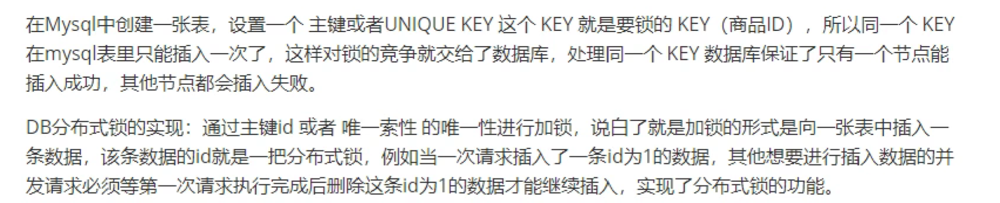
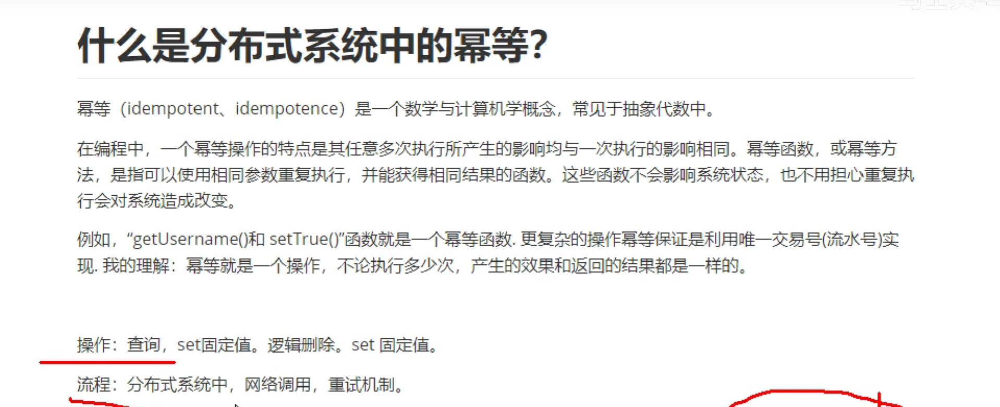
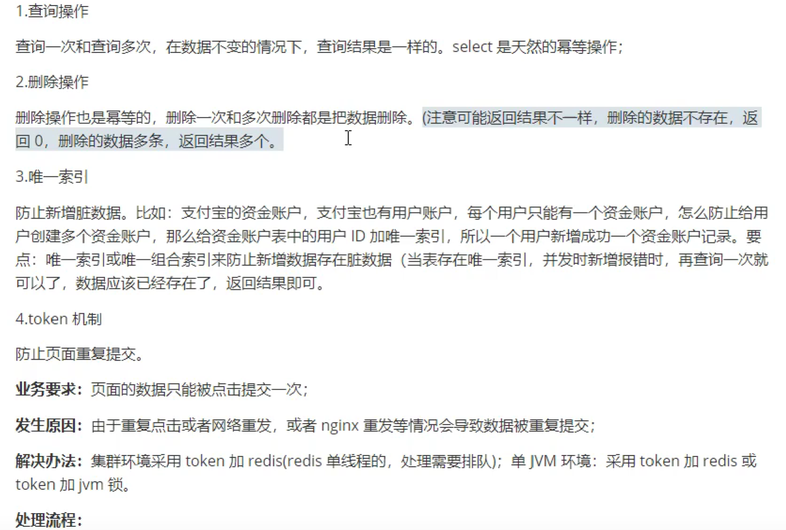
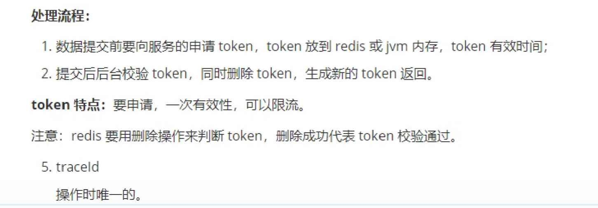
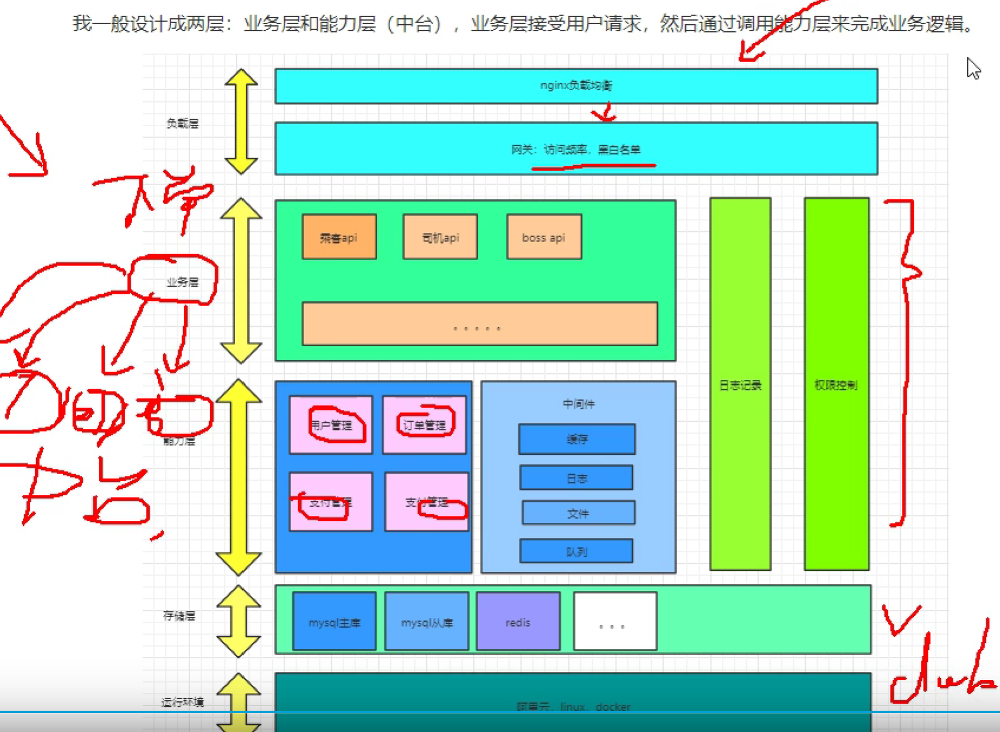
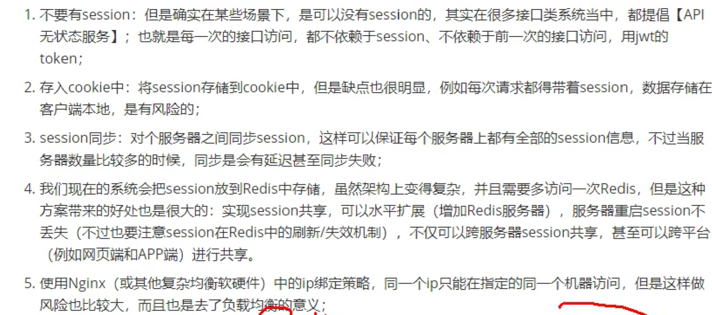

# 1. interview

## 1.1. 分布式id

### 1.1.1. 什么是分布式ID?

随着数据日渐增长,需要对数据库进行分库分表,但分库分表后需要有一个唯一ID来标识一条数据,数据库的自增ID显然不能满足需求;特别一点的如订单,优惠券也都需要有唯一ID做标识.此时一个能够生成全局唯一ID的系统是非常必要的.那么这个全局唯一ID就叫分布式ID.

### 1.1.2. 那么分布式ID需要满足那些条件?

1. 全局唯一:必须保证ID是全局性唯一的,基本要求
1. 高性能:高可用低延时,ID生成响应要块,否则反倒会成为业务瓶颈
1. 高可用:100%的可用性是骗人的,但是也要无限接近于100%的可用性
1. 好接入:要秉着拿来即用的设计原则,在系统设计和实现上要尽可能的简单
1. 趋势递增:最好趋势递增,这个要求就得看具体业务场景了,一般不严格要求

### 1.1.3. 分布式id生成方案有哪些?

UUID,数据库主键自增, Redis自增ID,雪花算法.

  
  

## 1.2. 雪花算法生成分布式ID有哪些部分组成

  

SnowFlake算法生成id的结果是一个64bit大小的long类型整数

1. 符号位: 1位,不用.二进制中最高位为1的都是负数,但是我们生成的id一般都使用整数,所以这个最高位固定是0
1. 时间戳(毫秒): 41位,  支持69年的时间跨度
1. 机器id: 10位
1. 序列号: 12位,  表示同一机器同一时间截(毫秒)内产生的4095个ID序号.

### 1.2.1. SnowFlake可以保证

1. 所有生成的id按时间趋势递增
1. 整个分布式系统内不会产生重复id(因为有datacenterId和workerId来做区分)

## 1.3. 分布式锁在项目中有哪些应用场景?

在业务开发中,为了保证在多线程下处理共享数据的安全性,需要保证同一时刻只有一个线程能处理共享数据.

Java 语言给我们提供了线程锁,Synchronized,Lock 等.当一个锁被某个线程持有的时候,另一个线程尝试去获取这个锁会失败或者阻塞,直到持有锁的线程释放了该锁.

在单台服务器内部,可以通过线程加锁的方式来同步,避免并发问题,那么在分布式场景下需要用的分布式锁

分布式锁的目的是保证在分布式部署的应用集群中,多个服务在请求同一个方法或者同一个业务操作的情况下,对应业务逻辑只能被一台机器上的一个线程执行,避免出现并发问题.

1. 系统是一个分布式系统, java的锁已经锁不住了.
2. 操作共享资源,比如库里唯一的用户数据.
3. 同步访问,即多个进程同时操作共享资源.

## 1.4. 分布锁有哪些解决方案

1. Redis:利用 Redis 的 setnx 命令.此命令同样是原子性操作,只有在 key 不存在的情况下,才能 set 成功.
1. Zookeeper:利用 Zookeeper 的顺序临时节点,来实现分布式锁和等待队列
1. MySQL: 基于关系型数据库实现分布式锁,是依赖数据库的唯一性来实现资源锁定,比如主键和唯一索引等.

## 1.5. Redis做分布式锁用什么命令

格式:setnx key value 将 key 的值设为 value,当旦仅当 key 不存在.
若给定的 key 已经存在,则SETNX不做任何动作,操作失败.

1. 加锁:set key value nx ex 10s
1. 释放锁: delete key

```java
@Autowired
private RedisTemplate redis;

Boolean nx = redis.opsForValue().setIfAbsent("key", "value", 20, TimeUnit.MINUTES)
```

## 1.6. Redis做分布式锁死锁有哪些情况, 如何解决

1. 加锁,没有释放锁.需要加释放锁的操作.比如delete key.
1. 加锁后,程序还没有执行释放锁,程序挂了.需要用到key的过期机制.

## 1.7. Redis如何做分布式锁?

1. 服务A为了获得锁,向Redis发起如下命令: SET productld:lock 0xx9p03001 NX EX 30000 其中, "productld"由自己定义,可以是与本次业务有关的id,"0xx9p03001"是一串随机值,必须保证全局唯一,"NX"指的是当且仅当key(也就是案例中的"productld:lock")在Redis中不存在时,返回执行成功,否则执行失败."EX 30000"指的是在30秒后, key将被自动删除.执行命令后返回成功,表明服务成功的获得了锁.
1. 服务B为了获得锁,向Redis发起同样的命令: SET productld:lock 0000111 NX EX 30000 由于Redis内已经存在同名key,且并未过期,因此命令执行失败,服务B未能获得锁.服务B进入循环请求状态, 比如每隔1秒钟(自行设置)向Redis发送请求,直到执行成功并获得锁.
1. 服务A的业务代码执行时长超过了30秒,导致key超时,因此Redis自动删除了key.此时服务B再次发送命令执行成功,假设本次请求中设置的value值 0000222.此时需要在服务A中对key进行续期, watch dog.
1. 服务A执行完毕,为了释放锁,服务A会主动向Redis发起删除key的请求.注意: 在删除key之前,一定要判断服务A持有的value与Redis内存储的value是否一致.比如当前场景下,Redis中的锁早就不是服务A持有的那一
把了,而是由服务B创建,如果贸然使用服务A持有的key来删除锁,则会误将服务B的锁释放掉.

## 1.8. MySQL如何做分布式锁？

  

## 1.9. 什么是分布式系统中的幂等

  

## 1.10. 幂等有哪些技术解决方案？

  

  

## 1.11. 分布式微服务你是如何设计的？

  

## 1.12. 分布式架构下，Session共享有什么方案？

  
