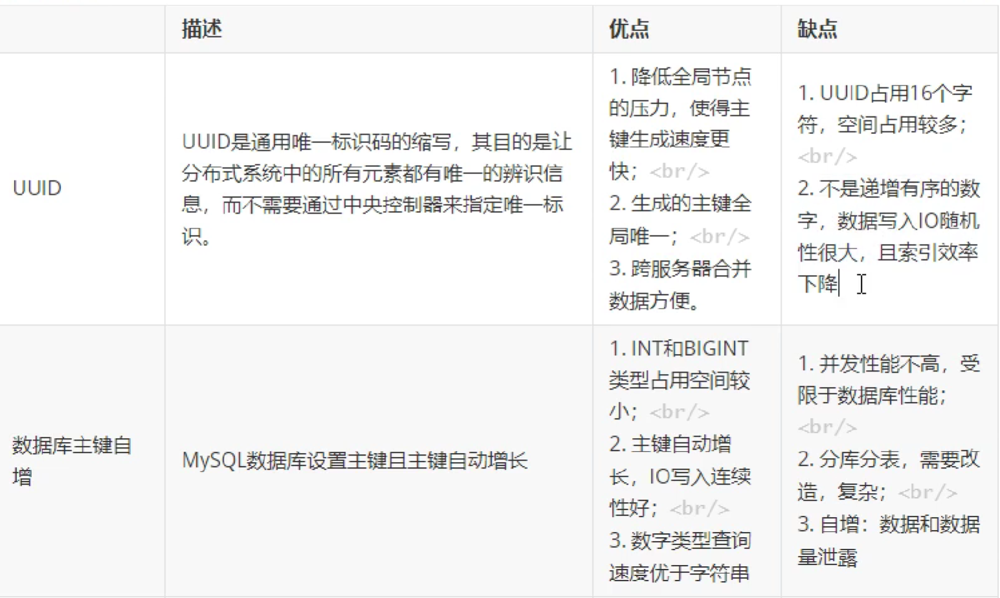
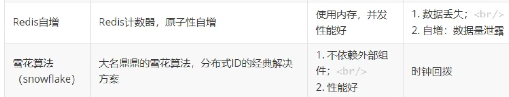
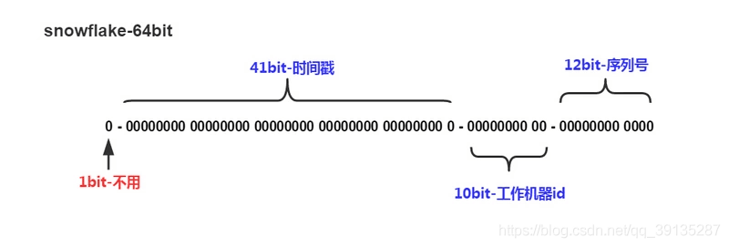
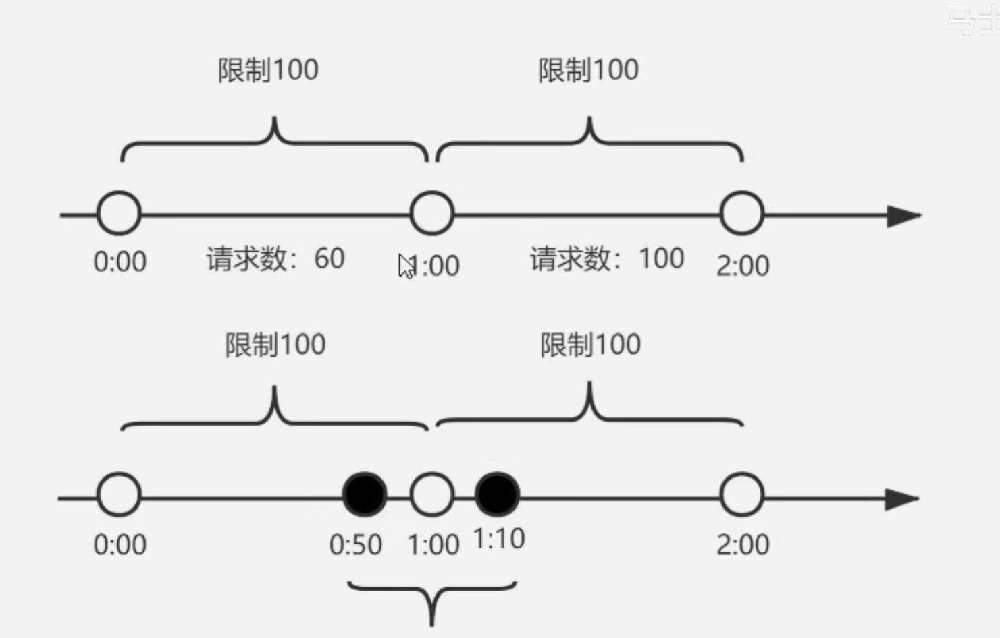
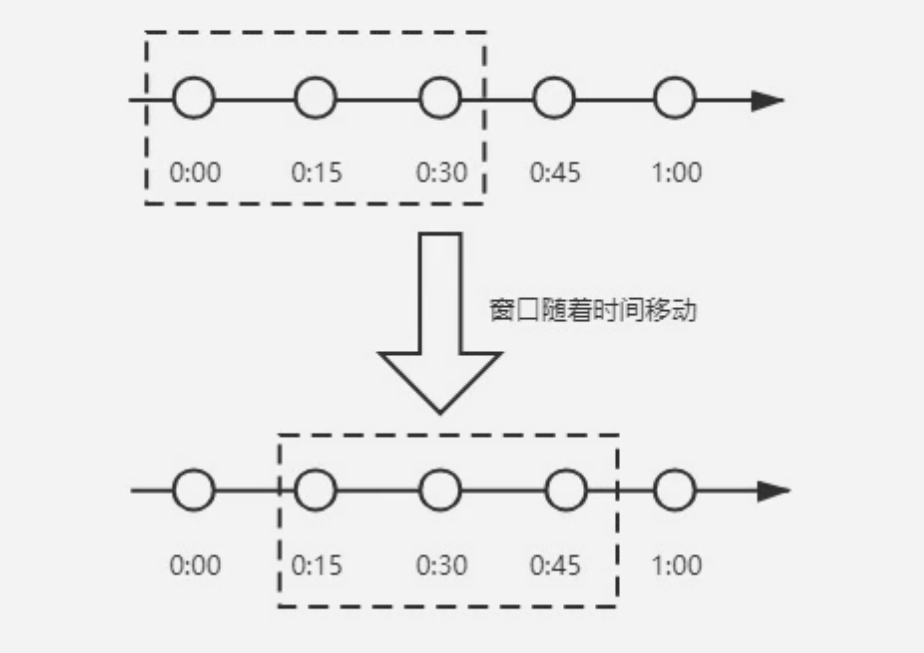
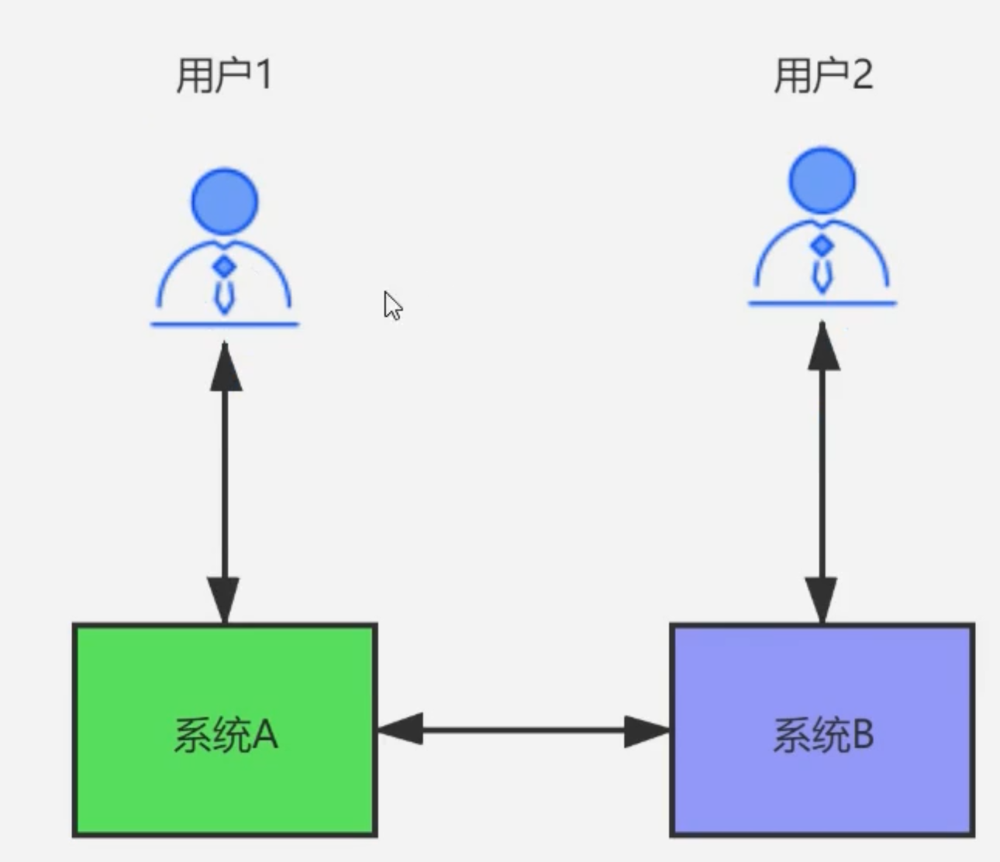
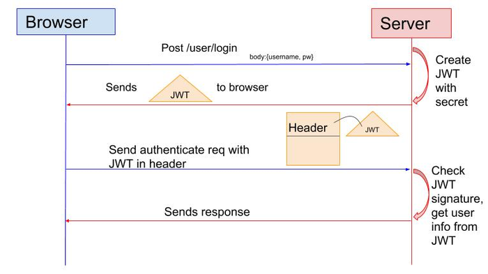
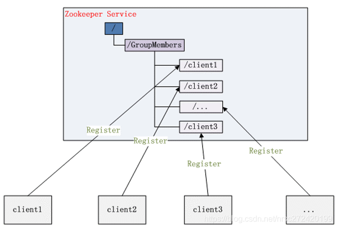
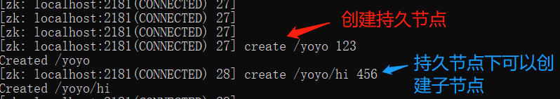
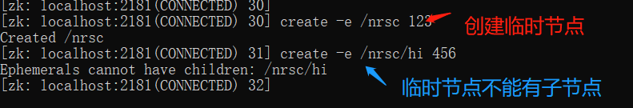

# 1. interview

## 1.1. 分布式id

### 1.1.1. 什么是分布式ID?

随着数据日渐增长,需要对数据库进行分库分表,但分库分表后需要有一个唯一ID来标识一条数据,数据库的自增ID显然不能满足需求;特别一点的如订单,优惠券也都需要有唯一ID做标识.此时一个能够生成全局唯一ID的系统是非常必要的.那么这个全局唯一ID就叫分布式ID.

### 1.1.2. 那么分布式ID需要满足那些条件?

1. 全局唯一:必须保证ID是全局性唯一的
1. 高性能:高可用低延时,ID生成响应要块,否则反倒会成为业务瓶颈
1. 高可用:100%的可用性是骗人的,但是也要无限接近于100%的可用性
1. 好接入:要秉着拿来即用的设计原则,在系统设计和实现上要尽可能的简单
1. 趋势递增:即保证下一个ID一定大于上一个ID,非连续递增,这个要求就得看具体业务场景了,一般不严格要求

### 1.1.3. 分布式id生成方案有哪些?

UUID,数据库主键自增, Redis自增ID,雪花算法.

  
  

### 1.1.4. UUID生成生成分布式ID

UUID的核心思想是使用「机器的网卡、当地时间、一个随机数」来生成UUID

使用UUID的方式只需要调用UUID.randomUUID().toString()就可以生成，这种方式方便简单，本地生成，不会消耗网络。当时简单的东西，出现的问题就会越多，不利于存储，16字节128位，通常是以36位长度的字符串表示，很多的场景都不适合, 并且UUID生成的无序的字符串，查询效率低下，没有实际的业务含义，不具备自增特性，所以都不会使用UUID作为分布式ID来使用。

### 1.1.5. redis 分布式id

Redis本身有incr和increby 这样自增的命令，保证原子性，生成的ID也是有序的。Redis基于内存操作，性能高效，不依赖于数据库，数据天然有序，利于分页和排序。但是这个方案也会有自己的缺点，因为增加了中间件，需要自己编码实现工作量增大，增加复杂度。使用Redis的方式还要考虑持久化，Redis的持久化有两种「RDB和AOF」，「RDB是以快照的形式进行持久化，会丢失上一次快照至此时间的数据」。「AOF可以设置一秒持久化一次，丢失的数据是秒内的」，也会存在可能上一次自增后的秒内的ID没有持久化的问题。

```java
// 使用redisTemplate.opsForHash()和结合UUID的方式来生成生成ID。
public Long getSeq(String key,String hashKey,Long delta) throws BusinessException{
    try {
        if (null == delta) {
            delta=1L;
        }
        return redisTemplate.opsForHash().increment(key, hashKey, delta);
    } catch (Exception e) {  // 若是redis宕机就采用uuid的方式
        int first = new Random(10).nextInt(8) + 1;
        int randNo=UUID.randomUUID().toString().hashCode();
        if (randNo < 0) {
            randNo=-randNo;
        }
        return Long.valueOf(first + String.format("d", randNo));
    }
} 

```

### 1.1.6. 雪花算法生成分布式ID有哪些部分组成

  

SnowFlake算法生成id的结果是一个64bit大小的long类型整数,雪花算法使用数据中心ID和机器ID作为标识，不会产生ID的重复，并且是在本地生成，不会消耗网络，效率高，有数据显示，每秒能生成26万个ID。

1. 符号位: 1位,不用.二进制中最高位为1的都是负数,但是我们生成的id一般都使用整数,所以这个最高位固定是0
1. 时间戳(毫秒): 41位,  支持69年的时间跨度
1. 机器id: 10位,包括5位的数据中心标识ID和5位的机器标识ID
1. 序列号: 12位,  表示同一机器同一时间截(毫秒)内产生的4095个ID序号.

#### 1.1.6.1. 时间回拨产生重复ID的情况

雪花算法的计算依赖于时间，若是系统时间回拨，就会产生重复ID的情况。

雪花算法的实现中，若是其前置的时间等于当前的时间，就抛出异常，也可以关闭掉时间回拨。对于回拨时间比较短的，可以等待回拨时间过后再生成ID。

### 1.1.7. SnowFlake可以保证

1. 所有生成的id按时间趋势递增
1. 整个分布式系统内不会产生重复id(因为有datacenterId和workerId来做区分)

## 1.2. 分布式锁在项目中有哪些应用场景?

在业务开发中,为了保证在多线程下处理共享数据的安全性,需要保证同一时刻只有一个线程能处理共享数据.

Java 语言给我们提供了线程锁,Synchronized,Lock 等.当一个锁被某个线程持有的时候,另一个线程尝试去获取这个锁会失败或者阻塞,直到持有锁的线程释放了该锁.

在单台服务器内部,可以通过线程加锁的方式来同步,避免并发问题,那么在分布式场景下需要用的分布式锁

分布式锁的目的是保证在分布式部署的应用集群中,多个服务在请求同一个方法或者同一个业务操作的情况下,对应业务逻辑只能被一台机器上的一个线程执行,避免出现并发问题.

1. 系统是一个分布式系统, java的锁已经锁不住了.
2. 操作共享资源,比如库里唯一的用户数据.
3. 同步访问,即多个进程同时操作共享资源.

## 1.3. 分布锁有哪些解决方案

1. Redis:利用 Redis 的 setnx 命令.此命令同样是原子性操作,只有在 key 不存在的情况下,才能 set 成功.
1. reddison: Redisson 是一个在 Redis 的基础上实现的 Java 驻内存数据网格

```java
@ResponseBody
@GetMapping("test-lock")
public String TestLock() {
    // 1.获取锁，只要锁的名字一样，获取到的锁就是同一把锁。
    RLock lock = redisson.getLock("WuKong-lock");

    // 2.加锁
    lock.lock();
    try {
        System.out.println("加锁成功，执行后续代码。线程 ID：" + Thread.currentThread().getId());
        Thread.sleep(10000);
    } catch (Exception e) {
        //TODO
    } finally {
        lock.unlock();
        // 3.解锁
        System.out.println("Finally，释放锁成功。线程 ID：" + Thread.currentThread().getId());
    }

    return "test lock ok";
}
```

1. Zookeeper:利用 Zookeeper 的顺序临时节点,来实现分布式锁和等待队列
1. MySQL: 基于关系型数据库实现分布式锁,是依赖数据库的唯一性来实现资源锁定,比如主键和唯一索引等.

## 1.4. Redis做分布式锁用什么命令

格式:setnx key value 将 key 的值设为 value,当旦仅当 key 不存在.
若给定的 key 已经存在,则SETNX不做任何动作,操作失败.

1. 加锁:set key value nx ex 10s
1. 释放锁: delete key

```java
@Autowired
private RedisTemplate redis;

Boolean nx = redis.opsForValue().setIfAbsent("key", "value", 20, TimeUnit.MINUTES)
```

## 1.5. Redis做分布式锁死锁有哪些情况, 如何解决

1. 加锁,没有释放锁.需要加释放锁的操作.比如delete key.
1. 加锁后,程序还没有执行释放锁,程序挂了.需要用到key的过期机制.

## 1.6. Redis如何做分布式锁?

1. 服务A为了获得锁,向Redis发起如下命令: SET productld:lock 0xx9p03001 NX EX 30000 其中, "productld"由自己定义,可以是与本次业务有关的id,"0xx9p03001"是一串随机值,必须保证全局唯一,"NX"指的是当且仅当key(也就是案例中的"productld:lock")在Redis中不存在时,返回执行成功,否则执行失败."EX 30000"指的是在30秒后, key将被自动删除.执行命令后返回成功,表明服务成功的获得了锁.
1. 服务B为了获得锁,向Redis发起同样的命令: SET productld:lock 0000111 NX EX 30000 由于Redis内已经存在同名key,且并未过期,因此命令执行失败,服务B未能获得锁.服务B进入循环请求状态, 比如每隔1秒钟(自行设置)向Redis发送请求,直到执行成功并获得锁.
1. 服务A的业务代码执行时长超过了30秒,导致key超时,因此Redis自动删除了key.此时服务B再次发送命令执行成功,假设本次请求中设置的value值 0000222.此时需要在服务A中对key进行续期, watch dog.
1. 服务A执行完毕,为了释放锁,服务A会主动向Redis发起删除key的请求.注意: 在删除key之前,一定要判断服务A持有的value与Redis内存储的value是否一致.比如当前场景下,Redis中的锁早就不是服务A持有的那一
把了,而是由服务B创建,如果贸然使用服务A持有的key来删除锁,则会误将服务B的锁释放掉.

## 1.7. Redission 如何做分布式锁?

redisson 是 Redis 官方的分布式锁组件. Redisson 是一个在 Redis 的基础上实现的 Java 驻内存数据网格.它不仅提供了一系列的分布式的 Java 常用对象,还实现了可重入锁(Reentrant Lock),公平锁(Fair Lock,联锁(MultiLock), 红锁(RedLock), 读写锁(ReadWriteLock)等,还提供了许多分布式服务.Redisson 提供了使用 Redis 的最简单和最便捷的方法.Redisson 的宗旨是促进使用者对 Redis 的关注分离(Separation of Concern),从而让使用者能够将精力更集中地放在处理业务逻辑上.

```java
RLock lock = redisson.getLock("myLock"); 
```

## 1.8. 基于 ZooKeeper 的分布式锁实现原理是什么?

### 1.8.1. 顺序节点特性

使用ZooKeeper的顺序节点特性,假如我们在/lock/目录下创建3个节点,ZK集群会按照发起创建的顺序来创建节点,节点分别为/lock/0000000001,/lock/0000000002,/lock/0000000003,最后一位数是依次递增的,节点名由zk来完成.

### 1.8.2. 临时节点特性

ZK中还有一种名为临时节点的节点,临时节点由某个客户端创建,当客户端与ZK集群断开连接,则该节点自动被删除.EPHEMERAL_SEQUENTIAL为临时顺序节点.

根据ZK中节点是否存在,可以作为分布式锁的锁状态,以此来实现一个分布式锁,下面是分布式锁的基本逻辑:

1. 客户端1调用create()方法创建名为"/业务ID/lock-"的临时顺序节点.
1. 客户端1调用getChildren("业务ID")方法来获取所有已经创建的子节点.
1. 客户端获取到所有子节点path之后,如果发现自己在步骤1中创建的节点是所有节点中序号最小的,就是看自己创建的序列号是否排第一,如果是第一,那么就认为这个客户端1获得了锁,在它前面没有别的客户端拿到
锁.
1. 如果创建的节点不是所有节点中需要最小的,那么则监视比自己创建节点的序列号小的最大的节点,进入等
待.直到下次监视的子节点变更的时候,再进行子节点的获取,判断是否获取锁.

## 1.9. ZooKeeper和Reids做分布式锁的区别?

### 1.9.1. Reids

1. Redis只保证最终一致性,副本间的数据复制是异步进行(Set是写,Get是读,Reids集群—般是读写分离架构,存在主从同步延迟情况),主从切换之后可能有部分数据没有复制过去可能会 [丢失锁」 情况,故强一致性要求的业务不推荐使用Reids,推荐使用zk.
2. Redis集群各方法的响应时间均为最低.随着并发量和业务数量的提升其响应时间会有明显上升(公网集群影响因素偏大),但是极限qps可以达到最大且基本无异常

### 1.9.2. ZooKeeper

1. 使用ZooKeeper集群,锁原理是使用ZooKeeper的临时顺序节点,临时顺序节点的生命周期在Client与集群的 Session结束时结束.因此如果某个Client节点存在网络问题,与ZooKeeper集群断开连接,Session超时同样会导致锁被错误的释放(导致被其他线程错误地持有),因此ZooKeeper也无法保证完全一致.
2. ZK具有较好的稳定性; 响应时间抖动很小,没有出现异常.但是随着并发量和业务数量的提升其响应时间和
qps会明显下降.

### 1.9.3. 总结

1. Zookeeper每次进行锁操作前都要创建若干节点,完成后要释放节点,会浪费很多时间;
1. Redis只是简单的数据操作,没有这个问题.

## 1.10. MySQL如何做分布式锁?

在Mysql中创建一张表,设置一个主键或者UNIQUE KEY, 这个 KEY 就是要锁的 KEY(商品id),所以同一个KEY在mysql表里只能插入一次了,这样对锁的竞争就交给了数据库,处理同一个 KEY数据库保证了只有一个节点能插入成功,其他节点都会插入失败.

DB分布式锁的实现:通过主键id 或者唯一索性的唯一性进行加锁,说白了就是加锁的形式是向一张表中插入
条数据,该条数据的id就是一把分布式锁,例如当一次请求插入了一条id为1的数据,其他想要进行插入数据的并发请求必须等第一次请求执行完成后删除这id为1的数据才能继续插入,实现了分布式锁的功能.

这样|ock 和 unlock 的思路就很简单了,伪代码:

```python
def lock :
    exec sq1: insert into locked-table (xxx) values (xxx)
    if result == true :
        return true
    else :
        return false


def unlock:
    exec sql: delete from lockedOrder where order_id='order_id'
```

## 1.11. 为什么需要限流?

由于互联网公司的流量巨大,系统上线会做一个流量峰值的评估,尤其是像各种秒杀促销活动,为了保证系统不被巨大的流量压垮,会在系统流量到达一定阈值时,拒绝掉一部分流量.

## 1.12. 限流算法有哪些

计数器,滑动时间窗口,漏桶算法,令牌桶算法

## 1.13. 计数器算法是什么?

计数器算法,是指在指定的时间周期内累加访问次数,达到设定的阈值时,触发限流策略.下一个时间周期
进行访问时,访问次数清零.此算法无论在单机还是分布式环境下实现都非常简单,使用redis的incr原子自增性,再结合key的过期时间,即可轻松实现.

  

我们设置一分钟的阈值是100,在0:00到1:00内请求数是60,当到1:00时,请求数清零,从
0开始计算,这时在1:00到2:00之间我们能处理的最大的请求为100,超过100个的请求,系统都拒绝.
这个算法有一个临界问题,比如在上图中,在0:00到1:00内,只在0:50有60个请求,而在1:00到2:00之间,
只在1:10有60个请求,虽然在两个一分钟的时间内,都没有超过100个请求,但是在0:50到1:10这20秒内,确有120个请求,虽然在每个周期内,都没超过阈值,但是在这20秒内,已经远远超过了我们原来设置的1分钟100个请求的阈值.

## 1.14. 滑动时间窗口算法是什么?

为了解决计数器算法的临界值的问题,发明了滑动窗口算法.在TCP网络通信协议中,就采用滑动时间窗口算法来解决网络拥堵问题.

滑动时间窗口是将计数器算法中的实际周期切分成多个小的时间窗口,分别在每个小的时间窗口中记录访问次数,然后根据时间将窗口往前滑动并删除过期的小时间窗口.最终只需要统计滑动窗口范围内的小时间窗口的总的请求数即可.

  

在上图中,假设我们设置一分钟的请求阈值是100,我们将一分钟拆分成4个小时间窗口,这样,每个小的时间窗口只能处理25个请求,我们用虚线方框表示滑动时间窗口,当前窗口的大小是2,也就是在窗口内最多能处理50个请求.随着时间的推移,滑动窗口也随着时间往前移动,比如上图开始时,窗口是0:00到0:30的这个范围,过了15秒后,窗口是0:15到0:45的这个范围,窗口中的请求重新清零,这样就很好的解决了计数器算法的临界值问题.

在滑动时间窗口算法中,我们的小窗口划分的越多,滑动窗口的滚动就越平滑,限流的统计就会越精确

## 1.15. 漏桶限流算法是什么?

漏桶算法的原理就像它的名字一样,我们维持一个漏斗,它有恒定的流出速度,不管水流流入的速度有多快,漏斗出水的速度始终保持不变,类似于消息中间件,不管消息的生产者请求量有多大,消息的处理能力取决于消费者.

漏桶的容量=漏桶的流出速度*可接受的等待时长.在这个容量范围内的请求可以排队等待系统的处理,超过这个容量的请求,才会被抛弃.

### 1.15.1. 在漏桶限流算法中,存在下面几种情况

1. 当请求速度大于漏桶的流出速度时,也就是请求量大于当前服务所能处理的最大极限值时,触发限流策略.
1. 请求速度小于或等于漏桶的流出速度时,也就是服务的处理能力大于或等于请求量时,正常执行.

### 1.15.2. 缺点

当系统在短时间内有突发的大流量时,漏桶算法处理不了

## 1.16. 令牌桶限流算法是什么?

令牌桶算法,是增加一个大小固定的容器,也就是令牌桶,系统以恒定的速率向令牌桶中放入令牌,如果有客户端来请求,先需要从令牌桶中拿一个令牌,拿到令牌,才有资格访问系统,这时令牌桶中少一个令牌.当令牌桶满的时候,再向令牌桶生成令牌时,令牌会被抛弃.

在令牌桶算法中,存在以下几种情况:

1. 请求速度大于令牌的生成速度:那么令牌桶中的令牌会被取完,后续再进来的请求,由于拿不到令牌,会被限流.
1. 请求速度等于令牌的生成速度:那么此时系统处于平稳状态.
1. 请求速度小于令牌的生成速度:那么此时系统的访问量远远低于系统的并发能力,请求可以被正常处理.令牌桶算法,由于有一个桶的存在,可以处理短时间大流量的场景.这是令牌桶和漏桶的一个区别.

## 1.17. 设计微服务时遵循什么原则

1. 单一职责原则:让每个服务能独立,有界限的工作,每个服务只关注自己的业务.做到高内聚.
2. 服务自治原则:每个服务要能做到独立开发,独立测试,独立构建,独立部署,独立运行.与其他服务进行解耦.
3. 轻量级通信原则:让每个服务之间的调用是轻量级,并且能够跨平台,跨语言.比如采用RESTful风格,利用消息队列进行通信等.
4. 粒度进化原则:对每个服务的粒度把控,其实没有统一的标准,这个得结合我们解决的具体业务问题.不要过度设计.服务的粒度随着业务和用户的发展而发展.

总结一句话,软件是为业务服务的,好的系统不是设计出来的,而是进化出来的.

## 1.18. CAP定理

一个分布式系统最多只能同时满足C一致性(Consistency),A可用性(Availability)和P分区容错性(Partition tolerance)这三项中的两项.

### 1.18.1. 概念解释

1. C:一致性(Consistency),数据在多个副本节点中保持一致,可以理解成两个用户访问两个系统A和B,当A系统数据有变化时,及时同步给B系统,让两个用户看到的数据是一致的.
1. A:可用性(Availability),系统对外提供服务必须一直处于可用状态,在任何故障下,客户端都能在合理时间内获得服务端非错误的响应.
1. P:分区容错性(Partition tolerance),一个分布式系统里面，节点组成的网络本来应该是连通的。然而可能因为一些故障，使得有些节点之间不连通了，整个网络就分成了几块区域。数据就散布在了这些不连通的区域中。这就叫分区。当你一个数据项只在一个节点中保存，那么分区出现后，和这个节点不连通的部分就访问不到这个数据了。这时分区就是无法容忍的。提高分区容忍性的办法就是一个数据项复制到多个节点上，那么出现分区之后，这一数据项就可能分布到各个区里。容忍性就提高了。然而，要把数据复制到多个节点，就会带来一致性的问题，就是多个节点上面的数据可能是不一致的。要保证一致，每次写操作就都要等待全部节点写成功，而这等待又会带来可用性的问题。总的来说就是，数据存在的节点越多，分区容忍性越高，但要复制更新的数据就越多，一致性就越难保证。为了保证一致性，更新所有节点数据所需要的时间就越长，可用性就会降低。

### 1.18.2. 原理解释

我们来详细分析一下CAP,为什么只能满足两个.看下图所示:
  

用户1和用户2分别访问系统A和系统B,系统A和系统B通过网络进行同步数据.理想情况是:用户1访问系统A对数据进行修改,将data1改成了data2,同时用户2访问系统B,拿到的是data2数据.

我们知道,只要有网络调用,网络总是不可靠的.

1. 当网络发生故障时,系统A和系统B没法进行数据同步,也就是我们不满足P,同时两个系统依然可以访问,那么此时其实相当于是单机系统,就不是分布式系统了,所以既然我们是分布式系统,P必须满足.
1. 当P满足时,如果用户1通过系统A对数据进行了修改将data1改成了data2,也要让用户2通过系统B正确的拿到data2,那么此时是满足C,就必须等待网络将系统A和系统B的数据同步好,并且在同步期间,任何人不能访问系统B(让系统不可用),否则数据就不是一致的.此时满足的是CP.
1. 当P满足时,如果用户1通过系统A对数据进行了修改将data1改成了data2,也要让系统B能继续提供服务,那么此时,只能接受系统A没有将data2同步给系统B(牺牲了一致性).此时满足的就是AP.

## 1.19. 幂等有哪些技术解决方案?

### 1.19.1. 查询操作

查询一次和查询多次,在数据不变的情况下,查询结果是一样的.select 是天然的幂等操作;

### 1.19.2. 删除操作

删除操作也是幂等的,删除一次和多次删除都是把数据删除.(注意可能返回结果不一样,删除的数据不存在,返回 0,删除的数据多条,返回结果多个.

### 1.19.3. 唯一索引

防止新增脏数据.比如:支付宝的资金账户,支付宝也有用户账户,每个用户只能有一个资金账户,怎么防止给用户创建多个资金账户,那么给资金账户表中的用户 ID 加唯一索引,所以一个用户新增成功一个资金账户记录.要点:唯一索引或唯一组合索引来防止新增数据存在脏数据(当表存在唯一索引,并发时新增报错时,再查询一次就可以了,数据应该已经存在了,返回结果即可.

### 1.19.4. token机制

防止页面重复提交.

1. 业务要求:页面的数据只能被点击提交一次;
1. 发生原因:由于重复点击或者网络重发,或者 nginx 重发等情况会导致数据被重复提交;
1. 解决办法: 集群环境采用 token 加 redis(redis 单线程的,处理需要排队);单 JVM 环境:采用 token 加 redis或token 加 jvm 锁.
1. 处理流程:
   * 数据提交前要向服务的申请 token,token 放到 redis 或 jvm 内存,token 有效时间;
   * 提交后后台校验 token,同时删除 token,生成新的 token 返回.
1. token 特点:要申请,一次有效性,可以限流.

### 1.19.5. traceld

操作时唯一的.

## 1.20. 对外提供的API如何保证幂等?

举例说明:银联提供的付款接口:需要接入商户提交付款请求时附带:source 来源,seq 序列号.source+seq 在数据库里面做唯一索引,防止多次付款(并发时,只能处理一个请求).

重点:对外提供接口为了支持幂等调用,接口有两个字段必须传,一个是来源 source,个是来源方序列号seq,这个两个字段在提供方系统里面做联合唯一索引,这样当第三方调用时,先在本方系统里面查询一下,是否已经处理过,返回相应处理结果;没有处理过,进行相应处理,返回结果.

## 1.21. 双写一致性问题如何解决?

从理论上来说,给缓存设置过期时间,是保证最终一致性的解决方案.这种方案下,我们可以对存入缓存的数据设置过期时间,所有的写操作以数据库为准,对缓存操作只是尽最大努力更新即可.也就是说如果数据库写成功,缓存更新失败,那么只要到达过期时间,则后面的读请求自然会从数据库中读取新值然后回填缓存.因此,接下来讨论的思路不依赖于给缓存设置过期时间这个方案.

### 1.21.1. 四种更新策略

1. 先更新缓存,再更新数据库.
1. 先更新数据库,再更新缓存
1. 先删除缓存,再更新数据库
1. 先更新数据库,再删除缓存

### 1.21.2. 先更新缓存,再更新数据库 (pass)

更新完缓存后,数据库由于某种原因宕机了,直接pass掉.

### 1.21.3. 先更新数据库,再更新缓存 (pass)

#### 1.21.3.1. 多线程场景

同时有请求A和请求B进行更新操作,那么会出现
1)线程A更新了数据库;
2)线程B更新了数据库;
3)线程B更新了缓存;
4)线程A更新了缓存;
这就出现请求A更新缓存应该比请求B更新缓存早才对,但是因为网络等原因,B却比A更早更新了缓存.这就导致了脏数据,直接paas掉.

#### 1.21.3.2. 业务场景

1. 如果是一个写数据库场景比较多,而读数据场景比较少的业务需求,采用这种方案就会导致,数据压根还没读到,缓存就被频繁的更新,浪费性能.
1. 如果写入数据库的值,并不是直接写入缓存的,而是要经过一系列复杂的计算再写入缓存.那么,每次写入数据库后,都再次计算写入缓存的值,无疑是浪费性能的.显然,删除缓存更为适合.

### 1.21.4. 先删除缓存,再更新数据库

该方案会导致不一致的原因是:同时有一个请求A进行更新操作,另一个请求B进行查询操作.

1. 请求A进行写操作,删除缓存;
1. 请求B查询发现缓存不存在;
1. 请求B去数据库查询得到旧值;
1. 请求B将旧值写入缓存;
1. 请求A将新值写入数据库;
上述情况就会导致不一致的情形出现.而且,如果不采用给缓存设置过期时间策略,该数据永远都是脏数据.

### 1.21.5. 先更新数据库,再删除缓存

这种情况也会存在并发问题: 假设有两个请求,一个请求A做查询操作,一个请求B做更新操作,那么会有如下情形产生:

1. 缓存刚好失效;
1. 请求A查询数据库,得一个旧值;
1. 请求B将新值写入数据库;
1. 请求B删除缓存;(只是删除动作)
1. 请求A将查到的旧值写入缓存;
如果发生上述情况,确实是会发生脏数据.

然而,发生这种情况的概率又有多少呢?
发生上述情况有一个先天性条件,就是步骤(3)的写数据库操作比步骤(2)的读数据库操作耗时更短,才有可能使得步骤(4)先于步骤(5).可是,大家想想,数据库的读操作的速度远快于写操作的(不然做读写分离干嘛,做读写分离的意义就是因为读操作比较快,耗资源少),因此步骤(3)耗时比步骤(2)更短,这一情形很难出现.

## 1.22. 认证(Authentication)和授权(Authorization)的区别是什么?

Authentication(认证)是验证您的身份的凭据(例如用户名/用户ID和密码),通过这个凭据,系统得以知道你就是你,也就是说系统存在你这个用户.所以,Authentication 被称为身份/用户验证.

Authorization(授权) 发生在 Authentication(认证)之后.授权,它主要掌管我们访问系统的权限.比如有些特定资源只能具有特定权限的人才能访问比如admin,有些对系统资源操作比如删除,添加,更新只能特定人才具有.

这两个一般在我们的系统中被结合在一起使用,目的就是为了保护我们系统的安全性.

## 1.23. Cookie 和 Session 有什么区别?如何使用Session进行身份验证?

Session 的主要作用就是通过服务端记录用户的状态.
Cookie 数据保存在客户端(浏览器端),Session 数据保存在服务器端.相对来说 Session 安全性更高.如果使用Cookie 的话,一些敏感信息不要写入 Cookie 中,I最好能将 Cookie 信息加密然后使用到的时候再去服务器端解密.

### 1.23.1. 如何使用Session进行身份验证?

很多时候我们都是通过SessionID来指定特定的用户,SessionID一般会选择存放在服务端.举个例子:用户成功登陆系统,然后返回给客户端具有SessionID的Cookie,当用户向后端发起请求的时候会把SessionID带上,这样后端就知道你的身份状态了.关于这种认证方式更详细的过程如下:

  

1. 用户向服务器发送用户名和密码用于登陆系统.
1. 服务器验证通过后,服务器为用户创建一个 Session,并将 Session信息存储 起来[
1. 服务器向用户返回一个SessionID,写入用户的 Cookie.
1. 当用户保持登录状态时,Cookie 将与每个后续请求一起被发送出去.
1. 服务器可以将存储在 Cookie 上的 Session ID 与存储在内存中或者数据库中的 Session 信息进行比较,以验证用户的身份,返回给用户客户端响应信息的时候会附带用户当前的状态.

## 1.24. 什么是Token7什么是JWT:如何基于Token进行身份验证?

我们知道Session 信息需要保存一份在服务器端.这种方式会带来一些麻烦,比如需要我们保证保存Session信息服务器的可用性,不适合移动端(不依赖Cookie)等.
有没有一种不需要自己存放Session 信息就能实现身份验证的方式呢?使用Token即可!JWT(JSON Web
Token) 就是这种方式的实现,通过这种方式服务器端就不需要保存 Session 数据了,只用在客户端保存服务端
返回给客户的 Token 就可以了,扩展性得到提升.
JWT 本质上就一段签名的 JSON 格式的数据.由于它是带有签名的,因此接收者便可以验证它的真实性.

  

1. 用户向服务器发送用户名和密码用于登陆系统.
1. 身份验证服务响应并返回了签名的 JWT,上面包含了用户是谁的内容.
1. 用户以后每次向后端发请求都在Header中带上 JWT.
1. 服务端检查 JWT 并从中获取用户相关信息.

## 1.25. 分布式架构下,Session 共享有什么方案?

1. 现在的系统会把session放到Redis中存储,虽然架构上变得复杂,并且需要多访问一次Redis,但是这种方案带来的好处也是很大的:实现session共享,可以水平扩展(增加Redis服务器),服务器重启session不丢失(不过也要注意session在Redis中的刷新/失效机制),不仅可以跨服务器session共享,甚至可以跨平台(例如网页端和APP端)进行共享.
1. 不要有session:但是确实在某些场景下,是可以没有session的,其实在很多接口类系统当中,都提倡【API无状态服务】;也就是每一次的接口访问,都不依赖于session,不依赖于前一次的接口访问,用jwt的
token;
1. 存入cookie中:将session存储到cookie中,但是缺点也很明显,例如每次请求都得带着session,数据存储在客户端本地,是有风险的;
1. session同步:对个服务器之间同步session,这样可以保证每个服务器上都有全部的session信息,不过当服务器数量比较多的时候,同步是会有延迟甚至同步失败;
1. 使用Nginx(或其他复杂均衡软硬件)中的ip绑定策略,同一个ip只能在指定的同一个机器访问,但是这样做风险也比较大,而目也是去了负载均衡的意义:

## 1.26. Zookeeper watch机制是什么

ZooKeeper是用来协调(同步)分布式进程的服务,提供了一个简单高性能的协调内核,用户可以在此之上构建更多复杂的分布式协调功能.

多个分布式进程通过ZooKeeper提供的API来操作共享的ZooKeeper内存数据对象ZNode来达成某种一致的行为或结果,这种模式本质上是基于状态共享的并发模型,与Java的多线程并发模型一致,他们的线程或进程都是"共享式内存通信".

Java没有直接提供某种响应式通知接口来监控某个对象状态的变化,只能要么浪费CPU时间毫无响应式的轮询重试,或基于Java提供的某种主动通知(Notif)机制(内置队列)来响应状态变化,但这种机制是需要循环阻塞调用.

而ZooKeeper实现这些分布式进程的状态(ZNode的Data,Children)共享时,基于性能的考虑采用了类似的异步非阻塞的主动通知模式即Watch机制,使得分布式进程之间的"共享状态通信"更加实时高效,其实这也是ZooKeeper的主要任务决定的一协调.Consul虽然也实现了Watch机制,但它是阻塞的长轮询.

## 1.27. zk的命名服务、配置管理、集群管理分别是什么

### 1.27.1. 分布式协调

大于等于一的情况下，才会有协调，在协调的事务进行分类得到一些名词，语义能够接受就可以

### 1.27.2. 命名服务

通过使用有序节点的特性做到协调命名规则
通过zk的事务ID递增，做到有序行命名规则
通过使用自己点做map映射，做到1:N的命名映射，比如DNS
顺序关系、映射关系

### 1.27.3. 配置管理

配置、元数据、状态等语义可以通过ZK的节点1MB存储，或者通过zk的节点目录结构特性存储并且通过watch机制，满足配置变化的全局通知能力

### 1.27.4. 集群管理

通过zk的排他性，有序性
满足分布式锁、分布式选主、队列锁
串行化回调调度分
布式调度等

## 1.28. zk的数据模型和节点类型

### 1.28.1. ZK数据模型

ZooKeeper的视图结构和标准的Unix文件系统类似，其中每个节点称为“数据节点”或ZNode,每个znode可以存储数据，还可以挂载子节点，因此可以称之为“树”。
需要注意的是 创建znode时，每个znode都必须指定值，如果没有值，节点是不能创建成功的。

在Zookeeper中，znode是一个跟Unix文件系统路径相似的节点，可以往这个节点存储或获取数据 ； 且通过客户端可对znode进行增删改查的操作，还可以注册watcher监控znode的变化。
  

### 1.28.2. ZK节点类型

#### 1.28.2.1. 持久（persistent）节点

1. session断开后，数据不会丢失
1. 可以创建子节点

  

#### 1.28.2.2. 临时（ephemeral）节点

1. session断开后，数据会丢失
1. 不可以创建子节点

  
