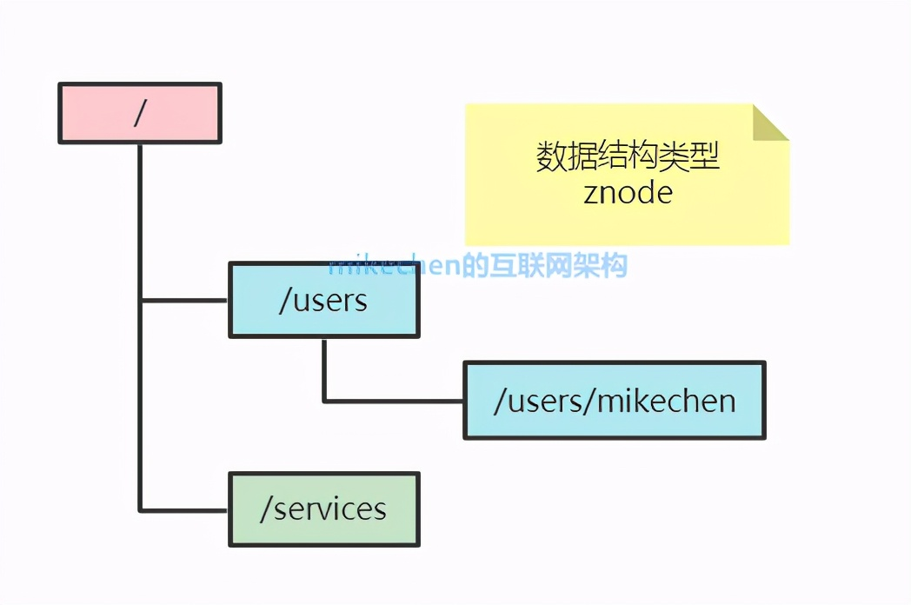
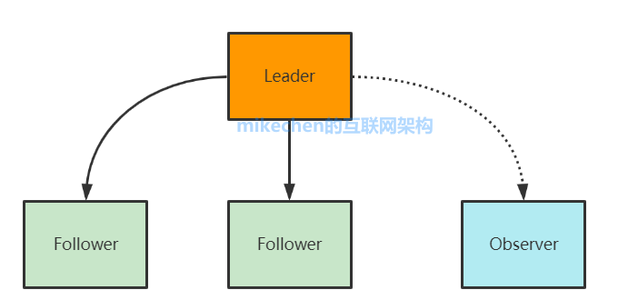
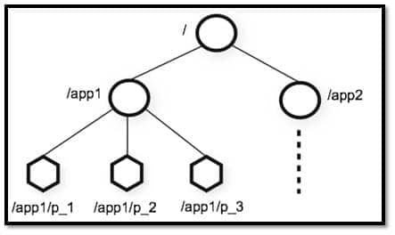
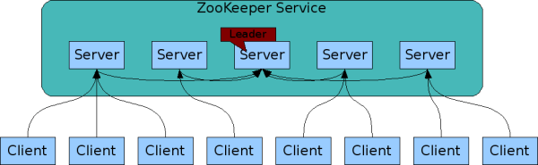
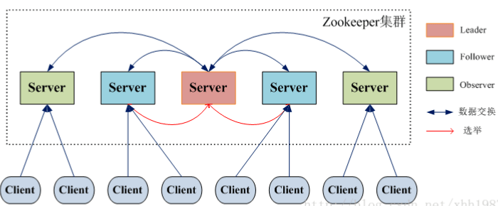
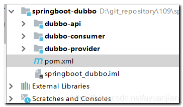
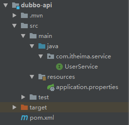

<!-- ---
sidebar: false
--- -->

# 1. zookeeper

## 1.1. ZooKeeper 概览

ZooKeeper 是一个开源的分布式协调服务. 它可以为分布式应用提供一致性服务, 提供的功能包括配置管理,命名服务,分布式锁,集群管理等

## 1.2. ZooKeeper 典型应用场景

### 1.2.1. 配置管理(数据发布/订阅)

发布者将数据发布到 Zookeeper 节点上, 通过 watcher 机制,客户端可以监听这些数据节点,当这些节点发生变化时,Zookeeper 及时地通知客户端,从而达到动态获取数据的目的, 来实现配置的动态更新.

### 1.2.2. 命名服务

根据指定名称来获取资源或服务的地址

### 1.2.3. 分布式锁

通过创建临时顺序节点获得分布式锁, 当获得锁的一方执行完相关代码或者是挂掉之后就释放锁

### 1.2.4. 分布式协调/通知

Zookeeper 中特有的 Watcher 注册于异步通知机制,能够很好地实现分布式环境下不同机器,甚至不同系统之间的协调与通知,从而实现对数据变更的实时处理.通常的做法是不同的客户端都对 Zookeeper 上的同一个数据节点进行 Watcher 注册,监听数据节点的变化(包括节点本身和子节点),若数据节点发生变化,那么所有订阅的客户端都能够接收到相应的 Watcher 通知,并作出相应处理

## 1.3. Zookeeper 的核心功能?

### 1.3.1. 文件系统

zk 的存储的数据的结构,类似于一个文件系统.每个节点称为 znode,每个 znode 都是一个类似于 KV 的结构,每个节点名称相当于 key,每个节点中都保存了对应的数据,类似于 Key对应的 value.每个 znode 下面都可以有多个子节点,就这样一直延续下去,构成了类似于Linux 文件系统的架构.



### 1.3.2. 通知机制(watcher 机制)

Zookeeper 允许客户端向服务端的某个 Znode 注册一个 Watcher 监听,当服务端的一些指
定事件触发了这个 Watcher,服务端会向指定客户端发送一个事件通知来实现分布式的通知
功能,然后客户端根据 Watcher 通知状态和事件类型做出业务上的改变.

### 1.3.3. 集群管理机制

zk 本身是一个集群结构,有一个 leader 节点,负责写请求,多个 follower 负责响应读请求
.并且在 leader 节点故障时,会自动根据选举机制从剩下的 follower 中选出新的 leader.

## 1.4. Zookeeper 的角色?



1. leader 角色: 处理所有的事务请求(写请求),可以处理读请求,集群中只能有一个
   Leader
1. Follower 角色: 只能处理读请求,同时作为 Leader 的候选节点,即如果 Leader 宕机
   ,Follower 节点要参与到新的 Leader 选举中,有可能成为新的 Leader 节点.
1. Observer 角色: Observer:只能处理读请求,不能参与选举.

## 1.5. ZooKeeper 重要概念解读

### 1.5.1. Data model(数据模型)



ZooKeeper 数据模型采用层次化的多叉树形结构,每个节点上都可以存储数据,这些数据可以是数字,字符串或者是二进制序列.并且.每个节点还可以拥有 N 个子节点,最上层是根节点以 / 来代表.每个数据节点在 ZooKeeper 中被称为 znode,它是 ZooKeeper 中数据的最小单元.并且,每个 znode 都有一个唯一的路径标识.

ZooKeeper 主要是用来协调服务的,而不是用来存储业务数据的,所以不要放比较大的数据在znode 上,ZooKeeper 给出的上限是每个结点的数据大小最大是 1M.

ZooKeeper 将数据保存在内存中,这也就保证了 高吞吐量和低延迟, 但是内存限制了能够存储的容量

### 1.5.2. znode(数据节点)

每个数据节点在 ZooKeeper 中被称为 znode,它是 ZooKeeper 中数据的最小单元.

#### 1.5.2.1. znode 4 种类型

1. 持久 (PERSISTENT) 节点: 一旦创建就一直存在,即使 ZooKeeper 集群宕机,直到将其删除.
1. 临时 (EPHEMERAL) 节点: 临时节点的生命周期是与客户端会话 (session) 绑定的,会话消失则节点消失.并且,临时节点只能做叶子节点,不能创建子节点.
1. 持久顺序 (PERSISTENT_SEQUENTIAL) 节点: 除了具有持久 (PERSISTENT) 节点的特性之外,子节点的名称还具有顺序性.比如 /node1/app0000000001 ,/node1/app0000000002 .
1. 临时顺序 (EPHEMERAL_SEQUENTIAL) 节点: 除了具备临时 (EPHEMERAL) 节点的特性之外,子节点的名称还具有顺序性.

## 1.6. ZooKeeper 集群



为了保证高可用,最好是以集群形态来部署 ZooKeeper,这样只要集群中大部分机器是可用的,那么 ZooKeeper 本身仍然是可用的.

集群规则为 2N+1 台,N>0,即 3 台. 可以继续使用,单数服务器只要没超过一半的服务器宕机就可以继续使用. 通常 3 台服务器就可以构成一个 ZooKeeper 集群了

每一个 Server 代表一个安装 ZooKeeper 服务的服务器.组成 ZooKeeper 服务的服务器都会在内存中维护当前的服务器状态,并且每台服务器之间都互相保持着通信.集群间通过 ZAB协议 (ZooKeeper Atomic Broadcast) 来保持数据的一致性.

最典型集群模式是 Master/Slave 模式 (主备模式).在这种模式中,通常 Master 服务器作为主服务器提供写服务,其他的 Slave 服务器从服务器通过异步复制的方式获取 Master 服务器最新的数据提供读服务.

## 1.7. ZooKeeper 集群角色



ZooKeeper 中没有选择传统的 Master/Slave 概念,而是引入了 Leader,Follower 和Observer 三种角色.

ZooKeeper 集群中的所有机器通过一个 Leader 选举过程来选定一台称为 Leader 的机器,Leader 可以为客户端提供读写服务.除了 Leader 外,Follower 和 Observer 都只能提供读服务. Follower 和 Observer 唯一的区别在于 Observer 机器不参与 Leader 的选举过程,也不参与写操作的过半写成功策略,因此 Observer 机器可以在不影响写性能的情况下提升集群的读性能.

| 角色     | 说明                                                                                                                                                                        |
| -------- | --------------------------------------------------------------------------------------------------------------------------------------------------------------------------- |
| Leader   | 为客户端提供读和写的服务,负责投票的发起和决议,更新系统状态.                                                                                                                 |
| Follower | 为客户端提供读服务,如果是写服务则转发给 Leader.参与选举过程中的投票.                                                                                                        |
| Observer | 为客户端提供读服务,如果是写服务则转发给 Leader.不参与选举过程中的投票,也不参与 过半写成功 策略.在不影响写性能的情况下提升集群的读性能.此角色于 ZooKeeper3.3 系列新增的角色. |

当 Leader 服务器出现网络中断,崩溃退出与重启等异常情况时,就会进入 Leader 选举过程
,这个过程会选举产生新的 Leader 服务器.

1. Leader election(选举阶段):节点在一开始都处于选举阶段,只要有一个节点得到超半数节点的票数,它就可以当选准 leader.
2. Discovery(发现阶段):在这个阶段,followers 跟准 leader 进行通信,同步 followers
   最近接收的事务提议.
3. Synchronization(同步阶段):同步阶段主要是利用 leader 前一阶段获得的最新提议历
   史,同步集群中所有的副本.同步完成之后准 leader 才会成为真正的 leader.
4. Broadcast(广播阶段):到了这个阶段,ZooKeeper 集群才能正式对外提供事务服务,并且
   leader 可以进行消息广播.同时如果有新的节点加入,还需要对新节点进行同步.

## 1.8. ZooKeeper 集群为啥最好奇数台?

集群中只要有过半的机器是正常工作的,那么整个集群对外就是可用的

ZooKeeper 集群在宕掉几个 ZooKeeper 服务器之后,如果剩下的 ZooKeeper 服务器个数大于宕掉的个数的话整个 ZooKeeper 依然可用.

## 1.9. ZooKeeper 选举的过半机制防止脑裂

对于一个集群,通常多台机器会部署在不同机房,来提高这个集群的可用性.保证可用性的同时,会发生一种机房间网络线路故障,导致机房间网络不通,而集群被割裂成几个小集群.这时候子集群各自选主导致脑裂的情况,这将会带来数据一致性等问题.

### 1.9.1. 过半机制是如何防止脑裂现象产生的?

ZooKeeper 的过半机制导致不可能产生 2 个 leader,因为少于等于一半是不可能产生 leader 的,这就使得不论机房的机器如何分配都不可能发生脑裂.

## 1.10. SpringBoot 使用 zookeeper 整合 Dubbo



创建 3 个模块: 模块说明 dubbo-api 模块 存放消费者和生产者通用接口组+通用模块
dubbo-provider 服务提供者 ,生产者 提供业务方法的实现 dubbo-cosumer 服务消费者,请
求服务,获取实现

### 1.10.1. api 模块



```java
public interface UserService {
    public String  sayHello(String name);
}
```

### 1.10.2. 生产者模块

两个注解

@Service 注解 来完成服务的发布 注意导包的时候,要导入 dubbo 官方提供的包.
@EnabledDubbo 在启动类上添加,自动扫描所有的服务类(有@Service 注解的类) 注册到
zookeeper 上发布

```pom
<dependencies>
    <!-- 引入上述api模块坐标 -->
      <dependency>
         <groupId>com.itheima.dubbo</groupId>
         <artifactId>api</artifactId>
         <version>1.0-SNAPSHOT</version>
      </dependency>
</dependencies>
```

```java
编写服务类: 注意使用注解 不要导错包 @Service,导的是dubbo包下的Service

//注意 : @Service注解不要导错包!!!!!
// 1. 生成UserService接口实例对象
// 2. 提供服务类 后续会结合 @EnableDubbo注解 服务注册到zookeeper中心上
@Service
public class UserServiceImpl implements UserService {
    @Override
    public String sayHello(String name) {
        System.out.println("----服务访问了一次------后续访问数据源");
        return "hello dubbo "+name;
    }
}
```

```properties
# dubbo-provider.properties
dubbo.application.name=annotation-springboot-provider
dubbo.registry.address=zookeeper://127.0.0.1:2181
dubbo.protocol.name=dubbo
dubbo.protocol.port=20880
dubbo.scan.base-packages=com.itheima.service
server.port=8081
```

### 1.10.3. 消费者模块

@Reference 获取,订阅服务

```pom
 <dependencies>
      <!-- 引入上述api模块坐标 -->
      <dependency>
         <groupId>com.itheima.dubbo</groupId>
         <artifactId>api</artifactId>
         <version>1.0-SNAPSHOT</version>
      </dependency>
</dependencies>
```

```java
@RestController
public class UserController {
    @Reference  //  注解不要导错包  导入dubbo的才行  注册服务到zookeeper
    private UserService userService;

    @GetMapping("/hello/{name}")
    public String hello(@PathVariable("name") String name){
        String s = userService.sayHello(name);
        return "hello"+s;
    }
}
```

```properties
# dubbo-consumer.properties
dubbo.application.name=annotation-springboot-consumer
dubbo.registry.address=zookeeper://127.0.0.1:2181
dubbo.consumer.check=false
server.port=8088
```

## 1.11. Zookeeper 怎么保证主从节点的状态同步?

Zookeeper 的核心是原子广播机制,这个机制保证了各个 server 之间的同步.实现这个机
制的协议叫做 Zab 协议.Zab 协议有两种模式,它们分别是恢复模式和广播模式.

### 1.11.1. 恢复模式

当服务启动或者在领导者崩溃后,Zab 就进入了恢复模式,当领导者被选举出来,且大多数
server 完成了和 leader 的状态同步以后,恢复模式就结束了.状态同步保证了 leader
和 server 具有相同的系统状态.

### 1.11.2. 广播模式

一旦 leader 已经和多数的 follower 进行了状态同步后,它就可以开始广播消息了,即进
入广播状态.这时候当一个 server 加入 ZooKeeper 服务中,它会在恢复模式下启动,发
现 leader,并和 leader 进行状态同步.待到同步结束,它也参与消息广播.ZooKeeper
服务一直维持在 Broadcast 状态,直到 leader 崩溃了或者 leader 失去了大部分的
followers 支持.

## 1.12. 说几个 zookeeper 常用的命令

常用命令:ls get set create delete 等.

## 1.13. zookeeper 是如何保证事务的顺序一致性的?

zookeeper 采用了全局递增的事务 Id 来标识,所有的 proposal(提议)都在被提出的时
候加上了 zxid,zxid 实际上是一个 64 位的数字,高 32 位是 epoch 用来标识 leader 周期,如果有新的 leader 产生出来,epoch 会自增,低 32
位用来递增计数.当新产生 proposal 的时候,会依据数据库的两阶段过程,首先会向其他
的 server 发出事务执行请求,如果超过半数的机器都能执行并且能够成功,那么就会开始
执行.

## 1.14. 注册中心的作用了解么?

注册中心负责服务地址的注册与查找,相当于目录服务,服务提供者和消费者只在启动时与注册中心交互.

## 1.15. 服务提供者宕机后,注册中心会做什么?

注册中心会立即推送事件通知消费者.

## 1.16. 监控中心的作用呢?

监控中心负责统计各服务调用次数,调用时间等.

## 1.17. 注册中心和监控中心都宕机的话,服务都会挂掉吗?

不会.两者都宕机也不影响已运行的提供者和消费者,消费者在本地缓存了提供者列表.注册中心和监控中心都是可选的,服务消费者可以直连服务提供者.
