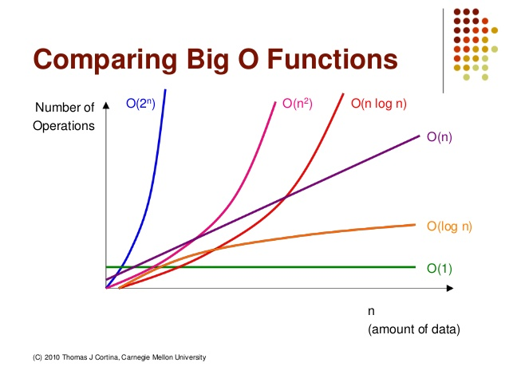
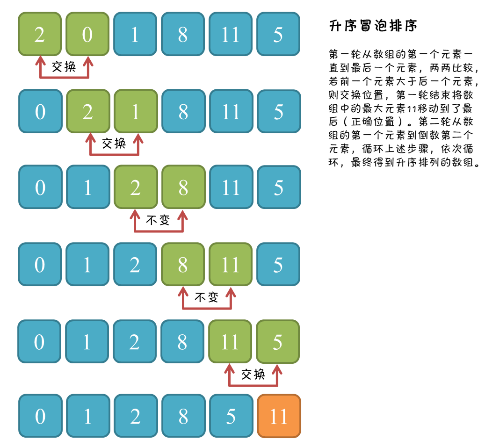
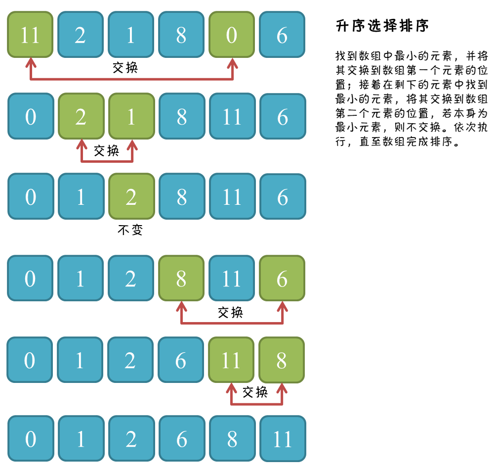
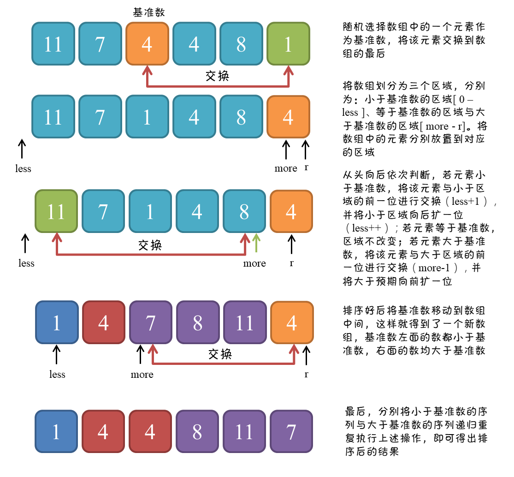

# 1. algorithm

## 1.1. 时间复杂度与空间复杂度

时间复杂度要比空间复杂度更容易出问题,更多研究的是时间复杂度,如果没有特殊说明, 算法复杂度讲的是时间复杂度.

1. 时间复杂度:用于评估执行程序所消耗的时间,可以估算出程序对处理器的使用程度.
1. 空间复杂度:用于评估执行程序所占用的内存空间,可以估算出程序对计算机内存的使用程度.

### 1.1.1. 常见的时间复杂度

O(1)常数型;O(log n)对数型,O(n)线性型,O(nlog n)线性对数型,O(n2)平方型,O(n3)立方型,O(nk)k次方型,O(2n)指数型

不同类型的函数的增长趋势图,随着问题规模n的不断增大,上述时间复杂度不断增大,算法的执行效率越低
  

### 1.1.2. 求解算法复杂度步骤

1. 找出算法中的基本语句:算法中执行次数最多的语句就是基本语句,通常是最内层循环的循环体.
1. 计算基本语句的执行次数的数量级:只需计算基本语句执行次数的数量级,即只要保证函数中的最高次幂正确即可,可以忽略所有低次幂和最高次幂的系数
1. 用大Ο表示算法的时间性能:将基本语句执行次数的数量级放入大Ο记号中.

### 1.1.3. 大O表示法规则

1. 用常数1取代运行时间中的所有加法常数;
1. 只保留时间函数中的最高阶项;
1. 如果最高阶项存在,则省去最高阶项前面的系数;

### 1.1.4. 时间复杂度实例

#### 1.1.4.1. 常数阶O(1)

无论代码执行了多少行,只要是没有循环等复杂结构,那这个代码的时间复杂度就都是O(1),如:

```go
int i = 1;
int j = 2;
int k = 1 + 2;
```

#### 1.1.4.2. 对数阶O(log n)

```go
int i = 1; // ①
while (i <= n) {
   i = i * 2; // ②
}
```

在上述代码中,语句①的频度为1,可以忽略不计.

语句②我们可以看到它是以2的倍数来逼近n,每次都乘以2.也就是说2的x次方小于等于n时会执行循环体,记作2^x^ <= n,于是得出x <= $log{n}$.时间复杂度为O($log{n}$).

#### 1.1.4.3. 线性阶O(n)

for循环中的代码会执行n遍,因此它消耗的时间是随着n的变化而成线性变化的,因此这类算法都可以用O(n)来表示时间复杂度.

```go
int j = 0; // ①
for (int i = 0; i < n; i++) { // ②
   j = i; // ③
   j++; // ④
}
```

上述代码中,语句①的频度为1,②的频度为n,③的频度为n-1,④的频度为n-1,因此整个算法可以用公式T(n)=1+n+(n-1)+(n-1)来表示.进而可以推到T(n)=1+n+(n-1)+(n-1)=3n-1,即O(n)=3n-1,去掉低次幂和系数即O(n)=n,因此T(n)=O(n)

#### 1.1.4.4. 线性对数阶O(nlogN)

```go
for (int m = 1; m < n; m++) {
   int i = 1; // ①
   while (i <= n) {
      i = i *2; // ②
   }
}
```

时间复杂度n*O(log n)了,记作O(nlog n).

#### 1.1.4.5. 平方阶O(n²)

```go
int k = 0;
for (int i = 0; i < n; i++) {
   for (int j = 0; j < n; j++) {
      k++;
   }
}
```

#### 1.1.4.6. 组合式复杂度分析

##### 1.1.4.6.1. 取最大复杂度作为整个算法复杂度

```go
public static void print1(int n){
    for (int i=0;i<1000;i++){
        System.out.println(i);
    }
    for (int j=0;j<n;j++){
        System.out.println(j);
    }

    for (int p=0;p<n;p++){
        for (int q=0;q<n;q++){
            System.out.println(p+q);
        }
    }
}
// 三个复杂度可以很明显得到的大小关系为：O(1)<O(n)<O(n²)，在同一个算法中有明确大小关系的，就可以直接取最大值作为这个算法的复杂度，所以算法的复杂度就是 O(n²)。
```

##### 1.1.4.6.2. 取多个复杂度之和作为整个算法复杂度

```go
public static void print2(int m,int n){
    for (int i=0;i<1000;i++){
        System.out.println(i);
    }
    for (int j=0;j<m;j++){
        System.out.println(j);
    }
    for (int k=0;k<n;k++){
        System.out.println(k);
    }
}
// 三段循环分别复杂度：O(1)，O(m)，O(n)。这时候我们只能知道 O(1) 最小可以忽略，但是后面两个无法却无法确定大小，所以这时候我们需要取两段循环复杂度之和来作为算法的复杂度，所以可以得到这个例子的算法复杂度为：O(m+n)。
```

## 1.2. 冒泡排序

冒泡排序重复地走访过要排序的元素列,依次比较两个相邻的元素,如果顺序(如从大到小,首字母从Z到A)错误就把他们交换过来.走访元素的工作是重复地进行直到没有相邻元素需要交换,也就是说该元素列已经排序完成.

  

```go
func bubbleSort(arr []int) []int {
 if len(arr) == 0 {
  return arr
 }
 for i := 0; i < len(arr); i++ {
  for j := 0; j < len(arr); j++ {
   if arr[i] > arr[j] {
    arr[j], arr[i] = arr[i], arr[j]
   }
  }
 }
 return arr
}

```

## 1.3. 选择排序

选择排序法是每一次从待排序的数据元素中选出最小(或最大)的一个元素,存放在序列的起始位置,然后,再从剩余未排序元素中继续寻找最小(大)元素,然后放到已排序序列的末尾.以此类推,直到全部待排序的数据元素排完

  

```go
func selectionSort(arr []int) []int {
 l := len(arr)
 if l == 0 {
  return arr
 }

 for i := 0; i < l; i++ {
  min := i
  for j := i + 1; j < l; j++ {
   if arr[j] < arr[min] {
    min = j
   }
  }
  arr[i],arr[min] =  arr[min],arr[i]
 }
 return arr
}
```

## 1.4. 归并排序

归并排序将已有序的子序列合并,得到完全有序的序列;即先使每个子序列有序,再使子序列段间有序.若将两个有序表合并成一个有序表,称为二路归并.

  

```go

func mergeSort(arr []int) []int {
        length := len(arr)
        if length < 2 {
                return arr
        }
        middle := length / 2
        left := arr[0:middle]
        right := arr[middle:]
        return merge(mergeSort(left), mergeSort(right))
}

func merge(left []int, right []int) []int {
        var result []int
        for len(left) != 0 && len(right) != 0 {
                if left[0] <= right[0] {
                        result = append(result, left[0])
                        left = left[1:]
                } else {
                        result = append(result, right[0])
                        right = right[1:]
                }
        }

        for len(left) != 0 {
                result = append(result, left[0])
                left = left[1:]
        }

        for len(right) != 0 {
                result = append(result, right[0])
                right = right[1:]
        }

        return result
}

```

## 1.5. 快速排序

通过一趟排序将要排序的数据分割成独立的两部分,其中一部分的所有数据比另一部分的所有数据要小,再按这种方法对这两部分数据分别进行快速排序,整个排序过程可以递归进行,使整个数据变成有序序列.

  

```go
func quickSort(arr []int) []int {
        return _quickSort(arr, 0, len(arr)-1)
}

func _quickSort(arr []int, left, right int) []int {
        if left < right {
                partitionIndex := partition(arr, left, right)
                _quickSort(arr, left, partitionIndex-1)
                _quickSort(arr, partitionIndex+1, right)
        }
        return arr
}

func partition(arr []int, left, right int) int {
        pivot := left
        index := pivot + 1

        for i := index; i <= right; i++ {
                if arr[i] < arr[pivot] {
                        swap(arr, i, index)
                        index += 1
                }
        }
        swap(arr, pivot, index-1)
        return index - 1
}

func swap(arr []int, i, j int) {
        arr[i], arr[j] = arr[j], arr[i]
}


```
