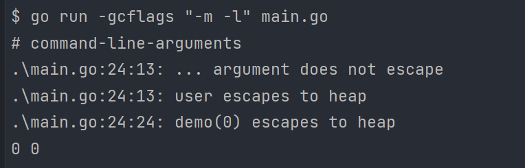

# 1. basic

## 1.1. Go 有什么优势或者特点?

1. Go 允许跨平台编译,编译出来的是二进制的可执行文件,直接部署在对应系统上即可运行
1. Go 天生支持高并发,通过 goroutine 和 channel 实现
1. GO 是静态类型语言,可以在编译的时候检查出来隐藏的大多数问题
1. Go 的代码风格是强制性的统一

## 1.2. golang 中 make 和 new 的区别?

1. new 和 make 都是用于内存的分配.
1. make 只用于 chan,map,slice 的初始化.
1. new 用于给类型分配内存空间,并且置零.
1. make 返回类型本身,new 返回指向类型的指针.

## 1.3. Golang数据类型

### 1.3.1. 值类型

int,float,bool,string,struct和array. 变量直接存储值,分配在栈区的内存空间,这些变量所占据的空间在函数被调用完后会自动释放.

### 1.3.2. 引用类型

slice,map,chan和 指针. 变量存储的是一个地址,使用指针指向内存中真正存储数据的首地址.内存通常在堆上分配,通过GC回收.对于引用类型的变量,不仅要声明变量,还需要手动分配空间.

## 1.4. Go中new和make的区别

### 1.4.1. new 函数

new 函数返回的永远是类型的指针,指针指向分配类型的内存地址.

```go
func new(Type) *Type
```

### 1.4.2. make 函数

make 也是用于内存分配的,它只用于 chan,map 以及 slice 的内存创建,而且它返回的类型就是这三个类型本身,而不是他们的指针类型

```go
func make(t Type, size ...IntegerType) Type
```

## 1.5. Go 语言如何高效的进行字符串拼

通过 benchmark 对比, 无论什么情况下使用 strings.builder 进行字符串拼接都是最高效
的;如果进行少量的字符串拼接时,直接使用+操作符是最方便也是性能最高的

### 1.5.1. 原生拼接方式"+"

Go 语言原生支持使用+操作符直接对两个字符串进行拼接,使用例子如下:

```go
var s string
s += "asong"
s += "真帅"
fmt.Println(s)
```

这种方式使用起来最简单,基本所有语言都有提供这种方式,使用+操作符进行拼接时,会对字
符串进行遍历,计算并开辟一个新的空间来存储原来的两个字符串.

### 1.5.2. Strings.builder

Go 语言提供了一个专门操作字符串的库 strings,使用 strings.Builder 可以进行字符串
拼接,提供了 writeString 方法拼接字符串,使用方式如下:

```go
 var builder strings.Builder
 builder.WriteString("asong")
 builder.WriteString(" hello")
 s := builder.String()
 fmt.Println(s)
```

### 1.5.3. 字符串格式化函数 fmt.Sprintf

```go
str := "asong"
str = fmt.Sprintf("%s%s", str, str)
```

fmt.Sprintf 实现原理主要是使用到了反射,反射会产生性能的损耗,影响性能

### 1.5.4. bytes.Buffer

因为 string 类型底层就是一个 byte 数组,所以我们就可以 Go 语言的 bytes.Buffer 进
行字符串拼接.bytes.Buffer 是一个一个缓冲 byte 类型的缓冲器,这个缓冲器里存放着都
是 byte.

```go
buf := new(bytes.Buffer)
buf.WriteString("asong")
buf.String()
```

### 1.5.5. strings.join

```go
baseSlice := []string{"asong", "真帅"}
strings.Join(baseSlice, "")
```

### 1.5.6. 切片 append

因为 string 类型底层也是 byte 类型数组,所以我们可以重新声明一个切片,使用
append 进行字符串拼接,使用方式如下:

```go
a := "Hello,"
b := "World!"
s := string(append([]byte(a), []byte(b)...))
fmt.Println(s)
```

如果想减少内存分配,在将[]byte 转换为 string 类型时可以考虑使用强制转换.

## 1.6. 数组(array)和切片(slice)的区别

### 1.6.1. array 特点

golang 中的数组是值类型, 如果数组作为函数的参数,那么实际传递的参数是一份数组的拷贝,而不是数组的指针, array 的长度也是 Type 的一部分,这样就说明[10]int
和[20]int 是不一样的.

### 1.6.2. slice 类型

切片是一个结构体,保存着切片的容量,长度以及指向数组的指针, 切片是不定长的

```go
type slice struct {  
    array unsafe.Pointer
    len   int
    cap   int
}
```

## 1.7. 切片长度和容量区别

`make([]int, 0, 5)`

1. 切片的长度是它所包含的元素个数.
1. 切片的容量是从它的第一个元素到其底层数组元素末尾的个数.当切片的底层数组不足以容纳所有给定值时,它就会分配一个更大的数组.返回的切片会指向这个新分配的数组.

## 1.8. for 循环遍历 slice 或 map 有什么问题?

for range 遍历的 slice/map 内容是对元素的一个拷贝,而不是直接返回每个元素的引用, 所以不能用来修改原 slice/map 中内容.

for range创建的是每个元素的拷贝,而不是直接返回每个元素的引用,如果使用该值变量的地址作为指向每个元素的指针,就会导致错误,在迭代时,返回的变量是一个迭代过程中根据切片依次赋值的新变量,所以值的地址总是相同的,导致结果不如预期.

```go
package main
import (
 "fmt"
)
func main() {
 slice := []int{0, 1, 2, 3}
 myMap := make(map[int]*int)
 for _,v :=range slice{
  if v==1 {
   v=100
  }
 }
 for k,v :=range slice{
  fmt.Println("k:",k,"v:",v)
 }
}
// k: 0 v: 0
// k: 1 v: 1
// k: 2 v: 2
// k: 3 v: 3


// 使用 k根据索引直接修改值.
for k,v :=range slice{
  if v==1 {
   slice[k]=100
  }
 }
```

```go
package main
import (
    "fmt"
)
func main() {
    s :=[]int{1,2,3,4}
    m :=make(map[int]*int)
    for k,v:=range s{
    m[k]=&v
    }
    for key, value := range m {
    fmt.Printf("map[%v]=%v\n", key, *value)
    }
    fmt.Println(m)
}
// map[2]=4
// map[3]=4
// map[0]=4
// map[1]=4


// 声明一个中间变量,保存value,并且复制给map即可
package main
import (
 "fmt"
)
func main() {
 s :=[]int{1,2,3,4}
 m :=make(map[int]*int)
 for k,v:=range s{
  n:=v
  m[k]= &n
 }
 for key, value := range m {
  fmt.Printf("map[%v]=%v\n", key, *value)
 }
 fmt.Println(m)
}
```

## 1.9. Golang中 int int8 int16 int32 int64的区别和取值

### 1.9.1. 区别

| int   | 类型大小为 4/8 字节 |
| :---- | ------------------: |
| int8  |   类型大小为 1 字节 |
| int16 |   类型大小为 2 字节 |
| int32 |   类型大小为 4 字节 |
| int64 |   类型大小为 8 字节 |

go语言中的int的大小是和操作系统位数相关的,如果是32位操作系统,int类型的大小就是4字节; 如果是64位操作系统,int类型的大小就是8个字节

### 1.9.2. 取值范围

|int8 |  -128 ~ 127|
|:--|--:|
|int16 | -32768 ~ 32767|
|int32 | -2147483648 ~ 2147483647|
|int64 | -9223372036854775808 ~ 9223372036854775807|
|
|uint8 |  0 ~ 255|
|uint16 | 0 ~ 65535|
|uint32 | 0 ~ 4294967295|
|uint64 | 0 ~ 18446744073709551615|

## 1.10. 介绍 rune 类型

rune 是 Go 语言中一种特殊的数据类型,它是 int32 的别名,几乎在所有方面等同于int32,用于区分字符值和整数值.rune代表一个utf-8字符.当需要处理中文,日文或者其他复合字符时,则需要用到rune类型

```go
var s = "你好吗"
runes := []rune(s)
runes[2] = '啊'
fmt.Println(string(runes))
```

## 1.11. golang 中解析 tag 是怎么实现的?反射原理是什么?

 声明struct结构体的时候,属性的右侧还有反引号括起来的内容, 在golang中叫标签(Tag),在转换成其它数据格式的时候,会使用其中特定的字段作为键值

```go

1 type User struct {
2     UserId   int    `json:"user_id" gorm:"user_id"`
3     UserName string `json:"user_name" gorm:"user_name"`
4 }

```

## 1.12. golang是值传递还是引用传递?

Go语言中所有的传参都是值传递,值的副本或引用类型的副本.无论是值类型的变量还是引用类型的变量作为参数传递都会发生值拷贝,开辟新的内存空间.

## 1.13. struct 能不能进行比较?

1. 不同类型的 struct 不能进行比较,编译期就会报错
1. 同类型的struct 分两种情况:
   1. struct 的所有成员都是可以比较的,则该 strcut 的不同实例可以比较
   1. struct 中含有不可比较的成员(如 Slice),则该 struct 不可以比较

## 1.14. Go 闭包

闭包是一个函数内引用了外部的局部变量, 闭包中引用的外部局部变量并不会随着函数的返回而被从栈上销毁.

```go
package main
import "fmt"
func adder() func(int) int {
    sum := 0
    return func(x int) int {
        sum += x
        return sum
    }
}
func main() {
     valueFunc:= adder()
     fmt.Println(valueFunc(2))     // output: 2
     fmt.Println(valueFunc(2))   // output: 4
}
```

## 1.15. golang map 是线程安全的吗? go 如何解决 Map 并发读写安全问题 ?

map 是一个可以存储 key/value 对的一种数据结构,map 是引用类型,map 中存入的数据是无序的, 因为 map 变量为引用类型变量,并发写时,多个协程同时操作一个内存,类似于多线程操作同一个资源会发生竞争关系,共享资源会遭到破坏, Go 语言在 1.9 版本中提供了一种效率较高的并发安全的 sync.Map,  也可以使用第三方包 "concurrent-map"

```go
package main
import (
    "fmt"
    "sync"
    "time"
)

var m1 sync.Map
func main() {
    i: = 0
    go func() {
        for {
            i++
            m1.Store(1, i)
            time.Sleep(1000)
        }
    }()
    go func() {
        for {
            time.Sleep(1000)
            fmt.Println(m1.Load(1))
        }

    }()
    for {;
    }
}
```

## 1.16. map 中删除一个 key, 它的内存会释放么?

1. 如果删除的元素是值类型,如 int,float,bool,string,array,  struct, 则 map 的内存不会自动释放
1. 如果删除的元素是引用类型,如指针,slice,map,chan 等, 则 map 的内存会自动释放,但释放的内存是子元素应用类型的内存占用
1. 将 map 设置为 nil 后,内存被回收

## 1.17. Golang 空 map 和未初始化 map 注意事项

### 1.17.1. 未初始化 map

1. 可以对未初始化的 map 进行取值,但取出来的东西是空:

    ```go
    var m1 map[string]string
    fmt.Println(m1["1"])

    // output:
    // 
    ```

1. 不能对未初始化的 map 进行赋值, 会抛出异常

    ```go
    var m1 map[string]string
    m1["1"] = "1"
    ```

### 1.17.2. 空 map

断定 map 是空还是 nil, 需要通过 map == nil 来判断. 因为通过 fmt 打印 map 时,空 map 和 nil map 结果是一样的

```go
// 使用make函数初始化map
m1 = make(map[string]string)
if m1 != nil {
    fmt.Printf("空map, 不是nil")
}
```

## 1.18. map 的数据结构是什么?是怎么实现扩容?

Go 中的 map 在底层是用哈希表实现的, 哈希表示的是键值对之间映射关系.

随着 Map 中元素的增加,发生哈希冲突的概率会增加,Map 的读写性能也会下降,所以我们需
要更多的桶和更大的内存来保证 Map 的读写性能.

在实际应用中,当装载因子超过某个阈值时,会动态地增加 Map 长度,实现自动扩容.

每当 Map 长度发生变化后,所有 key 在 Map 中对应的索引需要重新计算.如果一个一个计
算原 Map 中的 key 的索引并插入到新 Map 中,这种一次性扩容方式是达不到生产环境的要
求的,因为时间复杂度太高了 O(n),在数据量大的情况下性能会很差.

## 1.19. map 如何顺序读取?

map 不能顺序读取,是因为他是无序的,想要有序读取,需要把 key 变为有序,所以可以把key 放入切片,对切片进行排序,遍历切片,通过 key 取值
可以通过sort中的排序包进行对map中的key进行排序

```go
package main

import (
    "fmt"
    "sort"
)

func main() {
    m := make(map[string]string)
    m["b"] = "2"
    m["a"] = "1"
    m["c"] = "3"

    keys := make([]string, 0, len(m))
    for k, _ := range m {
        keys = append(keys, k)
    }

    sort.Strings(keys)

    for _, k := range keys {
        fmt.Printf("Key:%+v, Value:%+v\n", k, m[k])
    }
}

```

## 1.20. 简单描述 Go 语言 GC(垃圾回收)的工作原理

垃圾回收(GC)是在后台运行一个守护线程,监控各个对象的状态,识别并且丢弃不再使用的对象, 来释放和重用资源.

Golang使用的垃圾回收机制是三色标记法,是对标记清除法的改进.

### 1.20.1. 标记清除

1. 标记阶段 - 从根对象出发标记堆中存活的对象
1. 清除阶段 - 遍历堆中所有对象,回收未被标记的垃圾对象

#### 1.20.1.1. 缺点

 GC 执行期间需要把整个程序完全暂停,不能异步进行 GC 操作

### 1.20.2. 三色标记

三色标记优点是可以异步执行,从而可以以中断时间极少的代价或者完全没有中断操作来进行整个GC.

三色标记算法将程序中的对象分成白色,黑色和灰色三类,初始都是白色

1. 白色,初始值.本次回收没被扫描过的对象默认都是白色的.而确认不可达的对象也是白色,但是会被标记「不可达」.
1. 灰色,中间状态.本对象有被外部引用,但是本对象引用的其它对象尚未全部检测完.
1. 黑色,本对象有被其它对象引用,且已检测完本对象引用的其它对象.

#### 1.20.2.1. 垃圾回收过程

1. 垃圾回收开始时,将程序所有对象,包括新创建的对象,全部标记为白色,并将白色对象放入到白色标记表集合中;
1. 每次GC回收开始, 然后从根节点开始遍历所有对象,把遍历到的对象从白色集合放入"灰色"集合.
1. 遍历灰色集合,将灰色对象引用的对象从白色集合放入灰色集合,之后将此灰色对象放入黑色集合
1. 重复上一步, 直到灰色中无任何对象.
1. 回收所有的白色标记表的对象. 也就是回收垃圾.

#### 1.20.2.2. 触发条件

1. 手动触发: 一般很少用,主要由开发者通过调用 runtime.GC()
1. 系统触发:
   1. 当前分配的内存达到一定阈值时触发,这个阈值在每次GC过后都会根据堆内存的增长情况和CPU占用率来调整
   1. 自从上次GC后, 间隔时间达到了2分钟,将启动GC

## 1.21. 为什么小对象多了会造成GC压力

通常小对象过多会导致GC三色法消耗过多的GPU.优化思路是,减少对象分配.

## 1.22. 请简述 Go 是如何分配内存的?

1. 栈内存由编译器自动分配和释放,开发者无法控制.栈内存一般存储函数中的局部变量,参数等,函数创建的时候,这些内存会被自动创建;函数返回的时候,这些内存会被自动释放.
1. 堆内存的生命周期比栈内存要长,如果函数返回的值还会在其他地方使用,那么这个值就会被编译器自动分配到堆上.堆内存相比栈内存来说,不能自动被编译器释放,只能通过垃圾回收器才能释放,所以栈内存效率会很高.

## 1.23. 在Go函数中为什么会发生内存泄露

Goroutine需要维护执行用户代码的上下文信息.在运行过程中需要消耗一定的内存来保存这类信息,而这些内存在目前版本的 Go 中是不会被释放的.因此,如果一个程序持续不断地产生新的 goroutine,且不结束已经创建的 goroutine 并复用这部分内存,就会造成内存泄漏的现象. 可以借助 pprof 排查

```go
func main() {
 for i := 0; i < 10000; i++ {
  go func() {
   select {}
  }()
 }
}
```

## 1.24. go 实现单例的方式?

sync.Once

```go
package main
import (
"fmt"
"sync"
)
func main() {
var once sync.Once
onceBody := func() {
 fmt.Println("Only once")
}
done := make(chan bool)
for i := 0; i < 10; i++ {
 go func() {
  once.Do(onceBody)
  done <- true
 }()
}
for i := 0; i < 10; i++ {
 <-done
}
}
```

## 1.25. client 如何实现长连接?

在 Golang 中使用持久化连接发起 HTTP 请求,主要依赖 Transport,官方封装的 net 库中
已经支持,在实际应用中,需要在初始化 HTTP 的 client 时传入 transport,

### 1.25.1. Transport 的主要功能

1. 缓存了长连接,用于大量 http 请求场景下的连接复用
1. 对连接做一些限制,连接超时时间,每个 host 的最大连接数

```go
package main

import (
    "fmt"
    "io/ioutil"
    "net"
    "net/http"
    "time"
)

var HTTPTransport = &http.Transport{
    DialContext: (&net.Dialer{
        Timeout:   30 * time.Second, // 连接超时时间
        KeepAlive: 60 * time.Second, // 保持长连接的时间
    }).DialContext, // 设置连接的参数
    MaxIdleConns:          500, // 最大空闲连接
    IdleConnTimeout:       60 * time.Second, // 空闲连接的超时时间
    ExpectContinueTimeout: 30 * time.Second, // 等待服务第一个响应的超时时间
    MaxIdleConnsPerHost:   100, // 每个host保持的空闲连接数
}

func main() {
    times := 50
    uri := "http://local.test.com/t.php"

    // 短连接的情况
    start := time.Now()
    client := http.Client{} // 初始化http的client


    // 长连接的情况
    start2 := time.Now()
    // 初始化一个带有transport的http的client
    client2 := http.Client{Transport: HTTPTransport}
  }

```

## 1.31. 分布式锁的问题吗?分布式锁的原理你清楚吗?

golang 中的分布式锁可使用 etcd 进行实现,实现原理如下:

1. 利用租约在 etcd 集群中创建一个 key,这个 key 有两种形态,存在和不存在,而这两种
   形态就是互斥量.
1. 如果这个 key 不存在,那么线程创建 key,成功则获取到锁,该 key 就为存在状态.
1. 如果该 key 已经存在,那么线程就不能创建 key,则获取锁失败.

## 1.32. Go 实现 set 类型

Go 中是不提供 Set 类型的,Set 是一个集合,其本质就是一个 List,只是 List 里的元素不
能重复.

Go 提供了 map 类型,但是我们知道,map 类型的 key 是不能重复的,因此,我们可以利用这
一点,来实现一个 set.那 value 呢?value 我们可以用一个常量来代替,比如一个空结构体,
实际上空结构体不占任何内存,使用空结构体,能够帮我们节省内存空间,提高性能

```go
// 下面看看两种结构体的声明方法

// 这种形式的声明会返回一个指向该结构体的指针
type Empty struct { }

func main(){
    empty := new(Empty)
    fmt.Println(unsafe.Sizeof(empty)) //8
}

// 这种结构体的声明就是一个随处可用的空缓存

var empty Empty
fmt.Println(unsafe.Sizeof(empty)) //0
```

## 1.33. 了解空指针吗

当一个指针被定义后没有分配到任何变量时,它的值为 nil. nil 指针也称为空指针. nil
在概念上和其它语言的 null,None,nil,NULL 一样,都指代零值或空值.

## 1.34. 无缓冲通道和缓冲通道的区别是什么?

无缓冲通道,在通道满了之后就会阻塞所在的 goroutine.(需要在其他 goroutine 中取出该
通道中的元素,才能解除它所在通道的阻塞,不然就会一直阻塞下去.)缓冲通道,存完了东西
可以不取出来,不会阻塞; 缓冲通道相较于无缓冲区的通道在用法上是要灵活一些的,不会出
现一次写入,一次读完就会堵塞.

## 1.35. 内存逃逸

### 1.35.1. 什么是内存逃逸?

在程序中,每个函数块都会有自己的内存区域用来存自己的局部变量(内存占用少),返回地址,返回值之类的数据,这一块内存区域有特定的结构和寻址方式,寻址起来十分迅速,开销很少.这一块内存地址称为栈.栈是线程级别的,大小在创建的时候已经确定,当变量太大的时候,会"逃逸"到堆上,这种现象称为内存逃逸.简单来说,局部变量通过堆分配和回收,就叫内存逃逸.

### 1.35.2. 逃逸是如何产生的?

如果一个函数返回对一个变量的引用,那么它就会发生逃逸.即任何时候,一个值被分享到函数栈范围之外,它都会在堆上被重新分配.在这里有一个例外,就是如果编译器可以证明在函数返回后不会再被引用的,那么就会分配到栈上,这个证明的过程叫做逃逸分析.

### 1.35.3. 总结

如果函数外部没有引用,则优先放到栈中;
如果函数外部存在引用,则必定放到堆中;

### 1.35.4. 内存逃逸的危害

堆是一块没有特定结构,也没有固定大小的内存区域,可以根据需要进行调整.全局变量,内存占用较大的局部变量,函数调用结束后不能立刻回收的局部变量都会存在堆里面.变量在堆上的分配和回收都比在栈上开销大的多.对于 go 这种带 GC 的语言来说,会增加 gc 压力,同时也容易造成内存碎片(采用分区式存储管理的系统,在储存分配过程中产生的,不能供用户作业使用的主存里的小分区称成"内存碎片".内存碎片分为内部碎片和外部碎片).

### 1.35.5. demo

`go run -gcflags "-m -l" main.go`

使用 go run 运行程序时,-gcflags 参数是编译参数.其中 -m 表示进行内存分配分析,-l 表示避免程序内联,也就是避免进行程序优化.
  

```go
func demo(user int) int {
    //声名一个变量并赋值
     var admin int 
     admin = user
     return admin
}
//空的没啥用的方法
func void() {}
func main() {
   // 声明user变量并打印
    var user int 
    void()
    // 存在内存逃逸
    fmt.Println(user, demo(0))
}

```

## 1.36. golang的init函数

初始化每个包后,会自动执行 init()函数,并且执行优先级高于主函数的执行优先级

### 1.36.1. init函数的主要特点

1. init函数先于main函数自动执行,不能被其他函数调用;
1. init函数没有输入参数,返回值;
1. 每个包可以有多个init函数;
1. 包的每个源文件也可以有多个init函数,这点比较特殊;
1. 同一个包的init执行顺序,golang没有明确定义,编程时要注意程序不要依赖这个执行顺序.
1. 不同包的init函数按照包导入的依赖关系决定执行顺序.

## 1.37. go语言局部变量分配在栈还是堆

函数内局部变量,它会被分配在堆还是栈,是由编译器做逃逸分析之后自动做出的决定.

## 1.38. Go中两个Nil可能不相等吗

两个nil只有在类型相同时才相等.

```go
 var p *int = nil
 var i interface{} = nil
 fmt.Println(p == i)
// false
```

## 1.39. Golang函数返回局部变量的指针是否安全

在 Go 中是安全的,Go 编译器将会对每个局部变量进行逃逸分析.如果发现局部变量的作用域超出该函数,则不会将内存分配在栈上,而是分配在堆上

## 1.40. 非接口的任意类型 T() 都能够调用 *T 的方法吗?反过来呢?

1. 一个T类型的值可以调用为`*T`类型声明的方法,但是仅当此T的值是可寻址的情况下.编译器在调用指针属主方法前,会自动取此T值的地址.因为不是任何T值都是可寻址的,所以并非任何T值都能够调用为类型*T声明的方法.
1. 一个`*T`类型的值可以调用为类型T声明的方法,这是因为解引用指针总是合法的.

## 1.41. golang判断map中key是否存在的方法

```go
func main() {
    dict := map[string]int{"key1": 1, "key2": 2}
    if value, ok := dict["key1"]; ok {
        fmt.Printf(value)
    } else {
        fmt.Println("key1 不存在")
    }
}
```

## 1.42. Golang比较两个字符串切片是否相等

遍历比较切片中的每一个元素

```go
func CompareSlice(a, b []string) bool {
 if len(a) != len(b) {
  return false
 }
 if (a == nil) != (b == nil) {
  return false
 }
 for key, value := range a {
  if value != b[key] {
   return false
  }
 }
 return true
}
```

## 1.43. Go的Struct能不能比较

1. 相同struct类型的可以比较
1. 不同struct类型的不可以比较,编译都不过,类型不匹配

## 1.44. go 打印 %v %+v %#v 的区别

1. %v  输出所有的值
1. %+v 先输出字段名字,再输出该字段的值
1. %#v 先输出结构体名字值,再输出结构体(字段名字+字段的值)

```go
type student struct {
 id   int32
 name string
}
 
func main() {
 a := &student{id: 1, name: "xiaoming"}
 fmt.Printf("%v \n", a)
 fmt.Printf("%+v \n", a)
 fmt.Printf("%#v \n", a)

// output:
// &{1 xiaoming} 
// &{id:1 name:xiaoming} 
// &main.student{id:1, name:"xiaoming"} 

```

## 1.45. golang的枚举类型

go语言并没有提供enum的定义,可以使用const来模拟枚举类型.

```go

const (
    Running int = iota
    Pending
    Stopped
)

func main() {
    fmt.Println("State running: ", Running)
    fmt.Println("State pending: ", Pending)
    fmt.Println("State Stoped: ", Stopped)
}

```

## 1.46. Go 空结构体 struct{} 的用途

`map[string]struct{}`

空结构体 struct{} 可以用来节省内存,因为空结构体不占据内存空间,因此被广泛作为占位符使用.

## 1.47. Go中的nil切片和空切片区别

1. nil slice  只是声明了slice,却没有给实例化的对象, 未分配内存  

```go
var slice []int
slice[1] = 0 //err
```

1. empty slice已分配内存

```go
slice := make([]int,0)
slice := []int{}
```

## 1.48. Go的defer原理是什么

### 1.48.1. 如何理解 defer 关键字

defer 用于延迟执行一个函数.常用于处理如资源释放,连接关闭等问题, 会在函数返回之前进行调用

## 1.49. 多个 defer 的顺序,defer 在什么时机会修改返回值?

如果有多个defer 表达式,执行顺序为先进后出, 类似于栈. defer 的执行顺序在 return 之后,但是在返回值返回之前,所以使用 defer 可以达到修改返回值的目的.

```go
package main
import (
    "fmt"
)
func main() {
    ret := test()
    fmt.Println("test return:", ret)
}
//返回值改为命名返回值
func test() (i int) {
    //var i int
    defer func() {
        i++
        fmt.Println("test defer, i = ", i)
    }()
    return i
}
// 执行结果为:
// test defer, i =  1
// test return: 1
// 这次test函数的返回值变成了1,defer里面的"i++"修改了返回值.所以defer的执行时机应该是return之后,且返回值返回给调用方之前.
```

## 1.50. defer recover 的问题?

不建议在编写普通函数时也经常性使用这种特性

panic 终止程序的运行,recover 捕获异常,程序在发生错误后,我们能够做一些处理,保证程
序可以继续运行,那么这时候,我们就需要使用异常恢复,即 recover.Golang 中的 recover
一般都是配套 defer 一起使用.

```go
defer func() {
    if r := recover(); r != nil {
        fmt.Println("Recovered in f", r)
    }
}()
```

## 1.51. 闭包与匿名函数

defer 经常使用到会闭包与匿名函数.

1. 匿名函数:没有函数名的函数.
1. 闭包:可以使用另外一个函数作用域中的变量的函数.

## 1.52. Go的 slice如何扩容

slice是可以看做是一个长度可变的数组.

```go
type slice struct {
// 指向一个数组的指针
 array unsafe.Pointer
// 切片的长度
 len   int
//  切片的容量
 cap   int
}
```

在对slice进行append等操作时,可能会造成slice的自动扩容.

1. 如果切片的容量小于1024个元素,那么扩容的时候slice的cap就乘以2;一旦元素个数超过1024个元素,增长因子就变成1.25,即每次增加原来容量的四分之一.
1. 如果扩容之后,还没有触及原数组的容量,那么,切片中的指针指向的位置,就还是原数组,如果扩容之后,超过了原数组的容量,那么,Go就会开辟一块新的内存,把原来的值拷贝过来,这种情况丝毫不会影响到原数组.

## 1.53. 同步, 异步和阻塞, 非阻塞的区别?

同步是个过程，阻塞是线程的一种状态

### 1.53.2. 同步和异步的区别

同步与异步是线程之间的关系,两个线程之间要么是同步的,要么是异步的.

1. 同步: 发起一个请求, 必须要等到响应结果才能发起下一个请求。
1. 异步: 发起一个请求, 不需要等到响应结果就能发起下一个请求。

### 1.53.3. 阻塞与非阻塞的区别

阻塞与非阻塞是是程序在等待响应结果时的状态, 对同一个线程来说的,在某个时刻,线程要么处于阻塞,要么处于非阻塞

1. 阻塞:调用结果返回之前,当前线程会被挂起,一直处于等待消息通知,不能够执行其他业务,函数只有在得到结果之后才会返回.
1. 非阻塞:在不能立刻得到结果之前,该函数不会阻塞当前线程,而会立刻返回.

## 1.54. golang 中切片去重

### 1.54.1. 双重循环过滤

```go
// 通过两重循环过滤重复元素
func RemoveRepByLoop(slc []int) []int {
 result := []int{} // 存放结果
 for i := range slc {
  flag := true
  for j := range result {
   if slc[i] == result[j] {
    flag = false // 存在重复元素,标识为false
    break
   }
  }
  if flag { // 标识为false,不添加进结果
   result = append(result, slc[i])
  }
 }
 return result
}

```

### 1.54.2. 通过字典(set)过滤

```go
// 通过map主键唯一的特性过滤重复元素
func RemoveRepByMap(slc []int) []int {
    result := []int{}
    tempMap := map[int]byte{}  // 存放不重复主键
    for _, e := range slc{
        l := len(tempMap)
        tempMap[e] = 0
        if len(tempMap) != l{  // 加入map后,map长度变化,则元素不重复
            result = append(result, e)
        }
    }
    return result
}
```
