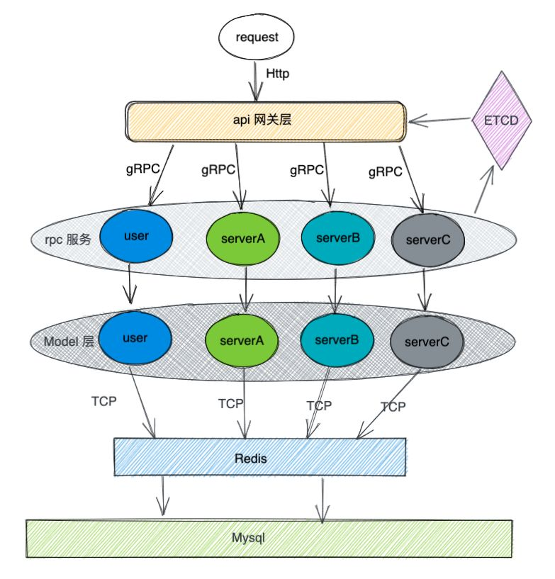

# 1. one

## 1.1. Go 有什么优势或者特点?

1. Go 允许跨平台编译,编译出来的是二进制的可执行文件,直接部署在对应系统上即可运行
1. Go 在语言层次上天生支持高并发,通过 goroutine 和 channel 实现
1. 静态类型语言,可以在编译的时候检查出来隐藏的大多数问题
1. Go 的代码风格是强制性的统一

## 1.2. golang 中 make 和 new 的区别?

1. new 和 make 都是用于内存的分配.
1. make 只用于 chan,map,slice 的初始化.
1. new 用于给类型分配内存空间,并且置零.
1. make 返回类型本身,new 返回指向类型的指针.

## 1.3. Go 有异常类型吗?

Go 没有异常类型,只有错误类型(Error).

### 1.3.1. new 函数

new 函数,它返回的永远是类型的指针,指针指向分配类型的内存地址.

```golang
func new(Type) *Type
var sum *int
sum = new(int) //分配内存空间
*sum = 98
fmt.Println(*sum)
```

### 1.3.2. make 函数

make 也是用于内存分配的,但是和 new 不同,它只用于 chan,map 以及 slice 的内存创建,
而且它返回的类型就是这三个类型本身,而不是他们的指针类型,因为这三种类型就是引用类
型,所以就没有必要返回他们的指针了.

```golang
func make(t Type, size ...IntegerType) Type
```

## 1.4. Go 语言如何高效的进行字符串拼

通过 benchmark 对比, 无论什么情况下使用 strings.builder 进行字符串拼接都是最高效
的；如果进行少量的字符串拼接时，直接使用+操作符是最方便也是性能最高的

### 1.4.1. 原生拼接方式"+"

Go 语言原生支持使用+操作符直接对两个字符串进行拼接,使用例子如下:

```golang
var s string
s += "asong"
s += "真帅"
fmt.Println(s)
```

这种方式使用起来最简单,基本所有语言都有提供这种方式,使用+操作符进行拼接时,会对字
符串进行遍历,计算并开辟一个新的空间来存储原来的两个字符串.

### 1.4.2. Strings.builder

Go 语言提供了一个专门操作字符串的库 strings,使用 strings.Builder 可以进行字符串
拼接,提供了 writeString 方法拼接字符串,使用方式如下:

```golang
 var builder strings.Builder
 builder.WriteString("asong")
 builder.WriteString(" hello")
 s := builder.String()
 fmt.Println(s)
```

### 1.4.3. 字符串格式化函数 fmt.Sprintf

```golang
str := "asong"
str = fmt.Sprintf("%s%s", str, str)
```

fmt.Sprintf 实现原理主要是使用到了反射,反射会产生性能的损耗,影响性能

### 1.4.4. bytes.Buffer

因为 string 类型底层就是一个 byte 数组,所以我们就可以 Go 语言的 bytes.Buffer 进
行字符串拼接.bytes.Buffer 是一个一个缓冲 byte 类型的缓冲器,这个缓冲器里存放着都
是 byte.

```golang
buf := new(bytes.Buffer)
buf.WriteString("asong")
buf.String()
```

### 1.4.5. strings.join

```golang
baseSlice := []string{"asong", "真帅"}
strings.Join(baseSlice, "")
```

### 1.4.6. 切片 append

因为 string 类型底层也是 byte 类型数组，所以我们可以重新声明一个切片，使用
append 进行字符串拼接，使用方式如下：

```golang
a := "Hello,"
b := "World!"
s := string(append([]byte(a), []byte(b)...))
fmt.Println(s)
```

如果想减少内存分配，在将[]byte 转换为 string 类型时可以考虑使用强制转换。

## 1.5. 数组(array)和切片(slice)的区别

### 1.5.1. array 特点

golang 中的数组是值类型,也就是说,如果你将一个数组赋值给另外一个数组,那么,实际上
就是整个数组拷贝了一份如果 golang 中的数组作为函数的参数,那么实际传递的参数是一
份数组的拷贝,而不是数组的指针 array 的长度也是 Type 的一部分,这样就说明[10]int
和[20]int 是不一样的.

### 1.5.2. slice 类型

slice 是一个引用类型,是一个动态的指向数组切片的指针. slice 是一个不定长的,总是指
向底层的数组 array 的数据结构.

## 1.6. for range 的时候它的地址会发生变化么?

通过 for range 遍历切片,首先,计算遍历次数(切片长度);每次遍历,都会把当前遍历到的
值存放到一个全局变量 index 中.

```golang
func main() {
 v := []int{1, 2, 3}
 for i := range v {
  v = append(v, i)
 }
}
```

## 1.7. for 循环遍历 slice 或 map 有什么问题?

// for range 遍历的 slice/map 内容是对原内容的一个拷贝,所以不能用来修改原
slice/map 中内容.

```golang
package main
import (
 "fmt"
)
func main() {
 slice := []int{0, 1, 2, 3}
 myMap := make(map[int]*int)
 for _,v :=range slice{
  if v==1 {
   v=100
  }
 }
 for k,v :=range slice{
  fmt.Println("k:",k,"v:",v)
 }
}
// k: 0 v: 0
// k: 1 v: 1
// k: 2 v: 2
// k: 3 v: 3
// 使用 k根据索引直接修改值.
for k,v :=range slice{
  if v==1 {
   slice[k]=100
  }
 }
```

<!-- for range创建的是每个元素的拷贝,而不是直接返回每个元素的引用,如果使用该值变量的地址作为指向每个元素的指针,就会导致错误,在迭代时,返回的变量是一个迭代过程中根据切片依次赋值的新变量,所以值的地址总是相同的,导致结果不如预期. -->

```golang
package main
import (
    "fmt"
)
func main() {
    s :=[]int{1,2,3,4}
    m :=make(map[int]*int)
    for k,v:=range s{
    m[k]=&v
    }
    for key, value := range m {
    fmt.Printf("map[%v]=%v\n", key, *value)
    }
    fmt.Println(m)
}
// map[2]=4
// map[3]=4
// map[0]=4
// map[1]=4
// 声明一个中间变量,保存value,并且复制给map即可
package main
import (
 "fmt"
)
func main() {
 s :=[]int{1,2,3,4}
 m :=make(map[int]*int)
 for k,v:=range s{
  n:=v
  m[k]= &n
 }
 for key, value := range m {
  fmt.Printf("map[%v]=%v\n", key, *value)
 }
 fmt.Println(m)
}
```

## 1.8. 多个 defer 的顺序,defer 在什么时机会修改返回值?

defer 用于资源的释放,会在函数返回之前进行调用 defer 的执行顺序为:如果有多个
defer 表达式,调用顺序类似于栈,越后面的 defer 表达式越先被调用. defer 的执行顺序
在 return 之后,但是在返回值返回给调用方之前,所以使用 defer 可以达到修改返回值的
目的.

```golang
package main
import (
    "fmt"
)
func main() {
    ret := test()
    fmt.Println("test return:", ret)
}
//返回值改为命名返回值
func test() (i int) {
    //var i int
    defer func() {
        i++
        fmt.Println("test defer, i = ", i)
    }()
    return i
}
// 执行结果为:
// test defer, i =  1
// test return: 1
// 这次test函数的返回值变成了1,defer里面的"i++"修改了返回值.所以defer的执行时机应该是return之后,且返回值返回给调用方之前.
```

## 1.9. defer recover 的问题?

不建议在编写普通函数时也经常性使用这种特性

panic 终止程序的运行,recover 捕获异常,程序在发生错误后,我们能够做一些处理,保证程
序可以继续运行,那么这时候,我们就需要使用异常恢复,即 recover.Golang 中的 recover
一般都是配套 defer 一起使用.

```golang
defer func() {
    if r := recover(); r != nil {
        fmt.Println("Recovered in f", r)
    }
}()
```

## 1.10. int/uint 类型溢出

一个算术运算的结果,不管是有符号或者是无符号的,如果需要更多的 bit 位才能正确表示
的话,就说明计算结果是溢出了.超出的高位的 bit 位部分将被丢弃.

## 1.11. 介绍 rune 类型

rune 是 Go 语言中一种特殊的数据类型,它是 int32 的别名,几乎在所有方面等同于
int32,用于区分字符值和整数值.

## 1.12. golang 中解析 tag 是怎么实现的?反射原理是什么?

```golang
// 声明struct结构的时候,属性的右侧还有反引号括起来的内容, 在golang中叫标签(Tag),在转换成其它数据格式的时候,会使用其中特定的字段作为键值

1 type User struct {
2     UserId   int    `json:"user_id" gorm:"user_id"`
3     UserName string `json:"user_name" gorm:"user_name"`
4 }

```

## 1.13. 调用函数传入结构体时,应该传值还是指针? (Golang 都是值传递)

## 1.14. struct 能不能进行比较?

不同类型的 struct 之间不能进行比较,编译期就会报错(GoLand 会直接提示)同类型的
struct 也分为两种情况, struct 的所有成员都是可以比较的,则该 strcut 的不同实例可
以比较 struct 中含有不可比较的成员(如 Slice),则该 struct 不可以比较

## 1.15. Go 闭包

一个函数内引用了外部的局部变量,这种现象,就称之为闭包.闭包中引用的外部局部变量并
不会随着 adder 函数的返回而被从栈上销毁.

```golang
package main
import "fmt"
func adder() func(int) int {
    sum := 0
    return func(x int) int {
        sum += x
        return sum
    }
}
func main() {
     valueFunc:= adder()
     fmt.Println(valueFunc(2))     // output: 2
     fmt.Println(valueFunc(2))   // output: 4
}
```

## 1.16. context 使用场景及注意事项

context 用于控制 goroutine 的生命周期.当一个计算任务被 goroutine 承接了之后,由于
某种原因(超时,或者强制退出)我们希望中止这个 goroutine 的计算任务,那么就用得到这
个 Context 了.

Go 里的 context 有 cancelCtx ,timerCtx,valueCtx.它们分别是用来通知取消,通知超时,
存储 key - value 值.context 的 注意事项如下:

context 的 Done() 方法往往需要配合 select {} 使用,以监听退出.尽量通过函数参数来
暴露 context,不要在自定义结构体里包含它. WithValue 类型的 context 应该尽量存储一
些全局的 data,而不要存储一些可有可无的局部 data. context 是并发安全的.一旦
context 执行取消动作,所有派生的 context 都会触发取消.

## 1.17. channel 是否线程安全?锁用在什么地方?

## 1.18. go channel 的底层实现原理 (数据结构)

## 1.19. nil. 关闭的 channel. 有数据的 channel,再进行读. 写. 关闭会怎么样?(各类变种题型)

例如:go channel close 后读的问题向为 nil 的 channel 发送数据会怎么样?

## 1.20. 向 channel 发送数据和从 channel 读数据的流程是什么样的?

## 1.21. golang map 是线程安全的吗?(Golang 解决 Map 并发读写安全问题)

map 是一个可以存储 key/value 对的一种数据结构,map 是引用类型,map 中存入的数据是
无序的(map 内部实现)

因为 map 变量为 指针类型变量,并发写时,多个协程同时操作一个内存,类似于多线程操作
同一个资源会发生竞争关系,共享资源会遭到破坏

如果确实需要对 map 进行并发读写操作,可以采用加锁机制,channel 同步机制,但这样性能
并不高. Go 语言在 1.9 版本中提供了一种效率较高的并发安全的 sync.Map.

```golang
package main
import (
 "fmt"
 "sync"
 "time"
)

var m1 sync.Map
func main() {
 i := 0
 go func() {
 for {
 i++
 m1.Store(1, i)
 time.Sleep(1000)
 }
 }()
 go func() {
 for{
 time.Sleep(1000)
 fmt.Println(m1.Load(1))
 }

 }()
 for {
 ;
 }
}
```

## 1.22. 为什么遍历 Go map 是无序的?

map 底层是 hash 表, 然后扩容缩容会发生 rehash, 顺序会发生变化, 但是没有扩缩容的
时候,顺序是有保是 golang 为了让程序员不依赖这种不可靠的保证,就干脆遍历的时候加入
随机数,然后不管什么时候遍历,顺序都是不保证

## 1.23. map 中删除一个 key,它的内存会释放么?

1. 如果删除的元素是值类型,如 int,float,bool,string 以及数组和 struct,map 的内存
   不会自动释放
1. 如果删除的元素是引用类型,如指针,slice,map,chan 等,map 的内存会自动释放,但释放
   的内存是子元素应用类型的内存占用
1. 将 map 设置为 nil 后,内存被回收

## 1.24. Golang 空 map 和未初始化 map 注意事项

1. 可以对未初始化的 map 进行取值,但取出来的东西是空:

```golang
var m1 map[string]string
fmt.Println(m1["1"])
```

1. 不能对未初始化的 map 进行赋值,这样将会抛出一个异常:panic: assignment to entry
   in nil map

```golang
var m1 map[string]string
m1["1"] = "1"
```

通过 fmt 打印 map 时,空 map 和 nil map 结果是一样的,都为 map[].所以,这个时候别断
定 map 是空还是 nil,而应该通过 map == nil 来判断.

```golang
// 再使用make函数初始化map
m1 = make(map[string]string)
```

## 1.25. map 的数据结构是什么?是怎么实现扩容?

Go 中的 map 在底层是用哈希表实现的, 哈希表示的是键值对之间映射关系.

随着 Map 中元素的增加,发生哈希冲突的概率会增加,Map 的读写性能也会下降,所以我们需
要更多的桶和更大的内存来保证 Map 的读写性能.

在实际应用中,当装载因子超过某个阈值时,会动态地增加 Map 长度,实现自动扩容.

每当 Map 长度发生变化后,所有 key 在 Map 中对应的索引需要重新计算.如果一个一个计
算原 Map 中的 key 的索引并插入到新 Map 中,这种一次性扩容方式是达不到生产环境的要
求的,因为时间复杂度太高了 O(n),在数据量大的情况下性能会很差.


## 1.31. map 如何顺序读取?

map 不能顺序读取,是因为他是无序的,想要有序读取,需要把 key 变为有序,所以可以把
key 放入切片,对切片进行排序,遍历切片,通过 key 取值

```golang
package main

import (
    "fmt"
    "sort"
)

func main() {
    m := make(map[string]string)
    m["b"] = "2"
    m["a"] = "1"
    m["c"] = "3"

    keys := make([]string, 0, len(m))
    for k, _ := range m {
        keys = append(keys, k)
    }

    sort.Strings(keys)

    for _, k := range keys {
        fmt.Printf("Key:%+v, Value:%+v\n", k, m[k])
    }
}

```

1. 除了 mutex 以外还有那些方式安全读写共享变量?
2. Go 如何实现原子操作?
3. Mutex 是悲观锁还是乐观锁?悲观锁. 乐观锁是什么?
4. Mutex 有几种模式?
5. goroutine 的自旋占用资源如何解决
6. 读写锁底层是怎么实现的?

## 1.32. 知道哪些 sync 同步原语?各有什么作用?

Go 语言在 sync 包中提供了用于同步的一些基本原语,包括常见的互斥锁 Mutex 与读写互
斥锁 RWMutex 以及 Once,WaitGroup.

## 1.33. 控制并发的 goroutine 数量

并发过多的 goroutine 数量会导致系统占用资源不断上涨.最终该服务崩盘的极端情况

### 1.33.1. 利用 channel 阻塞的特性和带缓冲的 channel 来实现控制并发数量

```golang
func channel() {
    count := 10 // 最大支持并发
    sum := 100 // 任务总数

    c := make(chan struct{}, count) // 控制任务并发的chan
    defer close(c)
    defer close(sc)

    for i:=0; i<sum;i++{
        c <- struct{}{} // 作用类似于waitgroup.Add(1)
        go func(j int) {
            fmt.Println(j)
            <- c // 执行完毕,释放资源
        }(i)
    }

}
```

### 1.33.2. 使用 sync 包下的 waitGroup

这也是在工作中比较常见的实现方式,关键点就是把握好 Add 方法的位置,Wait 方法则是等
待所有的协程执行完毕

```golang
func waitGroup() {
    count := 10
    wg := sync.WaitGroup{}

    for i := 0; i < count; i++ {
        wg.Add(1)
        go func(j int) {
            fmt.Print(j)
            wg.Done() // 也可使用 wg.Add(-1)
        }(i)
    }

    wg.Wait()
}
```

### 1.33.3. 利用第三方库

目前有很多第三方库实现了协程池,可以很方便地用来控制协程的并发数量,比较受欢迎的有
:

1. Jeffail/tunny
1. panjf2000/ants

## 1.34. select 可以用于什么?

golang 中的 select 就是用来监听和 channel 有关的 IO 操作,当 IO 操作发生时,触发相
应的动作. select 只能应用于 channel 的操作,既可以用于 channel 的数据接收,也可以
用于 channel 的数据发送.如果 select 的多个分支都满足条件,则会随机的选取其中一个
满足条件的分支执行.

```golang
select {
 case <- chan1:
  // 如果 chan1 成功读到数据,则进行该 case 处理语句
 case chan2 <- 1:
  // 如果成功向 chan2 写入数据,则进行该 case 处理语句
 default:
  // 如果上面都没有成功,则进入default处理流程
}
```

## 1.35. 主协程如何等其余协程完再操作?

### 1.35.1. channel 实现同步

```golang
/*
@Time : 2019-10-28 下午 5:30
@Author : Gerald
@File : 用channel来实现同步
@Software: GoLand
*/
package main

import (
 "fmt"
)

func printString(str string) {
 for _, data := range str {
  fmt.Printf("%c", data)
 }
 fmt.Printf("\n")
}

var ch = make(chan int)
var tongBu = make(chan int)

func person1() {
 printString("Gerald")
 tongBu <- 1
 ch <- 1
}

func person2() {
 <- tongBu
 printString("Seligman")
 ch <- 2
}

func main() {
 // 目的:使用 channel 来实现 person1 先于 person2 执行
 go person1()

 go person2()

 count := 2

 // 判断所有协程是否退出
 for range ch {
  count--

  if 0 == count {
   close(ch)
  }
 }

}

// count 表示有所少个协程
// ch 用来子协程与主协程之间的同步
// tongBu 用来两个协程之间的同步
// 主协程阻塞等待数据,每当一个子协程执行完后,就会往 ch 里面写一个数据,主协程收到后会使 count–,当 count 减为 0,关闭 ch,主协程将不阻塞在 range ch.

```

### 1.35.2. sync.WaitGroup 实现等待

sync.WaitGroup 内部是实现了一个计数器,它有三个方法

Add() 用来设置一个计数 Done() 用来在操作结束时调用,使计数减 1 Wait() 用来等待所
有的操作结束,即计数变为 0.

```golang
/*
@Time : 2019-10-28 下午 5:30
@Author : Gerald
@File : 用channel来实现同步
@Software: GoLand
*/
package main

import (
   "fmt"
   "sync"
)

func printString(str string) {
   for _, data := range str {
      fmt.Printf("%c", data)
   }
   fmt.Printf("\n")
}

// 使用 sync.WaitGroup 的方式来实现主协程等待其他子协程
var wg sync.WaitGroup

var tongBu = make(chan int)

func person1() {
   printString("Gerald")
   tongBu <- 1

   wg.Done()
}

func person2() {
   <- tongBu
   printString("Seligman")

   wg.Done()
}

func main() {
   wg.Add(2)

   // 目的:使用 channel 来实现 person1 先于 person2 执行
   go person1()

   go person2()
   defer close(tongBu)

   wg.Wait()
}
```

## 1.36. 单描述 Go 语言 GC(垃圾回收)的工作原理

三色标记,黑白灰三色,初始都是白色

白色,对象未被标记黑色,对象已被标记,且子对象均被标记灰色,对象已被标记,但对象包含
的子对象未标记根据顺序,先进行根对象分析,将白色对象转为灰色,然后进行灰色分析,如果
不存在引用子对象(白色),转为黑色,如果存在引用子对象,那么引用子对象变成灰色,被分析
的灰色对象变为黑色,再继续灰色分析,直到不存在灰色,就将白色删除,黑色保留.

### 1.36.1. 触发条件

默认是内存扩大一倍 2min 定时触发手动执行 runtime.gc ()

1. 谈谈内存泄露,什么情况下内存会泄露?怎么定位排查内存泄漏问题?
2. 知道 golang 的内存逃逸吗?什么情况下会发生内存逃逸?
3. 请简述 Go 是如何分配内存的? Channel 分配在栈上还是堆上?哪些对象分配在堆上, 哪
   些对象分配在栈上?
4. 介绍一下大对象小对象,为什么小对象多了会造成 gc 压力?
5. 堆和栈的区别?
6. 当 go 服务部署到线上了,发现有内存泄露,该怎么处理?

## 1.37. go 实现单例的方式?

sync.Once

```golang
package main
import (
"fmt"
"sync"
)
func main() {
var once sync.Once
onceBody := func() {
 fmt.Println("Only once")
}
done := make(chan bool)
for i := 0; i < 10; i++ {
 go func() {
  once.Do(onceBody)
  done <- true
 }()
}
for i := 0; i < 10; i++ {
 <-done
}
}
```

## 1.38. client 如何实现长连接?

在 Golang 中使用持久化连接发起 HTTP 请求,主要依赖 Transport,官方封装的 net 库中
已经支持,在实际应用中,需要在初始化 HTTP 的 client 时传入 transport,

### 1.38.1. Transport 的主要功能

1. 缓存了长连接,用于大量 http 请求场景下的连接复用
1. 对连接做一些限制,连接超时时间,每个 host 的最大连接数

```golang
package main

import (
    "fmt"
    "io/ioutil"
    "net"
    "net/http"
    "time"
)

var HTTPTransport = &http.Transport{
    DialContext: (&net.Dialer{
        Timeout:   30 * time.Second, // 连接超时时间
        KeepAlive: 60 * time.Second, // 保持长连接的时间
    }).DialContext, // 设置连接的参数
    MaxIdleConns:          500, // 最大空闲连接
    IdleConnTimeout:       60 * time.Second, // 空闲连接的超时时间
    ExpectContinueTimeout: 30 * time.Second, // 等待服务第一个响应的超时时间
    MaxIdleConnsPerHost:   100, // 每个host保持的空闲连接数
}

func main() {
    times := 50
    uri := "http://local.test.com/t.php"

    // 短连接的情况
    start := time.Now()
    client := http.Client{} // 初始化http的client


    // 长连接的情况
    start2 := time.Now()
    // 初始化一个带有transport的http的client
    client2 := http.Client{Transport: HTTPTransport}
  }

```

## 1.39. 用过哪些微服务框架?

Go-zero 是一个集成了各种工程实践的 web 和 rpc 框架.通过弹性设计保障了大并发服务
端的稳定性,经受了充分的实战检验.


## 1.40. rpc 使用

一个完整的 RPC 架构里面包含了四个核心的组件,分别是 Client,Server,ClientOptions
以及 ServerOptions,这个 Options 就是 RPC 需要设计实现的东西.


客户端(Client):服务的调用方. 服务端(Server):真正的服务提供方. 客户端存根
(ClientOption):socket 管理,网络收发包的序列化. 服务端存根(ServerOption):socket
管理,提醒 server 层 rpc 方法调用,以及网络收发包的序列化.

gRPC 是 RPC 的一种,它使用 Protocol Buffer(简称 Protobuf)作为序列化格式

## 1.41. 为什么选择 grpc

grpc 有明确的接口规范和对于流的支持; RPC 效率更高.RPC 使用自定义的 TCP 协议, 可
以让请求报文体积更小,或者使用 HTTP2 协议,也可以很好的减少报文的体积,提高传输效率
.

## 1.42. rpc 分类

RPC 调用通常根据双端是否流式交互,分为了单项 RPC,服务端流式 RPC,客户端流式 RPC,双
向流 PRC 四种方式

### 1.42.1. 单项 RPC

客户端发送一个请求给服务端,从服务端获取一个应答,就像一次普通的函数调用.

### 1.42.2. 服务端流式 RPC

客户端发送一个请求给服务端,可获取一个数据流用来读取一系列消息.客户端从返回的数据
流里一直读取直到没有更多消息为止.

### 1.42.3. 客户端流式 RPC

客户端用提供的一个数据流写入并发送一系列消息给服务端.一旦客户端完成消息写入,就等
待服务端读取这些消息并返回应答.

### 1.42.4. 双向流 RPC

两边都可以分别通过一个读写数据流来发送一系列消息.这两个数据流操作是相互独立的,所
以客户端和服务端能按其希望的任意顺序读写

## 1.43. pb 和 grpc

protobuf buffer(pb) 解码编码的工具, 可以把结构体序列化成二进制,也可以把对应二进
制反序列化回结构体

grpc 是网络通信框架,在网络通信时,会发送和接收数据.收发的数据使用 protobuf/json
进行编解码

## 1.44. 分布式锁的问题吗?分布式锁的原理你清楚吗?

golang 中的分布式锁可使用 etcd 进行实现,实现原理如下:

1. 利用租约在 etcd 集群中创建一个 key,这个 key 有两种形态,存在和不存在,而这两种
   形态就是互斥量.
1. 如果这个 key 不存在,那么线程创建 key,成功则获取到锁,该 key 就为存在状态.
1. 如果该 key 已经存在,那么线程就不能创建 key,则获取锁失败.

## 1.45. Go 实现 set 类型

Go 中是不提供 Set 类型的,Set 是一个集合,其本质就是一个 List,只是 List 里的元素不
能重复.

Go 提供了 map 类型,但是我们知道,map 类型的 key 是不能重复的,因此,我们可以利用这
一点,来实现一个 set.那 value 呢?value 我们可以用一个常量来代替,比如一个空结构体,
实际上空结构体不占任何内存,使用空结构体,能够帮我们节省内存空间,提高性能

```golang
// 下面看看两种结构体的声明方法

// 这种形式的声明会返回一个指向该结构体的指针
type Empty struct { }

func main(){
    empty := new(Empty)
    fmt.Println(unsafe.Sizeof(empty)) //8
}

// 这种结构体的声明就是一个随处可用的空缓存

var empty Empty
fmt.Println(unsafe.Sizeof(empty)) //0
```

## 1.46. 了解空指针吗

当一个指针被定义后没有分配到任何变量时,它的值为 nil. nil 指针也称为空指针. nil
在概念上和其它语言的 null,None,nil,NULL 一样,都指代零值或空值.

## 1.47. 无缓冲通道和缓冲通道的区别是什么?

无缓冲通道,在通道满了之后就会阻塞所在的 goroutine.(需要在其他 goroutine 中取出该
通道中的元素,才能解除它所在通道的阻塞,不然就会一直阻塞下去.)缓冲通道,存完了东西
可以不取出来,不会阻塞; 缓冲通道相较于无缓冲区的通道在用法上是要灵活一些的,不会出
现一次写入,一次读完就会堵塞.
