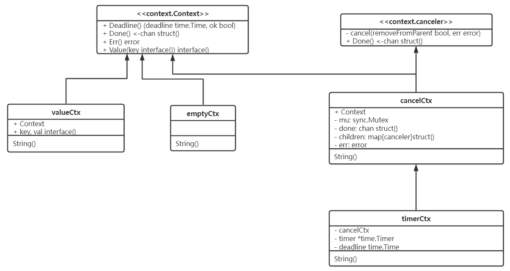
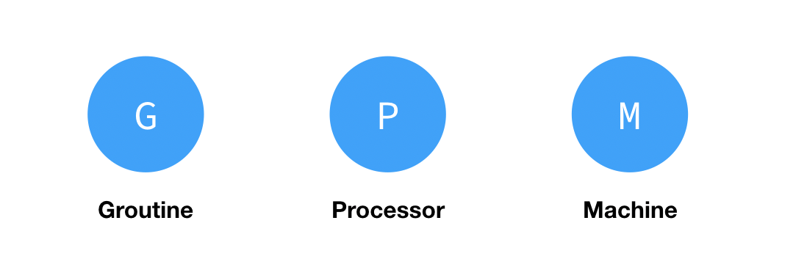

# 1. concurrency

## 1.1. 并发编程概念是什么

并发是同一实体上的多个事件在同一时间间隔发生.

并发编程是指在一台处理器上同时处理多个任务. 并发编程的目标是充分的利用处理器的每一个核,以达到最高的处理性能.

### 1.1.1. 并发和并行的区别是什么

1. 并发是在同一实体上的多个事件, 并行是在不同实体上的多个事件
1. 并发是多个事件在同一时间间隔发生, 并行是多个事件在同一时刻发生;
1. 并发是一台处理器上同时处理多个任务,并行是在多台处理器上同时处理多个任务.

## 1.2. golang中除了加Mutex锁以外还有哪些方式安全读写共享变量

### 1.2.1. mutext加锁 安全读写共享变量

```go
var (
 mu      sync.Mutex
 balance int
)

func Balance() int {
 mu.Lock()
 defer mu.Unlock()
 return balance
}

```

### 1.2.2. goroutine 安全读写共享变量

```go
var deposits = make(chan int) // send amout to deposit
var balances = make(chan int) // receive balance
// Deposit 存款
func Deposit(amount int) { deposits <- amount }

// Balance 余额
func Balance() int { return <-balances }

// 出纳员
func teller() {
 var balance int // balance is confined to teller goroutine
 for {
  select {
  case amount := <-deposits:
   balance += amount
  case balances <- balance:
  }
 }
}

func init() {
 go teller() // start the monitor goroutine
}
```

## 1.3. golang中常用的并发模型

### 1.3.1. 通过channel通知实现并发控制

无缓冲通道(同步通道)指的是通道的大小为0,这种类型的通道在接收前没有能力保存任何值,它要求发送 goroutine 和接收 goroutine 同时准备好,才可以完成发送和接收操作.如果没有同时准备好的话,先执行的操作就会阻塞等待,直到另一个相对应的操作准备好为止.这种无缓冲的通道我们也称之为同步通道.

```go
func main() {
    ch := make(chan struct{})
    go func() {
        fmt.Println("start working")
        time.Sleep(time.Second * 1)
        ch <- struct{}{}
    }()
    <-ch
    fmt.Println("finished")
}
// 当主 goroutine 运行到 <-ch 接受 channel 的值的时候,如果该 channel 中没有数据,就会一直阻塞等待,直到有值. 这样就可以简单实现并发控制
```

### 1.3.2. 通过sync包中的WaitGroup实现并发控制

goroutine是异步执行的,为了防止在结束main函数的时候结束掉goroutine,所以需要同步等待,这个时候就需要用 WaitGroup了,在 sync 包中,提供了 WaitGroup,它会等待它收集的所有 goroutine 任务全部完成.

#### 1.3.2.1. 在WaitGroup里主要有三个方法

Add, 可以添加goroutine的数量.
Done, 相当于Add(-1).
Wait, 执行后会堵塞主线程,直到WaitGroup 里的值减至0.

```go
func main(){
 wg := sync.WaitGroup{}
    for i := 0; i < 5; i++ {
        wg.Add(1)
        go func(wg sync.WaitGroup, i int) {
            fmt.Printf("i:%d", i)
            wg.Done()
        }(wg, i)
    }
    wg.Wait()
    fmt.Println("exit")
}
```

### 1.3.3. 上下文Context实现并发控制

context 包主要是用来处理多个 goroutine 之间共享数据,及多个 goroutine 的管理.

## 1.4. context 是什么

context 主要用来在 goroutine 之间传递上下文信息, 用于控制goroutine的生命周期, 也常用于并发控制和超时控制

```go
type Context interface {  
    Deadline() (deadline time.Time, ok bool)
    Done() <-chan struct{}        
    Err() error 
    Value(key interface{}) interface{}
}
// Deadline会返回一个超时时间,routine获得了超时时间后,可以对某些io操作设定超时时间.
// Done会返回一个channel,当该context被取消的时候,该channel会被关闭,同时对应的使用该context的routine也应该结束并返回.
// Value可以让routine共享一些数据,当然获得数据是协程安全的.
// Context中的方法是协程安全的,这也就代表了在父routine中创建的context,可以传递给任意数量的routine并让他们同时访问.

```

## 1.5. context 使用场景及注意事项

context 用于控制 goroutine 的生命周期.当一个计算任务被 goroutine 承接了之后,由于某种原因(超时,或者强制退出)我们希望中止这个 goroutine 的计算任务,那么就用得到这个 Context 了.

context 有 cancelCtx, timerCtx, valueCtx. 它们分别是用来通知取消, 通知超时, 存储 key-value 值.

  

### 1.5.1. context 的 注意事项如下

context 的 Done() 方法往往需要配合 select {} 使用,以监听退出.尽量通过函数参数来暴露 context,不要在自定义结构体里包含它. WithValue 类型的 context 应该尽量存储一些全局的 data,而不要存储一些可有可无的局部 data. context 是并发安全的.一旦context 执行取消动作,所有派生的 context 都会触发取消.

## 1.6. context 使用场景

### 1.6.1. RPC调用

在主goroutine上有4个RPC,RPC2/3/4是并行请求的,我们这里希望在RPC2请求失败之后,直接返回错误,并且让RPC3/4停止继续计算.这个时候,就使用的到Context.使用了waitGroup来保证main函数在所有RPC调用完成之后才退出.当主goroutine想要告诉所有goroutine要结束的时候,通过cancel函数把结束的信息告诉给所有的goroutine.所有的goroutine都需要内置处理这个听声器结束信号的逻辑(ctx->Done())

```go

package main
import (
    "context"
    "sync"
    "github.com/pkg/errors"
)

func Rpc(ctx context.Context, url string) error {
    result: = make(chan int)
    err: = make(chan error)

        go func() {
        // 进行RPC调用,并且返回是否成功,成功通过result传递成功信息,错误通过error传递错误信息
        isSuccess: = true
        if isSuccess {
            result < -1
        } else {
            err < -errors.New("some error happen")
        }
    }()

        select {
        case <-ctx.Done():
            // 其他RPC调用调用失败
            return ctx.Err()
        case e:
            = < -err:
                // 本RPC调用失败,返回错误信息
                return e
        case <-result:
            // 本RPC调用成功,不返回错误信息
            return nil
    }
}


func main() {
    ctx, cancel: = context.WithCancel(context.Background())

    // RPC1调用
    err: = Rpc(ctx, "http://rpc_1_url")
    if err != nil {
        return
    }

    wg: = sync.WaitGroup {}

    // RPC2调用
    wg.Add(1)
    go func() {
        defer wg.Done()
        err: = Rpc(ctx, "http://rpc_2_url")
        if err != nil {
            cancel()
        }
    }()

    // RPC3调用
    wg.Add(1)
    go func() {
        defer wg.Done()
        err: = Rpc(ctx, "http://rpc_3_url")
        if err != nil {
            cancel()
        }
    }()

    // RPC4调用
    wg.Add(1)
    go func() {
        defer wg.Done()
        err: = Rpc(ctx, "http://rpc_4_url")
        if err != nil {
            cancel()
        }
    }()

    wg.Wait()
}

```

### 1.6.2. 超时请求 (context.WithTimeout)

发送RPC请求的时候,都会对这个请求进行一个超时的限制, 超时会自动断开.

```go
func main() {
    ctx, cancel := context.WithTimeout(context.Background(), 50*time.Millisecond)
    defer cancel()

    select {
    case <-time.After(1 * time.Second):
        fmt.Println("overslept")
    case <-ctx.Done():
        fmt.Println(ctx.Err()) // prints "context deadline exceeded"
    }
}

// 客户端 http 请求
func main() {
 uri := "https://httpbin.org/delay/3"
 req, err := http.NewRequest("GET", uri, nil)
 if err != nil {
  log.Fatalf("http.NewRequest() failed with '%s'\n", err)
 }

 ctx, _ := context.WithTimeout(context.Background(), time.Millisecond*100)
 req = req.WithContext(ctx)

 resp, err := http.DefaultClient.Do(req)
 if err != nil {
  log.Fatalf("http.DefaultClient.Do() failed with:\n'%s'\n", err)
 }
 defer resp.Body.Close()

}

```

### 1.6.3. HTTP服务器的request互相传递数据

valueCtx最经常使用的场景就是在一个http服务器中,在request中传递一个特定值,比如有一个中间件,做权限验证,然后把验证后的用户名存放在request中.

```go

type FooKey string

var UserName = FooKey("user-name")
var UserId = FooKey("user-id")

func foo(next http.HandlerFunc) http.HandlerFunc {
 return func(w http.ResponseWriter, r *http.Request) {
  ctx := context.WithValue(r.Context(), UserId, "1")
  ctx2 := context.WithValue(ctx, UserName, "yejianfeng")
  next(w, r.WithContext(ctx2))
 }
}

func GetUserName(context context.Context) string {
 if ret, ok := context.Value(UserName).(string); ok {
  return ret
 }
 return ""
}

func GetUserId(context context.Context) string {
 if ret, ok := context.Value(UserId).(string); ok {
  return ret
 }
 return ""
}

func test(w http.ResponseWriter, r *http.Request) {
 w.Write([]byte("welcome: "))
 w.Write([]byte(GetUserId(r.Context())))
 w.Write([]byte(" "))
 w.Write([]byte(GetUserName(r.Context())))
}

func main() {
 http.Handle("/", foo(test))
 http.ListenAndServe(":8080", nil)
}
```

## 1.7. 协程和线程和进程的区别

1. 进程是CPU资源分配的基本单位,进程拥有自己的资源空间,一个进程包含若干个线程
1. 线程是独立运行和独立调度的基本单位, 线程与CPU资源分配无关,多个线程共享同一进程内的资源.线程的调度与切换比进程快很多.
1. 协程是一种用户态的轻量级线程,协程拥有自己的寄存器上下文和栈.

## 1.8. 什么是 GMP? 调度过程是什么样的?

go 语言天然支持高并发,可以在一个进程中启动成千上万个协程.

### 1.8.1. go 语言的并发模型 CSP

CSP(通信顺序过程 Communicating Sequential Processes),是基于通道传递消息的理论,以通信的方式来共享内存, 它的核心观念是将两个并发执行的实体通过通道 channel 连接起来,所有的消息都通过 channel 传输.

### 1.8.2. go 语言对 CSP 并发模型的实现: GPM 调度模型

GPM 代表了三个角色,分别是 goroutine,Processor,Machine.


1. G (协程:goroutine): go 协程,每个 go 关键字都会创建一个协程. `go func() {}()`
1. M(thread):内核级线程,所有的 G 都要放在 M 上才能运行.
1. P (processor): 逻辑处理器,它的主要用途就是用来执行goroutine的,所以它也维护了一个goroutine队列,里面存储了所有需要它来执行的goroutine.

### 1.8.3. go 调度器调度过程

线程是运行 Goroutine 的实体，调度器的功能是把可运行的 Goroutine 分配到工作线程上。Goroutine 调度器和 OS 调度器是通过 M 结合起来的，每个 M 都代表了 1 个内核线程，OS 调度器负责把内核线程分配到 CPU 的核上执行。

新创建的goroutine会先存放在Global全局队列中,等待go调度器进行调度,随后goroutine被分配给其中的一个逻辑处理器P,并放到这个逻辑处理器对应的Local本地运行队列中,最终等待被逻辑处理器P执行即可.

在M与P绑定后,M会不断从P的Local队列中无锁地取出G,并切换到G的堆栈执行,当P的Local队列中没有G时,再从Global队列中获取一个G,当Global队列中也没有待运行的G时,则尝试从其它的P窃取部分G来执行相当于P之间的负载均衡.

## 1.9. GMP 的数量问题?

### 1.9.1. P 的数量问题

默认是 CPU 核心数,由启动时环境变量 goMAXPROCS 或者是由runtime.goMAXPROCS()决定

### 1.9.2. M 的数量问题

1. go 语⾔本身是限定 M 的最⼤量是 10000
1. runtime/debug 包中的 SetMaxThreads 函数来设置, `debug.SetMaxThreads()` 方法可以让我们修改最大线程数值.
1. 有⼀个 M 阻塞,会创建⼀个新的 M
1. 如果有 M 空闲,那么就会回收或者等待

### 1.9.3. G 的数量问题

#### 1.9.3.1. 怎么查看goroutine的数量

Numgoroutine可以查看goroutine的数量.

```go
func main() {
// Numgoroutine返回当前存在的goroutine数量.
fmt.Println(runtime.NumGoroutine())

//goMAXPROCS设置可以执行的cpu的最大数量
 fmt.Println(runtime.GOMAXPROCS(10)) 
}
```

#### 1.9.3.2. 怎么限制goroutine的数量

可以使用 channel+WaitGroup 限制goroutine的数量

```go
var wg = sync.WaitGroup{}
ch := make(chan bool, 4)

for i := 0; i < 10; i++ {
    wg.Add(1)
    ch <- true
    go func(j int) {
        fmt.Printf("j %d \n", j)
        <-ch
        wg.Done()
    }(i)
}
wg.Wait()
```

## 1.10. 通道(channel)

channel 是 goroutine 之间的通信队列,可以使用 channel 在多个 goroutine 之间传递信息

go的设计思想是: 不要通过共享内存来通信(加锁), 而是通过通信来共享内存(channel), 设计channel的主要目的就是在多任务间传递数据的,本身就是安全的.

### 1.10.1. 通道分为无缓存通道和有缓存通道

1. 无缓冲通道没有缓冲, 发送和接收需要同步.发送阻塞直到数据被接收,接收阻塞数据直到数据被读取.
1. 有缓冲通道不要求发送和接收操作同步.当缓冲满时发送阻塞,当缓冲空时接收阻塞.

```go
// 无缓冲通道
func main() {
 ch := make(chan int)
 // 接收者
 go func() {
  v := <-ch // 这里阻塞
  fmt.Println("收到：", v)
 }()

 // 发送者
 ch <- 1
 fmt.Println("发送：", 1)
}

// 有缓冲通道
func main() {
 ch := make(chan int, 1)
 // 发送者
 ch <- 1
 fmt.Println("发送：", 1)

 // 接收者
 go func() {
  v := <-ch // 这里阻塞
  fmt.Println("收到：", v)
 }()
}

```

### 1.10.2. 通道的关闭

close函数关闭channel, 关闭channel后, 无法向channel再发送数据,可以继续从channel接收数据, 对于nil channel,无论收发都会被阻塞.

```go
func main() {
 chan1 := make(chan int, 5)
 chan1 <- 1
 close(chan1)
 for {
  _, ok := <-chan1
//   如果 ok 的值为 false,则表示 ch 已经被关闭.
  fmt.Println(ok)
  if !ok {
   fmt.Println("channel closed!")
   break
  }
 }
}
```

### 1.10.3. 超时处理

```go
ch := make(chan int)
// 首先实现并执行一个匿名的超时等待函数
timeout := make(chan bool, 1)
go func() {
    time.Sleep(1e9) // 等待 1 秒
    timeout <- true
}()
// 然后把 timeout 这个 channel 利用起来
select {
case <-ch:
    // 从 ch 中读取到数据
case <- timeout:
    // 一直没有从 ch 中读取到数据,但从 timeout 中读取到了数据
    fmt.Println("Timeout occurred.")
}
// Timeout occurred.
```

## 1.11. go channel为什么是安全的?

channel 发送和接收数据都是原子性的. channel内部维护了一个互斥锁,来保证线程安全

## 1.12. 对已经关闭的的 chan 进行读写,会怎么样?为什么?

1. 读已经关闭的 chan, 如果 chan 关闭前,buffer 内有未读数据, 会读取 chan 内的值,且返回的第二个 bool 值(是否读成功)为 true.
1. 读已经关闭的 chan, 如果 chan 关闭前,buffer 内无未读数据, 所有接收的值都会非阻塞直接成功,返回 channel 元素的零值,但是第二个 bool 值一直为 false.

    ```go
    func main() {
        c := make(chan int, 3)
        c <- 1
        close(c)
        num, ok := <-c
        fmt.Printf("第一次读取chan的协程,num=%v, ok=%v\n", num, ok)
        num1, ok1 := <-c
        fmt.Printf("第二次读取chan的协程,num=%v, ok=%v\n", num1, ok1)
        num2, ok2 := <-c
        fmt.Printf("第三次读取chan的协程,num=%v, ok=%v\n", num2, ok2)
    }

    // 第一次读取chan的协程,num=1, ok=true
    // 第二次读取chan的协程,num=0, ok=false
    // 第三次读取chan的协程,num=0, ok=false
    ```

1. 写已经关闭的 chan 会 panic

    ```go
    func main() {
        c := make(chan int, 3)
        close(c)
        c <- 1
    }
    ```

## 1.13. 等待组 WaitGroup

WaitGroup 主要用于同步多个协程间的状态, 例如等待所有协程都执行完.在 WaitGroup 对象实现中,内部有一个计数器,最初从 0 开始,它有三个方法:

1. Add():计数器加一
1. Done():计数器减一
1. Wait():等待计数器清零. 执行Wait 方法的函数在等待组内部计数器不为 0 的时候会阻塞,一旦计数器为 0 了,程序就会继续往下执行.

```go
func main() {
    wg := sync.WaitGroup{}
    num := 10
    wg.Add(num)
    for i := 0; i < num; i++ {
        go func(i int) {
            fmt.Println(i)
            wg.Done()
        }(i)
    }
    wg.Wait()
}
```

## 1.14. sync.Once 与 init() 区别

1. sync.Once是在代码运行中需要的时候执行,且只执行一次.
1. init函数是在文件包首次被加载的时候执行,且只执行一次.
1. 可以使用sync.Once实现单例模式

```go
package main

import (
 "fmt"
 "sync"
 "time"
)

func main() {
 var once sync.Once
 for i := 0; i < 10; i++ {
  go func() {
   once.Do(read)
  }()
 }
 time.Sleep(time.Second)
}

func read() {
 fmt.Println(1)
}
// output:
//  1
```

## 1.15. golang并发,选channel还是选锁

channel是设计在语言特性中的,并发问题优先使用通道, 如果通过通道解决不了的, 必须使用共享内存来实现并发的,才考虑锁机制

1. channel的能力是让数据流动起来,擅长的是数据流动的场景 e.g. 传递数据的所有权,即把某个数据发送给其他协程
1. mutex的能力是数据保持不变,某段时间只给一个协程访问数据的权限, 擅长数据位置固定的场景 e.g. 缓存

## 1.16. golang 的锁机制

golang 中的有两种锁, 为互斥锁 sync.Mutex 和读写锁 sync.RWMutex. 两者都是悲观锁

### 1.16.1. 互斥锁和读写锁区别

1. 互斥锁(Mutex): 用于保证在任何时刻, 都只能有一个线程访问该对象.当获取锁操作失败时,线程会进入等待,等待锁释放时被唤醒.
1. 读写锁(RWMutex): 分为读锁和写锁.处于读操作时,可以允许多个线程同时获得读操作. 但是同一时刻只能有一个线程可以获得写锁.其它获取写锁失败的线程都会进入等待状态,直到写锁释放时被唤醒. 注意:写锁会阻塞其它读写锁.当有一个线程获得写锁时,读锁不能被其它线程获取; 写锁优先于读锁, 一旦有写锁, 则后续读锁必须等待,唤醒时优先考虑写锁.

### 1.16.2. 互斥锁

互斥锁是传统的并发程序对共享资源进行访问控制的方法, 使用互斥锁是为了来保护一个资源不会因为并发操作而引起冲突导致数据异常. 加上 Mutex 互斥锁,要求同一时刻,仅能有一个协程对数据操作.

```go
// 没有互斥锁之前, 三个协程在执行时,先读取 count 再更新 count 的值,而这个过程并不具备原子性,
// 所以导致了数据的不准确.解决这个问题的方法,就是给 add 这个函数加上 Mutex 互斥锁,要求同一时
// 刻,仅能有一个协程能对 count 操作. 
import (
    "fmt"
    "sync"
)

func add(count *int, wg *sync.WaitGroup, lock *sync.Mutex) {
    for i := 0; i < 1000; i++ {
        lock.Lock()
        *count = *count + 1
        lock.Unlock()
    }
    wg.Done()
}

func main() {
    var wg sync.WaitGroup
    lock := &sync.Mutex{}
    count := 0
    wg.Add(3)
    go add(&count, &wg, lock)
    go add(&count, &wg, lock)
    go add(&count, &wg, lock)

    wg.Wait()
    fmt.Println("count 的值为:", count)
}


```

#### 1.16.2.1. 注意事项

1. 同一协程里,不要在尚未解锁时再次使加锁
1. 同一协程里,不要对已解锁的锁再次解锁
1. 加了锁后,别忘了解锁,必要时使用 defer 语句

### 1.16.3. 读写锁

读写锁是分别针对读操作和写操作进行锁定和解锁操作的互斥锁, 适用于读多于写少的场景

1. 读锁:调用 RLock 方法开启锁,调用 RUnlock 释放锁
1. 写锁:调用 Lock 方法开启锁,调用 Unlock 释放锁(和 Mutex类似)

#### 1.16.3.1. 基本原则: 读写互斥

1. 写锁定情况下，对读写锁进行读锁定或者写锁定，都将阻塞；
1. 读锁定情况下，对读写锁进行写锁定，将阻塞；加读锁时不会阻塞, 支持多个并发读操作

```go
package main

import (
    "fmt"
    "sync"
    "time"
)
func main() {
    lock := &sync.RWMutex{}
    lock.Lock()

    for i := 0; i < 4; i++ {
        go func(i int) {
            fmt.Printf("第 %d 个协程准备开始... \n", i)
            lock.RLock()
            fmt.Printf("第 %d 个协程获得读锁, sleep 1s 后,释放锁\n", i)
            time.Sleep(time.Second)
            lock.RUnlock()
        }(i)
    }

    time.Sleep(time.Second * 2)

    fmt.Println("准备释放写锁,读锁不再阻塞")
    // 写锁一释放,读锁就自由了
    lock.Unlock()

    // 由于会等到读锁全部释放,才能获得写锁
    // 因为这里一定会在上面 4 个协程全部完成才能往下走
    lock.Lock()
    fmt.Println("程序退出...")
    lock.Unlock()
}

// 第 1 个协程准备开始...
// 第 0 个协程准备开始...
// 第 3 个协程准备开始...
// 第 2 个协程准备开始...
// 准备释放写锁,读锁不再阻塞
// 第 2 个协程获得读锁, sleep 1s 后,释放锁
// 第 3 个协程获得读锁, sleep 1s 后,释放锁
// 第 1 个协程获得读锁, sleep 1s 后,释放锁
// 第 0 个协程获得读锁, sleep 1s 后,释放锁
// 程序退出...

```

## 1.17. 乐观锁和悲观锁

乐观锁和悲观锁是两种思想,用于解决并发场景下的数据竞争问题.

### 1.17.1. 乐观锁

对于同一个数据的并发操作, 乐观锁认为自己在使用数据时不会有别的线程修改数据,所以不会添加锁,只是在更新数据的时候去判断之前有没有别的线程更新了这个数据. 乐观锁适用于读多写少的应用场景,这样可以提高吞吐量.

### 1.17.2. 悲观锁

对于同一个数据的并发操作,悲观锁认为自己在使用数据的时候一定有别的线程来修改数据,因此在获取数据的时候会先加锁,确保数据不会被别的线程修改

## 1.18. 在go函数中为什么会发生内存泄露(goroutine泄露)

go的并发是以goroutine和channel的形式实现的, goroutine需要维护执行用户代码的上下文信息.在运行过程中需要消耗一定的内存来保存这类信息. 因此,如果一个程序持续不断地产生新的 goroutine,且不结束已经创建的 goroutine,最终导致会内存耗尽,程序崩溃. 可以借助 pprof 排查

```go
func main() {
 for i := 0; i < 10000; i++ {
  go func() {
   select {}
  }()
 }
}
```

## 1.19. select 可以用于什么?

select 用来监听和 channel 有关的 IO 操作，当 IO 操作发生时，触发相应的动作, select 只能应用于 channel 的操作, 可以用于监听 channel 的数据接收和发送.

如果 select 的多个分支都满足条件,则会随机的选取一个满足条件的分支执行. 否则执行default的逻辑.

```go
select {
    // 如果 chan1 成功读到数据,则进行该 case 处理语句
 case <- chan1:
  // 如果成功向 chan2 写入数据,则进行该 case 处理语句
 case chan2 <- 1:
  // 如果上面都没有成功,则进入default处理流程
 default:
}
```

## 1.20. goroutine的优雅退出

### 1.20.1. 使用 for-range 退出

range能够感知channel的关闭,当channel被发送数据的协程关闭时,range就会结束,接着退出for循环.

```go
go func(in <-chan int) {
    for x := range in {
        fmt.Printf("Process %d\n", x)
    }
}(in)
```

### 1.20.2. 使用select case ,ok退出

当读取数据的通道关闭时, 没有数据读取时程序会退出

#### 1.20.2.1. 某个通道关闭后, 无需处理其他case, return退出协程

```go
go func() {
    // in for-select using ok to exit goroutine
    for {
        select {
            case x, ok := <-in:
                if !ok {
                    return
                }
                fmt.Printf("Process %d\n", x)
                processedCnt++
            case <-t.C:
                fmt.Printf("Working, processedCnt = %d\n", processedCnt)
        }
    }
}()
```

#### 1.20.2.2. 某个通道关闭后, 需要等待处理其他case, 已关闭的通道设置为nil

select的特性: 不会在nil的通道上进行等待. 可以把只读通道设置为nil

```go
go func() {
 // in for-select using ok to exit goroutine
 for {
  select {
  case x, ok := <-in1:
   if !ok {
    in1 = nil
   }
   // Process
  case y, ok := <-in2:
   if !ok {
    in2 = nil
   }
   // Process
  case <-t.C:
   fmt.Printf("Working, processedCnt = %d\n", processedCnt)
  }

  // If both in channel are closed, goroutine exit
  if in1 == nil && in2 == nil {
   return
  }
 }
}()
```

### 1.20.3. 使用退出通道退出

```go
func worker(stopCh <-chan struct{}) {
    go func() {
        defer fmt.Println("worker exit")
        // Using stop channel explicit exit
        for {
            select {
            case <-stopCh:
                fmt.Println("Recv stop signal")
                return
            case <-t.C:
                fmt.Println("Working .")
            }
        }
    }()
    return
}

```

### 1.20.4. 总结

1. 发送协程主动关闭通道,接收协程不关闭通道.技巧:把接收方的通道入参声明为只读,如果接收协程关闭只读协程,编译时就会报错.
1. 协程处理1个通道,并且是读时,协程优先使用for-range,因为range可以关闭通道,自动退出协程.
1. ,ok可以处理多个读通道关闭,需要关闭当前使用for-select的协程.

## 1.21. 如何让所有子协程执行完后再执行主协程

子协程不会执行

```go
func main() {
    // 子协程
 go func() {
    fmt.Println("son goroutine......")
 }()
    // 主协程
    fmt.Println("main goroutine....")
}
```

### 1.21.1. channel 实现同步

```go
package main

import (
    "fmt"
)

func printString(str string) {
    for _, data: = range str {
        fmt.Printf("%c", data)
    }
    fmt.Printf("\n")
}

var ch = make(chan int)
var tongBu = make(chan int)

func person1() {
    printString("Gerald")
    tongBu < -1
    ch < -1
}

func person2() { 
    < -tongBu
    printString("Seligman")
    ch < -2
}

func main() {
    // 目的:使用 channel 来实现 person1 先于 person2 执行
    go person1()
    go person2()
    count: = 2

    // 判断所有协程是否退出
    for range ch {
        count--
        if 0 == count {
            close(ch)
        }
    }
}

// count 表示有多少个协程
// ch 用来子协程与主协程之间的同步
// tongBu 用来两个协程之间的同步
// 主协程阻塞等待数据,每当一个子协程执行完后,就会往 ch 里面写一个数据,主协程收到后会使 count–,
// 当 count 减为 0,关闭 ch,主协程将不阻塞在 range ch.
```

### 1.21.2. sync.WaitGroup 实现等待

sync.WaitGroup 内部是实现了一个计数器,它有三个方法

1. Add() 用来设置一个计数
1. Done() 用来在操作结束时调用,使计数减 1
1. Wait() 用来等待所有的操作结束,即计数变为 0.

```go
package main

import (
   "fmt"
   "sync"
)

func printString(str string) {
   for _, data := range str {
      fmt.Printf("%c", data)
   }
   fmt.Printf("\n")
}

// 使用 sync.WaitGroup 的方式来实现主协程等待其他子协程
var wg sync.WaitGroup

var tongBu = make(chan int)

func person1() {
   printString("Gerald")
   tongBu <- 1

   wg.Done()
}

func person2() {
   <- tongBu
   printString("Seligman")

   wg.Done()
}

func main() {
   wg.Add(2)
   // 目的:使用 channel 来实现 person1 先于 person2 执行
   go person1()
   go person2()
   defer close(tongBu)
   wg.Wait()
}
```

## 1.22. 知道哪些 sync 同步原语?各有什么作用?

sync 包中提供了用于同步的一些基本原语,包括常见的互斥锁 Mutex 与读写互斥锁 RWMutex 以及 Once,WaitGroup.

> 原语,一般是指由若干条指令组成的程序段,用来实现某个特定功能,在执行过程中不可被中断
