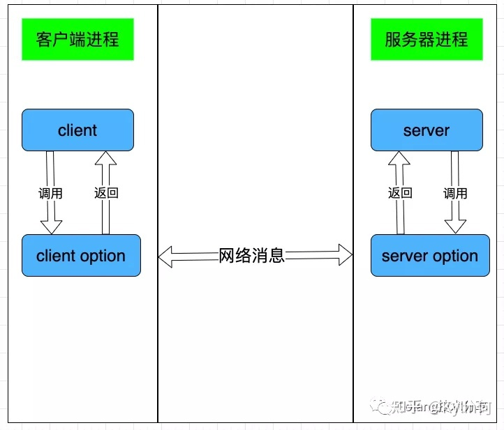

# 1. grpc

## 1.1. 定义

gRPC 是一个由 google 开源的高性能、通用RPC远程服务调用框架，基于 ProtoBuf(Protocol Buffers) 序列化协议开发

## 1.2. 为什么选择 grpc

1. protobuf是二进制消息，性能好/效率高
1. 通过在服务器和客户端之间共享 .proto 文件，可以端到端生成消息和客户端代码。 节约开发时间。并且有严格的规范。
1. 基于HTTP/2，与 HTTP 1.x 相比，HTTP/2 具有巨大性能优势。
1. 支持流式处理
1. 截止时间/超时和取消, gRPC 允许客户端指定其愿意等待 RPC 完成的时间期限。

## 1.3. rpc 架构

一个完整的 RPC 架构里面包含了四个核心的组件,分别是 Client,Server,ClientOptions以及 ServerOptions,这个 Options 就是 RPC 需要设计实现的东西.



1. 客户端(Client):服务的调用方.
1. 服务端(Server):真正的服务提供方.
1. 客户端存根(ClientOption):socket 管理,网络收发包的序列化.
1. 服务端存根(ServerOption):socket管理,提醒 server 层 rpc 方法调用,以及网络收发包的序列化.

## 1.4. gRPC 有哪些类型

RPC 调用通常根据双端是否流式交互,分为了单项 RPC,服务端流式 RPC,客户端流式 RPC,双向流 PRC 四种方式

### 1.4.1. 单项 RPC

客户端传入一个请求对象，服务端返回一个结果对象

### 1.4.2. 服务端流式 RPC

客户端发起一个请求到服务端，服务端返回一段连续的数据流响应

### 1.4.3. 客户端流式 RPC

客户端连续发送数据流，服务端返回一个响应；

### 1.4.4. 双向流 RPC

客户端和服务端可同时向对方发送数据流，同时也可以接收数据

## 1.5. protocolBuffer

protocolBuffer 是Google出品的序列化工具, 采用了二进制字节的序列化方式, 特别适合对数据大小和传输速率比较敏感的场合使用。

### 1.5.1. 使用步骤

#### 1.5.1.1. 定义.proto文件

```go
// proto文件 messages.proto
package zxwj;
syntax = "proto3";
message helloworld
{
   string zzuid = 123;  
   string zzstatus = 0;
}
```

#### 1.5.1.2. 编译.proto文件

使用protobuf.js命令行工具编译
`protoc --js_out=import_style=commonjs,binary:. messages.proto`

#### 1.5.1.3. code

```go
package main

import (
    "fmt"
    "log"
    "github.com/golang/protobuf/proto"
)

func main() {

    elliot := &Person{
        Name: "Elliot",
        Age:  24,
    }

    data, err := proto.Marshal(elliot)
    if err != nil {
        log.Fatal("marshaling error: ", err)
    }

    fmt.Println(data)

    newElliot := &Person{}
    err = proto.Unmarshal(data, newElliot)
    if err != nil {
        log.Fatal("unmarshaling error: ", err)
  }

}

```
