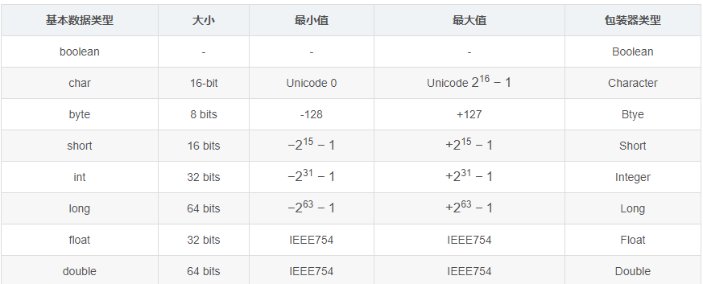
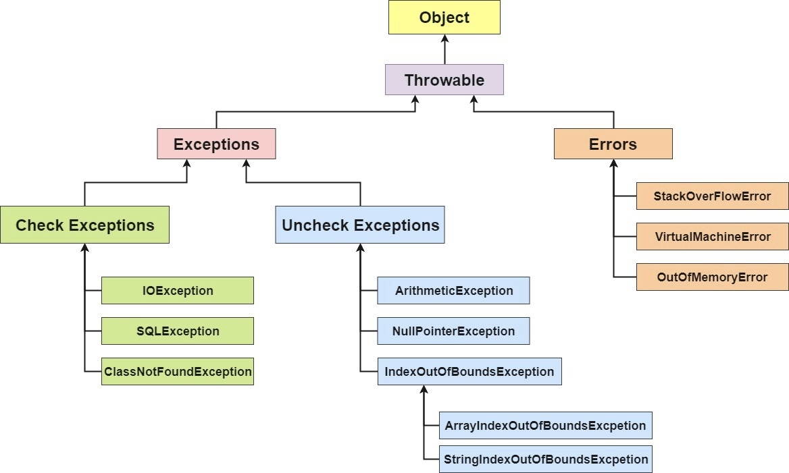
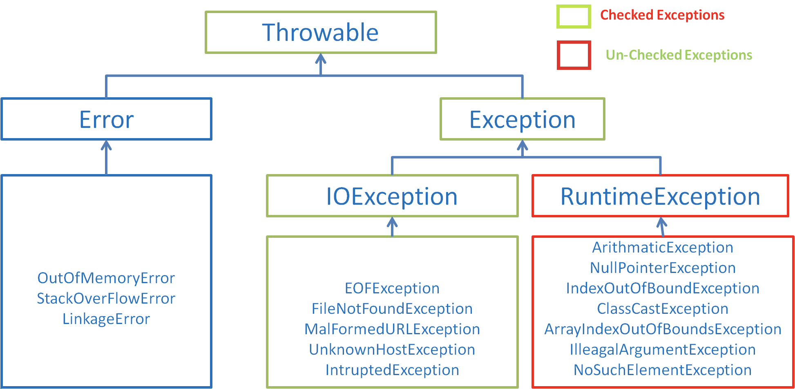
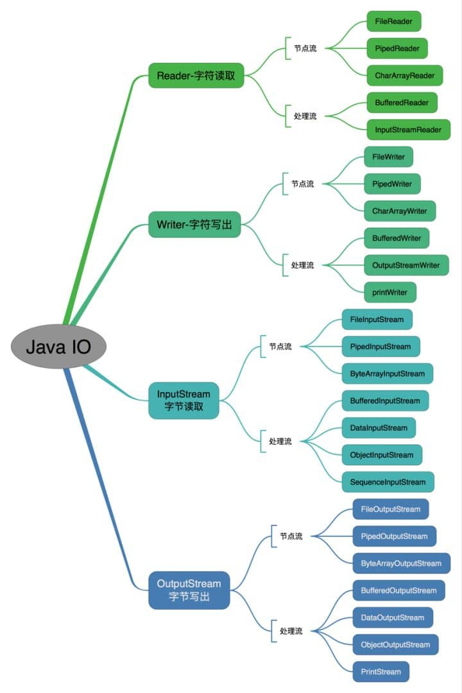
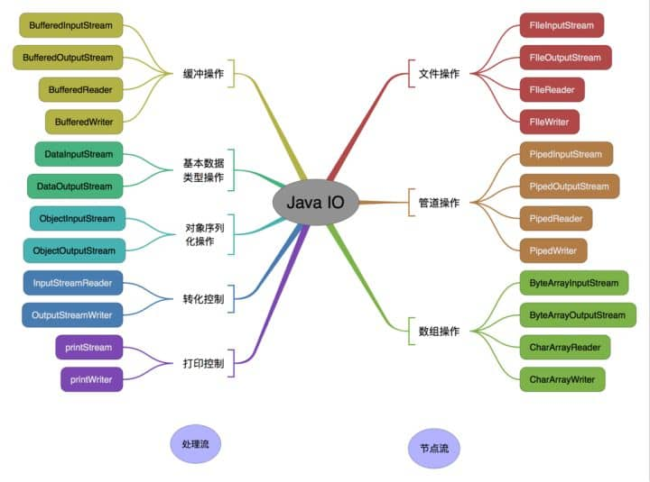
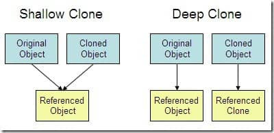

<!-- ---
sidebar: false
--- 
 -->
# 1. Java 基础

## 1.1. 面向对象和面向过程的区别

1. 面向过程

   面向过程性能比面向对象高.类调用时需要实例化, 开销比较大, 比较消耗资源, 所以当
   性能是最重要的考量因素的时候, 比如单片机, 嵌入式开发, Linux/Unix 等一般采用面
   向过程开发.

1. 面向对象

   面向对象易维护, 易复用, 易扩展.因为面向对象有封装, 继承, 多态性的特性, 所以可
   以设计出低耦合的系统, 使系统更加灵活, 更加易于维护.

## 1.2. Java 语言有哪些特点?

1. 简单易学;
2. 面向对象 (封装, 继承, 多态);
3. 平台无关性 ( Java 虚拟机实现平台无关性);
4. 可靠性;
5. 安全性;
6. 支持多线程
7. 支持网络编程并且很方便
8. 编译与解释并存;

## 1.3. Java 虚拟机 (JVM)

JVM 是运行 Java 字节码的虚拟机 .JVM 针对不同操作系统 (Windows, Linux, macOS) 有
特定的实现, 目的是使用相同的字节码, 它们都会给出相同的结果.

### 1.3.1. 什么是字节码?采用字节码的好处是什么?

JVM 可以理解的代码就叫做字节码 (即扩展名为 .class 的文件)

Java 语言通过字节码的方式, 在一定程度上解决了传统解释型语言执行效率低的问题, 同
时又保留了解释型语言可移植的特点.所以 Java 程序运行时比较高效, 而且, 由于字节码
并不针对一种特定的机器, 因此, Java 程序无须重新编译便可在多种不同操作系统的计算
机上运行.

## 1.4. JDK 和 JRE

JDK (Java Development Kit) , 它是功能齐全的 Java SDK.它拥有 JRE 所拥有的一切, 还
有编译器 (javac) 和工具 (如 javadoc 和 jdb). 它能够创建和编译程序.

JRE (Java Runtime Environment, Java 运行时环境), JRE 可以让计算机系统运行 Java
应用程序, 包括 Java 虚拟机 (JVM), Java 类库, java 命令和其他的一些基础构件.但是,
它不能用于创建新程序.

## 1.5. 字符型常量 (char) 和字符串常量 (string) 的区别?

1. 形式上:

   字符常量是单引号引起的一个字符; 字符串常量是双引号引起的若干个字符

2. 含义上:

   字符常量相当于一个整型值 ( ASCII 值), 可以参加表达式运算; 字符串常量代表一个
   地址值 (该字符串在内存中存放位置)

3. 占内存大小

   字符常量只占 2 个字节; 字符串常量占若干个字节

## 1.6. String 创建对象问题

### 1.6.1. 字符串常量池

jvm 针对字符串存储的一个特定内存区域.且里面内容都具有唯一性

### 1.6.2. 创建对象单个说明

1. String s = "abc" 在创建这个对象时, 会在常量池中看有没有 abc 这个字符串; 如果
   没有, 则会在常量池中创建一个; 如果有则不创建.
1. String s1 = "a" +"b"+"c" 在字符串常量相加时, 编译器编译时产生的字节码, 会把如
   "a" +"b"+"c" 优化为 "abc".所以只会产生一个对象
1. String s = new String ("abc"); 在创建这个对象时因为使用了 new 关键字, 所以肯
   定会在堆中创建一个对象.然后会在常量池中看有没有 abc 这个字符串; 如果没有 此时
   还会在常量池中创建一个; 如果有 则不创建.所以一共会产生两个对象
1. String s = "abc"; String s1= s + "ab"; 在变量与常量进行相加时, '+'可以理解:为
   利用加号进行拼接字符串.
   - 在底层内部中会生成新的 StringBuilder 对象, 调用 SringBuilder 中的 append 方
     法进行拼接, new StringBuilder.append(s).append("ab");
   - 拼接完成之后会调用 StringBuilder.toString()方法返回一个 String 的对象
     "abcab". new StringBuilder.append(s).append("ab").toString();

## 1.7. 构造器 Constructor 是否可被 override?

Constructor 不能被 override(重写), 但是可以 overload(重载), 所以可以看到一个类中
有多个构造函数的情况.

## 1.8. 重载和重写的区别

### 1.8.1. 重载

发生在同一个类中, 方法名必须相同, 参数类型不同, 个数不同, 顺序不同, 方法返回值和
访问修饰符可以不同.

### 1.8.2. 重写

重写发生在运行期, 是子类对父类的允许访问的方法的实现过程进行重新编写.

1. 返回值类型, 方法名, 参数列表必须相同, 抛出的异常范围小于等于父类, 访问修饰符
   范围大于等于父类.
2. 如果父类方法访问修饰符为 private/final/static 则子类就不能重写该方法, 但是被
   static 修饰的方法能够被再次声明.
3. 构造方法无法被重写

综上:重写就是子类对父类方法的重新改造, 外部样子不能改变, 内部逻辑可以改变

| 区别点     | 重载方法 | 重写方法                                                        |
| :--------- | :------- | :-------------------------------------------------------------- |
| 发生范围   | 同一个类 | 子类                                                            |
| 参数列表   | 必须修改 | 一定不能修改                                                    |
| 返回类型   | 可修改   | 子类方法返回值类型应比父类方法返回值类型更小或相等              |
| 异常       | 可修改   | 子类方法声明抛出的异常类应比父类方法声明抛出的异常类更小或相等; |
| 访问修饰符 | 可修改   | 一定不能做更严格的限制 (可以降低限制)                           |
| 发生阶段   | 编译期   | 运行期                                                          |

#### 1.8.2.1. 方法的重写要遵循两同两小一大

- 两同即方法名相同, 形参列表相同;
- 两小指的是子类方法返回值类型应比父类方法返回值类型更小或相等, 子类方法声明抛出
  的异常类应比父类方法声明抛出的异常类更小或相等;
- 一大指的是子类方法的访问权限应比父类方法的访问权限更大或相等.

关于重写的返回值类型:如果方法的返回类型是 void 和基本数据类型, 则返回值重写时不
可修改.但是如果方法的返回值是引用类型, 重写时是可以返回该引用类型的子类的.

## 1.9. Java 面向对象编程三大特性:封装 继承 多态

### 1.9.1. 封装

封装是把一个对象的属性私有化, 同时提供一些可以被外界访问的属性的方法, 如果属性不
想被外界访问, 大可不必提供方法给外界访问. 但是如果一个类没有提供给外界访问的方法
, 那么这个类也没有什么意义.

### 1.9.2. 继承

继承是使用已存在的类作为基础建立新类, 新类可以增加新的数据或新的功能, 也可以用父
类的功能, 但不能选择性地继承父类. 通过使用继承能够非常方便地复用以前的代码.

1. 子类拥有父类对象所有的属性和方法 (包括私有属性和私有方法), 但是父类中的私有属
   性和方法子类是无法访问, 只是拥有.
2. 子类可以拥有自己属性和方法, 即子类可以对父类进行扩展.
3. 子类可以用自己的方式实现父类的方法.

### 1.9.3. 多态

多态是指程序中定义的引用变量所指向的具体类型和通过该引用变量发出的方法调用在编程
时并不确定, 而是在程序运行期间才确定, 即一个引用变量到底会指向哪个类的实例对象,
该引用变量发出的方法调用到底是哪个类中实现的方法, 必须在由程序运行期间才能决定.

在 Java 中有两种形式可以实现多态:继承 (多个子类对同一方法的重写) 和接口 (实现接
口并覆盖接口中同一方法).

## 1.10. String, StringBuffer 和 StringBuilder 的区别是什么?String 为什么是不可变的?

### 1.10.1. 可变性

1. String 不可变, String 类中使用 final 关键字修饰字符数组来保存字符串, private
   final char value[], 所以 String 对象是不可变的.

1. StringBuilder 与 StringBuffer 可变, 他们都继承自 AbstractStringBuilder 类, 在
   AbstractStringBuilder 中也是使用字符数组保存字符串 char[]value, 但是没有用
   final 关键字修饰, 所以这两种对象都是可变的.

### 1.10.2. 线程安全性

1. String 中的对象是不可变的, 也就可以理解为常量, 线程安全.
1. StringBuffer 对方法加了同步锁或者对调用的方法加了同步锁, 所以是线程安全的.
1. StringBuilder 并没有对方法进行加同步锁, 所以是非线程安全的.

### 1.10.3. 性能

1. 操作少量的数据:适用 String, 每次对 String 类型进行改变的时候, 都会生成一个新
   的 String 对象, 然后将指针指向新的 String 对象.
1. StringBuffer 适用于多线程操作字符串缓冲区下操作大量数据, StringBuffer 每次都
   会对 StringBuffer 对象本身进行操作, 而不是生成新的对象并改变对象引用.
1. StringBuilder 适用于单线程操作字符串缓冲区下操作大量数据,StringBuilder 相比使
   用 StringBuffer 仅能获得 10%~15% 左右的性能提升, 但却要冒多线程不安全的风险.

## 1.11. 自动装箱与拆箱

1. 装箱:将基本数据类型转换为包装类型;
1. 拆箱:将包装类型转换为基本数据类型;

Java 要确定每种基本数据所占存储空间的大小。它们的大小并不像其他大多数语言那样随
机器硬件架构的变化而变化。这种所占存储空间大小的不变性是 Java 程序比用其他大多数
语言编写的程序更具可移植性的原因之一。



## 1.12. 在一个静态方法内调用一个非静态成员为什么是非法的?

类的静态成员 (变量或方法) 属于类本身, 在类加载的时候就会分配内存, 可以通过类名直
接访问

非静态成员 (变量或方法) 属于类的对象, 只有在类的对象产生 (实例化) 时才会分配内存
, 然后通过类的对象 (实例) 去访问

所以, 如果一个类的静态方法去调用非静态方法或变量的时候, 当类的静态方法存在的时候
, 类的非静态成员可能不存在

## 1.13. 在 Java 中定义一个不做事且没有参数的构造方法的作用

Java 程序在执行子类的构造方法之前, 如果没有用 super() 来调用父类特定的构造方法,
则会调用父类中没有参数的构造方法.

因此, 如果父类中只定义了有参数的构造方法, 而在子类的构造方法中又没有用 super()
来调用父类中特定的构造方法, 则编译时将发生错误, 因为 Java 程序在父类中找不到没有
参数的构造方法可供执行.解决办法是在父类里加上一个不做事且没有参数的构造方法.

## 1.14. 接口和抽象类的区别是什么?

1. 接口的方法默认是 public, 所有方法在接口中不能有实现 (Java 8 开始接口方法可以
   有默认实现), 而抽象类可以有非抽象的方法.
2. 接口中除了 static, final 变量, 不能有其他变量, 而抽象类中则不一定.
3. 一个类可以实现多个接口, 但只能实现一个抽象类.接口自己本身可以通过 extends 关
   键字扩展多个接口.
4. 接口方法默认修饰符是 public, 抽象方法可以有 public, protected 和 default 这些
   修饰符 (抽象方法就是为了被重写所以不能使用 private 关键字修饰!).
5. 从设计层面来说, 抽象是对类的抽象, 是一种模板设计, 而接口是对行为的抽象, 是一
   种行为的规范.

## 1.15. 成员变量与局部变量的区别有哪些?

1. 从语法形式上看:

   成员变量是属于类的, 而局部变量是在方法中定义的变量或是方法的参数; 成员变量可
   以被 public, private, static 等修饰符所修饰, 而局部变量不能被访问控制修饰符及
   static 所修饰; 但是, 成员变量和局部变量都能被 final 所修饰.

1. 从变量在内存中的存储方式来看:

   如果成员变量是使用 static 修饰的, 那么这个成员变量是属于类的, 如果没有使用
   static 修饰, 这个成员变量是属于实例的.对象存于堆内存, 如果局部变量类型为基本
   数据类型, 那么存储在栈内存, 如果为引用数据类型, 那存放的是指向堆内存对象的引
   用或者是指向常量池中的地址.

1. 从变量在内存中的生存时间上看:

   成员变量是对象的一部分, 它随着对象的创建而存在, 而局部变量随着方法的调用而自
   动消失.

1. 成员变量如果没有被赋初值:

   自动以类型的默认值而赋值, 而局部变量则不会自动赋值.例外:被 final 修饰的成员变
   量也必须显式地赋值

## 1.16. 创建一个对象用什么运算符? 对象实体与对象引用有何不同?

new 运算符创建对象实例, 对象实例在堆内存中, 对象引用存放在栈内存中, 对象引用指向
对象实例.

一个对象引用可以指向 0 个或 1 个对象; 一个对象可以有 n 个引用指向它

## 1.17. 什么是方法的返回值?返回值在类的方法里的作用是什么?

方法的返回值是指获取到的某个方法体中的代码执行后产生的结果!

返回值的作用:接收出结果, 使得它可以用于其他的操作!

## 1.18. 一个类的构造方法的作用是什么?若一个类没有声明构造方法, 该程序能正确执行吗?为什么?

构造方法的主要作用是完成对类对象的初始化工作,若一个类没有声明构造方法也可以执行.
因为一个类即使没有声明构造方法也会有默认的不带参数的构造方法.

## 1.19. 构造方法有哪些特性?

```java
class Person {
    private String name;
    private int age;
    public Person(String name, int age) {
        this.name = name;
        this.age = age;
    }
}
```

1. 构造方法名与类名相同.
2. 没有返回值, 但不能用 void 声明构造函数.
3. 生成类的对象时自动执行, 无需调用.

## 1.20. 静态方法和实例方法有何不同

1. 在外部调用静态方法时, 可以使用"类名.方法名"的方式, 也可以使用"对象名.方法名"
   的方式.而实例方法只有后面这种方式.也就是说, 调用静态方法可以无需创建对象.

2. 静态方法在访问本类的成员时, 只允许访问静态成员 (即静态成员变量和静态方法), 而
   不允许访问实例成员变量和实例方法; 实例方法则无此限制.

## 1.21. 对象的相等与指向他们的引用相等, 两者有什么不同?

1. 对象的相等, 比较的是内存中存放的内容是否相等.
1. 引用相等, 比较的是他们指向的内存地址是否相等.

## 1.22. 在调用子类构造方法之前会先调用父类没有参数的构造方法, 其目的是?

帮助子类做初始化工作.

## 1.23. hashCode 与 equals (重要)

### 1.23.1. hashCode() 介绍

hashCode() 的作用是获取哈希码(散列码); 它实际上是返回一个 int 整数. 哈希码的作用
是确定该对象在哈希表中的索引位置.

hashCode() 定义在 JDK 的 Object 类中, Java 中的任何类都包含有 hashCode() 函数.

```java
public native int hashCode();
```

哈希表 (散列表) 存储的是键值对 (key-value), 能根据键快速的检索出对应的值.

### 1.23.2. 为什么要有 hashCode?

> 以 HashSet 如何检查重复为例子来说明为什么要有 hashCode?

当把对象加入 HashSet 时, HashSet 会先计算对象的 hashcode 值, 来判断对象加入的位
置, 同时也会与其他已经加入的对象的 hashcode 值作比较, 如果没有相符的 hashcode,
HashSet 会假设对象没有重复出现.但是如果发现有相同 hashcode 值的对象, 这时会调用
equals() 方法来检查 hashcode 相等的对象是否真的相同.如果两者相同, HashSet 就不会
让其加入操作成功.如果不同的话, 就会重新散列到其他位置.这样就大大减少了 equals 的
次数, 相应就大大提高了执行速度.

### 1.23.3. 为什么重写 equals 时必须重写 hashCode 方法?

如果两个对象相等, 则 hashcode 一定也是相同的.两个对象相等, 对两个对象分别调用
equals 方法都返回 true.但是, 两个对象有相同的 hashcode 值, 它们也不一定是相等的
.因此, equals 方法被覆盖过, 则 hashCode 方法也必须被覆盖.

### 1.23.4. 为什么两个对象有相同的 hashcode 值, 它们也不一定是相等的?

因为 hashCode() 所使用的杂凑(Hashing)算法存在多个对象传回相同的杂凑值的情况. 越
糟糕的杂凑算法越容易碰撞, 但这也与数据值域分布的特性有关

比如 HashSet, 如果 HashSet 在对比的时候, 同样的 hashcode 有多个对象, 它会使用
equals() 来判断是否真的相同.也就是说 hashcode 只是用来缩小查找成本.

> 碰撞: 不同的对象得到相同的 hashCode.

## 1.24. 为什么 Java 中只有值传递?

Java 程序设计语言总是采用按值调用. 方法得到的是所有参数值的一个拷贝, 如果参数是
基本类型,传递的是基本类型的字面量值的拷贝.如果参数是引用类型,传递的是该参量所引
用的对象在堆中地址值的拷贝.

按值调用 (call by value) 表示方法接收的是调用者提供的值, 而按引用调用 (call by
reference) 表示方法接收的是调用者提供的变量地址.一个方法可以修改传递引用所对应的
变量值, 而不能修改传递值调用所对应的变量值.

## 1.25. 关于 final 关键字的一些总结

final 关键字主要用在三个地方:变量, 方法, 类.

1. 当用 final 修饰一个类时, 表明这个类不能被继承. final 类中的所有成员方法都会被
   隐式地指定为 final 方法.
1. 使用 final 修饰方法的原因有两个:
   - 把方法锁定, 以防任何继承类修改它的含义;
   - 效率, final 方法比非 final 方法要快, 因为在编译的时候已经静态绑定了, 不需要
     在运行时再动态绑定. (类的 private 方法会隐式地被指定为 final 方法)
1. 当用 final 修饰一个变量时, 如果是基本数据类型的变量, 则其数值一旦在初始化之后
   便不能更改; 如果是引用类型的变量, 则在对其初始化之后便不能再让其指向另一个对
   象.

## 1.26. java 访问修饰符

1. public: 可以被所有其他类所访问.
1. protected: 自身, 子类及同一个包中类可以访问.
1. default( 默认) : 同一包中的类可以访问, 声明时没有加修饰符, 认为是 friendly.
1. private: 只能被自身类访问和修改.

| 修饰符    | 类  | 包  | 子类 | 其他包 |
| --------- | --- | --- | ---- | ------ |
| public    | Y   | Y   | Y    | Y      |
| protected | Y   | Y   | Y    | N      |
| default   | Y   | Y   | N    | N      |
| private   | Y   | N   | N    | N      |

Java 中, 可以使用访问控制符来保护对类, 变量, 方法和构造方法的访问

## 1.27. Java 中的异常处理

  


### 1.27.1. Java 异常类层次结构图

在 Java 中, 所有的异常都有一个共同的祖先 java.lang 包中的 Throwable 类.Throwable
类有两个重要的子类 Exception(异常) 和 Error(错误).Exception 能被程序本身处理
(try-catch), Error 是无法处理的 (只能尽量避免).

Exception 和 Error 二者都是 Java 异常处理的重要子类, 各自都包含大量子类.

- Exception :程序本身可以处理的异常, 可以通过 catch 来进行捕获.Exception 又可以
  分为 受检查异常 (必须处理) 和 不受检查异常 (可以不处理).
- Error :Error 属于程序无法处理的错误 , 没办法通过 catch 来进行捕获 .例如, Java
  虚拟机运行错误 (Virtual MachineError), 虚拟机内存不够错误 (OutOfMemoryError),
  类定义错误 (NoClassDefFoundError) 等 .这些异常发生时, Java 虚拟机 (JVM) 一般会
  选择线程终止.

#### 1.27.1.1. 受检查异常

Java 代码在编译过程中, 如果受检查异常没有被 catch/throw 处理的话, 就没办法通过编
译 .比如下面这段 IO 操作的代码.

除了 RuntimeException 及其子类以外, 其他的 Exception 类及其子类都属于检查异常 .
常见的受检查异常有: IO 相关的异常, ClassNotFoundException , SQLException....

#### 1.27.1.2. 不受检查异常

Java 代码在编译过程中 , 即使不处理不受检查异常也可以正常通过编译.

RuntimeException 及其子类都统称为非受检查异常, 例如:NullPoin​terException,
NumberFormatException(字符串转换为数字), ArrayIndexOutOfBoundsException(数组越界
), ClassCastException(类型转换错误), ArithmeticException(算术错误) 等.

### 1.27.2. Throwable 类常用方法

- public string getMessage():返回异常发生时的简要描述
- public string toString():返回异常发生时的详细信息
- public string getLocalizedMessage():返回异常对象的本地化信息.使用 Throwable 的
  子类覆盖这个方法, 可以生成本地化信息.如果子类没有覆盖该方法, 则该方法返回的信
  息与 getMessage() 返回的结果相同
- public void printStackTrace():在控制台上打印 Throwable 对象封装的异常信息

### 1.27.3. 异常处理总结

- try 块:用于捕获异常.其后可接零个或多个 catch 块, 如果没有 catch 块, 则必须跟一
  个 finally 块.
- catch 块:用于处理 try 捕获到的异常.
- finally 块:无论是否捕获或处理异常, finally 块里的语句都会被执行.当在 try 块或
  catch 块中遇到 return 语句时, finally 语句块将在方法返回之前被执行.

#### 1.27.3.1. 在以下 3 种特殊情况下, finally 块不会被执行

1. 在 try 或 finally 块中用了 System.exit(int) 退出程序.但是, 如果
   System.exit(int) 在异常语句之后, finally 还是会被执行
2. 程序所在的线程死亡.
3. 关闭 CPU.

## 1.28. Java 序列化中如果有些字段不想进行序列化, 怎么办?

对于不想进行序列化的变量, 使用 transient 关键字修饰.

transient 关键字的作用是:阻止实例中那些用此关键字修饰的的变量序列化; 当对象被反
序列化时, 被 transient 修饰的变量值不会被持久化和恢复.transient 只能修饰变量, 不
能修饰类和方法.

## 1.29. Java 中 IO 流

### 1.29.1. Java 中 IO 流分为几种?

- 按照流的流向分, 可以分为输入流和输出流;
- 按照操作单元划分, 可以划分为字节流和字符流;
- 按照流的角色划分为节点流和处理流.

Java I0 流的 40 多个类都是从如下 4 个抽象类基类中派生出来的.

- InputStream/Reader: 所有的输入流的基类, 前者是字节输入流, 后者是字符输入流.
- OutputStream/Writer: 所有输出流的基类, 前者是字节输出流, 后者是字符输出流.

1. 按操作方式分类结构图:
   

1. 按操作对象分类结构图:



### 1.29.2. 既然有了字节流, 为什么还要有字符流?

不管是文件读写还是网络发送接收, 信息的最小存储单元都是字节, 那为什么 I/O 流操作
要分为字节流操作和字符流操作呢?

字符流是由 Java 虚拟机将字节转换得到的, 问题就出在这个过程还算是非常耗时, 并且,
如果不知道编码类型就很容易出现乱码问题.所以, I/O 流就干脆提供了一个直接操作字符
的接口, 方便平时对字符进行流操作.如果音频文件, 图片等媒体文件用字节流比较好, 如
果涉及到字符的话使用字符流比较好.

### 1.29.3. BIO, NIO, AIO 有什么区别?

1. BIO (Blocking I/O): 同步阻塞 I/O 模式, 数据的读取写入必须阻塞在一个线程内等待
   其完成.在活动连接数不是特别高 (小于单机 1000) 的情况下, 这种模型是比较不错的,
   可以让每一个连接专注于自己的 I/O 并且编程模型简单, 也不用过多考虑系统的过载,
   限流等问题.线程池本身就是一个天然的漏斗, 可以缓冲一些系统处理不了的连接或请求
   .但是, 当面对十万甚至百万级连接的时候, 传统的 BIO 模型是无能为力的.因此, 需要
   一种更高效的 I/O 处理模型来应对更高的并发量.
1. NIO (Non-blocking/New I/O): NIO 是一种同步非阻塞的 I/O 模型, 在 Java 1.4 中引
   入了 NIO 框架, 对应 java.nio 包, 提供了 Channel , Selector, Buffer 等抽象.NIO
   中的 N 可以理解为 Non-blocking, 不单纯是 New.它支持面向缓冲的, 基于通道的 I/O
   操作方法. NIO 提供了与传统 BIO 模型中的 Socket 和 ServerSocket 相对应的
   SocketChannel 和 ServerSocketChannel 两种不同的套接字通道实现, 两种通道都支持
   阻塞和非阻塞两种模式.阻塞模式使用就像传统中的支持一样, 比较简单, 但是性能和可
   靠性都不好; 非阻塞模式正好与之相反.对于低负载, 低并发的应用程序, 可以使用同步
   阻塞 I/O 来提升开发速率和更好的维护性; 对于高负载, 高并发的 (网络) 应用, 应使
   用 NIO 的非阻塞模式来开发
1. AIO (Asynchronous I/O): AIO 也就是 NIO 2.在 Java 7 中引入了 NIO 的改进版 NIO
   2, 它是异步非阻塞的 IO 模型.异步 IO 是基于事件和回调机制实现的, 也就是应用操
   作之后会直接返回, 不会堵塞在那里, 当后台处理完成, 操作系统会通知相应的线程进
   行后续的操作.AIO 是异步 IO 的缩写, 虽然 NIO 在网络操作中, 提供了非阻塞的方法,
   但是 NIO 的 IO 行为还是同步的.对于 NIO 来说, 的业务线程是在 IO 操作准备好时,
   得到通知, 接着就由这个线程自行进行 IO 操作, IO 操作本身是同步的.

## 1.30. 深拷贝 vs 浅拷贝



1. 浅拷贝:对基本数据类型进行值传递, 对引用数据类型进行引用传递般的拷贝, 此为浅拷
   贝.
2. 深拷贝:对基本数据类型进行值传递, 对引用数据类型, 创建一个新的对象, 并复制其内
   容, 此为深拷贝.

## 1.31. servlet 特性

单例多线程

## 1.32. servlet 是单实例的吗?

servlet 是单实例的

## 1.33. servlet 是线程安全的吗?为什么?

Servlet 对象并不是一个线程安全的对象.

Servlet 第一次被调用的时候,init()方法会被调用,然后调用 service() 方法,从第二次被
请求开始,就直接调用 service()方法.

因为 servlet 是单实例的,所以后面再次请求同一个 Servlet 的时候都不会创建 Servlet
实例,而且 web 容器会针对每个请求创建一个独立的线程,这样多个并发请求会导致多个线
程同时调用 service() 方法,这样就会存在线程不安全的问题.

## 1.34. servlet 生命周期

Servlet 加载—>实例化(init)—>服务(service)—>销毁(destroy)

## 1.35. 谈谈过滤器的作用

过滤器,是在 java web 中,你传入的 request,response 提前过滤掉一些信息,或者提前设
置一些参数,然后再传入 servlet 或者 struts 的 action 进行业务逻辑,比如过滤掉非法
url(不是 login.do 的地址请求,如果用户没有登陆都过滤掉),或者在传入 servlet 或者
struts 的 action 前统一设置字符集,或者去除掉一些非法字符

## 1.36. 谈谈拦截器的作用

拦截器,是在面向切面编程的就是在你的 service 或者一个方法,前调用一个方法,或者在方
法后调用一个方法比如动态代理就是拦截器的简单实现,在你调用方法前打印出字符串(或者
做其它业务逻辑的操作),也可以在你调用方法后打印出字符串,甚至在你抛出异常的时候做
业务逻辑的操作.

## 1.37. 拦截器和过滤器有什么区别

拦截器基于反射机制,而过滤器基于函数回调拦截器基于 Strust2 或 SpringMVC 这样的表
述层框架,而过滤器基于 Servlet 容器拦截器只能在框架内部生效,而过滤器可以对所有请
求生效拦截器可以访问框架内的资源对象(例如 Spring IOC 容器中的对象),而过滤器不能
直接访问框架内的资源对象

## 1.38. 拦截器和过滤器的执行顺序

过滤前 – 拦截前 – Action 处理 – 拦截后 – 过滤后.

过滤是一个横向的过程,首先把客户端提交的内容进行过滤(例如未登录用户不能访问内部页
面的处理);过滤通过后,拦截器将检查用户提交数据的验证,做一些前期的数据处理,接着把
处理后的数据发给对应的 Action;Action 处理完成返回后,拦截器还可以做其他过程(还没
想到要做啥),再向上返回到过滤器的后续操作.
