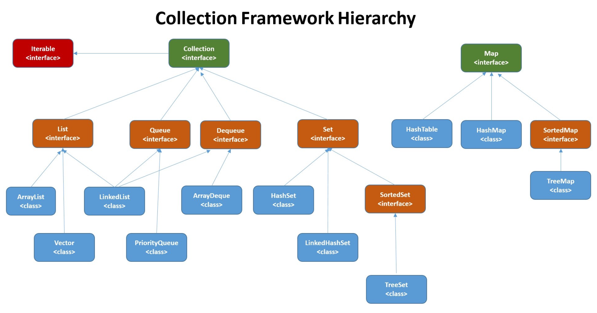

<!-- ---
sidebar: false
--- -->

# 1. Java 集合

  

## 1.1. 说说 List, Set, Map 三者的区别？

- List:存储的元素是有序的，可重复的。
- Set: 存储的元素是无序的，不可重复的。
- Map: 使用 key-value 键值对存储，Key 是无序的，不可重复的，value 是无序的，可重复的，每个键最多映射到一个值。

## 1.2. Arraylist 与 LinkedList 区别？

1. ArrayList 和 LinkedList 都不是线程安全的
1. ArrayList 的实现是基于数组，LinkedList 的实现是基于双向链表。
1. 对于快速随机访问，ArrayList 优于 LinkedList,  ArrayList 可以根据下标以 O (1) 时间复杂度对元素进行随机访问。而 LinkedList 的每一个元素都依靠地址指针和它后一个元素连接在一起，在这种情况下，查找某个元素的时间复杂度是 O (n)
1. 对于插入和删除操作，LinkedList 优于 ArrayList，因为当元素被添加到 LinkedList 任意位置的时候，不需要像 ArrayList 那样重新计算大小或者是更新索引。
1. LinkedList 比 ArrayList 更占内存，因为 LinkedList 的节点除了存储数据，还存储了两个引用，一个指向前一个元素，一个指向后一个元素。

## 1.3. 说一说 ArrayList 的扩容机制

ArrayList 是 List 接口的实现类，它是支持根据需要而动态增长的数组，ArrayList 不是线程安全的，按照插入的顺序来存放数据

1. ArrayList 扩容发生在 add() 方法调用的时候，调用 ensureCapacityInternal() 来扩容的，
   通过方法 calculateCapacity(elementData,  minCapacity) 获取需要扩容的长度：
1. ensureExplicitCapacity 方法可以判断是否需要扩容：
1. ArrayList 扩容的关键方法 grow():获取到 ArrayList 中 elementData 数组的内存空间长度 扩容至原来的 1.5 倍
1. 调用 Arrays.copyOf 方法将 elementData 数组指向新的内存空间 newCapacity 的连续空间，
   从此方法中可以清晰的看出其实 ArrayList 扩容的本质就是计算出新的扩容数组的 size 后实例化，并将原有数组内容复制到新数组中去。

## 1.4. HashMap 和 Hashtable 的区别

### 1.4.1. 线程是否安全

HashMap 是非线程安全的，HashTable 是线程安全的，因为 HashTable 内部的方法基本都经过 synchronized 修饰。

### 1.4.2. 效率

因为线程安全的问题，HashMap 要比 HashTable 效率高一点。另外，HashTable 是线程安全的，效率比较低，基本被淘汰，不要在代码中使用它;

### 1.4.3. 对 Null key 和 Null value 的支持

HashMap 可以存储 null 的 key 和 value，但 null 作为键只能有一个，null 作为值可以有多个;HashTable 不允许有 null 键和 null 值，否则会抛出 NullPointerException

### 1.4.4. 初始容量大小和每次扩充容量大小的不同

1. HashMap 默认的初始化大小为 16，扩容因子为 0.75，每次采用 2 倍的扩容，每当数组中的存储容量达到 75% 的时候，就需要对数组容量进行 2 倍的扩容. Hashtable 默认的初始大小为 11，之后每次扩充，容量变为原来的 2n+1.
1. 创建时如果给定了容量初始值，那么 HashMap 会将其扩充为 2 的幂次方大小，Hashtable 会直接使用给定的大小

### 1.4.5. 底层数据结构

JDK1.8 以后的 HashMap，当链表长度大于阈值 (默认为 8),  并且当容量大于 64 时，此时此索引位置上的所有数据改为使用红黑树存储，而当容量小于 64，会优先选择数组扩容

Hashtable 没有这样的机制

## 1.5. HashMap 和 HashSet 区别

```java
public HashSet() {
    map = new HashMap<>();
}
```

HashSet 底层就是基于 HashMap 实现的. HashSet 的源码非常非常少，因为除了 clone(), writeObject(), readObject() 是 HashSet 自己不得不实现之外，其他方法都是直接调用 HashMap 中的方法。

|              HashMap               |                                                      HashSet                                                       |
| :--------------------------------: | :----------------------------------------------------------------------------------------------------------------: |
|          实现了 Map 接口           |                                                   实现 Set 接口                                                    |
|             存储键值对             |                                                     仅存储对象                                                     |
|    调用 put() 向 map 中添加元素    |                                          调用 add() 方法向 Set 中添加元素                                          |
| HashMap 使用键 (Key) 计算 hashcode | HashSet 使用成员对象来计算 hashcode 值，对于两个对象来说 hashcode 可能相同，所以 equals() 方法用来判断对象的相等性 |

## 1.6. HashSet 如何检查重复

当你把对象加入 HashSet 时，HashSet 会先计算对象的 hashcode 值来判断对象加入的位置，同时也会与其他加入的对象的 hashcode 值作比较，如果没有相符的 hashcode, HashSet 会假设对象没有重复出现。但是如果发现有相同 hashcode 值的对象，这时会调用 equals() 方法来检查 hashcode 相等的对象是否真的相同。如果两者相同，HashSet 就不会让加入操作成功。

### 1.6.1. hashCode() 与 equals() 的相关规定

1. 两个对象相等，则 hashcode 一定也是相同的
2. 两个对象相等，对两个 equals() 方法返回 true
3. 两个对象有相同的 hashcode 值，它们也不一定是相等的

综上，如果一个类的 equals() 方法被覆盖过，则 hashCode() 方法也必须被覆盖. hashCode() 的默认⾏为是对堆上的对象产⽣独特值。如果没有重写 hashCode() , 即使通过 equals() 判断为相同的两个对象，在加入 HashSet 时，也不会被 HashSet 认为是重复对象。

### 1.6.2. ==与 equals 的区别

#### 1.6.2.1. 对象类型不同

1. equals (): 是超类 Object 中的方法。
1. ==: 是操作符。

#### 1.6.2.2. 比较的对象不同

1. equals (): 用来检测两个对象值是否相等。
1. ==: 基础数据类型：比较的是他们的值是否相等，引用数据类型：比较的是引用的地址是否相同

## 1.7. HashMap 的底层实现

HashMap 基于哈希表，它实现了 Map 接口，以键值对形式存储数据，通过 put() 和 get() 方法储存和获取对象。

1. 当保存对象时，将键值对传递给 put() 方法时，它调用键对象的 hashCode() 方法来计算 hashcode，返回的 hashCode 用于找到 bucket 位置来储存 Entry 对象。如果该位置已经有元素了，调用 equals 方法判断是否相等，相等的话就进行替换值，不相等的话，放在链表里面。

1. 当获取对象时，通过键对象的 equals() 方法找到正确的键值对，然后返回值对象. HashMap 使用链表来解决碰撞问题，当发生碰撞了，对象将会储存在链表的下一个节点中. HashMap 在每个链表节点中储存键值对对象。

> Hash 碰撞是计算得到的 Hash 值相同

## 1.8. HashMap 的长度为什么是 2 的幂次方

为了加快哈希计算以及减少哈希冲突

为了能让 HashMap 存取高效，尽量较少碰撞，也就是要尽量把数据分配均匀。上面也讲到了过了，Hash 值的范围值-2147483648 到 2147483647，前后加起来大概 40 亿的映射空间，只要哈希函数映射得比较均匀松散，一般应用是很难出现碰撞的。但问题是一个 40 亿长度的数组，内存是放不下的。所以这个散列值是不能直接拿来用的。用之前还要先做对数组的长度取模运算，得到的余数才能用来要存放的位置也就是对应的数组下标。这个数组下标的计算方法是" (n - 1) & hash".(n 代表数组长度).这也就解释了 HashMap 的长度为什么是 2 的幂次方。

## 1.9. HashMap 多线程操作导致死循环问题

多线程 put 操作后，get 操作导致 HashMap 死循环，原因在于 HashMap 的扩容 resize() 方法，并发下的 Rehash 会造成元素之间会形成一个循环链表。由于扩容是新建一个数组，复制原数据到数组。由于数组下标挂有链表，所以需要复制链表，但是多线程操作有可能导致环形链表。复制链表过程如下：
线程一：读取到当前的 HashMap 情况，在准备扩容时，线程二介入
线程二：读取 HashMap，进行扩容
线程一：继续执行
这个过程为，先将 A 复制到新的 hash 表中，然后接着复制 B 到链头 (A 的前边:B.next=A), 本来 B.next=null，到此也就结束了 (跟线程二一样的过程), 但是，由于线程二扩容的原因，将 B.next=A，所以，这里继续复制 A，让 A.next=B，由此，环形链表出现:B.next=A; A.next=B


jdk 1.8 后解决了这个问题，但是还是不建议在多线程下使用 HashMap，因为多线程下使用 HashMap 还是会存在其他问题比如数据丢失。并发环境下推荐使用 ConcurrentHashMap .

## 1.10. ConcurrentHashMap 和 Hashtable 的区别

ConcurrentHashMap 和 Hashtable 的区别主要体现在实现线程安全的方式上不同。

### 1.10.1. 底层数据结构

1. JDK1.8 中 ConcurrentHashMap 采用的数据结构跟 HashMap 的结构一样，数组 + 链表/红黑二叉树。
1. Hashtable 的底层数据结构采用数组 + 链表 的形式，数组是 HashMap 的主体，链表则是主要为了解决哈希冲突而存在的

### 1.10.2. 实现线程安全的方式 (重要)

1. JDK1.8 ConcurrentHashMap 用 Node 数组 + 链表 + 红黑树的数据结构来实现，并发控制使用 synchronized 和 CAS 来操作。
2. Hashtable(同一把锁) :使用 synchronized 来保证线程安全，效率非常低下。当一个线程访问同步方法时，其他线程也访问同步方法，可能会进入阻塞或轮询状态，如使用 put 添加元素，另一个线程不能使用 put 添加元素，也不能使用 get，竞争会越来越激烈效率越低。

## 1.11. 比较 HashSet, LinkedHashSet 和 TreeSet 三者的异同

1. HashSet 是 Set 接口的主要实现类，HashSet 的底层是 HashMap，线程不安全的，可以存储 null 值
1. LinkedHashSet 是 HashSet 的子类，能够按照添加的顺序遍历;
1. TreeSet 底层使用红黑树，能够按照添加元素的顺序进行遍历，排序的方式有自然排序和定制排序。

## 1.12. 集合框架底层数据结构总结

### 1.12.1. List

1. Arraylist: Object[] 数组
1. LinkedList: 双向链表
1. Vector:Object[] 数组

### 1.12.2. Set

1. HashSet(无序，唯一): 基于 HashMap 实现的，底层采用 HashMap 来保存元素
1. LinkedHashSet: LinkedHashSet 是 HashSet 的子类，并且其内部是通过 LinkedHashMap 来实现的
1. TreeSet(有序，唯一): 红黑树 (自平衡的排序二叉树)

### 1.12.3. Map

1. HashMap: JDK1.8 以后在解决哈希冲突时有了较大的变化，当链表长度大于阈值 (默认为 8)(将链表转换成红黑树前会判断，如果当前数组的长度小于 64，那么会选择先进行数组扩容，而不是转换为红黑树) 时，将链表转化为红黑树，以减少搜索时间
1. LinkedHashMap: LinkedHashMap 继承自 HashMap，所以它的底层仍然是基于拉链式散列结构即由数组和链表或红黑树组成。另外，LinkedHashMap 在上面结构的基础上，增加了一条双向链表，使得上面的结构可以保持键值对的插入顺序。同时通过对链表进行相应的操作，实现了访问顺序相关逻辑。
1. Hashtable: 数组 + 链表组成的，数组是 HashMap 的主体，链表则是主要为了解决哈希冲突而存在的
1. TreeMap: 红黑树 (自平衡的排序二叉树)

## 1.13. 如何选用集合？

1. 需要根据键值获取到元素值时: 选用 Map 接口下的集合，需要排序时选择 TreeMap，不需要排序时就选择 HashMap，需要保证线程安全就选用 ConcurrentHashMap.

1. 当只需要存放元素值时: 选择实现 Collection 接口的集合，需要保证元素唯一时选择实现 Set 接口的集合比如 TreeSet 或 HashSet，不需要保证元素唯一就选择实现 List 接口的比如 ArrayList 或 LinkedList
