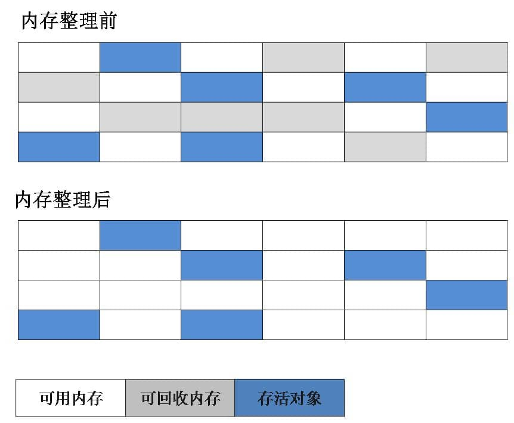

<!-- ---
sidebar: false
--- -->

# 1. Java 虚拟机

## 1.1. 介绍下 Java 内存区域 (运行时数据区)

Java 虚拟机在执行 Java 程序的过程中会把它管理的内存划分成若干个不同的数据区域.

  

1. 线程私有的: 程序计数器,虚拟机栈,本地方法栈
1. 线程共享的: 堆,方法区,直接内存 (非运行时数据区的一部分)

### 1.1.1. 程序计数器

程序计数器是是线程私有的,程序计数器私有主要是为了线程切换后能恢复到正确的执行位置. 它的生命周期随着线程的创建而创建, 随着线程的结束而死亡.

1. 在多线程的情况下, 程序计数器用于记录当前线程执行的位置, 从而当线程被切换回来的时候能够知道该线程上次运行位置.
1. 字节码解释器通过改变程序计数器来依次读取指令, 从而实现代码的流程控制, 如: 顺序执行, 选择, 循环, 异常处理.

### 1.1.2. 虚拟机栈和本地方法栈

为了保证线程中的局部变量不被别的线程访问到, 虚拟机栈和本地方法栈是线程私有的, 在 HotSpot 虚拟机中, 虚拟机栈和本地方法栈合二为一.

1. 虚拟机栈: 每个 Java 方法在执行的同时会创建一个栈帧用于存储局部变量表, 操作数栈, 常量池引用等信息. 从方法调用直至执行完成的过程, 就对应着一个栈帧在 Java 虚拟机栈中入栈和出栈的过程.局部变量表主要存放了编译期可知的各种数据类型( boolean, byte, char, short, int, float, long, double) , 对象引用( reference 类型).
1. 本地方法栈: 和虚拟机栈所发挥的作用非常相似, 区别是: 虚拟机栈为虚拟机执行 Java 方法(也就是字节码) 服务, 而本地方法栈则为虚拟机使用到的 Native 方法服务.

### 1.1.3. 堆

Java 虚拟机所管理的内存中最大的一块, Java 堆是所有线程共享的一块内存区域, 在虚拟机启动时创建. 此内存区域的唯一目的就是存放对象实例, 几乎所有的对象实例以及数组都在这里分配内存.

Java 堆是垃圾收集器管理的主要区域, 因此也被称作 GC 堆( Garbage Collected Heap) .从垃圾回收的角度, 由于现在收集器基本都采用分代垃圾收集算法, 所以 Java 堆还可以细分为: 新生代和老年代: 再细致一点有: Eden 空间, From Survivor, To Survivor 空间等. 进一步划分的目的是更好地回收内存, 或者更快地分配内存.

JDK 8 版本之后方法区( HotSpot 的永久代) 被彻底移除了, 取而代之是元空间, 元空间使用的是直接内存.
  

上图所示的 Eden 区, 两个 Survivor 区都属于新生代( 为了区分, 这两个 Survivor 区域按照顺序被命名为 from 和 to) , 中间一层属于老年代.

大部分情况, 对象都会首先在 Eden 区域分配, 在一次新生代垃圾回收后, 如果对象还存活, 则会进入 s0 或者 s1, 并且对象的年龄还会加 1(Eden 区->Survivor 区后对象的初始年龄变为 1), 当它的年龄增加到一定程度( 默认为 15 岁) , 就会被晋升到老年代中.

#### 1.1.3.1. 堆最容易出现的就是 OutOfMemoryError 错误

1. OutOfMemoryError: GC Overhead Limit Exceeded: 当 JVM 花太多时间执行垃圾回收并且只能回收很少的堆空间时, 就会发生此错误.
2. OutOfMemoryError: Java heap space: 假如在创建新的对象时, 堆内存中的空间不足以存放新创建的对象, 就会引发 OutOfMemoryError: Java heap space 错误.

### 1.1.4. 方法区(永久代)

方法区是各个线程共享的内存区域, 它用于存储已被虚拟机加载的类信息, 常量, 静态变量, 即时编译器编译后的代码等数据. 虽然 Java 虚拟机规范把方法区描述为堆的一个逻辑部分, 但是它却有一个别名叫做 Non-Heap( 非堆) , 目的应该是与 Java 堆区分开来.

#### 1.1.4.1. 方法区和永久代的关系

方法区是 Java 虚拟机规范中的定义, 是一种规范, 而永久代是 HotSpot 的概念, 是一种实现

#### 1.1.4.2. 常用参数

JDK 1.8 的时候, 方法区( HotSpot 的永久代) 被彻底移除了, 取而代之是元空间, 元空间使用的是直接内存.

```java
// 一些常用参数:
-XX:MetaspaceSize=N //设置 Metaspace 的初始值
-XX:MaxMetaspaceSize=N //设置 Metaspace 的最大值
```

#### 1.1.4.3. 为什么要将永久代 (PermGen) 替换为元空间 (MetaSpace) 呢?

1. 整个永久代有一个 JVM 本身设置固定大小上限, 无法进行调整, 而元空间使用的是直接内存, 受本机可用内存的限制, 虽然元空间仍旧可能溢出, 但是比原来出现的几率会更小.
1. 元空间里面存放的是类的元数据, 这样加载多少类的元数据就不由 MaxPermSize 控制了, 而由系统的实际可用空间来控制, 这样能加载的类就更多了.
1. JDK8 合并 HotSpot 和 JRockit 的代码时, JRockit 从来没有一个叫永久代的东西, 合并之后就没有必要额外的设置这么一个永久代的地方了.

### 1.1.5. 运行时常量池

运行时常量池是方法区的一部分. Class 文件中除了有类的版本, 字段, 方法, 接口等描述信息外, 还有常量池表( 用于存放编译期生成的各种字面量和符号引用)

既然运行时常量池是方法区的一部分, 自然受到方法区内存的限制, 当常量池无法再申请到内存时会抛出 OutOfMemoryError 错误.

### 1.1.6. 直接内存(堆外内存)

直接内存并不是虚拟机运行时数据区的一部分, 也不是虚拟机规范中定义的内存区域, 但是这部分内存也被频繁地使用. 而且也可能导致 OutOfMemoryError 错误出现.

本机直接内存的分配不会受到 Java 堆的限制, 但是, 既然是内存就会受到本机总内存大小以及处理器寻址空间的限制.

#### 1.1.6.1. 堆外内存的优点

1. 减少了垃圾回收,因为垃圾回收会暂停其他的工作.
1. 加快了复制的速度, 堆内在 flush 到远程时, 会先复制到直接内存( 非堆内存) , 然后在发送; 而堆外内存相当于省略掉了这个工作.

## 1.2. 说一下 Java 对象的创建过程


### 1.2.1. Step1:类加载检查

虚拟机遇到一条 new 指令时, 首先将去检查这个指令的参数是否能在常量池中定位到这个类的符号引用, 并且检查这个符号引用代表的类是否已被加载过, 解析和初始化过. 如果没有, 那必须先执行相应的类加载过程.

### 1.2.2. Step2:分配内存

在类加载检查通过后, 接下来虚拟机将为新生对象分配内存. 对象所需的内存大小在类加载完成后便可确定, 为对象分配空间的任务等同于把一块确定大小的内存从 Java 堆中划分出来. 分配方式有指针碰撞和空闲列表两种

#### 1.2.2.1. 内存分配的两种方式

选择指针碰撞和空闲列表中的哪一种, 取决于 Java 堆内存是否规整. 而 Java 堆内存是否规整, 取决于 GC 收集器的算法是标记 - 清除, 还是标记 - 整理( 也称作标记 - 压缩) , 值得注意的是, 复制算法内存也是规整的

#### 1.2.2.2. 内存分配并发问题,如何保证线程安全

> 在创建对象的时候有一个很重要的问题, 就是线程安全, 因为在实际开发过程中, 创建对象是很频繁的事情, 作为虚拟机来说, 必须要保证线程是安全的, 通常来讲, 虚拟机采用两种方式来保证线程安全:

1. CAS+ 失败重试: CAS 是乐观锁的一种实现方式. 所谓乐观锁就是, 每次不加锁而是假设没有冲突而去完成某项操作, 如果因为冲突失败就重试, 直到成功为止. 虚拟机采用 CAS 配上失败重试的方式保证更新操作的原子性.
1. TLAB: 为每一个线程预先在 Eden 区分配一块儿内存, JVM 在给线程中的对象分配内存时, 首先在 TLAB 分配, 当对象大于 TLAB 中的剩余内存或 TLAB 的内存已用尽时, 再采用上述的 CAS 进行内存分配

### 1.2.3. Step3:初始化零值

内存分配完成后, 虚拟机需要将分配到的内存空间都初始化为零值(不包括对象头) , 这一步操作保证了对象的实例字段在 Java 代码中可以不赋初始值就直接使用, 程序能访问到这些字段的数据类型所对应的零值.

### 1.2.4. Step4:设置对象头

初始化零值完成之后, 虚拟机要对对象进行必要的设置, 例如这个对象是哪个类的实例, 如何才能找到类的元数据信息, 对象的哈希码, 对象的 GC 分代年龄等信息. 这些信息存放在对象头中. 另外, 根据虚拟机当前运行状态的不同, 如是否启用偏向锁等, 对象头会有不同的设置方式.

### 1.2.5. Step5:执行 init 方法

在上面工作都完成之后, 从虚拟机的视角来看, 一个新的对象已经产生了, 但从 Java 程序的视角来看, 对象创建才刚开始, init 方法还没有执行, 所有的字段都还为零. 所以一般来说, 执行 new 指令之后会接着执行 init 方法, 把对象进行初始化, 这样一个真正可用的对象才算完全产生出来.

## 1.3. JVM 内存分配与回收

Java 的自动内存管理主要是对象内存的回收和对象内存的分配. 同时, Java 自动内存管理最核心的功能是堆内存中对象的分配与回收.

Java 堆是垃圾收集器管理的主要区域, 因此也被称作 GC 堆( Garbage Collected Heap) .从垃圾回收的角度, 由于现在收集器基本都采用分代垃圾收集算法, 所以 Java 堆还可以细分为: 新生代和老年代: 再细致一点有: Eden 空间, From Survivor, To Survivor 空间等. 进一步划分的目的是更好地回收内存, 或者更快地分配内存.

堆空间的基本结构:

  

上图所示的 Eden 区, From Survivor0(From) 区, To Survivor1(To) 区都属于新生代, Old Memory 区属于老年代.

大部分情况, 对象都会首先在 Eden 区域分配, 在一次新生代垃圾回收后, 如果对象还存活, 则会进入 s0 或者 s1, 并且对象的年龄还会加 1(Eden 区->Survivor 区后对象的初始年龄变为 1), 当它的年龄增加到一定程度( 默认为 15 岁) , 就会被晋升到老年代中. 对象晋升到老年代的年龄阈值, 可以通过参数 -XX:MaxTenuringThreshold 来设置.

> 修正( [issue552](https://github.com/Snailclimb/JavaGuide/issues/552)) : Hotspot 遍历所有对象时, 按照年龄从小到大对其所占用的大小进行累积, 当累积的某个年龄大小超过了 survivor 区的一半时, 取这个年龄和 MaxTenuringThreshold 中更小的一个值, 作为新的晋升年龄阈值 .
>
> 动态年龄计算的代码如下
>
> ```c++
> uint ageTable::compute_tenuring_threshold(size_t survivor_capacity) {
>  //survivor_capacity 是 survivor 空间的大小
> size_t desired_survivor_size = (size_t)((((double) survivor_capacity)*TargetSurvivorRatio)/100);
> size_t total = 0;
> uint age = 1;
> while (age < table_size) {
> total += sizes[age];//sizes 数组是每个年龄段对象大小
> if (total > desired_survivor_size) break;
> age++;
> }
> uint result = age < MaxTenuringThreshold ? age : MaxTenuringThreshold;
>  ...
> }
>
> ```

经过这次 GC 后, Eden 区和 From 区已经被清空. 这个时候, From 和 To 会交换他们的角色, 也就是新的 To 就是上次 GC 前的 From , 新的 From 就是上次 GC 前的 To. 不管怎样, 都会保证名为 To 的 Survivor 区域是空的. Minor GC 会一直重复这样的过程, 直到 To 区被填满, To 区被填满之后, 会将所有对象移动到老年代中.

## 1.4. 说一下堆内存中对象的分配的基本策略

## 1.5. 对象优先在 eden 区分配

目前主流的垃圾收集器都会采用分代回收算法, 因此需要将堆内存分为新生代和老年代, 这样我们就可以根据各个年代的特点选择合适的垃圾收集算法.

大多数情况下, 对象在新生代中 eden 区分配. 当 eden 区没有足够空间进行分配时, 虚拟机将发起一次 Minor GC.下面我们来进行实际测试以下.

测试:

```java
public class GCTest {

 public static void main(String[] args) {
  byte[] allocation1, allocation2;
  allocation1 = new byte[30900*1024];
  //allocation2 = new byte[900*1024];
 }
}
```

通过以下方式运行:


添加的参数: -XX:+PrintGCDetails


运行结果 (红色字体描述有误, 应该是对应于 JDK1.7 的永久代):


从上图我们可以看出 eden 区内存几乎已经被分配完全( 即使程序什么也不做, 新生代也会使用 2000 多 k 内存) . 假如我们再为 allocation2 分配内存会出现什么情况呢?

```java
allocation2 = new byte[900*1024];
```


简单解释一下为什么会出现这种情况: 因为给 allocation2 分配内存的时候 eden 区内存几乎已经被分配完了, 我们刚刚讲了当 Eden 区没有足够空间进行分配时, 虚拟机将发起一次 Minor GC.GC 期间虚拟机又发现 allocation1 无法存入 Survivor 空间, 所以只好通过 分配担保机制 把新生代的对象提前转移到老年代中去, 老年代上的空间足够存放 allocation1, 所以不会出现 Full GC. 执行 Minor GC 后, 后面分配的对象如果能够存在 eden 区的话, 还是会在 eden 区分配内存. 可以执行如下代码验证:

```java
public class GCTest {

 public static void main(String[] args) {
  byte[] allocation1, allocation2,allocation3,allocation4,allocation5;
  allocation1 = new byte[32000*1024];
  allocation2 = new byte[1000*1024];
  allocation3 = new byte[1000*1024];
  allocation4 = new byte[1000*1024];
  allocation5 = new byte[1000*1024];
 }
}

```

## 1.6. 大对象直接进入老年代

大对象就是需要大量连续内存空间的对象( 比如: 字符串, 数组).
大对象直接进入老年代, 为了避免为大对象分配内存时由于分配担保机制带来的复制而降低效率.

## 1.7. 长期存活的对象将进入老年代

既然虚拟机采用了分代收集的思想来管理内存, 那么内存回收时就必须能识别哪些对象应放在新生代, 哪些对象应放在老年代中. 为了做到这一点, 虚拟机给每个对象一个对象年龄( Age) 计数器.

如果对象在 Eden 出生并经过第一次 Minor GC 后仍然能够存活, 并且能被 Survivor 容纳的话, 将被移动到 Survivor 空间中, 并将对象年龄设为 1.对象在 Survivor 中每熬过一次 MinorGC, 年龄就增加 1 岁, 当它的年龄增加到一定程度( 默认为 15 岁) , 就会被晋升到老年代中. 对象晋升到老年代的年龄阈值, 可以通过参数 -XX:MaxTenuringThreshold 来设置.

## 1.8. 动态对象年龄判定

大部分情况, 对象都会首先在 Eden 区域分配, 在一次新生代垃圾回收后, 如果对象还存活, 则会进入 s0 或者 s1, 并且对象的年龄还会加 1(Eden 区->Survivor 区后对象的初始年龄变为 1), 当它的年龄增加到一定程度( 默认为 15 岁) , 就会被晋升到老年代中. 对象晋升到老年代的年龄阈值, 可以通过参数 -XX:MaxTenuringThreshold 来设置.

> 修正( [issue552](https://github.com/Snailclimb/JavaGuide/issues/552)) : Hotspot 遍历所有对象时, 按照年龄从小到大对其所占用的大小进行累积, 当累积的某个年龄大小超过了 survivor 区的一半时, 取这个年龄和 MaxTenuringThreshold 中更小的一个值, 作为新的晋升年龄阈值 .
>
> 动态年龄计算的代码如下
>
> ```c++
> uint ageTable::compute_tenuring_threshold(size_t survivor_capacity) {
>  //survivor_capacity 是 survivor 空间的大小
> size_t desired_survivor_size = (size_t)((((double) survivor_capacity)*TargetSurvivorRatio)/100);
> size_t total = 0;
> uint age = 1;
> while (age < table_size) {
> total += sizes[age];//sizes 数组是每个年龄段对象大小
> if (total > desired_survivor_size) break;
> age++;
> }
> uint result = age < MaxTenuringThreshold ? age : MaxTenuringThreshold;
>  ...
> }
>
> ```
>
> 额外补充说明 ([issue672](https://github.com/Snailclimb/JavaGuide/issues/672)): 关于默认的晋升年龄是 15, 这个说法的来源大部分都是< 深入理解 Java 虚拟机> 这本书.
> 如果你去 Oracle 的官网阅读[相关的虚拟机参数](https://docs.oracle.com/javase/8/docs/technotes/tools/unix/java.html), 你会发现-XX:MaxTenuringThreshold=threshold 这里有个说明
>
> Sets the maximum tenuring threshold for use in adaptive GC sizing. The largest value is 15. The default value is 15 for the parallel (throughput) collector, and 6 for the CMS collector.默认晋升年龄并不都是 15, 这个是要区分垃圾收集器的, CMS 就是 6.

## 1.9. 主要进行垃圾回收 (Garbage Collection) 的区域

针对 HotSpot VM 的实现, 它里面的 GC 其实准确分类只有两大种:

### 1.9.1. 部分收集 (Partial GC)

1. 新生代收集( Minor GC / Young GC): 只对新生代进行垃圾收集;
1. 老年代收集( Major GC / Old GC): 只对老年代进行垃圾收集. 需要注意的是 Major GC 在有的语境中也用于指代整堆收集;
1. 混合收集( Mixed GC): 对整个新生代和部分老年代进行垃圾收集.

### 1.9.2. 整堆收集 (Full GC)

收集整个 Java 堆和方法区

## 1.10. 如何判断对象是否死亡?

堆中几乎放着所有的对象实例, 对堆垃圾回收前的第一步就是要判断哪些对象已经死亡, 即不能再被任何途径使用的对象

### 1.10.1. 引用计数法

给对象中添加一个引用计数器, 每当有一个地方引用它, 计数器就加 1; 当引用失效, 计数器就减 1; 任何时候计数器为 0 的对象就是不可能再被使用的.

### 1.10.2. 可达性分析算法

通过一系列的称为 GC Roots 的对象作为起点, 从这些节点开始向下搜索, 节点所走过的路径称为引用链, 当一个对象到 GC Roots 没有任何引用链相连的话, 则证明此对象是不可用的.


## 1.11. 简单的介绍一下强引用, 软引用, 弱引用, 虚引用

无论是通过引用计数法判断对象引用数量, 还是通过可达性分析法判断对象的引用链是否可达, 判定对象的存活都与引用有关.

### 1.11.1. 强引用 (StrongReference)

使用最普遍的引用. 如果一个对象具有强引用, 那就类似于必不可少的生活用品, 垃圾回收器绝不会回收它. 当内存空间不足, Java 虚拟机宁愿抛出 OutOfMemoryError 错误, 使程序异常终止, 也不会靠随意回收具有强引用的对象来解决内存不足问题.

### 1.11.2. 软引用 (SoftReference)

如果一个对象只具有软引用, 那就类似于可有可无的生活用品. 如果内存空间足够, 垃圾回收器就不会回收它, 如果内存空间不足了, 就会回收这些对象的内存. 只要垃圾回收器没有回收它, 该对象就可以被程序使用. 软引用可用来实现内存敏感的高速缓存.

软引用可以和一个引用队列( ReferenceQueue) 联合使用, 如果软引用所引用的对象被垃圾回收, JAVA 虚拟机就会把这个软引用加入到与之关联的引用队列中.

### 1.11.3. 弱引用 (WeakReference)

如果一个对象只具有弱引用, 那就类似于可有可无的生活用品. 弱引用与软引用的区别在于: 只具有弱引用的对象拥有更短暂的生命周期. 在垃圾回收器线程扫描它所管辖的内存区域的过程中, 一旦发现了只具有弱引用的对象, 不管当前内存空间足够与否, 都会回收它的内存. 不过, 由于垃圾回收器是一个优先级很低的线程, 因此不一定会很快发现那些只具有弱引用的对象.

弱引用可以和一个引用队列( ReferenceQueue) 联合使用, 如果弱引用所引用的对象被垃圾回收, Java 虚拟机就会把这个弱引用加入到与之关联的引用队列中.

### 1.11.4. 虚引用( PhantomReference)

虚引用顾名思义, 就是形同虚设, 与其他几种引用都不同, 虚引用并不会决定对象的生命周期. 如果一个对象仅持有虚引用, 那么它就和没有任何引用一样, 在任何时候都可能被垃圾回收.

虚引用主要用来跟踪对象被垃圾回收的活动.

虚引用与软引用和弱引用的一个区别在于: 虚引用必须和引用队列( ReferenceQueue) 联合使用. 当垃 圾回收器准备回收一个对象时, 如果发现它还有虚引用, 就会在回收对象的内存之前, 把这个虚引用加入到与之关联的引用队列中. 程序可以通过判断引用队列中是 否已经加入了虚引用, 来了解被引用的对象是否将要被垃圾回收. 程序如果发现某个虚引用已经被加入到引用队列, 那么就可以在所引用的对象的内存被回收之前采取必要的行动.

特别注意, 在程序设计中一般很少使用弱引用与虚引用, 使用软引用的情况较多, 这是因为软引用可以加速 JVM 对垃圾内存的回收速度, 可以维护系统的运行安全, 防止内存溢出( OutOfMemory) 等问题的产生.

## 1.12. 如何判断运行时常量池中的一个常量是废弃常量?

假如在常量池中存在字符串 abc, 如果当前没有任何 String 对象引用该字符串常量的话, 就说明常量 abc 就是废弃常量, 如果这时发生内存回收的话而且有必要的话, abc 就会被系统清理出常量池.

## 1.13. 如何判断一个类是无用的类?

1. 该类所有的实例都已经被回收, 也就是 Java 堆中不存在该类的任何实例.
1. 加载该类的 ClassLoader 已经被回收.
1. 该类对应的 java.lang.Class 对象没有在任何地方被引用, 无法在任何地方通过反射访问该类的方法.

## 1.14. 垃圾收集有哪些算法, 各自的特点?

### 1.14.1. 标记 - 清除算法

  

该算法分为标记和清除阶段: 首先标记出所有不需要回收的对象, 在标记完成后统一回收掉所有没有被标记的对象. 它是最基础的收集算法, 后续的算法都是对其不足进行改进得到.

#### 1.14.1.1. 这种垃圾收集算法会带来两个明显的问题

1. 效率问题
2. 空间问题( 标记清除后会产生大量不连续的碎片)

### 1.14.2. 复制算法

  

为了解决效率问题, 复制收集算法出现了. 它可以将内存分为大小相同的两块, 每次使用其中的一块. 当这一块的内存使用完后, 就将还存活的对象复制到另一块去, 然后再把使用的空间一次清理掉. 这样就使每次的内存回收都是对内存区间的一半进行回收.

### 1.14.3. 标记 - 整理算法

  

根据老年代的特点提出的一种标记算法, 标记过程仍然与 标记 - 清除 算法一样, 但后续步骤不是直接对可回收对象回收, 而是让所有存活的对象向一端移动, 然后直接清理掉端边界以外的内存.

### 1.14.4. 分代收集算法

当前虚拟机的垃圾收集都采用分代收集算法, 这种算法没有什么新的思想, 只是根据对象存活周期的不同将内存分为几块. 为了提升 GC 效率, 一般将 java 堆分为新生代和老年代, 这样我们就可以根据各个年代的特点选择合适的垃圾收集算法.

比如在新生代中, 每次收集都会有大量对象死去, 所以可以选择复制算法, 只需要付出少量对象的复制成本就可以完成每次垃圾收集. 而老年代的对象存活几率是比较高的, 而且没有额外的空间对它进行分配担保, 所以我们必须选择 标记 - 清除 或 标记 - 整理 算法进行垃圾收集.

## 1.15. 常见的垃圾回收器有那些?

  

如果说收集算法是内存回收的方法论, 那么垃圾收集器就是内存回收的具体实现.

### 1.15.1. Serial(串行 GC)收集器

Serial 收集器是一个新生代收集器, 单线程执行, 使用复制算法. 它在进行垃圾收集时, 必须暂停其他所有的工作线程(用户线程). 是 Jvm client 模式下默认的新生代收集器. 对于限定单个 CPU 的环境来说, Serial 收集器由于没有线程交互的开销, 专心做垃圾收集自然可以获得最高的单线程收集效率.

### 1.15.2. ParNew(并行 GC)收集器

ParNew 收集器其实就是 serial 收集器的多线程版本, 除了使用多条线程进行垃圾收集之外, 其余行为与 Serial 收集器一样.

### 1.15.3. Parallel Scavenge(并行回收 GC)收集器

Parallel Scavenge 收集器也是一个新生代收集器, 它也是使用复制算法的收集器, 又是并行多线程收集器. parallel Scavenge 收集器的特点是它的关注点与其他收集器不同, CMS 等收集器的关注点是尽可能地缩短垃圾收集时用户线程的停顿时间, 而 parallel Scavenge 收集器的目标则是达到一个可控制的吞吐量. 吞吐量= 程序运行时间/(程序运行时间 + 垃圾收集时间), 虚拟机总共运行了 100 分钟. 其中垃圾收集花掉 1 分钟, 那吞吐量就是 99%.

### 1.15.4. CMS(并发 GC)收集器

Concurrent Mark Sweep 收集器是一种以获得最短回收停顿时间为目标的收集器, 基于标记清除算法.

过程如下: 初始标记, 并发标记, 重新标记, 并发清除, 优点是并发收集, 低停顿, 缺点是对 CPU 资源非常敏感, 无法处理浮动垃圾, 收集结束会产生大量空间碎片.

### 1.15.5. G1 收集器

G1 收集器是基于标记整理算法实现的, 不会产生空间碎片, 可以精确地控制停顿, 将堆划分为多个大小固定的独立区域, 并跟踪这些区域的垃圾堆积程度,

在后台维护一个优先列表, 每次根据允许的收集时间, 优先回收垃圾最多的区域(Garbage First).

## 1.16. 乐观锁和悲观锁

乐观锁和悲观锁是两种思想，用于解决并发场景下的数据竞争问题。

1. 乐观锁: 对于同一个数据的并发操作, 乐观锁认为自己在使用数据时不会有别的线程修改数据，所以不会添加锁，只是在更新数据的时候去判断之前有没有别的线程更新了这个数据. 乐观锁适用于读多写少的应用场景，这样可以提高吞吐量。
1. 悲观锁: 对于同一个数据的并发操作，悲观锁认为自己在使用数据的时候一定有别的线程来修改数据，因此在获取数据的时候会先加锁，确保数据不会被别的线程修改
