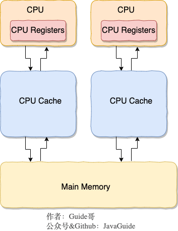
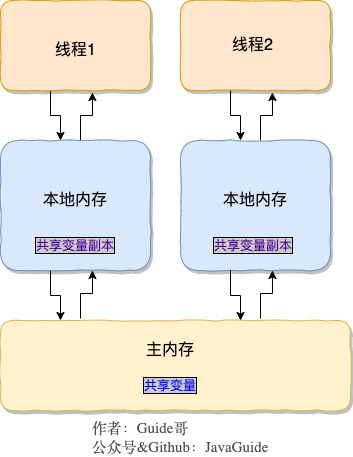
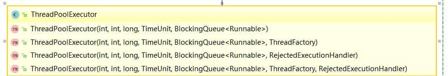
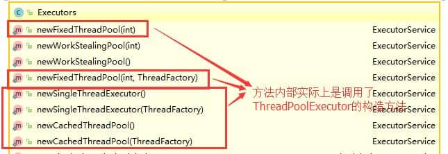
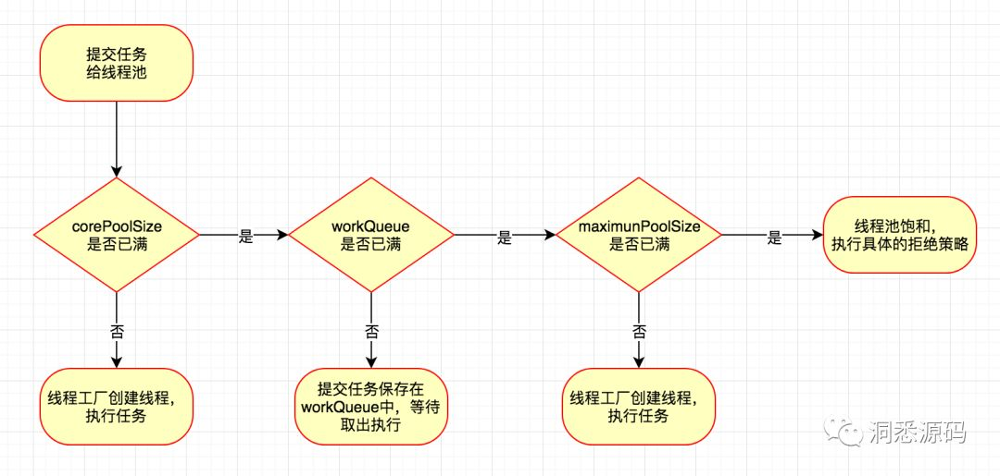

<!-- ---
sidebar: false
--- -->

# 1. 多线程-进阶

## 1.1. 说一说自己对于 synchronized 关键字的了解

synchronized 关键字解决的是多线程之间访问资源的同步性, synchronized 关键字可以保证被它修饰的方法或者代码块在任意时刻只有一个线程执行.

## 1.2. 说说自己是怎么使用 synchronized 关键字

### 1.2.1. 修饰实例方法

作用于实例方法,当前实例加锁,进入同步代码前要获得当前实例的锁;

```java
public class SyncTest implements Runnable{

    @Override
    public synchronized void run() {
        for (int i = 0; i < 5; i++) {
            increaseCount();
            System.out.println(Thread.currentThread().getName()+":"+count++);
        }
    }

    public static void main(String[] args) throws InterruptedException {
        SyncTest syncTest1 = new SyncTest();
        Thread thread1 = new Thread(syncTest1,"thread1");
        Thread thread2 = new Thread(syncTest1, "thread2");
        thread1.start();
        thread2.start();
    }
}
```

### 1.2.2. 修饰静态方法

作用于静态方法,因为静态成员不属于任何一个实例对象, 是类成员, 所以是给当前类加锁,进去同步代码前要获得当前类对象的锁;

```java
public class SyncTest implements Runnable {
    static int count = 0;

    @Override
    public synchronized void run() {
        increaseCount();
    }

    private synchronized static void increaseCount() {
        for (int i = 0; i < 5; i++) {
            System.out.println(Thread.currentThread().getName() + ":" + count++);
            try {
                Thread.sleep(1000);
            } catch (InterruptedException e) {
                e.printStackTrace();
            }
        }
    }

    public static void main(String[] args) throws InterruptedException {
        SyncTest syncTest1 = new SyncTest();
        SyncTest syncTest2 = new SyncTest();
        Thread thread1 = new Thread(syncTest1, "thread1");
        Thread thread2 = new Thread(syncTest2, "thread2");
        thread1.start();
        thread2.start();
    }
}
```

### 1.2.3. 修饰代码块

作用于代码块,对指定对象/类加锁,进入同步代码前要获得指定对象/类的锁.

1. synchronized(this|object)表示进入同步代码库前要获得给定对象的锁.
1. synchronized(类.class)表示进入同步代码前要获得当前 class 的锁

```java
public class SyncTest implements Runnable {
    //共享资源变量
    static int count = 0;
    private byte[] mBytes = new byte[0];

    @Override
    public synchronized void run() {
        increaseCount();
    }

    private void increaseCount() {
    //  this,指的就是调用这个方法的实例对象
        synchronized (this) {
            for (int i = 0; i < 5; i++) {
                System.out.println(Thread.currentThread().getName() + ":" + count++);
                try {
                    Thread.sleep(1000);
                } catch (InterruptedException e) {
                    e.printStackTrace();
                }
            }
        }
    }

    public static void main(String[] args) throws InterruptedException {
        SyncTest syncTest1 = new SyncTest();
        SyncTest syncTest2 = new SyncTest();
        Thread thread1 = new Thread(syncTest1, "thread1");
        Thread thread2 = new Thread(syncTest2, "thread2");
        thread1.start();
        thread2.start();
    }
}
```

## 1.3. synchronized 关键字的具体使用, 双重校验锁实现对象单例(线程安全)

```java
public class Singleton {
   private volatile static Singleton uniqueInstance;
   private Singleton() {}
  public static Singleton getUniqueInstance() {
     //先判断对象是否已经实例过,没有实例化过才进入加锁代码
       if (uniqueInstance == null) {
           //类对象加锁
           synchronized (Singleton.class) {
               if (uniqueInstance == null) {
                   uniqueInstance = new Singleton();
               }
           }
       }
      return uniqueInstance;
  }
```

uniqueInstance 采用 volatile 关键字修饰也是很有必要的,uniqueInstance = new Singleton (); 这段代码其实是分为三步执行:

1. 为 uniqueInstance 分配内存空间
1. 初始化 uniqueInstance
1. 将 uniqueInstance 指向分配的内存地址

   由于 JVM 具有指令重排的特性,执行顺序有可能变成 1->3->2.在多线程环境下会导致一个线程获得还没有初始化的实例.例如,线程 T1 执行了 1 和 3,此时 T2 调用 getUniqueInstance () 发现 uniqueInstance 不为空,因此返回 uniqueInstance,但此时 uniqueInstance 还未被初始化.

## 1.4. 构造方法可以使用 synchronized 关键字修饰么?

构造方法不能使用 synchronized 关键字修饰. 构造方法本身就属于线程安全的

## 1.5. 为什么要弄一个 CPU 高速缓存呢?

  

CPU 缓存则是为了解决 CPU 处理速度和内存处理速度不对等的问题.

先复制一份数据到 CPUCache 中, 当 CPU 需要用到的时候就可以直接从 CPUCache 中读取数据, 当运算完成后, 再将运算得到的数据写回 MainMemory 中

## 1.6. 讲一下 JMM(Java 内存模型)

  

在当前的 Java 内存模型下, 线程可以把变量保存本地内存(比如寄存器)中, 而不是直接在主存中进行读写. 这就可能造成一个线程在主存中修改了一个变量的值, 而另外一个线程还继续使用它在寄存器中的变量值的拷贝, 造成数据的不一致.
要解决这个问题, 就需要把变量声明为 volatile, 这就指示 JVM, 这个变量是共享且不稳定的, 每次使用它都到主存中进行读取.

所以, volatile 关键字除了防止 JVM 的指令重排, 还有一个重要的作用就是保证变量的可见性.

>寄存器是 CPU 内部用来存放数据的一些小型存储区域,用来暂时存放参与运算的数据和运算结果

## 1.7. 说说对 volatile 关键字的理解

`public volatile int counter = 0;`

### 1.7.1. volatile的特性

1. 保证了不同线程对该变量操作的内存可见性;
1. 禁止指令重排序

## 1.8. 并发编程的三个重要特性

1. 原子性 : 在一次或者多次操作时,要么所有操作都被执行,要么所有操作都不执行.synchronized 可以保证代码片段的原子性.
1. 可见性 : 当一个线程对共享变量进行了修改, 那么另外的线程都是立即可以看到修改后的最新值. volatile 关键字可以保证共享变量的可见性.
1. 有序性 : 代码在执行的过程中的先后顺序, 为了提高程序的运行效率,可能在编译期和运行期会对代码指令进行一定的优化,不会百分之百的保证代码的执行顺序严格按照编写代码中的顺序执行,但也不是随意进行重排序,它会保证程序的最终运算结果是编码时所期望的.这种情况被称之为指令重排. volatile 关键字可以禁止指令进行重排优化

## 1.9. 说说 synchronized 关键字和 volatile 关键字的区别

synchronized 关键字和 volatile 关键字是两个互补的存在, 而不是对立的存在!

1. volatile 关键字是线程同步的轻量级实现, 所以 volatile 性能肯定比 synchronized 关键字要好. 但是 volatile 关键字只能用于变量而 synchronized 关键字可以修饰方法以及代码块.
1. volatile 关键字能保证数据的可见性, 但不能保证数据的原子性. synchronized 关键字两者都能保证.
1. volatile 关键字主要用于解决变量在多个线程之间的可见性, 而 synchronized 关键字解决的是多个线程之间访问资源的同步性.

## 1.10. ThreadLocal 了解么?

通常情况下, 创建的变量是可以被任何一个线程访问并修改的. 如果想实现每一个线程都有自己的专属本地变量可以使用 ThreadLocal

```java
import java.text.SimpleDateFormat;
import java.util.Random;

public class ThreadLocalExample implements Runnable{

     // SimpleDateFormat 不是线程安全的, 所以每个线程都要有自己独立的副本
    private static final ThreadLocal<SimpleDateFormat> formatter = ThreadLocal.withInitial(() -> new SimpleDateFormat("yyyyMMdd HHmm"));

    public static void main(String[] args) throws InterruptedException {
        ThreadLocalExample obj = new ThreadLocalExample();
        for(int i=0 ; i<10; i++){
            Thread t = new Thread(obj, ""+i);
            Thread.sleep(new Random().nextInt(1000));
            t.start();
        }
    }

    @Override
    public void run() {
        System.out.println("Thread Name= "+Thread.currentThread().getName()+" default Formatter = "+formatter.get().toPattern());
        try {
            Thread.sleep(new Random().nextInt(1000));
        } catch (InterruptedException e) {
            e.printStackTrace();
        }
        //formatter pattern is changed here by thread, but it won't reflect to other threads
        formatter.set(new SimpleDateFormat());

        System.out.println("Thread Name= "+Thread.currentThread().getName()+" formatter = "+formatter.get().toPattern());
    }

}

```

## 1.11. ThreadLocal 内存泄露问题?

ThreadLocalMap 中使用的 key 为 ThreadLocal 的弱引用, 而 value 是强引用. 所以, 如果 ThreadLocal 没有被外部强引用的情况下, 在垃圾回收的时候, key 会被清理掉, 而 value 不会被清理掉. 这样一来, ThreadLocalMap 中就会出现 key 为 null 的 Entry. 假如我们不做任何措施的话, value 永远无法被 GC 回收, 这个时候就可能会产生内存泄露. ThreadLocalMap 实现中已经考虑了这种情况, 在调用 set(), get(), remove()方法的时候, 会清理掉 key 为 null 的记录.

## 1.12. 为什么要用线程池?

池化技术的思想主要是为了减少每次获取资源的消耗, 提高对资源的利用率. 线程池, 数据库连接池, Http 连接池等等都是对这个思想的应用.

### 1.12.1. 使用线程池的好处

1. 降低资源消耗. 通过重复利用已创建的线程降低线程创建和销毁造成的消耗.
1. 提高响应速度. 当任务到达时, 任务可以不需要的等到线程创建就能立即执行.
1. 提高线程的可管理性. 线程是稀缺资源, 如果无限制的创建, 不仅会消耗系统资源, 还会降低系统的稳定性, 使用线程池可以进行统一的分配, 调优和监控.

## 1.13. 实现 Runnable 接口和 Callable 接口的区别

Runnable 接口不会返回结果或抛出检查异常, 但是 Callable 接口可以.

```java
// Runnable. java
@FunctionalInterface
public interface Runnable{
// *被线程执行, 没有返回值也无法抛出异常
   public abstract void run();
}

// Callable. java
@FunctionalInterface
public interface Callable<V>{
// 计算结果, 或在无法这样做时抛出异常.
// @return计算得出的结果
// @throws如果无法计算结果, 则抛出异常
  V call() throws Exception;
}

```

工具类 Executors 可以实现将 Runnable 对象转换成 Callable 对象.

```java
Executors.callable(Runnable task)
Executors.callable(Runnable task, Object result))
```

## 1.14. 执行 execute()方法和 submit()方法的区别是什么呢?

1. execute()方法用于提交不需要返回值的任务, 所以无法判断任务是否被线程池执行成功与否;
1. submit()方法用于提交需要返回值的任务. 线程池会返回一个 Future 类型的对象, 通过这个 Future 对象可以判断任务是否执行成功, 并且可以通过 Future 的 get()方法来获取返回值, get()方法会阻塞当前线程直到任务完成, 而使用 get(longtimeout, TimeUnitunit)方法则会阻塞当前线程一段时间后立即返回, 这时候有可能任务没有执行完.

```java
// submit
public Future<?> submit(Runnable task) {
    if (task == null) throw new NullPointerException();
    RunnableFuture<Void> ftask = newTaskFor(task, null);
    execute(ftask);
    return ftask;
}

// execute
public void execute(Runnable command) {
  ...
}
```

## 1.15. 如何创建线程池

<<阿里巴巴 Java 开发手册>> 中强制线程池不允许使用 Executors 去创建, 而是通过 ThreadPoolExecutor 的方式, 这样的处理方式让写的同学更加明确线程池的运行规则, 规避资源耗尽的风险
  

### 1.15.1. 通过 Executor 框架的工具类 Executors 来实现

  

1. FixedThreadPool: 该方法返回一个固定线程数量的线程池. 该线程池中的线程数量始终不变. 当有一个新的任务提交时, 线程池中若有空闲线程, 则立即执行. 若没有, 则新的任务会被暂存在一个任务队列中, 待有线程空闲时, 便处理在任务队列中的任务.
1. SingleThreadExecutor: 方法返回一个只有一个线程的线程池. 若多余一个任务被提交到该线程池, 任务会被保存在一个任务队列中, 待线程空闲, 按先入先出的顺序执行队列中的任务.
1. CachedThreadPool: 该方法返回一个可根据实际情况调整线程数量的线程池. 线程池的线程数量不确定, 但若有空闲线程可以复用, 则会优先使用可复用的线程. 若所有线程均在工作, 又有新的任务提交, 则会创建新的线程处理任务. 所有线程在当前任务执行完毕后, 将返回线程池进行复用.

#### 1.15.1.1. Executors 返回线程池对象的弊端

1. FixedThreadPool 和 SingleThreadExecutor: 允许请求的队列长度为 Integer. MAX_VALUE, 可能堆积大量的请求, 从而导致 OOM.
1. CachedThreadPool 和 ScheduledThreadPool: 允许创建的线程数量为 Integer. MAX_VALUE, 可能会创建大量线程, 从而导致 OOM.

### 1.15.2. ThreadPoolExecutor 类分析

```java
/**
 * 用给定的初始参数创建一个新的ThreadPoolExecutor.
 */
public ThreadPoolExecutor(int corePoolSize,
                      int maximumPoolSize,
                      long keepAliveTime,
                      TimeUnit unit,
                      BlockingQueue<Runnable> workQueue,
                      ThreadFactory threadFactory,
                      RejectedExecutionHandler handler) {
    if (corePoolSize < 0 ||
        maximumPoolSize <= 0 ||
        maximumPoolSize < corePoolSize ||
        keepAliveTime < 0)
            throw new IllegalArgumentException();
    if (workQueue == null || threadFactory == null || handler == null)
        throw new NullPointerException();
    this.corePoolSize = corePoolSize;
    this.maximumPoolSize = maximumPoolSize;
    this.workQueue = workQueue;
    this.keepAliveTime = unit.toNanos(keepAliveTime);
    this.threadFactory = threadFactory;
    this.handler = handler;
}

```

### 1.15.3. threadPoolExecutor 构造函数重要参数分析

#### 1.15.3.1. ThreadPoolExecutor 3 个最重要的参数

1. corePoolSize: 核心线程数线程数定义了最小可以同时运行的线程数量.
1. maximumPoolSize: 当队列中存放的任务达到队列容量的时候, 当前可以同时运行的线程数量变为最大线程数.
1. workQueue: 当新任务来的时候会先判断当前运行的线程数量是否达到核心线程数, 如果达到的话, 新任务就会被存放在队列中.

#### 1.15.3.2. ThreadPoolExecutor 其他常见参数

1. keepAliveTime: 当线程池中的线程数量大于 corePoolSize 的时候, 如果这时没有新的任务提交, 核心线程外的线程不会立即销毁, 而是会等待, 直到等待的时间超过了 keepAliveTime 才会被回收销毁;
1. unit: keepAliveTime 参数的时间单位.
1. threadFactory: executor 创建新线程的时候会用到.
1. handler: 饱和策略. 关于饱和策略下面单独介绍一下.

### 1.15.4. hreadPoolExecutor 饱和策略

如果当前同时运行的线程数量达到最大线程数量并且队列也已经被放满了任务时, ThreadPoolTaskExecutor 可以定义的一些策略:

1. ThreadPoolExecutor.AbortPolicy: 抛出 RejectedExecutionException 来拒绝新任务的处理.
1. ThreadPoolExecutor.CallerRunsPolicy: 调用执行自己的线程运行任务, 也就是直接在调用 execute 方法的线程中运行(run)被拒绝的任务, 如果执行程序已关闭, 则会丢弃该任务. 因此这种策略会降低对于新任务提交速度, 影响程序的整体性能. 如果您的应用程序可以承受此延迟并且你要求任何一个任务请求都要被执行的话, 你可以选择这个策略.
1. ThreadPoolExecutor.DiscardPolicy: 不处理新任务, 直接丢弃掉.
1. ThreadPoolExecutor.DiscardOldestPolicy: 此策略将丢弃最早的未处理的任务请求.

### 1.15.5. 线程池原理分析

  


> 比如: 我们在代码中模拟了 10 个任务, 我们配置的核心线程数为 5 , 等待队列容量为 100 , 所以每次只可能存在 5 个任务同时执行, 剩下的 5 个任务会被放到等待队列中去. 当前的 5 个任务中如果有任务被执行完了, 线程池就会去拿新的任务执行

重点分析一下 execute 方法, 一般使用 executor.execute(worker)来提交一个任务到线程池中

```java
// 存放线程池的运行状态 (runState) 和线程池内有效线程的数量 (workerCount)
private final AtomicInteger ctl = new AtomicInteger(ctlOf(RUNNING, 0));

private static int workerCountOf(int c) {
    return c & CAPACITY;
}

private final BlockingQueue<Runnable> workQueue;

public void execute(Runnable command) {
    // 如果任务为null, 则抛出异常.
    if (command == null)
        throw new NullPointerException();
    // ctl 中保存的线程池当前的一些状态信息
    int c = ctl.get();

    //  下面会涉及到 3 步 操作
    // 1.首先判断当前线程池中执行的任务数量是否小于 corePoolSize
    // 如果小于的话, 通过addWorker(command, true)新建一个线程, 并将任务(command)添加到该线程中; 然后, 启动该线程从而执行任务.
    if (workerCountOf(c) < corePoolSize) {
        if (addWorker(command, true))
            return;
        c = ctl.get();
    }
    // 2.如果当前执行的任务数量大于等于 corePoolSize 的时候就会走到这里
    // 通过 isRunning 方法判断线程池状态, 线程池处于 RUNNING 状态才会被并且队列可以加入任务, 该任务才会被加入进去
    if (isRunning(c) && workQueue.offer(command)) {
        int recheck = ctl.get();
        // 再次获取线程池状态, 如果线程池状态不是 RUNNING 状态就需要从任务队列中移除任务, 并尝试判断线程是否全部执行完毕. 同时执行拒绝策略.
        if (!isRunning(recheck) && remove(command))
            reject(command);
            // 如果当前线程池为空就新创建一个线程并执行.
        else if (workerCountOf(recheck) == 0)
            addWorker(null, false);
    }
    //3. 通过addWorker(command, false)新建一个线程, 并将任务(command)添加到该线程中; 然后, 启动该线程从而执行任务.
    //如果addWorker(command, false)执行失败, 则通过reject()执行相应的拒绝策略的内容.
    else if (!addWorker(command, false))
        reject(command);
}

```

## 1.16. 介绍一下 Atomic 原子类

原子类是具有原子操作特征的类. Atomic 是指一个操作是不可中断的. 即使是在多个线程一起执行的时候, 一个操作一旦开始, 就不会被其他线程干扰.

## 1.17. JUC 包中的原子类是哪 4 类?

### 1.17.1. 基本类型

使用原子的方式更新基本类型

1. AtomicInteger: 整形原子类
1. AtomicLong: 长整型原子类
1. AtomicBoolean: 布尔型原子类

### 1.17.2. 数组类型

使用原子的方式更新数组里的某个元素

1. AtomicIntegerArray: 整形数组原子类
1. AtomicLongArray: 长整形数组原子类
1. AtomicReferenceArray: 引用类型数组原子类

### 1.17.3. 引用类型

1. AtomicReference: 引用类型原子类
1. AtomicStampedReference: 原子更新带有版本号的引用类型. 该类将整数值与引用关联起来, 可用于解决原子的更新数据和数据的版本号, 可以解决使用 CAS 进行原子更新时可能出现的 ABA 问题.
1. AtomicMarkableReference: 原子更新带有标记位的引用类型

### 1.17.4. 对象的属性修改类型

1. AtomicIntegerFieldUpdater: 原子更新整形字段的更新器
1. AtomicLongFieldUpdater: 原子更新长整形字段的更新器
1. AtomicReferenceFieldUpdater: 原子更新引用类型字段的更新器
