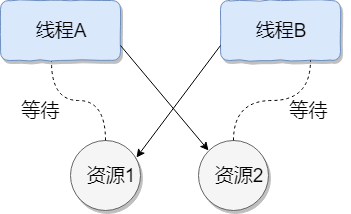

<!-- ---
sidebar: false
--- -->

# 1. 多线程-基础

## 1.1. 什么是线程和进程?

Java 程序天生就是多线程程序, 一个 Java 程序的运行是 main 线程和多个其他线程同时运行.

### 1.1.1. 何为进程?

进程是程序的一次执行过程, 是系统运行程序的基本单位, 因此进程是动态的. 系统运行一个程序即是一个进程从创建, 运行到消亡的过程.

在 Java 中, 当我们启动 main 函数时其实就是启动了一个 JVM 的进程, 而 main 函数所在的线程就是这个进程中的一个线程, 也称主线程.

### 1.1.2. 何为线程?

一个进程在其执行的过程中可以产生多个线程. 与进程不同的是同类的多个线程共享进程的堆和方法区资源, 但每个线程有自己的程序计数器, 虚拟机栈和本地方法栈, 所以系统在产生一个线程, 或是在各个线程之间作切换工作时, 负担要比进程小得多, 因此, 线程也被称为轻量级进程.

## 1.2. 说说并发与并行的区别?

1. 并发: 同一时间段, 多个任务都在执行(单位时间内不一定同时执行);
1. 并行: 单位时间内, 多个任务同时执行.

## 1.3. 为什么要使用多线程呢?

1. 从计算机底层来说: 线程可以比作是轻量级的进程, 是程序执行的最小单位,线程间的切换和调度的成本远远小于进程. 另外, 多核 CPU 时代意味着多个线程可以同时运行, 这减少了线程上下文切换的开销.
1. 从当代互联网发展趋势来说: 现在的系统动不动就要求百万级甚至千万级的并发量, 而多线程并发编程正是高并发的的基础, 利用好多线程机制可以大大提高系统整体的并发能力以及性能.

## 1.4. 使用多线程可能带来什么问题?

并发编程的目的就是为了能提高程序的执行效率, 提高程序运行速度, 但是并发编程并不总是能提高程序运行速度的, 而且并发编程可能会遇到很多问题, 比如: 内存泄漏, 上下文切换, 死锁.

## 1.5. 说说线程的生命周期和状态?

  

六种状态, 分别是新建( New) , 就绪/运行( Runnable) , 结束( Terminated) , 阻塞状态( Blocked) , 等待( Waiting) , 超时等待( Time_Waiting) .

线程创建之后它将处于 NEW(新建)状态, 调用 start()方法后开始运行, 线程这时候处于 READY(可运行)状态. 可运行状态的线程获得了 CPU 时间片(timeslice)后就处于 RUNNING(运行)状态.
当线程执行 wait()方法之后, 线程进入 WAITING(等待)状态. 进入等待状态的线程需要依靠其他线程的通知才能够返回到运行状态, 而 TIME_WAITING(超时等待)状态相当于在等待状态的基础上增加了超时限制, 比如通过 sleep(longmillis)方法或 wait(longmillis)方法可以将 Java 线程置于 TIMEDWAITING 状态. 当超时时间到达后 Java 线程将会返回到 RUNNABLE 状态. 当线程调用同步方法时, 在没有获取到锁的情况下, 线程将会进入到 BLOCKED(阻塞)状态. 线程在执行 Runnable 的 run()方法之后将会进入到 TERMINATED(终止)状态.

## 1.6. 什么是上下文切换?

多线程编程中, 一般线程的个数都大于 CPU 核心的个数, 而一个 CPU 核心在任意时刻只能被一个线程使用, 为了让这些线程都能得到有效执行, CPU 采取的策略是为每个线程分配时间片并轮转的形式. 当前任务在执行完 CPU 时间片切换到另一个任务之前会先保存自己的状态, 以便下次再切换回这个任务时, 可以再加载这个任务的状态. 任务从保存到再加载的过程就是一次上下文切换.

## 1.7. 什么是线程死锁?如何避免死锁?

### 1.7.1. 认识线程死锁

  
死锁是指两个或两个以上的进程（线程）在执行过程中同时被阻塞, 它们中的一个或者全部都在等待某个资源被释放. 由于进程(线程)被无限期地阻塞, 因此程序不可能正常终止.

#### 1.7.1.1. 产生死锁必须具备以下四个条件

1. 互斥条件: 该资源任意一个时刻只由一个线程占用.
1. 请求与保持条件: 一个线程因请求资源而阻塞时, 对已获得的资源保持不放.
1. 不剥夺条件: 线程已获得的资源在末使用完之前不能被其他线程强行剥夺, 只有自己使用完毕后才释放资源.
1. 循环等待条件: 若干线程之间形成一种头尾相接的循环等待资源关系.

## 1.8. 如何避免线程死锁?

为了避免死锁, 只要破坏产生死锁的四个条件中的其中一个就可以

1. 破坏互斥条件: 没有办法破坏, 用锁本来就是想让他们互斥的
1. 破坏请求与保持条件 : 一次性申请所有的资源.
1. 破坏不剥夺条件 : 占用部分资源的线程进一步申请其他资源时, 如果申请不到, 可以主动释放它占有的资源.
1. 破坏循环等待条件 : 靠按序申请资源来预防. 按某一顺序申请资源, 释放资源则反序释放. 破坏循环等待条件.

## 1.9. 说说 sleep()方法和 wait()方法区别和共同点?

### 1.9.1. 区别

sleep() 方法没有释放锁, 而 wait() 方法释放了锁 .

### 1.9.2. 共同点

两者都可以暂停线程的执行.

1. wait() 通常被用于线程间交互/通信, sleep()通常被用于暂停执行.
1. wait() 方法被调用后, 线程不会自动苏醒, 需要别的线程调用同一个对象上的 notify()或者 notifyAll() 方法. sleep()方法执行完成后, 线程会自动苏醒. 或者可以使用 wait(long timeout) 超时后线程会自动苏醒.

```java
public class MultiThread {
    public static void main(String[] args) {
        new Thread(new Thread1()).start();
        try {
            Thread.sleep(10);
        } catch (InterruptedException e) {
            e.printStackTrace();
        }

        new Thread(new Thread2()).start();
    }

    private static class Thread1 implements Runnable {
        @Override
        public void run() {
            synchronized (MultiThread.class) {
                try {
                    MultiThread.class.wait();
                } catch (InterruptedException e) {
                    e.printStackTrace();
                }
            }
        }
    }

    private static class Thread2 implements Runnable {
        @Override
        public void run() {
            synchronized (MultiThread.class) {
                MultiThread.class.notify();
                try {
                    Thread.sleep(10);
                } catch (InterruptedException e) {
                    e.printStackTrace();
                }
            }
        }
    }
}

```

## 1.10. 为什么我们调用 start()方法时会执行 run()方法, 为什么我们不能直接调用 run()方法?

1. new 一个 Thread, 线程进入了新建状态. 调用 start()方法, 会启动一个线程并使线程进入了就绪状态, 当分配到时间片后就可以开始运行了. start()会执行线程的相应准备工作, 然后自动执行 run()方法的内容, 这是真正的多线程工作.
1. 直接执行 run()方法, 会把 run()方法当成一个 main 线程下的普通方法去执行, 并不会在某个线程中执行它, 所以这并不是多线程工作.
