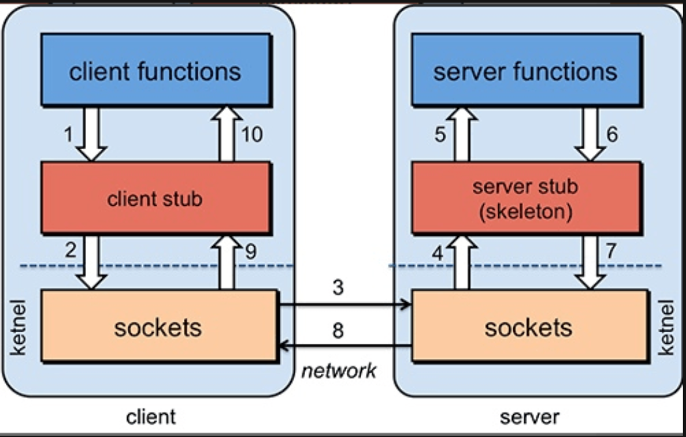
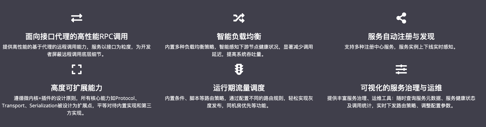
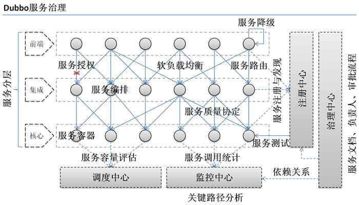
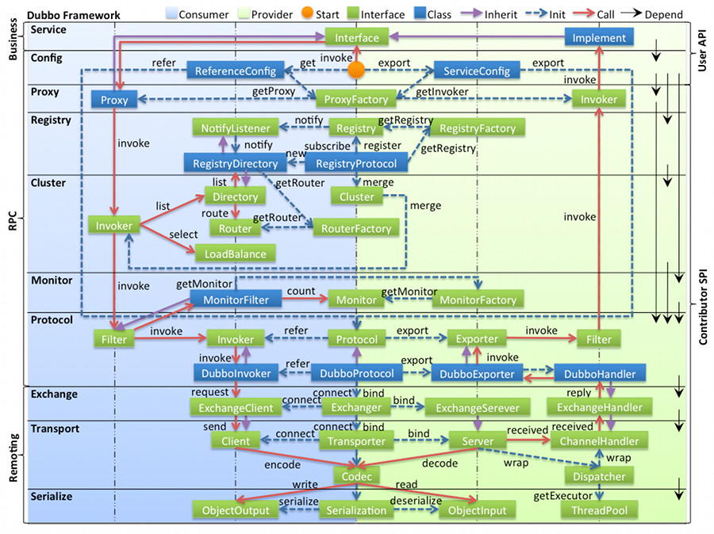

<!-- ---
sidebar: false
--- -->

# 1. dubbo

## 1.1. 何为 RPC?

RPC(Remote Procedure Call) 即远程过程调用协议, 它是一种通过网络从远程计算机程序上请求服务，而不需要了解底层网络技术的协议。

## 1.2. RPC 架构

一个完整的 RPC 架构里面包含了四个核心的组件，分别是 Client，Client Stub，Server 以及 Server Stub，这个 Stub 可以理解为存根。

1. 客户端(Client)，服务的调用方。
1. 客户端存根(Client Stub)，存放服务端的地址消息，再将客户端的请求参数打包成网络消息，然后通过网络远程发送给服务方。
1. 服务端(Server)，真正的服务提供者。
1. 服务端存根(Server Stub)，接收客户端发送过来的消息，将消息解包，并调用本地的方法。

## 1.3. RPC 的原理是什么?

1. 客户端（client）以本地调用方式（即以接口的方式）调用服务；
1. 客户端存根（client stub）接收到调用后，负责将方法、参数等组装成能够进行网络传输的消息体（将消息体对象序列化为二进制）；
1. 客户端通过 sockets 将消息发送到服务端；
1. 服务端存根( server stub）收到消息后进行解码（将消息对象反序列化）；
1. 服务端存根( server stub）根据解码结果调用本地的服务；
1. 本地服务执行并将结果返回给服务端存根( server stub）；
1. 服务端存根( server stub）将返回结果打包成消息（将结果消息对象序列化）；
1. 服务端（server）通过 sockets 将消息发送到客户端；
1. 客户端存根（client stub）接收到结果消息，并进行解码（将结果消息发序列化）；
1. 客户端（client）得到最终结果。

## 1.4. 什么是 Dubbo?

Dubbo 是一个分布式, 高性能, 透明化的 基于 Java 的 RPC 分布式服务框架, 提供服务自动注册, 自动发现等高效服务治理方案

### 1.4.1. Dubbo 提供了六大核心能力

1. 面向接口代理的高性能 RPC 调用.
2. 智能容错和负载均衡.
3. 服务自动注册和发现.
4. 高度可扩展能力.
5. 运行期流量调度.
6. 可视化的服务治理与运维.

## 1.5. 为什么要用 Dubbo?

### 1.5.1. Dubbo 的出现解决了以下问题?

1. 负载均衡: 同一个服务部署在不同的机器时该调用哪一台机器上的服务.
2. 服务调用链路生成: 随着系统的发展, 服务越来越多, 服务间依赖关系变得错踪复杂, 甚至分不清哪个应用要在哪个应用之前启动,Dubbo 可以为解决服务之间互相是如何调用的.
3. 服务访问压力以及时长统计, 资源调度和治理: 基于访问压力实时管理集群容量, 提高集群利用率.
   

另外, Dubbo 除了能够应用在分布式系统中, 也可以应用在现在比较火的微服务系统中. 不过, 由于 Spring Cloud 在微服务中应用更加广泛, 所以, 觉得一般提 Dubbo 的话, 大部分是分布式系统的情况.

## 1.6. 什么是分布式?

分布式就是把整个系统拆分成不同的服务, 然后将这些服务放在不同的服务器上减轻单体服务的压力以提高并发量和性能.

> 比如电商系统可以简单地拆分成订单系统, 商品系统, 登录系统等等, 拆分之后的每个服务可以部署在不同的机器上, 如果某一个服务的访问量比较大的话也可以将这个服务同时部署在多台机器上.

## 1.7. 为什么要分布式?

单体应用的代码都集中在一起, 而分布式系统的代码根据业务被拆分. 所以, 每个团队可以负责一个服务的开发, 这样提升了开发效率. 另外, 代码根据业务拆分之后更加便于维护和扩展, 更能提高整个系统的性能.

## 1.8. Dubbo 架构中的核心角色有哪些?

1. Container:服务运行容器, 负责加载, 运行服务提供者. 必须.
1. Provider:暴露服务的服务提供方, 会向注册中心注册自己提供的服务. 必须.
1. Consumer:调用远程服务的服务消费方, 会向注册中心订阅自己所需的服务. 必须.
1. Registry:服务注册与发现的注册中心. 注册中心会返回服务提供者地址列表给消费者. 非必须.
1. Monitor:统计服务的调用次数和调用时间的监控中心. 服务消费者和提供者会定时发送统计数据到监控中心. 非必须.

## 1.9. Dubbo 中的 Invoker 概念了解么?

Invoker 就是 Dubbo 对远程调用的抽象.

Invoker 是 Dubbo 中的实体域，也就是真实存在的。其他模型都向它靠拢或转换成它，它也就代表一个可执行体，可向它发起 invoke 调用。在服务提供方，Invoker 用于调用服务提供类。在服务消费方，Invoker 用于执行远程调用。

Invoker 分为服务提供 Invoker, 服务消费 Invoker

假如需要调用一个远程方法, 需要动态代理来屏蔽远程调用的细节吧! 屏蔽掉的这些细节就依赖对应的 Invoker 实现, Invoker 实现了真正的远程服务调用.

## 1.10. Dubbo 的工作原理了解么?

下图是 Dubbo 的整体设计, 从下至上分为十层, 各层均为单向依赖.

> 左边淡蓝背景的为服务消费方使用的接口, 右边淡绿色背景的为服务提供方使用的接口, 位于中轴线上的为双方都用到的接口.

- config 配置层:Dubbo 相关的配置. 支持代码配置, 同时也支持基于 Spring 来做配置, 以 ServiceConfig, ReferenceConfig 为中心
- proxy 服务代理层: 调用远程方法像调用本地的方法一样简单的一个关键, 真实调用过程依赖代理类, 以 ServiceProxy 为中心.
- registry 注册中心层: 封装服务地址的注册与发现.
- cluster 路由层: 封装多个提供者的路由及负载均衡, 并桥接注册中心, 以 Invoker 为中心.
- monitor 监控层:RPC 调用次数和调用时间监控, 以 Statistics 为中心.
- protocol 远程调用层: 封装 RPC 调用, 以 Invocation, Result 为中心.
- exchange 信息交换层: 封装请求响应模式, 同步转异步, 以 Request, Response 为中心.
- transport 网络传输层: 抽象 mina 和 netty 为统一接口, 以 Message 为中心.
- serialize 数据序列化层: 对需要在网络传输的数据进行序列化.

## 1.11. Dubbo 的 SPI 机制了解么? 如何扩展 Dubbo 中的默认实现?

SPI(Service Provider Interface) 机制被大量用在开源项目中, 它可以帮助动态寻找服务/功能 (比如负载均衡策略) 的实现.

SPI 的具体原理是这样的: 将接口的实现类放在配置文件中, 在程序运行过程中读取配置文件, 通过反射加载实现类. 这样, 可以在运行的时候, 动态替换接口的实现类. 和 IoC 的解耦思想是类似的.

## 1.12. Dubbo 的微内核架构了解吗?

微内核架构包含两类组件: 核心系统 (core system) 和 插件模块 (plug-in modules).

Dubbo 采用 微内核 (Microkernel) + 插件 (Plugin) 模式,微内核只负责组装插件.

核心系统提供系统所需核心能力, 插件模块可以扩展系统的功能. 因此, 基于微内核架构的系统, 非常易于扩展功能.

正是因为 Dubbo 基于微内核架构, 才使得可以随心所欲替换 Dubbo 的功能点.

> 比如觉得 Dubbo 的序列化模块实现的不满足自己要求, 没关系啊! 你自己实现一个序列化模块就好了啊!

## 1.13. 注册中心的作用了解么?

注册中心负责服务地址的注册与查找, 相当于目录服务, 服务提供者和消费者只在启动时与注册中心交互.

## 1.14. 服务提供者宕机后, 注册中心会做什么?

注册中心会立即推送事件通知消费者.

## 1.15. 监控中心的作用呢?

监控中心负责统计各服务调用次数, 调用时间等.

## 1.16. 注册中心和监控中心都宕机的话, 服务都会挂掉吗?

不会. 两者都宕机也不影响已运行的提供者和消费者, 消费者在本地缓存了提供者列表. 注册中心和监控中心都是可选的, 服务消费者可以直连服务提供者.

## 1.17. 什么是负载均衡?

系统中的某个服务的访问量特别大, 将这个服务部署在了多台服务器上, 当客户端发起请求的时候, 多台服务器都可以处理这个请求. 负载均衡就是为了避免单个服务器响应同一请求, 造成服务器宕机, 崩溃等问题

## 1.18. Dubbo 提供的负载均衡策略有哪些?

1. RandomLoadBalance:随机负载均衡。随机的选择一个。是 Dubbo 的默认负载均衡策略。
1. RoundRobinLoadBalance:轮询负载均衡。轮询选择一个。
1. LeastActiveLoadBalance:最少活跃调用数，相同活跃数的随机。活跃数指调用前后计数差。使慢的 Provider 收到更少请求，因为越慢的 Provider 的调用前后计数差会越大。
1. ConsistentHashLoadBalance:一致性哈希负载均衡。相同参数的请求总是落在同一台机器上。

## 1.19. Dubbo 支持哪些协议, 每种协议的应用场景, 优缺点?

1. dubbo: (默认协议)

   单一长连接和 NIO 异步通讯, 适合大并发小数据量的服务调用, 以及消费者远大于提供者. 传输协议 TCP, 异步, Hessian 序列化;

1. rmi:

   采用 JDK 标准的 rmi 协议实现, 传输参数和返回参数对象需要实现 Serializable 接口, 使用 java 标准序列化机制, 使用阻塞式短连接, 传输数据包大小混合, 消费者和提供者个数差不多, 可传文件, 传输协议 TCP.多个短连接, TCP 协议传输, 同步传输, 适用常规的远程服务调用和 rmi 互操作. 在依赖低版本的 Common-Collections 包, java 序列化存在安全漏洞;

1. http:

   基于 Http 表单提交的远程调用协议, 使用 Spring 的 HttpInvoke 实现. 多个短连接, 传输协议 HTTP, 传入参数大小混合, 提供者个数多于消费者, 需要给应用程序和浏览器 JS 调用;

1. webservice:

   基于 WebService 的远程调用协议, 集成 CXF 实现, 提供和原生 WebService 的互操作. 多个短连接, 基于 HTTP 传输, 同步传输, 适用系统集成和跨语言调用;

1. hessian:

   集成 Hessian 服务, 基于 HTTP 通讯, 采用 Servlet 暴露服务, Dubbo 内嵌 Jetty 作为服务器时默认实现, 提供与 Hession 服务互操作. 多个短连接, 同步 HTTP 传输, Hessian 序列化, 传入参数较大, 提供者大于消费者, 提供者压力较大, 可传文件;

1. redis:

   基于 redis 实现的 RPC 协议

## 1.20. Dubbo 超时时间怎样设置?

1. 服务提供者端设置超时时间

   在 Dubbo 的用户文档中, 推荐如果能在服务端多配置就尽量多配置, 因为服务提供者比消费者更清楚自己提供的服务特性.

1. 服务消费者端设置超时时间

   如果在消费者端设置了超时时间, 以消费者端为主, 即优先级更高. 因为服务调用方设置超时时间控制性更灵活. 如果消费方超时, 服务端线程不会定制, 会产生警告.

## 1.21. Dubbo 有些哪些注册中心?

1. Zookeeper 注册中心:

   基于分布式协调系统 Zookeeper 实现, 采用 Zookeeper 的 watch 机制实现数据变更;

1. Multicast 注册中心:

   Multicast 注册中心不需要任何中心节点, 只要广播地址, 就能进行服务注册和发现. 基于网络中组播传输实现;

1. redis 注册中心:

   基于 redis 实现, 采用 key/Map 存储, 住 key 存储服务名和类型, Map 中 key 存储服务 URL, value 服务过期时间. 基于 redis 的发布/订阅模式通知数据变更;

1. Simple 注册中心

## 1.22. Dubbo 的主要应用场景?

1. 透明化的远程方法调用, 就像调用本地方法一样调用远程方法, 只需简单配置, 没有任何 API 侵入.
1. 软负载均衡及容错机制, 可在内网替代 F5 等硬件负载均衡器, 降低成本, 减少单点.
1. 服务自动注册与发现, 不再需要写死服务提供方地址, 注册中心基于接口名查询服务提供者的 IP 地址, 并且能够平滑添加或删除服务提供者.

## 1.23. Dubbo 的核心功能?

1. Remoting: 网络通信框架, 提供对多种 NIO 框架抽象封装, 包括 "同步转异步" 和 "请求 - 响应" 模式的信息交换方式.
1. Cluster:服务框架, 提供基于接口方法的透明远程过程调用, 包括多协议支持, 以及软负载均衡, 失败容错, 地址路由, 动态配置等集群支持.
1. Registry:服务注册, 基于注册中心目录服务, 使服务消费方能动态的查找服务提供方, 使地址透明, 使服务提供方可以平滑增加或减少机器.

## 1.24. 为什么需要服务治理?

1. 过多的服务 URL 配置困难
1. 负载均衡分配节点压力过大的情况下也需要部署集群
1. 服务依赖混乱, 启动顺序不清晰
1. 过多服务导致性能指标分析难度较大, 需要监控

## 1.25. Dubbo 使用的是什么通信框架?

默认使用 NIO Netty 框架

## 1.26. Dubbo 集群提供了哪些负载均衡策略?

1. Random LoadBalance: 随机选取提供者策略, 有利于动态调整提供者权重. 截面碰撞率高, 调用次数越多, 分布越均匀;
1. RoundRobin LoadBalance: 轮循选取提供者策略, 平均分布, 但是存在请求累积的问题;  LeastActive LoadBalance: 最少活跃调用策略, 解决慢提供者接收更少的请求;
1. ConstantHash LoadBalance: 一致性 Hash 策略, 使相同参数请求总是发到同一提供者, 一台机器宕机, 可以基于虚拟节点, 分摊至其他提供者, 避免引起提供者的剧烈变动;
1. 缺省时为 Random 随机调用

## 1.27. Dubbo 的集群容错方案有哪些?

1. Failover Cluster (默认)
   失败自动切换, 当出现失败, 重试其它服务器. 通常用于读操作, 但重试会带来更长延迟.
1. Failfast Cluster
   快速失败, 只发起一次调用, 失败立即报错. 通常用于非幂等性的写操作, 比如新增记录.
1. Failsafe Cluster
   失败安全, 出现异常时, 直接忽略. 通常用于写入审计日志等操作.
1. Failback Cluster
   失败自动恢复, 后台记录失败请求, 定时重发. 通常用于消息通知操作.
1. Forking Cluster
   并行调用多个服务器, 只要一个成功即返回. 通常用于实时性要求较高的读操作, 但需要浪费更多服务资源. 可通过 forks="2" 来设置最大并行数.
1. Broadcast Cluster
   广播调用所有提供者, 逐个调用, 任意一台报错则报错 . 通常用于通知所有提供者更新缓存或日志等本地资源信息

## 1.28. Dubbo 支持哪些序列化方式?

默认使用 Hessian 序列化, 还有 Duddo, FastJson, Java 自带序列化.

## 1.29. 服务调用超时问题怎么解决?

dubbo 在调用服务不成功时, 默认是会重试两次的.

## 1.30. Dubbo 在安全机制方面是如何解决?

Dubbo 通过 Token 令牌防止用户绕过注册中心直连, 然后在注册中心上管理授权. Dubbo 还提供服务黑白名单, 来控制服务所允许的调用方.

## 1.31. Dubbo 与 Spring 的关系?

Dubbo 采用全 Spring 配置方式, 透明化接入应用, 对应用没有任何 API 侵入, 只需用 Spring 加载 Dubbo 的配置即可, Dubbo 基于 Spring 的 Schema 扩展进行加载.

## 1.32. Dubbo 和 Spring Cloud 的关系?

1. Dubbo SOA 的产物 (Service Oriented Ambiguity) 即面向服务架构, 是基于 TCP 协议传输的, 配合以 Hession 序列化完成 RPC 通信. 主要在于服务的调用, 流量分发, 流量监控和熔断. 定位服务治理
1. Spring Cloud 是基于 Http 协议 + Rest 接口调用远程过程的通信, 考虑的是微服务治理
