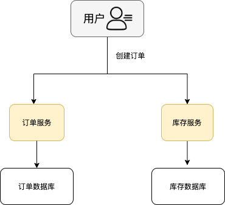
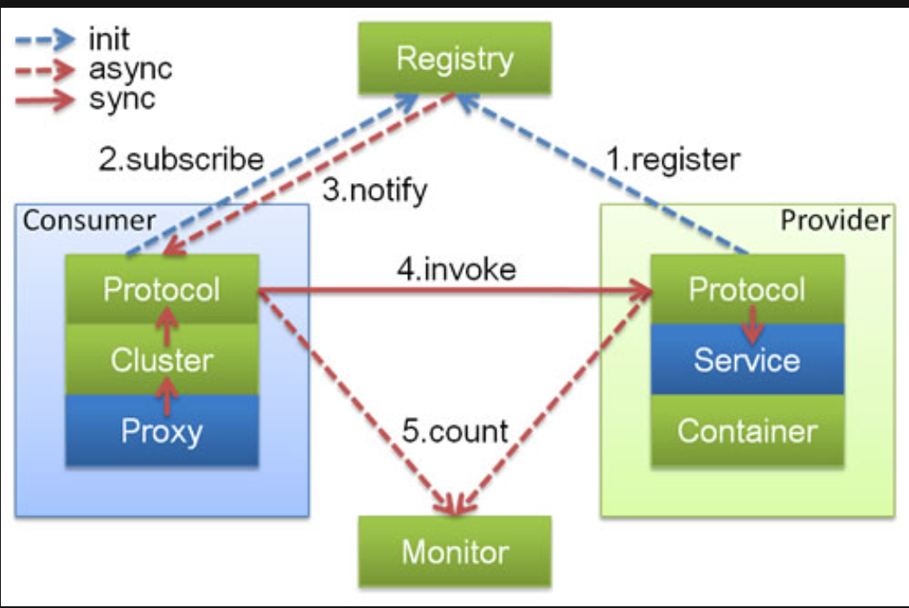
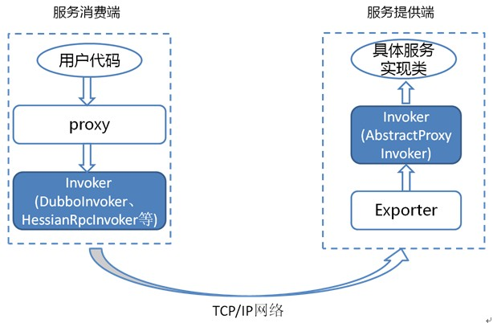
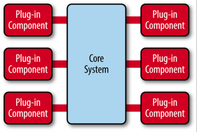

# 1. dubbo

## 1.1. 何为 RPC?

RPC(Remote Procedure Call) 即远程过程调用，通过 RPC 可以帮助调用远程计算机上某个服务的方法，这个过程就像调用本地方法一样简单。并且！不需要了解底层网络编程的具体细节.( TCP 还是 UDP，序列化方式等等方面.)

## 1.2. RPC 的原理是什么？


1. 服务消费端 (client) 以本地调用的方式调用远程服务;
1. 客户端 Stub(client stub) 接收到调用后负责将方法，参数等组装成能够进行网络传输的消息体 (序列化):RpcRequest;
1. 客户端 Stub(client stub) 找到远程服务的地址，并将消息发送到服务提供端;
1. 服务端 Stub(桩) 收到消息将消息反序列化为 Java 对象: RpcRequest;
1. 服务端 Stub(桩) 根据 RpcRequest 中的类，方法，方法参数等信息调用本地的方法;
1. 服务端 Stub(桩) 得到方法执行结果并将组装成能够进行网络传输的消息体:RpcResponse(序列化) 发送至消费方;
1. 客户端 Stub(client stub) 接收到消息并将消息反序列化为 Java 对象:RpcResponse ,这样也就得到了最终结果.over!

## 1.3. 什么是 Dubbo?

Dubbo 是阿里巴巴开源的基于 Java 的高性能 RPC 分布式服务框架，现已成为 Apache 的项目。由于 Dubbo 的出现，才使得越来越多的公司开始使用以及接受分布式架构。


### 1.3.1. Dubbo 提供了六大核心能力

1. 面向接口代理的高性能 RPC 调用。
2. 智能容错和负载均衡。
3. 服务自动注册和发现。
4. 高度可扩展能力。
5. 运行期流量调度。
6. 可视化的服务治理与运维。

## 1.4. 为什么要用 Dubbo?

随着互联网的发展，网站的规模越来越大，用户数量越来越多。单一应用架构 ,垂直应用架构无法满足的需求，这个时候分布式服务架构就诞生了。

分布式服务架构下，系统被拆分成不同的服务比如短信服务，安全服务，每个服务独立提供系统的某个核心服务。

Dubbo 的出现解决了以下问题？

1. 负载均衡：同一个服务部署在不同的机器时该调用哪一台机器上的服务。
2. 服务调用链路生成：随着系统的发展，服务越来越多，服务间依赖关系变得错踪复杂，甚至分不清哪个应用要在哪个应用之前启动，架构师都不能完整的描述应用的架构关系.Dubbo 可以为解决服务之间互相是如何调用的。
3. 服务访问压力以及时长统计，资源调度和治理：基于访问压力实时管理集群容量，提高集群利用率。
   

另外，Dubbo 除了能够应用在分布式系统中，也可以应用在现在比较火的微服务系统中。不过，由于 Spring Cloud 在微服务中应用更加广泛，所以，觉得一般提 Dubbo 的话，大部分是分布式系统的情况。

## 1.5. 什么是分布式？

分布式就是把整个系统拆分成不同的服务然后将这些服务放在不同的服务器上减轻单体服务的压力以提高并发量和性能。

比如电商系统可以简单地拆分成订单系统，商品系统，登录系统等等，拆分之后的每个服务可以部署在不同的机器上，如果某一个服务的访问量比较大的话也可以将这个服务同时部署在多台机器上。



## 1.6. 为什么要分布式？

从开发角度来讲单体应用的代码都集中在一起，而分布式系统的代码根据业务被拆分。所以，每个团队可以负责一个服务的开发，这样提升了开发效率。另外，代码根据业务拆分之后更加便于维护和扩展。

另外，将系统拆分成分布式之后不光便于系统扩展和维护，更能提高整个系统的性能。

## 1.7. Dubbo 架构中的核心角色有哪些？



- Container:服务运行容器，负责加载，运行服务提供者。必须。
- Provider:暴露服务的服务提供方，会向注册中心注册自己提供的服务。必须。
- Consumer:调用远程服务的服务消费方，会向注册中心订阅自己所需的服务。必须。
- Registry:服务注册与发现的注册中心。注册中心会返回服务提供者地址列表给消费者。非必须。
- Monitor:统计服务的调用次数和调用时间的监控中心。服务消费者和提供者会定时发送统计数据到监控中心。非必须。

## 1.8. Dubbo 中的 Invoker 概念了解么？

Invoker 就是 Dubbo 对远程调用的抽象。



按照 Dubbo 官方的话来说，Invoker 分为

- 服务提供 Invoker
- 服务消费 Invoker

假如需要调用一个远程方法，需要动态代理来屏蔽远程调用的细节吧！屏蔽掉的这些细节就依赖对应的 Invoker 实现，Invoker 实现了真正的远程服务调用。

## 1.9. Dubbo 的工作原理了解么？

下图是 Dubbo 的整体设计，从下至上分为十层，各层均为单向依赖。

> 左边淡蓝背景的为服务消费方使用的接口，右边淡绿色背景的为服务提供方使用的接口，位于中轴线上的为双方都用到的接口。


- config 配置层:Dubbo 相关的配置。支持代码配置，同时也支持基于 Spring 来做配置，以 ServiceConfig, ReferenceConfig 为中心
- proxy 服务代理层：调用远程方法像调用本地的方法一样简单的一个关键，真实调用过程依赖代理类，以 ServiceProxy 为中心。
- registry 注册中心层：封装服务地址的注册与发现。
- cluster 路由层：封装多个提供者的路由及负载均衡，并桥接注册中心，以 Invoker 为中心。
- monitor 监控层:RPC 调用次数和调用时间监控，以 Statistics 为中心。
- protocol 远程调用层：封装 RPC 调用，以 Invocation, Result 为中心。
- exchange 信息交换层：封装请求响应模式，同步转异步，以 Request, Response 为中心。
- transport 网络传输层：抽象 mina 和 netty 为统一接口，以 Message 为中心。
- serialize 数据序列化层：对需要在网络传输的数据进行序列化。

## 1.10. Dubbo 的 SPI 机制了解么？如何扩展 Dubbo 中的默认实现？

SPI(Service Provider Interface) 机制被大量用在开源项目中，它可以帮助动态寻找服务/功能 (比如负载均衡策略) 的实现。

SPI 的具体原理是这样的：将接口的实现类放在配置文件中，在程序运行过程中读取配置文件，通过反射加载实现类。这样，可以在运行的时候，动态替换接口的实现类。和 IoC 的解耦思想是类似的。

Java 本身就提供了 SPI 机制的实现。不过，Dubbo 没有直接用，而是对 Java 原生的 SPI 机制进行了增强，以便更好满足自己的需求。

那如何扩展 Dubbo 中的默认实现呢？

比如说想要实现自己的负载均衡策略，创建对应的实现类 XxxLoadBalance 实现 LoadBalance 接口或者 AbstractLoadBalance 类。

```java
package com.xxx;

import org.apache.dubbo.rpc.cluster.LoadBalance;
import org.apache.dubbo.rpc.Invoker;
import org.apache.dubbo.rpc.Invocation;
import org.apache.dubbo.rpc.RpcException;

public class XxxLoadBalance implements LoadBalance {
    public <T> Invoker<T> select(List<Invoker<T>> invokers, Invocation invocation) throws RpcException {
        // ...
    }
}
```

将这个实现类的路径写入到 resources 目录下的 META-INF/dubbo/org.apache.dubbo.rpc.cluster.LoadBalance 文件中即可。

```java
src
 |-main
    |-java
        |-com
            |-xxx
                |-XxxLoadBalance.java (实现 LoadBalance 接口)
    |-resources
        |-META-INF
            |-dubbo
                |-org.apache.dubbo.rpc.cluster.LoadBalance (纯文本文件，内容为:xxx=com.xxx.XxxLoadBalance)
```

org.apache.dubbo.rpc.cluster.LoadBalance

```
xxx=com.xxx.XxxLoadBalance
```

其他还有很多可供扩展的选择，你可以在[官方文档 @SPI 扩展实现](https://dubbo.apache.org/zh/docs/v2.7/dev/impls/)这里找到。


## 1.11. Dubbo 的微内核架构了解吗？

Dubbo 采用 微内核 (Microkernel) + 插件 (Plugin) 模式，简单来说就是微内核架构。微内核只负责组装插件。

微内核架构包含两类组件：核心系统 (core system) 和 插件模块 (plug-in modules).



核心系统提供系统所需核心能力，插件模块可以扩展系统的功能。因此，基于微内核架构的系统，非常易于扩展功能。

正是因为 Dubbo 基于微内核架构，才使得可以随心所欲替换 Dubbo 的功能点。比如你觉得 Dubbo 的序列化模块实现的不满足自己要求，没关系啊！你自己实现一个序列化模块就好了啊！

通常情况下，微核心都会采用 Factory,IoC,OSGi 等方式管理插件生命周期.Dubbo 不想依赖 Spring 等 IoC 容器，也不想自己造一个小的 IoC 容器 (过度设计),因此采用了一种最简单的 Factory 方式管理插件 :JDK 标准的 SPI 扩展机制 (java.util.ServiceLoader).

## 1.12. 注册中心的作用了解么？

注册中心负责服务地址的注册与查找，相当于目录服务，服务提供者和消费者只在启动时与注册中心交互。

## 1.13. 服务提供者宕机后，注册中心会做什么？

注册中心会立即推送事件通知消费者。

## 1.14. 监控中心的作用呢？

监控中心负责统计各服务调用次数，调用时间等。

## 1.15. 注册中心和监控中心都宕机的话，服务都会挂掉吗？

不会。两者都宕机也不影响已运行的提供者和消费者，消费者在本地缓存了提供者列表。注册中心和监控中心都是可选的，服务消费者可以直连服务提供者。

## 1.16. 什么是负载均衡？

系统中的某个服务的访问量特别大，将这个服务部署在了多台服务器上，当客户端发起请求的时候，多台服务器都可以处理这个请求。那么，如何正确选择处理该请求的服务器就很关键。假如，你就要一台服务器来处理该服务的请求，那该服务部署在多台服务器的意义就不复存在了。负载均衡就是为了避免单个服务器响应同一请求，容易造成服务器宕机，崩溃等问题

## 1.17. Dubbo 提供的负载均衡策略有哪些？

在集群负载均衡时，Dubbo 提供了多种均衡策略，默认为 random 随机调用。还可以自行扩展负载均衡策略 (参考 Dubbo SPI 机制).

在 Dubbo 中，所有负载均衡实现类均继承自 AbstractLoadBalance，该类实现了 LoadBalance 接口，并封装了一些公共的逻辑。

```java
public abstract class AbstractLoadBalance implements LoadBalance {

    static int calculateWarmupWeight(int uptime, int warmup, int weight) {
    }

    @Override
    public <T> Invoker<T> select(List<Invoker<T>> invokers, URL url, Invocation invocation) {
    }

    protected abstract <T> Invoker<T> doSelect(List<Invoker<T>> invokers, URL url, Invocation invocation);


    int getWeight(Invoker<?> invoker, Invocation invocation) {

    }
}
```

AbstractLoadBalance 的实现类有下面这些：


### 1.17.1. RandomLoadBalance

根据权重随机选择 (对加权随机算法的实现).这是 Dubbo 默认采用的一种负载均衡策略。

RandomLoadBalance 具体的实现原理非常简单，假如有两个提供相同服务的服务器 S1,S2,S1 的权重为 7,S2 的权重为 3.

把这些权重值分布在坐标区间会得到:S1->[0, 7) ,S2->[7, 10).生成 [0, 10) 之间的随机数，随机数落到对应的区间，就选择对应的服务器来处理请求。


RandomLoadBalance 的源码非常简单，简单花几分钟时间看一下。

> 以下源码来自 Dubbo master 分支上的最新的版本 2.7.9.

```java
public class RandomLoadBalance extends AbstractLoadBalance {

    public static final String NAME = "random";

    @Override
    protected <T> Invoker<T> doSelect(List<Invoker<T>> invokers, URL url, Invocation invocation) {

        int length = invokers.size();
        boolean sameWeight = true;
        int[] weights = new int[length];
        int totalWeight = 0;
        // 下面这个 for 循环的主要作用就是计算所有该服务的提供者的权重之和 totalWeight(),
        // 除此之外，还会检测每个服务提供者的权重是否相同
        for (int i = 0; i < length; i++) {
            int weight = getWeight(invokers.get(i), invocation);
            totalWeight += weight;
            weights[i] = totalWeight;
            if (sameWeight && totalWeight != weight * (i + 1)) {
                sameWeight = false;
            }
        }
        if (totalWeight > 0 && !sameWeight) {
            // 随机生成一个 [0, totalWeight) 区间内的数字
            int offset = ThreadLocalRandom.current().nextInt(totalWeight);
            // 判断会落在哪个服务提供者的区间
            for (int i = 0; i < length; i++) {
                if (offset < weights[i]) {
                    return invokers.get(i);
                }
            }

        return invokers.get(ThreadLocalRandom.current().nextInt(length));
    }

}

```

### 1.17.2. LeastActiveLoadBalance

LeastActiveLoadBalance 最小活跃数负载均衡。

这个名字起得有点不直观，不仔细看官方对活跃数的定义，你压根不知道这玩意是干嘛的。

这么说吧！初始状态下所有服务提供者的活跃数均为 0(每个服务提供者的中特定方法都对应一个活跃数，在后面的源码中会提到),每收到一个请求后，对应的服务提供者的活跃数 +1，当这个请求处理完之后，活跃数 -1.

因此，Dubbo 就认为谁的活跃数越少，谁的处理速度就越快，性能也越好，这样的话，就优先把请求给活跃数少的服务提供者处理。

如果有多个服务提供者的活跃数相等怎么办？

很简单，那就再走一遍 RandomLoadBalance .

```java
public class LeastActiveLoadBalance extends AbstractLoadBalance {

    public static final String NAME = "leastactive";

    @Override
    protected <T> Invoker<T> doSelect(List<Invoker<T>> invokers, URL url, Invocation invocation) {
        int length = invokers.size();
        int leastActive = -1;
        int leastCount = 0;
        int[] leastIndexes = new int[length];
        int[] weights = new int[length];
        int totalWeight = 0;
        int firstWeight = 0;
        boolean sameWeight = true;
        // 这个 for 循环的主要作用是遍历 invokers 列表，找出活跃数最小的 Invoker
        // 如果有多个 Invoker 具有相同的最小活跃数，还会记录下这些 Invoker 在 invokers 集合中的下标，并累加它们的权重，比较它们的权重值是否相等
        for (int i = 0; i < length; i++) {
            Invoker<T> invoker = invokers.get(i);
            // 获取 invoker 对应的活跃 (active) 数
            int active = RpcStatus.getStatus(invoker.getUrl(), invocation.getMethodName()).getActive();
            int afterWarmup = getWeight(invoker, invocation);
            weights[i] = afterWarmup;
            if (leastActive == -1 || active < leastActive) {
                leastActive = active;
                leastCount = 1;
                leastIndexes[0] = i;
                totalWeight = afterWarmup;
                firstWeight = afterWarmup;
                sameWeight = true;
            } else if (active == leastActive) {
                leastIndexes[leastCount++] = i;
                totalWeight += afterWarmup;
                if (sameWeight && afterWarmup != firstWeight) {
                    sameWeight = false;
                }
            }
        }
       // 如果只有一个 Invoker 具有最小的活跃数，此时直接返回该 Invoker 即可
        if (leastCount == 1) {
            return invokers.get(leastIndexes[0]);
        }
        // 如果有多个 Invoker 具有相同的最小活跃数，但它们之间的权重不同
        // 这里的处理方式就和  RandomLoadBalance 一致了
        if (!sameWeight && totalWeight > 0) {
            int offsetWeight = ThreadLocalRandom.current().nextInt(totalWeight);
            for (int i = 0; i < leastCount; i++) {
                int leastIndex = leastIndexes[i];
                offsetWeight -= weights[leastIndex];
                if (offsetWeight < 0) {
                    return invokers.get(leastIndex);
                }
            }
        }
        return invokers.get(leastIndexes[ThreadLocalRandom.current().nextInt(leastCount)]);
    }
}

```

活跃数是通过 RpcStatus 中的一个 ConcurrentMap 保存的，根据 URL 以及服务提供者被调用的方法的名称，便可以获取到对应的活跃数。也就是说服务提供者中的每一个方法的活跃数都是互相独立的。

```java
public class RpcStatus {

    private static final ConcurrentMap<String, ConcurrentMap<String, RpcStatus>> METHOD_STATISTICS =
            new ConcurrentHashMap<String, ConcurrentMap<String, RpcStatus>>();

   public static RpcStatus getStatus(URL url, String methodName) {
        String uri = url.toIdentityString();
        ConcurrentMap<String, RpcStatus> map = METHOD_STATISTICS.computeIfAbsent(uri, k -> new ConcurrentHashMap<>());
        return map.computeIfAbsent(methodName, k -> new RpcStatus());
    }
    public int getActive() {
        return active.get();
    }

}
```

### 1.17.3. ConsistentHashLoadBalance

ConsistentHashLoadBalance 小伙伴们应该也不会陌生，在分库分表，各种集群中就经常使用这个负载均衡策略。

ConsistentHashLoadBalance 即一致性 Hash 负载均衡策略. ConsistentHashLoadBalance 中没有权重的概念，具体是哪个服务提供者处理请求是由你的请求的参数决定的，也就是说相同参数的请求总是发到同一个服务提供者。


另外，Dubbo 为了避免数据倾斜问题 (节点不够分散，大量请求落到同一节点),还引入了虚拟节点的概念。通过虚拟节点可以让节点更加分散，有效均衡各个节点的请求量。


官方有详细的源码分析：[https://dubbo.apache.org/zh/docs/v2.7/dev/source/loadbalance/#23-consistenthashloadbalance](https://dubbo.apache.org/zh/docs/v2.7/dev/source/loadbalance/#23-consistenthashloadbalance) .这里还有一个相关的 [PR#5440](https://github.com/apache/dubbo/pull/5440) 来修复老版本中 ConsistentHashLoadBalance 存在的一些 Bug.感兴趣的小伙伴，可以多花点时间研究一下。这里不多分析了，这个作业留给你们！

### 1.17.4. RoundRobinLoadBalance

加权轮询负载均衡。

轮询就是把请求依次分配给每个服务提供者。加权轮询就是在轮询的基础上，让更多的请求落到权重更大的服务提供者上。比如假如有两个提供相同服务的服务器 S1,S2,S1 的权重为 7,S2 的权重为 3.

如果有 10 次请求，那么 7 次会被 S1 处理，3 次被 S2 处理。

但是，如果是 RandomLoadBalance 的话，很可能存在 10 次请求有 9 次都被 S1 处理的情况 (概率性问题).

Dubbo 中的 RoundRobinLoadBalance 的代码实现被修改重建了好几次，Dubbo-2.6.5 版本的 RoundRobinLoadBalance 为平滑加权轮询算法。

## 1.20. Dubbo 支持哪些协议，每种协议的应用场景，优缺点？

- dubbo: 单一长连接和 NIO 异步通讯，适合大并发小数据量的服务调用，以及消费者远大于提供者。传输协议 TCP，异步，Hessian 序列化;
- rmi: 采用 JDK 标准的 rmi 协议实现，传输参数和返回参数对象需要实现 Serializable 接口，使用 java 标准序列化机制，使用阻塞式短连接，传输数据包大小混合，消费者和提供者个数差不多，可传文件，传输协议 TCP.多个短连接，TCP 协议传输，同步传输，适用常规的远程服务调用和 rmi 互操作。在依赖低版本的 Common-Collections 包，java 序列化存在安全漏洞;
- http: 基于 Http 表单提交的远程调用协议，使用 Spring 的 HttpInvoke 实现。多个短连接，传输协议 HTTP，传入参数大小混合，提供者个数多于消费者，需要给应用程序和浏览器 JS 调用;
- webservice: 基于 WebService 的远程调用协议，集成 CXF 实现，提供和原生 WebService 的互操作。多个短连接，基于 HTTP 传输，同步传输，适用系统集成和跨语言调用;
- hessian: 集成 Hessian 服务，基于 HTTP 通讯，采用 Servlet 暴露服务，Dubbo 内嵌 Jetty 作为服务器时默认实现，提供与 Hession 服务互操作。多个短连接，同步 HTTP 传输，Hessian 序列化，传入参数较大，提供者大于消费者，提供者压力较大，可传文件;
- redis: 基于 redis 实现的 RPC 协议

## 1.21. Dubbo 超时时间怎样设置？

1. 服务提供者端设置超时时间，
   在 Dubbo 的用户文档中，推荐如果能在服务端多配置就尽量多配置，因为服务提供者比消费者更清楚自己提供的服务特性。

1. 服务消费者端设置超时时间，
   如果在消费者端设置了超时时间，以消费者端为主，即优先级更高。因为服务调用方设置超时时间控制性更灵活。如果消费方超时，服务端线程不会定制，会产生警告。

## 1.22. Dubbo 有些哪些注册中心？

1. Multicast 注册中心：
   Multicast 注册中心不需要任何中心节点，只要广播地址，就能进行服务注册和发现。基于网络中组播传输实现;
1. Zookeeper 注册中心：
   基于分布式协调系统 Zookeeper 实现，采用 Zookeeper 的 watch 机制实现数据变更;
1. redis 注册中心：
   基于 redis 实现，采用 key/Map 存储，住 key 存储服务名和类型，Map 中 key 存储服务 URL, value 服务过期时间。基于 redis 的发布/订阅模式通知数据变更;
1. Simple 注册中心

## 1.23. Dubbo 是什么？

Dubbo 是一个分布式，高性能，透明化的 RPC 服务框架，提供服务自动注册，自动发现等高效服务治理方案，可以和 Spring 框架无缝集成

## 1.24. Dubbo 的主要应用场景？

1. 透明化的远程方法调用，就像调用本地方法一样调用远程方法，只需简单配置，没有任何 API 侵入。
1. 软负载均衡及容错机制，可在内网替代 F5 等硬件负载均衡器，降低成本，减少单点。
1. 服务自动注册与发现，不再需要写死服务提供方地址，注册中心基于接口名查询服务提供者的 IP 地址，并且能够平滑添加或删除服务提供者。

## 1.25. Dubbo 的核心功能？

主要就是如下 3 个核心功能：

1. Remoting: 网络通信框架，提供对多种 NIO 框架抽象封装，包括 "同步转异步" 和 "请求 - 响应" 模式的信息交换方式。
1. Cluster:服务框架，提供基于接口方法的透明远程过程调用，包括多协议支持，以及软负载均衡，失败容错，地址路由，动态配置等集群支持。
1. Registry:服务注册，基于注册中心目录服务，使服务消费方能动态的查找服务提供方，使地址透明，使服务提供方可以平滑增加或减少机器。

8\. Dubbo 服务注册与发现的流程？


file

流程说明：

- Provider(提供者) 绑定指定端口并启动服务
- 指供者连接注册中心，并发本机 IP，端口，应用信息和提供服务信息发送至注册中心存储
- Consumer(消费者),连接注册中心 ,并发送应用信息，所求服务信息至注册中心
- 注册中心根据 消费 者所求服务信息匹配对应的提供者列表发送至 Consumer 应用缓存。
- Consumer 在发起远程调用时基于缓存的消费者列表择其一发起调用。
- Provider 状态变更会实时通知注册中心，在由注册中心实时推送至 Consumer
  设计的原因：
- Consumer 与 Provider 解偶，双方都可以横向增减节点数。
- 注册中心对本身可做对等集群，可动态增减节点，并且任意一台宕掉后，将自动切换到另一台
- 去中心化，双方不直接依懒注册中心，即使注册中心全部宕机短时间内也不会影响服务的调用
- 服务提供者无状态，任意一台宕掉后，不影响使用

9\. Dubbo 的架构设计


file

Dubbo 框架设计一共划分了 10 个层：

- 服务接口层 ( Service):该层是与实际业务逻辑相关的，根据服务提供方和服务消费方的业务设计对应的接口和实现。
- 配置层 ( Config):对外配置接口，以 ServiceConfig 和 ReferenceConfig 为中心。
- 服务代理层 ( Proxy):服务接口透明代理，生成服务的客户端 Stub 和服务器端 Skeleton
- 服务注册层 ( Registry):封装服务地址的注册与发现，以服务 URL 为中心。
- 集群层 ( Cluster):封装多个提供者的路由及负载均衡，并桥接注册中心，以 Invoker 为中心。
- 监控层 ( Monitor): RPC 调用次数和调用时间监控。
- 远程调用层 ( Protocol):封将 RPC 调用，以 Invocation 和 Result 为中心，扩展接口为 Protocol, Invoker 和 Exporter.
- 信息交换层 ( Exchange):封装请求响应模式，同步转异步，以 Request 和 Response 为中心。
- 网络传输层 ( Transport):抽象 mina 和 netty 为统一接口，以 Message 为中心。

## 1.26. Dubbo 的服务调用流程？


file

## 1.27. Dubbo 的核心组件？


file

## 1.28. dubbo 推荐用什么协议？

默认使用 dubbo 协议

## 1.29. Dubbo 默认采用注册中心？

采用 Zookeeper

## 1.30. 为什么需要服务治理？


- 过多的服务 URL 配置困难
- 负载均衡分配节点压力过大的情况下也需要部署集群 服务依赖混乱，启动顺序不清晰
- 过多服务导致性能指标分析难度较大，需要监控

## 1.31. Dubbo 的注册中心集群挂掉，发布者和订阅者之间还能通信么？

可以的，启动 dubbo 时，消费者会从 zookeeper 拉取注册的生产者的地址接口等数据，缓存在本地。
每次调用时，按照本地存储的地址进行调用。

## 1.32. Dubbo 与 Spring 的关系？

Dubbo 采用全 Spring 配置方式，透明化接入应用，对应用没有任何 API 侵入，只需用 Spring 加载 Dubbo 的配置即可， Dubbo 基于 Spring 的 Schema 扩展进行加载。

## 1.33. Dubbo 使用的是什么通信框架？

默认使用 NIO Netty 框架

## 1.34. Dubbo 集群提供了哪些负载均衡策略？

- Random LoadBalance: 随机选取提供者策略，有利于动态调整提供者权重。截面碰撞率高，调用次数越多，分布越均匀；
- RoundRobin LoadBalance: 轮循选取提供者策略，平均分布，但是存在请求累积的问题； LeastActive LoadBalance: 最少活跃调用策略，解决慢提供者接收更少的请求；
- ConstantHash LoadBalance: 一致性 Hash 策略，使相同参数请求总是发到同一提供者，一台机器宕机，可以基于虚拟节点，分摊至其他提供者，避免引起提供者的剧烈变动；
- 缺省时为 Random 随机调用

## 1.35. Dubbo 的集群容错方案有哪些？

 1. Failover Cluster
 失败自动切换，当出现失败，重试其它服务器。通常用于读操作，但重试会带来更长延迟。
 1. Failfast Cluster
 快速失败，只发起一次调用，失败立即报错。通常用于非幂等性的写操作，比如新增记录。
 1. Failsafe Cluster
 失败安全，出现异常时，直接忽略。通常用于写入审计日志等操作。
 1. Failback Cluster
 失败自动恢复，后台记录失败请求，定时重发。通常用于消息通知操作。
 1. Forking Cluster
 并行调用多个服务器，只要一个成功即返回。通常用于实时性要求较高的读操作，但需要浪费更多服务资源。可通过 forks="2" 来设置最大并行数。
 1. Broadcast Cluster
 广播调用所有提供者，逐个调用，任意一台报错则报错 。通常用于通知所有提供者更新缓存或日志等本地资源信息

## 1.36. Dubbo 的默认集群容错方案？

Failover Cluster

## 1.37. Dubbo 支持哪些序列化方式？

默认使用 Hessian 序列化，还有 Duddo、 FastJson、 Java 自带序列化。

## 1.39. 服务调用超时问题怎么解决？

dubbo 在调用服务不成功时，默认是会重试两次的。

## 1.40. Dubbo 在安全机制方面是如何解决？

Dubbo 通过 Token 令牌防止用户绕过注册中心直连，然后在注册中心上管理授权。 Dubbo 还提供服务黑白名单，来控制服务所允许的调用方。

## 1.41. Dubbo 和 Dubbox 之间的区别？

dubbox 基于 dubbo 上做了一些扩展，如加了服务可 restful 调用，更新了开源组件等。

## 1.42. Dubbo 和 Spring Cloud 的关系？

Dubbo 是 SOA 时代的产物，它的关注点主要在于服务的调用，流量分发、流量监控和熔断。而 Spring Cloud 诞生于微服务架构时代，考虑的是微服务治理的方方面面，另外由于依托了 Spirng、Spirng Boot 的优势之上，两个框架在开始目标就不一致， Dubbo 定位服务治理、 Spirng Cloud 是一个生态。

## 1.43. Dubbo 和 Spring Cloud 的区别？

Dubbo 底层是使用 Netty 这样的 NIO 框架，是基于 TCP 协议传输的，配合以 Hession 序列化完成 RPC 通信。
而 SpringCloud 是基于 Http 协议 +Rest 接口调用远程过程的通信，相对来说， Http 请求会有更大的报文，占的带宽也会更多。但是 REST 相比 RPC 更为灵活，服务提供方和调用方的依赖只依靠一纸契约，不存在代码级别的强依赖。
