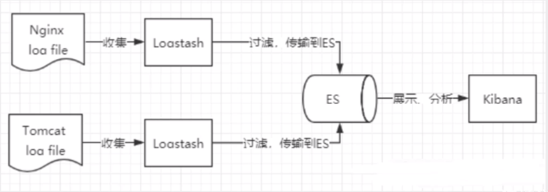
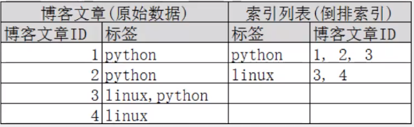
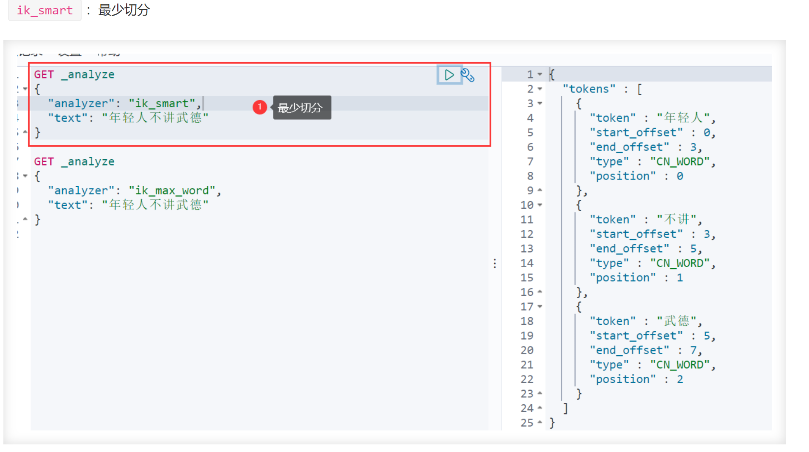
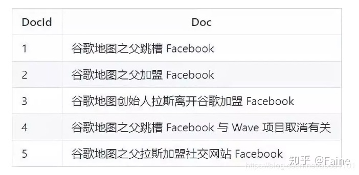
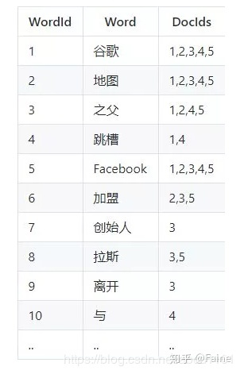

# 1. elasticsearch

<https://www.kuangstudy.com/bbs/1354069127022583809>

## 1.1. 定义

Elasticsearch 是一个基于 Lucene、分布式、通过 Restful 方式进行交互的近实时搜索平台框架
Logstash 是 ELK 的中央数据流引擎,用于从不同目标(文件/数据存储/MQ )收集的不同格式数据,经过过滤后支持输出到不同目的地(文件/MQ/redis/elasticsearch/kafka 等)。
Kibana 可以将 elasticsearch 的数据通过友好的页面展示出来 ,提供实时分析的功能。



收集清洗数据(Logstash) ==> 搜索、存储(ElasticSearch) ==> 展示(Kibana) ELK 是
Elasticsearch、Logstash、 Kibana 三大开源框架首字母大写简称。市面上也被成为
Elastic Stack。

## 倒排索引（Lucene 索引底层）

简单说就是 按（文章关键字，对应的文档\<0 个或多个\>）形式建立索引，根据关键字就
可直接查询对应的文档（含关键字的），无需查询每一个文档，如下图


## 1.2. 使用场景

1. 维基百科,类似百度百科，全文检索,高亮,搜索推荐
1. 电商网站,检索商品
1. 日志数据分析, logstash 采集日志, ES 进行复杂的数据分析, ELK 技术
   ,elasticsearch+logstash+kibana
1. 商品价格监控网站,用户设定某商品的价格阈值,当低于该阈值的时候,发送通知消息给用
   户,比如说订阅牙膏的监控,如果高露洁牙膏的家庭套装低于 50 块钱,就通知我,我就去
   买
1. BI 系统,商业智能, Business Intelligence。比如说有个大型商场集团，BI ,分析一下
   某某区域最近 3 年的用户消费 金额的趋势以及用户群体的组成构成,产出相关的数张报
   表, \*\*区,最近 3 年,每年消费金额呈现 100%的增长,而且用户群体 85%是高级白领，
   开-个新商场。ES 执行数据分析和挖掘, Kibana 进行数据可视化
1. 国内:站内搜索(电商,招聘,门户,等等),IT 系统搜索(OA,CRM,ERP,等等),数据分析(ES
   热门的一一个使用场景)

## 1.3. ik 分词器

IK 分词器：中文分词器, 把一段中文或者别的划分成一个个的关键字 ， 在搜索时候会把
自己的信息进行分词，会把数据库中或者索引库中的数据进行分词，然后进行一一个匹配操
作 IK 提供了两个分词算法: ik_smart 和 ik_max_word ,其中 ik_smart 为最少切分,
ik_max_word 为最细粒度划分!


## 1.4. Rest 风格说明

|method| url地址| 描述|
|--|--|--|
|PUT（创建,修改） |localhost:9200/索引名称/类型名称/文档id | 创建文档（指定文档id）
|POST（创建）| localhost:9200/索引名称/类型名称 | 创建文档（随机文档id）
|POST（修改） | localhost:9200/索引名称/类型名称/文档id/_update | 修改文档
|DELETE（删除）| localhost:9200/索引名称/类型名称/文档id |删除文档
|GET（查询） |localhost:9200/索引名称/类型名称/文档id | 查询文档通过文档ID
|POST（查询）| localhost:9200/索引名称/类型名称/文档id/_search | 查询所有数据

## 1.5. springboot 使用

```java

@Configuration
public class ElasticSearchConfig {
    // 注册 rest高级客户端 
    @Bean
    public RestHighLevelClient restHighLevelClient(){
        RestHighLevelClient client = new RestHighLevelClient(
                RestClient.builder(
                        new HttpHost("127.0.0.1",9200,"http")
                )
        );
        return client;
    }


@Autowired
public RestHighLevelClient restHighLevelClient;


// 索引的操作
// 1、索引的创建
@Test
public void testCreateIndex() throws IOException {
    CreateIndexRequest request = new CreateIndexRequest("liuyou_index");
    CreateIndexResponse response = restHighLevelClient.indices().create(request, RequestOptions.DEFAULT);
    System.out.println(response.isAcknowledged());// 查看是否创建成功
    System.out.println(response);// 查看返回对象
    restHighLevelClient.close();
}
// 2、索引的获取，并判断其是否存在
@Test
public void testIndexIsExists() throws IOException {
    GetIndexRequest request = new GetIndexRequest("index");
    boolean exists = restHighLevelClient.indices().exists(request, RequestOptions.DEFAULT);
    System.out.println(exists);// 索引是否存在
    restHighLevelClient.close();
}
// 3、索引的删除
@Test
public void testDeleteIndex() throws IOException {
    DeleteIndexRequest request = new DeleteIndexRequest("liuyou_index");
    AcknowledgedResponse response = restHighLevelClient.indices().delete(request, RequestOptions.DEFAULT);
    System.out.println(response.isAcknowledged());// 是否删除成功
    restHighLevelClient.close();
}


// 文档的操作

// 1、文档的添加
@Test
public void testAddDocument() throws IOException {
    // 创建一个User对象
    User liuyou = new User("liuyou", 18);
    // 创建请求
    IndexRequest request = new IndexRequest("liuyou_index");
    // 制定规则 PUT /liuyou_index/_doc/1
    request.id("1");// 设置文档ID
    request.timeout(TimeValue.timeValueMillis(1000));// request.timeout("1s")
    // 将我们的数据放入请求中
    request.source(JSON.toJSONString(liuyou), XContentType.JSON);
    // 客户端发送请求，获取响应的结果
    IndexResponse response = restHighLevelClient.index(request, RequestOptions.DEFAULT);
    System.out.println(response.status());// 获取建立索引的状态信息 CREATED
    System.out.println(response);// 查看返回内容 IndexResponse[index=liuyou_index,type=_doc,id=1,version=1,result=created,seqNo=0,primaryTerm=1,shards={"total":2,"successful":1,"failed":0}]
}
// 2、文档信息的获取
@Test
public void testGetDocument() throws IOException {
    GetRequest request = new GetRequest("liuyou_index","1");
    GetResponse response = restHighLevelClient.get(request, RequestOptions.DEFAULT);
    System.out.println(response.getSourceAsString());// 打印文档内容
    System.out.println(request);// 返回的全部内容和命令是一样的
    restHighLevelClient.close();
}
// 3、文档的获取，并判断其是否存在
@Test
public void testDocumentIsExists() throws IOException {
    GetRequest request = new GetRequest("liuyou_index", "1");
    // 不获取返回的 _source的上下文了
    request.fetchSourceContext(new FetchSourceContext(false));
    request.storedFields("_none_");
    boolean exists = restHighLevelClient.exists(request, RequestOptions.DEFAULT);
    System.out.println(exists);
}
// 4、文档的更新
@Test
public void testUpdateDocument() throws IOException {
    UpdateRequest request = new UpdateRequest("liuyou_index", "1");
    User user = new User("lmk",11);
    request.doc(JSON.toJSONString(user),XContentType.JSON);
    UpdateResponse response = restHighLevelClient.update(request, RequestOptions.DEFAULT);
    System.out.println(response.status()); // OK
    restHighLevelClient.close();
}
// 5、文档的删除
@Test
public void testDeleteDocument() throws IOException {
    DeleteRequest request = new DeleteRequest("liuyou_index", "1");
    request.timeout("1s");
    DeleteResponse response = restHighLevelClient.delete(request, RequestOptions.DEFAULT);
    System.out.println(response.status());// OK
}
// 6、文档的查询
// 查询
// SearchRequest 搜索请求
// SearchSourceBuilder 条件构造
// HighlightBuilder 高亮
// TermQueryBuilder 精确查询
// MatchAllQueryBuilder
// xxxQueryBuilder ...
@Test
public void testSearch() throws IOException {
    // 1.创建查询请求对象
    SearchRequest searchRequest = new SearchRequest();
    // 2.构建搜索条件
    SearchSourceBuilder searchSourceBuilder = new SearchSourceBuilder();
    // (1)查询条件 使用QueryBuilders工具类创建
    // 精确查询
    TermQueryBuilder termQueryBuilder = QueryBuilders.termQuery("name", "liuyou");
    //        // 匹配查询
    //        MatchAllQueryBuilder matchAllQueryBuilder = QueryBuilders.matchAllQuery();
    // (2)其他<可有可无>：（可以参考 SearchSourceBuilder 的字段部分）
    // 设置高亮
    searchSourceBuilder.highlighter(new HighlightBuilder());
    //        // 分页
    //        searchSourceBuilder.from();
    //        searchSourceBuilder.size();
    searchSourceBuilder.timeout(new TimeValue(60, TimeUnit.SECONDS));
    // (3)条件投入
    searchSourceBuilder.query(termQueryBuilder);
    // 3.添加条件到请求
    searchRequest.source(searchSourceBuilder);
    // 4.客户端查询请求
    SearchResponse search = restHighLevelClient.search(searchRequest, RequestOptions.DEFAULT);
    // 5.查看返回结果
    SearchHits hits = search.getHits();
    System.out.println(JSON.toJSONString(hits));
    System.out.println("=======================");
    for (SearchHit documentFields : hits.getHits()) {
        System.out.println(documentFields.getSourceAsMap());
    }
}
前面的操作都无法批量添加数据
// 上面的这些api无法批量增加数据（只会保留最后一个source）
@Test
public void test() throws IOException {
    IndexRequest request = new IndexRequest("bulk");// 没有id会自动生成一个随机ID
    request.source(JSON.toJSONString(new User("liu",1)),XContentType.JSON);
    request.source(JSON.toJSONString(new User("min",2)),XContentType.JSON);
    request.source(JSON.toJSONString(new User("kai",3)),XContentType.JSON);
    IndexResponse index = restHighLevelClient.index(request, RequestOptions.DEFAULT);
    System.out.println(index.status());// created
}
// 7、批量添加数据
// 特殊的，真的项目一般会 批量插入数据
@Test
public void testBulk() throws IOException {
    BulkRequest bulkRequest = new BulkRequest();
    bulkRequest.timeout("10s");
    ArrayList<User> users = new ArrayList<>();
    users.add(new User("liuyou-1",1));
    users.add(new User("liuyou-2",2));
    users.add(new User("liuyou-3",3));
    users.add(new User("liuyou-4",4));
    users.add(new User("liuyou-5",5));
    users.add(new User("liuyou-6",6));
    // 批量请求处理
    for (int i = 0; i < users.size(); i++) {
        bulkRequest.add(
                // 这里是数据信息
                new IndexRequest("bulk")
                        .id(""+(i + 1)) // 没有设置id 会自定生成一个随机id
                        .source(JSON.toJSONString(users.get(i)),XContentType.JSON)
        );
    }
    BulkResponse bulk = restHighLevelClient.bulk(bulkRequest, RequestOptions.DEFAULT);
    System.out.println(bulk.status());// ok
}

```

## 1.6. 为什么要使用Elasticsearch?

​
因为在我们商城中的数据，将来会非常多，所以采用以往的模糊查询，模糊查询前置配置，会放弃索引，导致商品查询是全表扫面，在百万级别的数据库中，效率非常低下，而我们使用ES做一个全文索引，我们将经常查询的商品的某些字段，比如说商品名，描述、价格还有id这些字段我们放入我们索引库里，可以提高查询速度。

## 1.7. 详细描述一下Elasticsearch索引文档的过程

　　协调节点默认使用文档ID参与计算（也支持通过routing），以便为路由提供合适的分片。
　　shard = hash(document_id) % (num_of_primary_shards)
　　当分片所在的节点接收到来自协调节点的请求后，会将请求写入到Memory Buffer，然后定时（默认是每隔1秒）写入到Filesystem Cache，这个从Momery Buffer到Filesystem 　　Cache的过程就叫做refresh；
　　当然在某些情况下，存在Momery Buffer和Filesystem Cache的数据可能会丢失，ES是通过translog的机制来保证数据的可靠性的。其实现机制是接收到请求后，同时也会写入到translog中，当Filesystem cache中的数据写入到磁盘中时，才会清除掉，这个过程叫做flush；
　　在flush过程中，内存中的缓冲将被清除，内容被写入一个新段，段的fsync将创建一个新的提交点，并将内容刷新到磁盘，旧的translog将被删除并开始一个新的translog。
　　flush触发的时机是定时触发（默认30分钟）或者translog变得太大（默认为512M）时；

## 1.8. 详细描述一下Elasticsearch更新和删除文档的过程(写操作)

删除和更新也都是写操作，但是Elasticsearch中的文档是不可变的，因此不能被删除或者改动以展示其变更；
磁盘上的每个段都有一个相应的.del文件。当删除请求发送后，文档并没有真的被删除，而是在.del文件中被标记为删除。该文档依然能匹配查询，但是会在结果中被过滤掉。当段合并时，在.del文件中被标记为删除的文档将不会被写入新段。
在新的文档被创建时，Elasticsearch会为该文档指定一个版本号，当执行更新时，旧版本的文档在.del文件中被标记为删除，新版本的文档被索引到一个新段。旧版本的文档依然能匹配查询，但是会在结果中被过滤掉。

## 1.9. 详细描述一下 Elasticsearch 搜索的过程(读操作)

读操作可以分为查询和搜索两种 ( Query Then Fetch)：

### 1.9.1. 查询：根据ID去GET一条doc

在写入某个doc的时候，这个doc会自动分配一个docID，当然这个docID也可以在写入时由客户端手动指定。在查询的时候，会对docID进行hash路由到一个随机的节点上，这个节点作为协调节点。

协调节点会找到doc存放在哪些节点上，包括该节点的主分片和副本分片。对于这些分片，将采取轮询的策略，从中随机选取一个读取，并由协调节点对数据进行返回

### 1.9.2. 搜索：根据一个单词或一段文本内容进行全文检索或精确匹配

客户端发送一个搜索请求到一个节点上，该节点成为协调节点，并将请求广播到索引所有的的shard上。然后每个shard将搜索自己的所有doc，进行匹配、排序，将符合的结果集返回给协调节点。

协调节点拉取这些docID对应的完整doc，然后全局的排序，分页等操作，产生最终的结果，并返回给客户端

## 1.10. 在并发情况下，Elasticsearch如果保证读写一致？

可以通过版本号使用乐观并发控制，以确保新版本不会被旧版本覆盖，由应用层来处理具体的冲突；

另外对于写操作，一致性级别支持quorum/one/all，默认为quorum，即只有当大多数分片可用时才允许写操作。但即使大多数可用，也可能存在因为网络等原因导致写入副本失败，这样该副本被认为故障，分片将会在一个不同的节点上重建。

对于读操作，可以设置replication为sync(默认)，这使得操作在主分片和副本分片都完成后才会返回；如果设置replication为async时，也可以通过设置搜索请求参数_preference为primary来查询主分片，确保文档是最新版本。

14.ElasticSearch中的集群、节点、索引、文档、类型是什么？
　　群集是一个或多个节点（服务器）的集合，它们共同保存您的整个数据，并提供跨所有节点的联合索引和搜索功能。群集由唯一名称标识，默认情况下为“elasticsearch”。此名称很重要，因为如果节点设置为按名称加入群集，则该节点只能是群集的一部分。
　　节点是属于集群一部分的单个服务器。它存储数据并参与群集索引和搜索功能。
　　索引就像关系数据库中的“数据库”。它有一个定义多种类型的映射。索引是逻辑名称空间，映射到一个或多个主分片，并且可以有零个或多个副本分片。 MySQL =>数据库 　　 ElasticSearch =>索引
　　文档类似于关系数据库中的一行。不同之处在于索引中的每个文档可以具有不同的结构（字段），但是对于通用字段应该具有相同的数据类型。 MySQL => Databases => 　 Tables => Columns / Rows ElasticSearch => Indices => Types =>具有属性的文档
　　类型是索引的逻辑类别/分区，其语义完全取决于用户。

15.ElasticSearch中的分片是什么?
　　在大多数环境中，每个节点都在单独的盒子或虚拟机上运行。

　　索引 - 在Elasticsearch中，索引是文档的集合。
　　分片 -因为Elasticsearch是一个分布式搜索引擎，所以索引通常被分割成分布在多个节点上的被称为分片的元素。

ElasticSearch中的集群、节点、索引、文档、类型是什么？

群集是一个或多个节点（服务器）的集合，它们共同保存您的整个数据，并提供跨所有节点的联合索引和搜索功能。群集由唯一名称标识，默认情况下为“elasticsearch”。此名称很重要，因为如果节点设置为按名称加入群集，则该节点只能是群集的一部分。
节点是属于集群一部分的单个服务器。它存储数据并参与群集索引和搜索功能。
索引就像关系数据库中的“数据库”。它有一个定义多种类型的映射。索引是逻辑名称空间，映射到一个或多个主分片，并且可以有零个或多个副本分片。 MySQL =>数据库 ElasticSearch =>索引
文档类似于关系数据库中的一行。不同之处在于索引中的每个文档可以具有不同的结构（字段），但是对于通用字段应该具有相同的数据类型。 MySQL => Databases => Tables => Columns / Rows ElasticSearch => Indices => Types =>具有属性的文档
类型是索引的逻辑类别/分区，其语义完全取决于用户。

## 1.11. ElasticSearch中的分片是什么？

索引 - 在Elasticsearch中，索引是文档的集合。
分片 -因为Elasticsearch是一个分布式搜索引擎，所以索引通常被分割成分布在多个节点上的被称为分片的元素。

## 1.12. ElasticSearch中的副本是什么？

一个索引被分解成碎片以便于分发和扩展。副本是分片的副本。一个节点是一个属于一个集群的ElasticSearch的运行实例。一个集群由一个或多个共享相同集群名称的节点组成。

## 1.13. 底层 lucene

简单来说，lucene 就是一个 jar 包，里面包含了封装好的各种建立倒排索引的算法代码。我们用 Java 开发的时候，引入 lucene jar，然后基于 lucene 的 api 去开发就可以了。

通过 lucene，我们可以将已有的数据建立索引，lucene 会在本地磁盘上面，给我们组织索引的数据结构。

## 1.14. 倒排索引

在搜索引擎中，每个文档都有一个对应的文档 ID，文档内容被表示为一系列关键词的集合。例如，文档 1 经过分词，提取了 20 个关键词，每个关键词都会记录它在文档中出现的次数和出现位置。

那么，倒排索引就是关键词到文档 ID 的映射，每个关键词都对应着一系列的文件，这些文件中都出现了关键词。
  

对文档进行分词之后，得到以下倒排索引。

  

另外，实用的倒排索引还可以记录更多的信息，比如文档频率信息，表示在文档集合中有多少个文档包含某个单词。

那么，有了倒排索引，搜索引擎可以很方便地响应用户的查询。比如用户输入查询 Facebook，搜索系统查找倒排索引，从中读出包含这个单词的文档，这些文档就是提供给用户的搜索结果。
