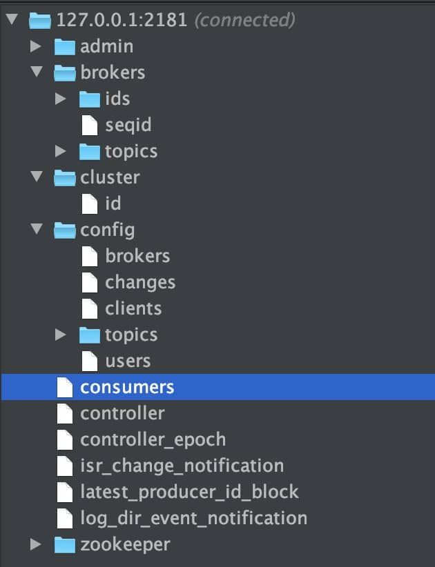
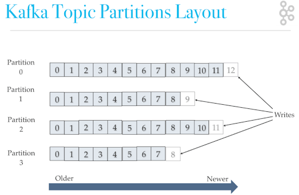

# 1. kafka

## 1.1. Kafka 是什么?主要应用场景有哪些?

Kafka 是一个分布式流式处理平台.

### 1.1.1. 流平台具有三个关键功能

1. 消息队列:
   发布和订阅消息流,这个功能类似于消息队列,这也是 Kafka 也被归类为消息队列的原因.
2. 容错的持久方式存储记录消息流:
   Kafka 会把消息持久化到磁盘,有效避免了消息丢失的风险.
3. 流式处理平台:
   在消息发布的时候进行处理,Kafka 提供了一个完整的流式处理类库.

### 1.1.2. Kafka 主要有两大应用场景

1. 消息队列 :建立实时流数据管道,以可靠地在系统或应用程序之间获取数据.
2. 数据处理: 构建实时的流数据处理程序来转换或处理数据流.

## 1.2. 和其他消息队列相比,Kafka 的优势在哪里?

1. 极致的性能 :基于 Scala 和 Java 语言开发,设计中大量使用了批量处理和异步的思想,最高可以每秒处理千万级别的消息.
2. 生态系统兼容性无可匹敌 :Kafka 与周边生态系统的兼容性是最好的没有之一,尤其在大数据和流计算领域.

## 1.3. Kafka 的消息模型知道吗?

Kafka 采用的是发布/订阅模型.
RocketMQ 的消息模型和 Kafka 基本是完全一样的.唯一的区别是 Kafka 中没有队列这个概念,与之对应的是 Partition(分区).

## 1.4. 什么是 Producer,Consumer,Broker,Topic,Partition?

Kafka 将生产者发布的消息发送到 Topic(主题) 中,需要这些消息的消费者可以订阅这些 Topic(主题),如下图所示:


1. Producer(生产者) : 产生消息的一方.
2. Consumer(消费者) : 消费消息的一方.
3. Broker(代理) : 可以看作是一个独立的 Kafka 实例.多个 Kafka Broker 组成一个 Kafka Cluster.

同时,你一定也注意到每个 Broker 中又包含了 Topic 以及 Partition 这两个重要的概念:

1. Topic(主题) : Producer 将消息发送到特定的主题,Consumer 通过订阅特定的 Topic(主题) 来消费消息.
1. Partition(分区) : Partition 属于 Topic 的一部分.一个 Topic 可以有多个 Partition ,并且同一 Topic 下的 Partition 可以分布在不同的 Broker 上,这也就表明一个 Topic 可以横跨多个 Broker

> Kafka 中的 Partition(分区) 实际上可以对应成为消息队列中的队列.

## 1.5. Kafka 的多副本机制了解吗?带来了什么好处?

Kafka 为分区(Partition)引入了多副本(Replica)机制.分区(Partition)中的多个副本之间会有一个叫做 leader 的家伙,其他副本称为 follower.发送的消息会被发送到 leader 副本,然后 follower 副本才能从 leader 副本中拉取消息进行同步.

生产者和消费者只与 leader 副本交互, 其他副本只是 leader 副本的拷贝,它们的存在只是为了保证消息存储的安全性.当 leader 副本发生故障时会从 follower 中选举出一个 leader,但是 follower 中如果有和 leader 同步程度达不到要求的参加不了 leader 的竞选.

### 1.5.1. Kafka 的多分区(Partition)以及多副本(Replica)机制有什么好处呢?

1. Kafka 通过给特定 Topic 指定多个 Partition, 而各个 Partition 可以分布在不同的 Broker 上, 这样便能提供比较好的并发能力(负载均衡).
2. Partition 可以指定对应的 Replica 数, 这也极大地提高了消息存储的安全性, 提高了容灾能力,不过也相应的增加了所需要的存储空间.

## 1.6. Zookeeper 在 Kafka 中的作用知道吗?



ZooKeeper 主要为 Kafka 提供元数据的管理的功能.

1. Broker 注册 :在 Zookeeper 上会有一个专门用来进行 Broker 服务器列表记录的节点.每个 Broker 在启动时,都会到 Zookeeper 上进行注册,即到 /brokers/ids 下创建属于自己的节点.每个 Broker 就会将自己的 IP 地址和端口等信息记录到该节点中去
2. Topic 注册 : 在 Kafka 中,同一个 Topic 的消息会被分成多个分区并将其分布在多个 Broker 上,这些分区信息及与 Broker 的对应关系也都是由 Zookeeper 在维护.比如我创建了一个名字为 my-topic 的主题并且它有两个分区,对应到 zookeeper 中会创建这些文件夹:/brokers/topics/my-topic/Partitions/0,/brokers/topics/my-topic/Partitions/1
3. 负载均衡 :上面也说过了 Kafka 通过给特定 Topic 指定多个 Partition, 而各个 Partition 可以分布在不同的 Broker 上, 这样便能提供比较好的并发能力. 对于同一个 Topic 的不同 Partition,Kafka 会尽力将这些 Partition 分布到不同的 Broker 服务器上.当生产者产生消息后也会尽量投递到不同 Broker 的 Partition 里面.当 Consumer 消费的时候,Zookeeper 可以根据当前的 Partition 数量以及 Consumer 数量来实现动态负载均衡.

## 1.7. Kafka 如何保证消息的消费顺序?

> 在使用消息队列的过程中经常有业务场景需要严格保证消息的消费顺序,比如同时发了 2 个消息,这 2 个消息对应的操作分别对应的数据库操作是:
>
> > 1. 更改用户会员等级.
> > 2. 根据会员等级计算订单价格.
>
> 假如这两条消息的消费顺序不一样造成的最终结果就会截然不同.

Kafka 中 Partition(分区)是真正保存消息的地方,发送的消息都被放在了这里.而的 Partition(分区) 又存在于 Topic(主题) 这个概念中,并且可以给特定 Topic 指定多个 Partition.


每次添加消息到 Partition(分区) 的时候都会采用尾加法,如上图所示. Kafka 只能为保证 Partition(分区) 中的消息有序.

消息在被追加到 Partition(分区)的时候都会分配一个特定的偏移量(offset).Kafka 通过偏移量(offset)来保证消息在分区内的顺序性.

### 1.7.1. 保证消息消费顺序的方法

1. 1 个 Topic 只对应一个 Partition.

   这样当然可以解决问题,但是破坏了 Kafka 的设计初衷.

1. (推荐) 发送消息的时候指定 key/Partition.

   Kafka 中发送 1 条消息的时候,可以指定 topic, partition, key,data(数据) 4 个参数.如果你发送消息的时候指定了 Partition 的话,所有消息都会被发送到指定的 Partition.并且,同一个 key 的消息可以保证只发送到同一个 partition,这个可以采用表/对象的 id 来作为 key .

## 1.8. Kafka 如何保证消息不丢失

### 1.8.1. 生产者丢失消息的情况

生产者(Producer) 调用 send 方法发送消息之后,消息可能因为网络问题并没有发送过去.所以,不能默认在调用 send 方法发送消息之后消息发送成功了.为了确定消息是发送成功,要判断消息发送的结果.

> 但是要注意的是 Kafka 生产者(Producer) 使用 send 方法发送消息实际上是异步的操作,可以通过 get()方法获取调用结果,但是这样也让它变为了同步操作,示例代码如下:
>
> ```java
> SendResult<String, Object> sendResult = kafkaTemplate.send(topic, o).get();
> if (sendResult.getRecordMetadata() != null) {
> logger.info("生产者成功发送消息到" + sendResult.getProducerRecord().topic() + "-> " + sendRe
> sult.getProducerRecord().value().toString());
> }
> ```
>
> 但是一般不推荐这么做!

可以添加回调函数验证是否发送信息成功

```java
ListenableFuture<SendResult<String, Object>> future = kafkaTemplate.send(topic, o);
future.addCallback(result -> logger.info("生产者成功发送消息到topic:{} partition:{}的消息", result.getRecordMetadata().topic(), result.getRecordMetadata().partition()),
        ex -> logger.error("生产者发送消失败,原因:{}", ex.getMessage()));
```

如果消息发送失败的话,检查失败的原因之后重新发送即可!

推荐为 Producer 的 retries(重试次数)设置一个比较合理的值,一般是 3 ,但是为了保证消息不丢失的话一般会设置比较大一点.设置完成之后,当出现网络问题之后能够自动重试消息发送,避免消息丢失.另外,建议还要设置重试间隔,因为间隔太小的话重试的效果就不明显了,网络波动一次你 3 次很快就重试完了

### 1.8.2. 消费者丢失消息的情况

知道消息在被追加到 Partition(分区)的时候都会分配一个特定的偏移量(offset).偏移量(offset)表示 Consumer 当前消费到的 Partition(分区)的所在的位置.Kafka 通过偏移量(offset)可以保证消息在分区内的顺序性.


当消费者拉取到了分区的某个消息之后,消费者会自动提交了 offset.自动提交的话会有一个问题,试想一下,当消费者刚拿到这个消息准备进行真正消费的时候,突然挂掉了,消息实际上并没有被消费,但是 offset 却被自动提交了.

解决办法也比较粗暴,手动关闭自动提交 offset,每次在真正消费完消息之后再自己手动提交 offset . 但是,细心的朋友一定会发现,这样会带来消息被重新消费的问题.比如你刚刚消费完消息之后,还没提交 offset,结果自己挂掉了,那么这个消息理论上就会被消费两次.

### 1.8.3. Kafka 消息丢失

Kafka 为分区(Partition)引入了多副本(Replica)机制.分区(Partition)中的多个副本之间会有一个叫做 leader 的家伙,其他副本称为 follower.发送的消息会被发送到 leader 副本,然后 follower 副本才能从 leader 副本中拉取消息进行同步.生产者和消费者只与 leader 副本交互. 其他副本只是 leader 副本的拷贝,它们的存在只是为了保证消息存储的安全性.

试想一种情况:假如 leader 副本所在的 broker 突然挂掉,那么就要从 follower 副本重新选出一个 leader ,但是 leader 的数据还有一些没有被 follower 副本的同步的话,就会造成消息丢失.

#### 设置 acks = all

解决办法就是设置 acks = all.acks 是 Kafka 生产者(Producer) 很重要的一个参数.

acks 的默认值即为 1,代表的消息被 leader 副本接收之后就算被成功发送.当配置 acks = all 代表则所有副本都要接收到该消息之后该消息才算真正成功被发送.

#### 设置 replication.factor >= 3

为了保证 leader 副本能有 follower 副本能同步消息,一般会为 topic 设置 replication.factor >= 3.这样就可以保证每个分区(partition) 至少有 3 个副本.虽然造成了数据冗余,但是带来了数据的安全性.

#### 设置 min.insync.replicas > 1

一般情况下还需要设置 min.insync.replicas> 1 ,这样配置代表消息至少要被写入到 2 个副本才算是被成功发送.min.insync.replicas 的默认值为 1 ,在实际生产中应尽量避免默认值 1.

但是,为了保证整个 Kafka 服务的高可用性,你需要确保 replication.factor > min.insync.replicas .为什么呢?设想一下假如两者相等的话,只要是有一个副本挂掉,整个分区就无法正常工作了.这明显违反高可用性!一般推荐设置成 replication.factor = min.insync.replicas + 1.

#### 设置 unclean.leader.election.enable = false

发送的消息会被发送到 leader 副本,然后 follower 副本才能从 leader 副本中拉取消息进行同步.多个 follower 副本之间的消息同步情况不一样,当配置了 unclean.leader.election.enable = false 的话,当 leader 副本发生故障时, 就不会从 follower 副本中和 leader 同步程度达不到要求的副本中选择出 leader, 这样降低了消息丢失的可能性.

## 1.9. Kafka 如何保证消息不重复消费

### 1.9.1. kafka 出现消息重复消费的原因

1. 服务端已经消费的数据没有成功提交 offset(根本原因).
1. Kafka 由于服务端处理业务时间长或者网络链接等等原因让 Kafka 认为服务假死,触发了分区重平衡 rebalance.

> 消费者 rebalance 发生在如果 consumer group 中某个消费者挂了，此时会自动把分配给他的分区交给其他的消费者，如果他又重启了，那么又会把一些分区重新交还给他

### 1.9.2. 解决方案

1. 消费者消息服务做幂等校验,比如 Redis 的 set,MySQL 的主键等天然的幂等功能.这种方法最有效.
1. 将 enable.auto.commit 参数设置为 false,关闭自动提交,开发者在代码中手动提交 offset.

### 1.9.3. 什么时候提交 offset 合适?

1. 处理完消息再提交:依旧有消息重复消费的风险,和自动提交一样
1. 拉取到消息即提交:会有消息丢失的风险.允许消息延时的场景,一般会采用这种方式.然后,通过定时任务在业务不繁忙(比如凌晨)的时候做数据兜底.
