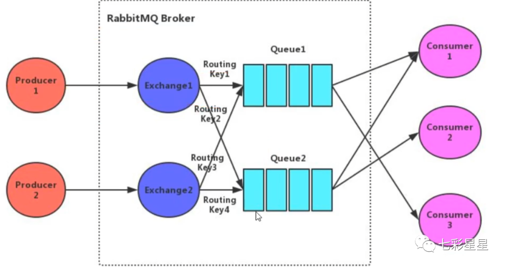

# 1. rabbitmq

## 1.1. rabbitmq的架构设计

  

1. Broker:rabbitmq的服务节点
1. Queue:队列,是RabbitMQ的内部对象,用于存储消息.RabbitMQ中消息只能存储在队列中.生产者投递消息到队列,消费者从队列中获取消息并消费.多个消费者可以订阅同一个队列,这时队列中的消息会被平均分摊(轮询)给多个消费者进行消费,而不是每个消费者都收到所有的消息进行消费.(注意:RabbitMQ不支持队列层面的广播消费,如果需要广播消费,可以采用一个交换器通过路由Key绑定多个队列,由多个消费者来订阅这些队列的方式.)
1. Exchange:交换器.生产者将消息发送到Exchange,由交换器将消息路由到一个或多个队列中.如果路由不到,或返回给生产者,或直接丢弃,或做其它处理.
1. RoutingKey:路由Key.生产者将消息发送给交换器的时候,一般会指定一个RoutingKey,用来指定这个消息的路由规则.这个路由Key需要与交换器类型和绑定键(BindingKey)联合使用才能最终生效.在交换器类型和绑定键固定的情况下,生产者可以在发送消息给交换器时通过指定RoutingKey来决定消息流向哪里.
1. bindingKey:通过绑定将交换器和队列关联起来,在绑定的时候一般会指定一个绑定键,这样RabbitMQ就可以指定如何正确的路由到队列了.交换器和队列实际上是多对多关系.就像关系数据库中的两张表.他们通过BindingKey做关联(多对多关系表).在投递消息时,可以通过Exchange和RoutingKey(对应BindingKey)就可以找到相对应的队列.

1. 信道:信道是建立在Connection之上的虚拟连接.当应用程序与Rabbit Broker建立TCP连接的时候,客户端紧接着可以创建一个AMQP信道(Channel),每个信道都会被指派一个唯一的D.RabbitMQ处理的每条AMQP指令都是通过信道完成的.信道就像电缆里的光纤束.一条电缆内含有许多光纤束,允许所有的连接通过多条光线束进行传输和接收.

### 1.1.1. RabbitMQ运转流程

#### 1.1.1.1. 生产者推送消息

1. 生产者连接到RabbitMQ的Broker建立一个连接(Connection),开启一个信道(Channel).
1. 生产者声明一个交换器,并设置相关属性,比如交换机类型,是否持久化等.
1. 生产者声明一个队列并设置相关属性,比如是否排他,是否持久化,是否自动删除等.
1. 生产者通过路由键将交换器和队列绑定起来.
1. 生产者发送消息至RabbitMQ的Broker,其中包含路由键,交换器等信息.
1. 相应的交换器根据接收到的路由键查找相匹配的队列.
1. 如果找到,则将从生产者发送过来的消息存入相应的队列中.
1. 如果没有找到,则根据生产者配置的属性选择丢弃还是回退给生产者.
1. 关闭信道.
1. 关闭连接.

#### 1.1.1.2. 消费者接收消息

1. 消费者连接到RabbitMQ的Broker,建立一个连接(Connection),开启一个信道(Channel).
1. 消费者向RabbitMQ的Broker请求消费相应队列中的消息,可能会设置相应的回调函数,以及做些准备工作(推拉模式).
1. 等待RabbitMQ的Broker回应并投递相应队列中的消息,消费者接收消息.
1. 消费者确认(ack)接收到的消息.
1. RabbitMQ从队列中删除相应己经被确认的消息.
1. 关闭信道.
1. 关闭连接.
注:上述有两个概念可以了解下,分别是信道(Channel)与连接(Connection),我们知道无论是生产者还是消费者,都需要和RabbitMQ的Broker建立连接,这个连接就是一条TCP连接,也就是Connection的TCP连接建立起来,客户端紧接着可以创建一个AMQP信道(Channel),每个信道都会被指派一个唯一的ID.Channel是建立在Connection之上的虚拟连接,RabbitMQ处理的每条AMQP指令都是通过信道完成的.

## 1.2. 简述RabbitMq的交换机类型

```java
Channel channel = connection.createChannel();    //在rabbitmq中创建一个信道
channel.exchangeDeclare("exchangeName", "direct"); //创建一个type为direct的交换器
channel.queueDeclare("queueName");    //创建一个队列
channel.queueBind("queueName", "exchangeName", "zhangsna");   //绑定并设置路由键
channel.queueBind("queueName", "exchangeName", "lisi");   //绑定并设置路由键
channel.queueBind("queueName", "exchangeName", "wangwu");   //绑定并设置路由键
```

1. fanout:扇形交换机,不再判断routekey,直接将消息分发到所有绑定的队列
1. direct:判断routekey的规则是完全匹配模式,即发送消息时指定的routekey要等于绑定的routekey
1. topic:判断routekey的规则是模糊匹配模式
1. header:绑定队列与交换器的时候指定一个键值对,当交换器在分发消息的时候会先解开消息体里的数据,然后判断里面是否有所设置的键值对,如果发现匹配成功,才将消息分发到队列中;这种交换器类型在性能上相对来说较差,在实际工作中很少会用到

## 1.3. rabbitmq如何保证消息可靠性不丢失

### 1.3.1. 生产者丢失消息

#### 1.3.1.1. 使用rabbitmq的事务功能

生产者在发送数据之前开启事务,然后发送消息,如果消息没有成功被rabbitmq接收到,那么生产者会受到异常报错,这时就可以回滚事务,然后尝试重新发送;如果收到了消息,那么就可以提交事务

```java
  channel.txSelect();//开启事务
  try{
      //发送消息
  }catch(Exection e){
      channel.txRollback();//回滚事务
      //重新提交
  }
```

##### 1.3.1.1.1. 缺点

rabbitmq事务已开启,就会变为同步阻塞操作,生产者会阻塞等待是否发送成功,太耗性能会造成吞吐量的下降.

#### 1.3.1.2. 生产者开启confirm模式

在生产者设置开启了confirm模式之后,每次写的消息都会分配一个唯一的id,然后如何写入了rabbitmq之中,rabbitmq会给回传一个ack消息,告诉这个消息发送OK了;如果rabbitmq没能处理这个消息,会回调一个nack接口,告诉这个消息失败了,可以进行重试.而且可以结合这个机制知道自己在内存里维护每个消息的id,如果超过一定时间还没接收到这个消息的回调,那么可以进行重发

```java
    //开启confirm
    channel.confirm();
    //发送成功回调
    public void ack(String messageId){

    }   

    // 发送失败回调
    public void nack(String messageId){
        //重发该消息
    }
```

##### 1.3.1.2.1. 二者不同

事务机制是同步的,提交了一个事务之后会阻塞住,但是confirm机制是异步的,发送消息之后可以接着发送下一个消息,然后rabbitmq会回调告知成功与否.
一般在生产者这块避免丢失,都是用confirm机制.

### 1.3.2. rabbitmq丢失数据

设置消息持久化到磁盘.设置持久化有两个步骤:

1. 创建queue的时候将其设置为持久化的,这样就可以保证rabbitmq持久化queue的元数据,但是不会持久化queue里面的数据.
1. 发送消息的时候讲消息的deliveryMode设置为2,这样消息就会被设为持久化方式,此时rabbitmq就会将消息持久化到磁盘上.
必须要同时开启这两个才可以.
而且持久化可以跟生产的confirm机制配合起来,只有消息持久化到了磁盘之后,才会通知生产者ack,这样就算是在持久化之前rabbitmq挂了,数据丢了,生产者收不到ack回调也会进行消息重发.

### 1.3.3. 消费者弄丢了数据

使用rabbitmq提供的ack机制,首先关闭rabbitmq的自动ack,然后每次在确保处理完这个消息之后,在代码里手动调用ack.这样就可以避免消息还没有处理完就ack.

## 1.4. RabbitMQ事务消息机制

### 1.4.1. 通过对信道设置实现

1. channel.txSelect(); 通知服务器开启事务模式;服务端会返回Tx.Select-Ok
2. channel.basicPublish;发送消息,可以是多条,可以是消费消息提交ack
3. channel.txCommit()提交事务;
4. channel.txRollback()回滚事务;

### 1.4.2. 消费者使用事务

1. autoAck=false,手动提交ack,以事务提交或回滚为准;
2. autoAck=true,不支持事务的,也就是说你即使在收到消息之后在回滚事务也是于事无补的,队列已经把消
息移除了

如果其中任意一个环节出现问题,就会抛出ioException异常,用户可以拦截异常进行事务回滚,或决定要不要重
复消息.事务消息会降低rabbitmq的性能, 同步机制, 会阻塞

```java
try{
        String exchangeName = "exchangeName";
        String routingKey = "routingKey";
        String queueName = "queueName";
        channel.exchangeDeclare(exchangeName,"direct",true);
        channel.queueDeclare(queueName,true,false,false,null);
        channel.queueBind(queueName,exchangeName,routingKey);
        byte [] messageBodyBytes = "Hello World!" .getBytes();
        channel.txSelect(); //开启事务
        channel.basicPublish(exchangeName, routingKey, null, messageBodyBytes);
        channel.txCommit(); //提交事务
    }catch (Exception e){
        e.printStackTrace();
        channel.txRollback();   //回滚
    }finally {
        channel.close();
        conn.close();
    }
```

## 1.5. rabbitmq的持久化机制

1. 交换机持久化:exchange_declare创建交互机时通过参数指定
1. 队列持久化:queue_declare创建队列时通过参数指定
1. 消息持久化:new AMQPMessage创建消息时通过参数指定
append的方式写文件,会根据大小自动生成新的文件,rabbitmq启动时会创建两个进程,一个负责持久化消息的存储,另一个负责非持久化消息的存储(内存不够时)
消息存储时会在ets表中记录消息在文件中的映射以及相关信息(包括id,偏移量,有效数据,左边文件,右边文件),消息读取时根据该信息到文件中读取,同时更新信息
消息删除时只从ets删除,变为垃圾数据,当垃圾数据超出比例(默认50%),并且文件数达到3个,触发垃圾回收,锁定左右两个文件,整理左边文件有效数据,将右边文件有效数据写入左边,更新文件信息,删除右边,完成合并.当一个文件的有用数据等于0时,删除该文件.

## 1.6. RabbitMQ的死信队列, 延时队列

### 1.6.1. 死信队列

1. 消息被消费方否定确认,使用channel.basicNack或channel.basicReject, 并且此时requeue属性被设置为false.
1. 消息在队列的存活时间超过设置的TTL时间
1. 消息队列的消息数量已经超过最大队列长度
那么该消息将成为"死信"."死信"消息会被RabbitMQ进行特殊处理,如果配置了死信队列信息,那么该消息将会被丢进死信队列中,如果没有配置,则该消息将会被丢弃

为每个需要使用死信的业务队列配置一个死信交换机,这里同一个项目的死信交换机可以共用一个,然后为每个业务队列分配一个单独的路由key,死信队列只不过是绑定在死信交换机上的队列,死信交换机也不是什么特殊的交换机,只不是是用来接受死信的交换机,所以可以为如何类型[Direct,Fanout,Topic]

### 1.6.2. 延迟队列

TTL: 一条消息或者该队列中的所有消息的最大存活时间

如果一条消息设置了TTL属性或者进入了设置TTL属性的队列,那么这条消息如果在TTL设置的时间内没有被消费,则会成为"死信".如果同时配置了队列的TTL和消息的TTL,那么较小的那个值将会被使用.

只需要消费者一直消费死信队列里的消息

## 1.7. RabbitMQ如何保证消息的可靠性传输

1,使用事务消息
2,使用消息确认机制

### 1.7.1. 发送方确认

1. channel设置为confirm模式,则每条消息会被分配一个唯一id
1. 消息投递成功,信道会发送ack给生产者,包含了id,回调ConfirmCallback接口
1. 如果发生错误导致消息丢失,发生nack给生产者.回调ReturnCallback接口
1. ack和nack只有一个触发,且只有一次,异步触发.可以继续发送消息

### 1.7.2. 接收方确认

1. 声明队列时,指定noack=false,broker会等待消费者手动返回ack,才会删除消息,否则立刻删除
1. broker的ack没有超时机制,只会判断链接是否断开,如果断开,消息会被重新发送

## 1.8. RabbitMQ如何确保消息发送 ? 消息接收?

### 1.8.1. 发送方确认机制

信道需要设置为 confirm 模式,则所有在信道上发布的消息都会分配一个唯一 ID.
一旦消息被投递到queue(可持久化的消息需要写入磁盘),信道会发送一个确认给生产者(包含消息唯一ID).
如果 RabbitMQ发生内部错误从而导致消息丢失,会发送一条nack(未确认)消息给生产者.
所有被发送的消息都将被 confirm(即ack)或者被nack一次.但是没有对消息被confirm 的快慢做任何保证,并且同一条消息不会既被 confirm又被nack

发送方确认模式是异步的,生产者应用程序在等待确认的同时,可以继续发送消息.当确认消息到达生产者,生产者的回调方法会被触发.
ConfirmCallback接口:只确认是否正确到达 Exchange 中,成功到达则回调
ReturnCallback接口:消息失败返回时回调

### 1.8.2. 接收方确认机制

消费者在声明队列时,可以指定noAck参数,当noAck=false时,RabbitMQ会等待消费者显式发回ack信号后才从内存(或者磁盘,持久化消息)中移去消息.否则,消息被消费后会被立即删除.
消费者接收每一条消息后都必须进行确认(消息接收和消息确认是两个不同操作).只有消费者确认了消息,RabbitMQ 才能安全地把消息从队列中删除.
RabbitMQ不会为未ack的消息设置超时时间,它判断此消息是否需要重新投递给消费者的唯一依据是消费该消息的消费者连接是否已经断开.这么设计的原因是RabbitMQ允许消费者消费一条消息的时间可以很长.保证数据的最终一致性;
如果消费者返回ack之前断开了链接,RabbitMQ会重新分发给下一个订阅的消费者.(可能存在消息重复消费的隐患,需要去重)

## 1.9. rabbitmq可以直连队列么?

可以的! 消费者和生产者使用相同的参数声明队列就可以,重复声明不会改变队列,谁先生效就用谁.

`channel.queueDeclare(QUEUE_NAME, false, false, false, null);`

## 1.10. 镜像队列作用

对于RabbitMQ的节点来说,有单节点模式和集群模式两种,其中集群模式又分为普通集群模式和镜像队列集群模式, RabbitMQ默认集群模式,并不包管队列的高可用性,尽管队列信息,交换机,绑定这些可以复制到集群里的任何一个节点,然则队列内容不会复制,固然该模式解决一项目组节点压力,但队列节点宕机直接导致该队列无法应用,只能守候重启,所以要想在队列节点宕机或故障也能正常应用,就要复制队列内容到集群里的每个节点,须要创建镜像队列.
