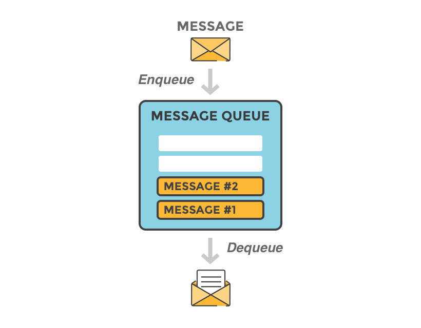
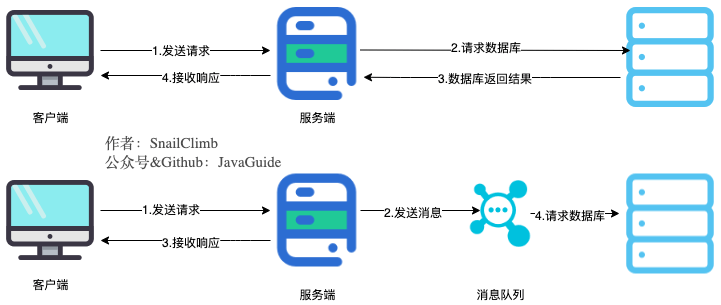
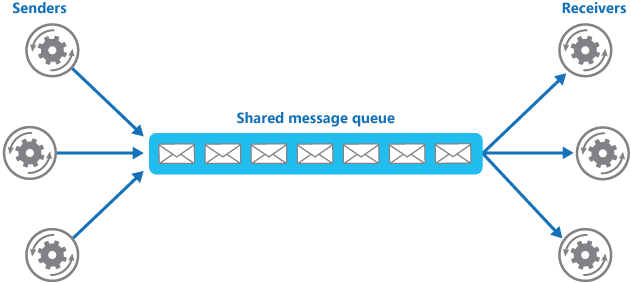
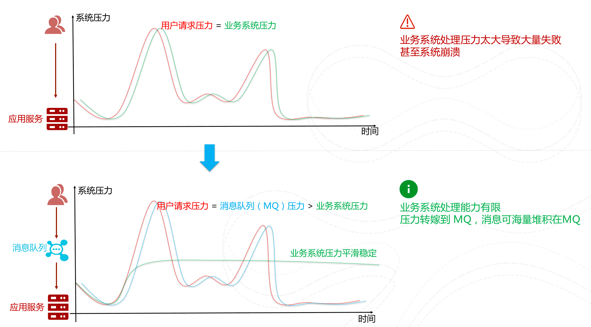
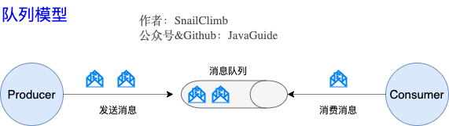
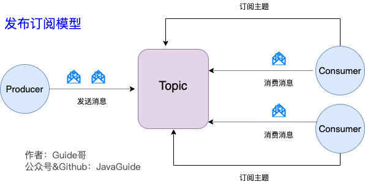
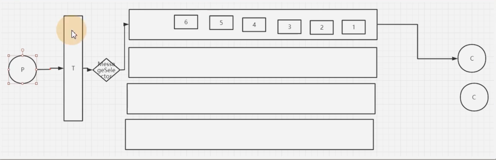
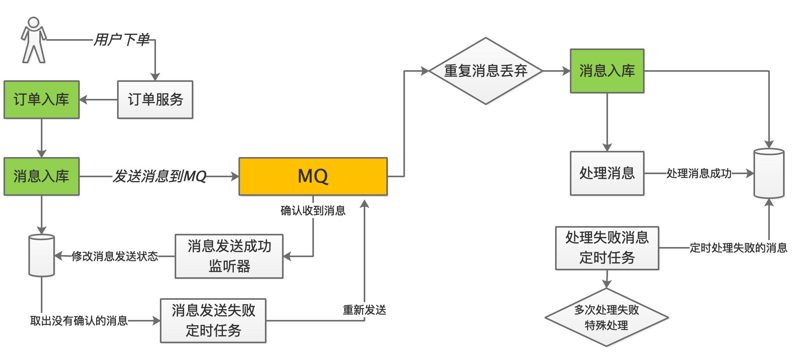

<!-- ---
sidebar: false
--- -->

# 1. summary

## 1.1. 什么是消息队列

消息队列 (Message Queue) 是一个存放消息的容器.由于队列 Queue 是一种先进先出的数据结构,所以消费消息时也是按照顺序来消费.

## 1.2. 为什么要用消息队列

使用消息队列主要是为了通过异步处理提高系统性能和解耦,削峰.

### 1.2.1. 通过异步处理提高系统性能,减少响应时间

  
将用户的请求数据存储到消息队列之后就立即返回结果.随后,系统再对消息进行消费.

> e.g. 快递。快递员->菜鸟驿站<-客户

#### 1.2.1.1. 作用

异步能提高系统的响应速度和吞吐量

因为用户请求数据写入消息队列之后就立即返回给用户了,但是请求数据在后续的业务校验,写数据库等操作中可能失败.因此,使用消息队列进行异步处理之后,需要适当修改业务流程进行配合

> 比如用户在提交订单之后,订单数据写入消息队列,不能立即返回用户订单提交成功,需要
> 在消息队列的订单消费者进程真正处理完该订单之后,甚至出库后,再通过电子邮件或短信
> 通知用户订单成功,以免交易纠纷.这就类似平时手机订火车票和电影票.

### 1.2.2. 解耦

生产者和消费者之间没有直接耦合，生产者将消息发送至分布式消息队列即结束对消息的处理，和消费者从分布式消息队列获取该消息后进行后续处理。

#### 1.2.2.1. 作用

服务之间进行解耦，可以减少服务之间的影响，提高系统的稳定性和可扩展性。
另外，解耦之后可以实现数据分发。生产者发送一个消息后，可以由多个消费者来处理。

### 1.2.3. 削峰/限流

先将短时间高并发产生的事务消息存储在消息队列中,然后后端服务再慢慢根据自己的能力去消费这些消息,这样就避免直接把后端服务打垮掉.

> 在电子商务一些秒杀,促销活动中,合理使用消息队列可以有效抵御促销活动刚开始大量订单涌入对系统的冲击.
> e.g. 长江涨水->三峡大坝

#### 1.2.3.1. 作用

以稳定的系统资源应对突发的流量冲击。

## 1.3. 使用消息队列带来的一些问题

1. 系统可用性降低:需要去考虑消息丢失或者说 MQ 宕机, 整个业务都会受到影响
1. 系统复杂性提高:需要保证消息没有被重复消费,处理消息丢失的情况,保证消息传递的顺
   序性等等问题
1. 一致性问题:消息的真正消费者如果没有正确消费消息就会导致数据不一致的情况, e.g.
   A 系统发消息，需要由 B、C 两个系统一同处理。如果 B 系统处理成功、C 系统处理失
   败，这会造成数据一致性的问题

## 1.4. JMS VS AMQP

### 1.4.1. JMS 简介

JMS(JAVA Message Service, java 消息服务),JMS 的客户端之间可以通过 JMS 进行异步的
消息传输.

JMS 是一个消息服务的标准/规范,允许应用程序组件基于 JavaEE 平台创建,发送,接收和读
取消息.它使分布式通信耦合度更低,消息服务更加可靠以及异步性.

### 1.4.2. JMS 两种消息模型

#### 1.4.2.1. 点到点 (P2P) 模型

使用队列 (Queue) 作为消息通信载体; 满足生产者与消费者模式,一条消息只能被一个消费
者使用,未被消费的消息在队列中保留直到被消费或超时.

> 比如:生产者发送 100 条消息的话,两个消费者来消费一般情况下两个消费者会按照消息
> 发送的顺序各自消费一半

#### 1.4.2.2. 发布/订阅 (Pub/Sub) 模型

发布订阅模型 (Pub/Sub) 使用主题 (Topic) 作为消息通信载体,类似于广播模式; 发布者
发布一条消息,该消息通过主题传递给所有的订阅者,在一条消息广播之后才订阅的用户则是
收不到该条消息的.

### 1.4.3. JMS 五种不同的消息正文格式

JMS 定义了五种不同的消息正文格式,以及调用的消息类型,允许发送并接收以一些不同形式
的数据,简单文本 (TextMessage), 可序列化的对象 (ObjectMessage), 键值对
(MapMessage), 字节流 (BytesMessage), 原始值流 (StreamMessage)

### 1.4.4. AMQP

AMQP (Advanced Message Queuing Protocol, 高级消息队列协议), 一个提供统一消息服务
的应用层标准高级消息队列协议,是应用层协议的一个开放标准,为面向消息的中间件设计,
兼容 JMS. 基于此协议的客户端与消息中间件可传递消息,并不受客户端/中间件同产品,不
同的开发语言等条件的限制.

生产者将消息发送给交换器,交换器和队列绑定,RabbitMQ 就是基于 AMQP 协议实现的.

### 1.4.5. AMQP 模型的几大组件?

1. 交换器 (Exchange): 消息代理服务器中用于把消息路由到队列的组件.
1. 队列 (Queue): 用来存储消息的数据结构,位于硬盘或内存中.
1. 绑定 (Binding): 一套规则,告知交换器消息应该将消息投递给哪个队列.

### 1.4.6. JMS vs AMQP

| 对比方向     | JMS                                     | AMQP                                                                                                                                                                                          |
| :----------- | :-------------------------------------- | :-------------------------------------------------------------------------------------------------------------------------------------------------------------------------------------------- |
| 定义         | Java API                                | 协议                                                                                                                                                                                          |
| 跨语言       | 否                                      | 是                                                                                                                                                                                            |
| 跨平台       | 否                                      | 是                                                                                                                                                                                            |
| 支持消息类型 | 提供两种消息模型:1. 点对点 2. 发布/订阅 | 提供了五种消息模型:①direct exchange; ②fanout exchange; ③topic change; ④headers exchange; ⑤system exchange.本质来讲,后四种和 JMS 的 pub/sub 模型没有太大差别,仅是在路由机制上做了更详细的划分; |
| 支持消息类型 | 支持多种消息类型                        | byte                                                                                                                                                                                |

总结:

- AMQP 为消息定义了线路层 (wire-level protocol) 的协议,而 JMS 所定义的是 API 规
  范.在 Java 体系中,多个 client 均可以通过 JMS 进行交互,不需要应用修改代码,但是
  其对跨平台的支持较差.而 AMQP 天然具有跨平台,跨语言特性.
- JMS 支持 TextMessage, MapMessage 等复杂的消息类型; 而 AMQP 仅支持 byte[] 消息
  类型 (复杂的类型可序列化后发送).
- 由于 Exchange 提供的路由算法,AMQP 可以提供多样化的路由方式来传递消息到消息队列
  ,而 JMS 仅支持 队列 和 主题/订阅 方式两种.

## 1.5. 常见的消息队列对比

| 对比方向 | 概要                                                                                                                                                                     |
| -------- | ------------------------------------------------------------------------------------------------------------------------------------------------------------------------ |
| 吞吐量   | 万级的 ActiveMQ 和 RabbitMQ 的吞吐量 (ActiveMQ 的性能最差) 要比十万级甚至是百万级的 RocketMQ 和 Kafka 低一个数量级.                                                      |
| 可用性   | 都可以实现高可用.ActiveMQ 和 RabbitMQ 都是基于主从架构实现高可用性.RocketMQ 基于分布式架构. kafka 也是分布式的,一个数据多个副本,少数机器宕机,不会丢失数据,不会导致不可用 |
| 时效性   | RabbitMQ 基于 erlang 开发,所以并发能力很强,性能极其好,延时很低,达到微秒级.其他三个都是 ms 级.                                                                            |
| 功能支持 | 除了 Kafka,其他三个功能都较为完备. Kafka 功能较为简单,主要支持简单的 MQ 功能,在大数据领域的实时计算以及日志采集被大规模使用,是事实上的标准                               |
| 消息丢失 | ActiveMQ 和 RabbitMQ 丢失的可能性非常低,RocketMQ 和 Kafka 理论上不会丢失.                                                                                                |

## 1.6. 如何进行产品选型

### 1.6.1. Kafka

1. 优点：吞吐量非常大，性能非常好，集群高可用。
1. 缺点：会丢数据，功能比较单一。
1. 使用场景：日志分析、大数据采集

### 1.6.2. RabbitMQ

1. 优点： 消息可靠性高，功能全面。
1. 缺点：吞吐量比较低，消息积累会严重影响性能。erlang语言不好定制。
1. 使用场景：小规模场景。

### 1.6.3. RocketMQ

1. 优点：高吞吐、高性能、高可用，功能非常全面。
1. 缺点：开源版功能不如云上商业版。官方文档和周边生态还不够成熟。客户
只支持java

## 1.7. mq如何保证消息的顺序

MQ只需要保证局部有序, 不需要保证全局有序
> e.g. 订单

  

生产者把一组有序的消息放到同一个队列当中，而消费者一次消费整个队列当中的消息。

1. Rocket: 有完整的设计，但是在RabbitMQ和Kafka当中，并没有完整的设计，需要自己进行设计。
1. RabbitMQ：要保证目标exchange只对应一个队列。并且一个队列只对应一个消费者。
1. Kafka:生产者通过定制partition分配规则，将消息分配到同一个partition。 Topic下只对应一个消费者。

## 1.8. 如何保证消息消费的幂等性(重复消费)？

实质是消费者重复消费的问题。由于网络原因, mq无法准确感知消费者的消费状态

### 1.8.1. 幂等性定义

幂等操作的特点是其任意多次执行所产生的影响均与一次执行的影响相同。

> e.g. 在RabbitMQ中消费幂等就是指给消费者发送多条同样的消息，消费者只会消费其中的一条。例如，在一次购物中提交订单进行支付时，当网络延迟等其他问题造成消费者重新支付，如果没有幂等性的支持，那么会对同一订单进行两次扣款，这是非常严重的，因此有了幂等性，当对同一个订单进行多次支付时，可以确保只对同一个订单扣款一次。

### 1.9. 解决方案

所有MQ产品并没有提供主动解决幂等性的机制，需要由消费者自行控制。

为了保证消息不被重复消费，首先要保证每个消息是唯一的，所以可以给每一个消息携带一个唯一的id(e.g. 有业务标识的ID, orderId)

1. 消费者监听到消息后获取消息的MsgId（这个MsgId是我们自定义消息的字段，是主键），先去Redis中查询这个MsgId是否存在。也可以生产者发送消息时指给消息对象设置唯一的 MessageID，只有该 MessageID 没有被消费者存入到Redis中即该消息未被消费，这样重发的消息才能在重试机制中再次被消费。
2. 如果不存在，则正常消费消息，并把消息的id存入Redis中。
3. 如果存在则丢弃或者拒绝此消息并不返回队列。

## 1.10. MQ如何保证分布式事务的最终一致性

  

### 1.10.1. 分布式事务

业务相关的多个操作，保证他们同时成功或者同时失败

### 1.10.2. 最终一致性

对于已改变写的数据的读取，最终都能获取已更新的数据，但不完全保证能立即获取已更新的数据

### 1.10.3. MQ中要保证事务的最终一致性，就需要做到两点

1. 生产者要保证100%的消息投递。事务消息机制
1. 消费者这一端需要保证幂等消费。唯一ID+业务自己实现的幂等

## 1.11. 消息队列如何保证消息可靠传输

### 1.11.1. 消息不能重复，也就是生产者不能重复生产消息，或者消费者不能重复消费消息

1. 首先要确保消息不多发，这个不常出现，也比较难控制，因为如果出现了多发，很大的原因是生产者自己的原因，如果要避免出现问题，就需要在消费端做控制
1. 要避免不重复消费，最保险的机制就是消费者实现幂等性，保证就算重复消费，也不会有问题，通过幂等性，也能解决生产者重复发送消息的问题

### 1.11.2. 消息不能丢失，生产者发送的消息，消费者一定要能消费到

1. 生产者发送消息时，要确认broker确实收到并持久化了这条消息，比rabbitmq的confirm机制，Kafka的ack机制都可以保证生产者能正确的将消息发送给broker
1. broker要等待消费者真正确认消费到了消息时才删除掉消息，这里通常就是消费端ack机制，消费者接收到一条消息后，如果确认没问题了，就可以给broker发送一个ack，broker接收到ack后才会删除消息

## 1.12. 死信队列是什么？延时队列是什么？

1．死信队列也是一个消息队列，它是用来存放那些没有成功消费的消息的，通常可以用来作为消息重试
2．延时队列就是用来存放需要在指定时间被处理的元素的队列，通常可以用来处理一些具有过期性操作的业务，比如十分钟内未支付则取消订单
