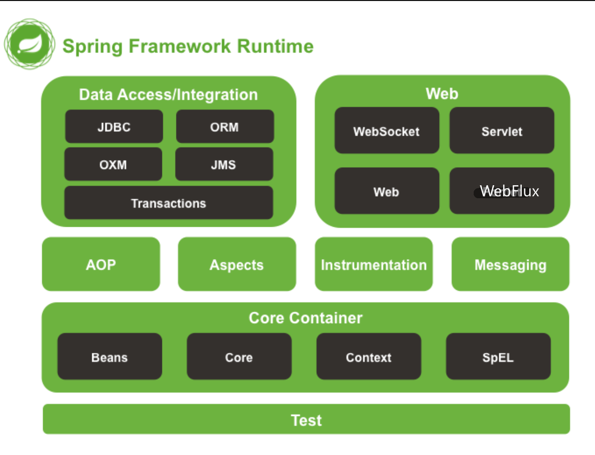
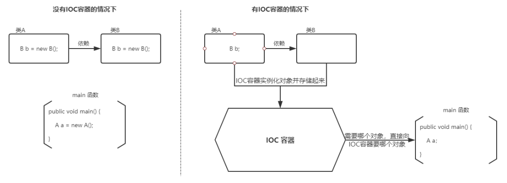
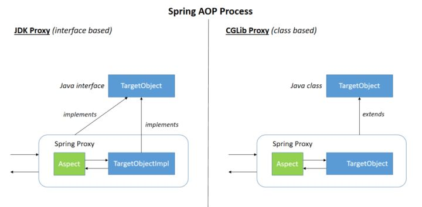
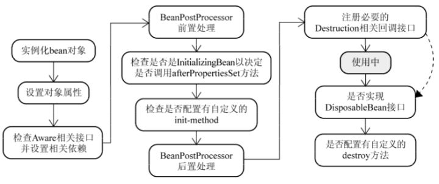
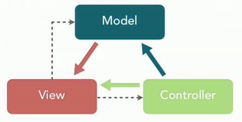
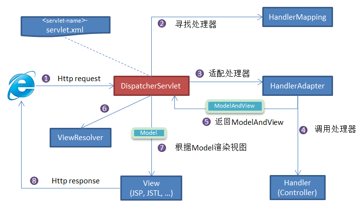

# 1. springboot

## 1.1. 什么是 Spring?

Spring 是一款开源的轻量级 Java 开发框架, 旨在提高开发人员的开发效率以及系统的可维护性.

## 1.2. 什么是 springboot

Spring Boot 是用来简化新 Spring 应用的初始搭建以及开发过程。该框架使用了特定的方式来进行配置，从而使开发人员不再需要定义样板化的配置。

## 1.3. 什么是 Spring 框架?

Spring 框架指的是 Spring Framework, 它是很多模块的集合, 使用这些模块可以很方便地协助进行开发.

Spring 自带 IoC(Inverse of Control:控制反转) 和 AOP(Aspect-Oriented Programming:面向切面编程), 可以很方便地对数据库进行访问, 可以很方便地集成第三方组件(电子邮件, 任务, 调度, 缓存等等), 对单元测试支持比较好, 支持 RESTful Java 应用程序的开发.

## 1.4. 列举一些重要的 Spring 模块?



### 1.4.1. Spring Core

核心模块, Spring 其他所有的功能基本都需要依赖于该类库, 主要提供 IoC 依赖注入功能的支持.

### 1.4.2. Spring Aspects

该模块为与 AspectJ 的集成提供支持.

### 1.4.3. Spring AOP

提供了面向切面的编程实现.

### 1.4.4. Spring Data Access/Integration

1. spring-jdbc : 提供了对数据库访问的抽象 JDBC.不同的数据库都有自己独立的 API 用于操作数据库, 而 Java 程序只需要和 JDBC API 交互, 这样就屏蔽了数据库的影响.
1. spring-transactions : 提供对事务的支持.
1. spring-orm : 提供对 Hibernate 等 ORM 框架的支持.
1. spring-oxm : 提供对 Castor 等 OXM 框架的支持.
1. spring-jms : Java 消息服务.

### 1.4.5. Spring Web

1. spring-web :对 Web 功能的实现提供一些最基础的支持.
1. spring-webmvc : 提供对 Spring MVC 的实现.
1. spring-websocket : 提供了对 WebSocket 的支持, WebSocket 可以让客户端和服务端进行双向通信.
1. spring-webflux :提供对 WebFlux 的支持.WebFlux 是 Spring Framework 5.0 中引入的新的响应式框架.与 Spring MVC 不同, 它不需要 Servlet API, 是完全异步.

### 1.4.6. Spring Test

Spring 的测试模块对 JUnit(单元测试框架), TestNG(类似 JUnit), Mockito(主要用来 Mock 对象), PowerMock(解决 Mockito 的问题比如无法模拟 final, static, private 方法)等等常用的测试框架支持的都比较好.

## 1.5. Spring IOC & AOP

### 1.5.1. 谈谈自己对于 Spring IoC 的了解

  

IoC(Inverse of Control:控制反转) 是一种设计思想, 而不是一个具体的技术实现.
IoC 的思想就是将原本在程序中手动创建对象的控制权, 交由 Spring 框架来管理.

#### 1.5.1.1. 为什么叫控制反转?

- 控制 :指的是对象创建(实例化, 管理)的权力
- 反转 :控制权交给外部环境(Spring 框架, IoC 容器)

将对象之间的相互依赖关系交给 IoC 容器来管理, 并由 IoC 容器完成对象的注入.这样可以很大程度上简化应用的开发, 把应用从复杂的依赖关系中解放出来. IoC 容器就像是一个工厂一样, 当需要创建一个对象的时候, 只需要配置好配置文件/注解即可, 完全不用考虑对象是如何被创建出来的.

> IoC 容器是 Spring 用来实现 IoC 的载体, IoC 容器实际上就是个 Map(key, value), Map 中存放的是各种对象.

#### 1.5.1.2. 什么是依赖注入

DI(Dependency Injection, 依赖注入)是将创建对象的权利反转给 IOC 容器,由 IOC 容器管理对象之间的依赖关系.

#### 1.5.1.3. AOC 与 DI 的区别

控制反转( IoC) 是一种设计思想, 依赖注入(DI) 是具体的实现方式

### 1.5.2. 谈谈自己对于 AOP 的了解

AOP(Aspect-Oriented Programming:面向切面编程)能够将那些与业务无关, 却为业务模块所共同调用的逻辑或责任(例如事务处理, 日志管理, 权限控制等)封装起来, 便于减少系统的重复代码, 降低模块间的耦合度, 并有利于未来的可拓展性和可维护性.

Spring AOP 就是基于动态代理的, 如果要代理的对象, 实现了某个接口, 那么 Spring AOP 会使用 JDK Proxy 去创建代理对象, 而对于没有实现接口的对象, 就无法使用 JDK Proxy 去进行代理了, 这时候 Spring AOP 会使用 Cglib 生成一个被代理对象的子类来作为代理, 如下图所示:

  

### 1.5.3. Spring AOP 和 AspectJ AOP 有什么区别?

Spring AOP 属于运行时增强, 而 AspectJ 是编译时增强. Spring AOP 基于代理(Proxying), 而 AspectJ 基于字节码操作(Bytecode Manipulation).

Spring AOP 已经集成了 AspectJ , AspectJ 应该算的上是 Java 生态系统中最完整的 AOP 框架了.AspectJ 相比于 Spring AOP 功能更加强大, 但是 Spring AOP 相对来说更简单,

如果的切面比较少, 那么两者性能差异不大.但是, 当切面太多的话, 最好选择 AspectJ , 它比 Spring AOP 快很多.

## 1.6. Spring bean

### 1.6.1. 什么是 bean?

  

bean 指的就是那些被 IoC 容器所管理的对象.

IoC 容器管理哪些对象是通过配置元数据来定义的.配置元数据可以是 XML 文件, 注解(@Configuration, @Bean...)或者 Java 配置类.

### 1.6.2. bean 的作用域有哪些?

1. singleton : 唯一 bean 实例, Spring 中的 bean 默认都是单例的, 对单例设计模式的应用.
1. prototype : 每次请求都会创建一个新的 bean 实例.
1. request : 每一次 HTTP 请求都会产生一个新的 bean, 该 bean 仅在当前 HTTP request 内有效.
1. session : 每一次来自新 session 的 HTTP 请求都会产生一个新的 bean, 该 bean 仅在当前 HTTP session 内有效.

#### 1.6.2.1. 如何配置 bean 的作用域呢?

```java
@Bean
@Scope(value = ConfigurableBeanFactory.SCOPE_PROTOTYPE)
public Person personPrototype() {
    return new Person();
}
```

### 1.6.3. 单例 bean 的线程安全问题了解吗?

大部分 bean 实际都是无状态(没有实例变量)的(比如 Dao, Service), 这种情况下, bean 是线程安全的.
若单例 bean 存在线程问题, 主要是因为当多个线程操作同一个对象的时候是存在资源竞争的.

#### 1.6.3.1. 常见的有两种解决办法

1. 在类中定义一个 ThreadLocal 成员变量, 将需要的可变成员变量保存在 ThreadLocal 中(推荐).
1. 在 bean 中尽量避免定义可变的成员变量. (不推荐)

### 1.6.4. @Component 和 @Bean 的区别是什么?

1. @Component 注解作用于类, 而@Bean 注解作用于方法.
2. @Component 通常是通过类路径扫描来自动侦测以及自动装配到 Spring 容器中(可以使用 @ComponentScan 注解定义要扫描的路径从中找出标识了需要装配的类自动装配到 Spring 的 bean 容器中).@Bean 注解通常是在标有该注解的方法中定义产生这个 bean, @Bean 告诉了 Spring 这是某个类的实例
3. @Bean 注解比 @Component 注解的自定义性更强, 而且很多地方只能通过 @Bean 注解来注册 bean.比如当引用第三方库中的类需要装配到 Spring 容器时, 则只能通过 @Bean 来实现.

#### 1.6.4.1. Bean 注解使用示例

```java
@Configuration
public class AppConfig {
    @Bean
    public TransferService transferService() {
        return new TransferServiceImpl();
    }
}
```

下面这个例子是通过 @Component 无法实现的.

```java
@Bean
public OneService getService(status) {
    case (status)  {
        when 1:
                return new serviceImpl1();
        when 2:
                return new serviceImpl2();
        when 3:
                return new serviceImpl3();
    }
}
```

### 1.6.5. 将一个类声明为 bean 的注解有哪些?

一般使用 @Autowired 注解自动装配 bean, 要想把类标识成可用于 @Autowired 注解自动装配的 bean 的类, 采用以下注解可实现:

1. @Component :通用的注解, 可标注任意类为 Spring 组件.如果一个 Bean 不知道属于哪个层, 可以使用@Component 注解标注.
1. @Repository : 对应持久层即 Dao 层, 主要用于数据库相关操作.
1. @Service : 对应服务层, 主要涉及一些复杂的逻辑, 需要用到 Dao 层.
1. @Controller : 对应 Spring MVC 控制层, 主要用户接受用户请求并调用 Service 层返回数据给前端页面.

### 1.6.6. @Resource 和 @Autowired 的区别

#### 1.6.6.1. 相同点

@Resource 和 @Autowired 注解都是用于 Bean 的注入

#### 1.6.6.2. 不同点

1. @Resource 是 Java 自己的注解, @Resource 有两个主要的属性, 分别是 name 和 type, 如果使用 name 属性, 则使用 byName 的自动注入策略. 而使用 type 属性, 则是使用 byType 的自动注入策略. 默认使用 byName 的自动注入策略.
1. @Autowired 是 spring 的注解, @Autowired 注解只根据 type 进行注入. 如果涉及到根据 type 无法辨别的注入对象, 将需要依赖 @Qualifier 或 @Primary 注解一起来修饰.

### 1.6.7. bean 的生命周期?

  

1. Bean 容器找到配置文件中 Spring Bean 的定义.
1. Bean 容器利用 Java Reflection API 创建一个 Bean 的实例.
1. 如果涉及到一些属性值 利用 set()方法设置一些属性值.
1. 如果 Bean 实现了 BeanNameAware 接口, 调用 setBeanName()方法, 传入 Bean 的名字.
1. 如果 Bean 实现了 BeanClassLoaderAware 接口, 调用 setBeanClassLoader()方法, 传入 ClassLoader 对象的实例.
1. 如果 Bean 实现了 BeanFactoryAware 接口, 调用 setBeanFactory()方法, 传入 BeanFactory 对象的实例.
1. 与上面的类似, 如果实现了其他 \*.Aware 接口, 就调用相应的方法.
1. 如果有和加载这个 Bean 的 Spring 容器相关的 BeanPostProcessor 对象, 执行 postProcessBeforeInitialization() 方法
1. 如果 Bean 实现了 InitializingBean 接口, 执行 afterPropertiesSet()方法.
1. 如果 Bean 在配置文件中的定义包含 init-method 属性, 执行指定的方法.
1. 如果有和加载这个 Bean 的 Spring 容器相关的 BeanPostProcessor 对象, 执行 postProcessAfterInitialization() 方法
1. 当要销毁 Bean 的时候, 如果 Bean 实现了 DisposableBean 接口, 执行 destroy() 方法.
1. 当要销毁 Bean 的时候, 如果 Bean 在配置文件中的定义包含 destroy-method 属性, 执行指定的方法.

## 1.7. Spring MVC

### 1.7.1. 说说自己对于 Spring MVC 了解?

  

MVC 是一种设计模式. MVC 是模型(Model), 视图(View), 控制器(Controller)的简写, 其核心思想是通过将业务逻辑, 数据, 显示分离来组织代码.

Spring MVC 可以帮助进行更简洁的 Web 层的开发, 并且它天生与 Spring 框架集成.

### 1.7.2. SpringMVC 工作原理了解吗?

Spring MVC 原理如下图所示:

  


流程说明(重要):

1. 客户端(浏览器)发送请求, 直接请求到 DispatcherServlet.
2. DispatcherServlet 根据请求信息调用 HandlerMapping, 解析请求对应的 Handler.
3. 解析到对应的 Handler(也就是平常说的 Controller 控制器)后, 开始由 HandlerAdapter 适配器处理.
4. HandlerAdapter 会根据 Handler 来调用真正的处理器开处理请求, 并处理相应的业务逻辑.
5. 处理器处理完业务后, 会返回一个 ModelAndView 对象, Model 是返回的数据对象, View 是个逻辑上的 View.
6. ViewResolver 会根据逻辑 View 查找实际的 View.
7. DispaterServlet 把返回的 Model 传给 View(视图渲染).
8. 把 View 返回给请求者(浏览器)

## 1.8. Spring 框架中用到了哪些设计模式?

- 工厂设计模式 : Spring 使用工厂模式通过 BeanFactory, ApplicationContext 创建 bean 对象.
- 代理设计模式 : Spring AOP 功能的实现.
- 单例设计模式 : Spring 中的 Bean 默认都是单例的.
- 模板方法模式 : Spring 中 jdbcTemplate, redisTemplate 等以 Template 结尾的对数据库操作的类, 它们就使用到了模板模式.
- 包装器设计模式 : 项目需要连接多个数据库, 而且不同的客户在每次访问中根据需要会去访问不同的数据库.这种模式让可以根据客户的需求能够动态切换不同的数据源.
- 观察者模式: Spring 事件驱动模型就是观察者模式很经典的一个应用.
- 适配器模式 : Spring AOP 的增强或通知(Advice)使用到了适配器模式, spring MVC 中也是用到了适配器模式适配 Controller.

## 1.9. Spring 事务

### 1.9.1. Spring 管理事务的方式有几种?

1. 声明式事务 : 直接基于注解(@Transactional)或在 XML 配置文件中配置, 实际是通过 AOP 实现
1. 编程式事务 : 在代码中硬编码(不推荐使用) : 通过 TransactionTemplate 或者 TransactionManager 手动管理事务, 实际应用中很少使用

### 1.9.2. Spring 事务中哪几种事务传播行为?

事务传播行为是为了解决业务层方法之间互相调用的事务问题.

当事务方法被另一个事务方法调用时, 必须指定事务应该如何传播.例如:方法可能继续在现有事务中运行, 也可能开启一个新事务, 并在自己的事务中运行.

#### 1.9.2.1. 正确的事务传播行为可能的值如下

1. TransactionDefinition.PROPAGATION_REQUIRED, 使用的最多的一个事务传播行为, 平时经常使用的@Transactional 注解默认使用就是这个事务传播行为.如果当前存在事务, 则加入该事务;如果当前没有事务, 则创建一个新的事务.
1. TransactionDefinition.PROPAGATION_REQUIRES_NEW, 创建一个新的事务, 如果当前存在事务, 则把当前事务挂起.也就是说不管外部方法是否开启事务, Propagation.REQUIRES_NEW 修饰的内部方法会新开启自己的事务, 且开启的事务相互独立, 互不干扰.
1. TransactionDefinition.PROPAGATION_NESTED, 如果当前存在事务, 则创建一个事务作为当前事务的嵌套事务来运行;如果当前没有事务, 则该取值等价于 TransactionDefinition.PROPAGATION_REQUIRED.
1. TransactionDefinition.PROPAGATION_MANDATORY, 如果当前存在事务, 则加入该事务;如果当前没有事务, 则抛出异常.(mandatory:强制性), 这个使用的很少.

#### 1.9.2.2. 若是错误的配置以下 3 种事务传播行为, 事务将不会发生回滚

1. TransactionDefinition.PROPAGATION_SUPPORTS: 如果当前存在事务, 则加入该事务;如果当前没有事务, 则以非事务的方式继续运行.
1. TransactionDefinition.PROPAGATION_NOT_SUPPORTED: 以非事务方式运行, 如果当前存在事务, 则把当前事务挂起.
1. TransactionDefinition.PROPAGATION_NEVER: 以非事务方式运行, 如果当前存在事务, 则抛出异常.

### 1.9.3. Spring 事务中的隔离级别有哪几种?

```java
public enum Isolation {
    DEFAULT(TransactionDefinition.ISOLATION_DEFAULT),
    READ_UNCOMMITTED(TransactionDefinition.ISOLATION_READ_UNCOMMITTED),
    READ_COMMITTED(TransactionDefinition.ISOLATION_READ_COMMITTED),
    REPEATABLE_READ(TransactionDefinition.ISOLATION_REPEATABLE_READ),
    SERIALIZABLE(TransactionDefinition.ISOLATION_SERIALIZABLE);

    private final int value;
    Isolation(int value) {
        this.value = value;
    }

    public int value() {
        return this.value;
    }
}
```

1. TransactionDefinition.ISOLATION_DEFAULT: 使用后端数据库默认的隔离级别, MySQL 默认采用的 REPEATABLE_READ 隔离级别, Oracle 默认采用的 READ_COMMITTED 隔离级别.
1. TransactionDefinition.ISOLATION_READ_UNCOMMITTED: 最低的隔离级别, 使用这个隔离级别很少, 因为它允许读取尚未提交的数据变更, 可能会导致脏读, 幻读或不可重复读
1. TransactionDefinition.ISOLATION_READ_COMMITTED: 允许读取并发事务已经提交的数据, 可以阻止脏读, 但是幻读或不可重复读仍有可能发生
1. TransactionDefinition.ISOLATION_REPEATABLE_READ: 对同一字段的多次读取结果都是一致的, 除非数据是被本身事务自己所修改, 可以阻止脏读和不可重复读, 但幻读仍有可能发生.
1. TransactionDefinition.ISOLATION_SERIALIZABLE: 最高的隔离级别, 完全服从 ACID 的隔离级别.所有的事务依次逐个执行, 这样事务之间就完全不可能产生干扰, 也就是说, 该级别可以防止脏读, 不可重复读以及幻读.但是这将严重影响程序的性能.通常情况下也不会用到该级别.

### 1.9.4. @Transactional(rollbackFor = Exception.class)注解了解吗?

Exception 分为运行时异常 RuntimeException 和非运行时异常.事务管理对于企业应用来说是至关重要的, 即使出现异常情况, 它也可以保证数据的一致性.

当 @Transactional 注解作用于类上时, 该类的所有 public 方法将都具有该类型的事务属性, 同时, 也可以在方法级别使用该标注来覆盖类级别的定义.如果类或者方法加了这个注解, 那么这个类里面的方法抛出异常, 就会回滚, 数据库里面的数据也会回滚.

在 @Transactional 注解中如果不配置 rollbackFor 属性, 那么事务只会在遇到 RuntimeException 的时候才会回滚, 加上 rollbackFor=Exception.class, 可以让事务在遇到非运行时异常时也回滚.

## 1.10. 如何在数据库中非持久化一个字段?

```java
@Entity(name="USER")
public class User {
    @Column(name = "ID")
    private Long id;
    private String secrect;
}

// 一般使用后面两种方式比较多, 个人使用注解的方式比较多.
1. static String secrect; // not persistent because of static
2. final String secrect = "Satish"; // not persistent because of final
3. transient String secrect; // not persistent because of transient
4. @Transient
    String secrect; // not persistent because of @Transient
```
