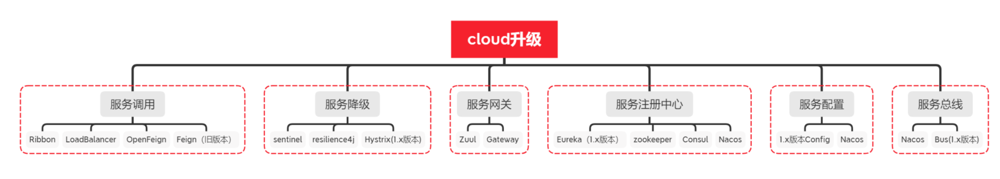

# 1. springcloud



## 1.1. 什么是 Spring Cloud

Spring Cloud 就是微服务系统架构的一站式解决方案, Spring Cloud 为我们提供了一套简易的编程模型, 使我们能在 Spring Boot 的基础上轻松地实现微服务项目的构建. 包括 服务发现注册, 配置中心, 消息总线, 负载均衡, 断路器, 数据监控等操作

## 1.2. nacos

Nacos 是阿里的一个开源产品, 它是针对微服务架构中的服务发现, 配置管理, 服务治理的综合型解决方案.

### 1.2.1. Nacos 注册中心原理

服务提供者, 服务消费者, 服务发现组件这三者之间的关系大致如下


1. 微服务在启动时, 将自己的网络地址等信息注册到服务发现组件 (nacos server) 中, 服务发现组件会存储这些信息.
1. 各个微服务与服务发现组件使用一定机制通信 (例如在一定的时间内发送心跳包).服务发现组件若发现与某微服务实例通信正常则保持注册状态 (up 在线状态),若长时间无法与某微服务实例通信, 就会自动注销 (即: 删除) 该实例.
1. 服务消费者可从服务发现组件查询服务提供者的网络地址, 并使用该地址调用服务提供者的接口.
1. 当微服务网络地址发生变更 (例如实例增减或者 IP 端口发生变化等) 时, 会重新注册到服务发现组件.

### 1.2.2. Nacos 主要提供以下四大功能

1. 服务发现与服务健康检查

   nacos 使服务更容易注册, 并通过 DNS 或 HTTP 接口发现其他服务, Nacos 还提供服务的实时健康检查, 以防止向不健康的主机或服务实例发送请求.

1. 动态配置管理

   配置服务允许您在所有环境中以集中和动态的方式管理所有服务的配置. Nacos 消除了在更新配置时重新部署应用程序, 这使配置的更改更加高效和灵活.

1. 动态 DNS 服务

   nacos 提供基于 DNS 协议的服务发现能力, 旨在支持异构语言的服务发现, 支持将注册在 Nacos 上的服务以域名的方式暴露端点, 让三方应用方便的查阅及发现.

1. 服务和元数据管理

   Nacos 能让您从微服务平台建设的视角管理数据中心的所有服务及元数据, 包括管理服务的描述, 生命周期, 服务的静态依赖分析, 服务的健康状态, 服务的流量管理, 路由及安全策略.

### 1.2.3. 加载多个配置文件怎么处理?

#### 1.2.3.1. NacosPropertySources

```java
@NacosPropertySources({@NacosPropertySource(dataId = "nacos-springboot",autoRefreshed = true)
    , @NacosPropertySource(dataId = "redis",autoRefreshed = true)
})
@SpringBootApplication
public class NacosSpringBootApp {
    public static void main(String[] args) {
        SpringApplication.run(NacosSpringBootApp.class, args);
    }
}
```

#### 1.2.3.2. NacosPropertySource

通过 @NacosPropertySource 可以注入一个配置文件, 一个项目中需要加载多个配置文件, 可以直接使用多个 @NacosPropertySource 注解即可.

```java
@NacosPropertySource(dataId = "nacos-springboot", autoRefreshed = true)
@NacosPropertySource(dataId = "redis", autoRefreshed = true)
@SpringBootApplication
public class NacosSpringBootApp {
    public static void main(String[] args) {
        SpringApplication.run(NacosSpringBootApp.class, args);
    }
}

```

#### 1.2.3.3. 在 Spring Cloud 应用中通过使用 spring.cloud.nacos.config.ext-config 参数配置来加载这多个配置内容

```properties
<!--  actuator.properties -->
spring.cloud.nacos.config.ext-config[0].dataId=actuator.properties
spring.cloud.nacos.config.ext-config[0].group=DEFAULT_GROUP
spring.cloud.nacos.config.ext-config[0].refresh=true

<!-- log.properties -->
spring.cloud.nacos.config.ext-config[1].dataId=log.properties
spring.cloud.nacos.config.ext-config[1].group=DEFAULT_GROUP
spring.cloud.nacos.config.ext-config[1].refresh=true
```

### 1.2.4. 配置修改了如何监听?

```java
@NacosConfigListener(dataId = "nacos-springboot")
public void onMessage(String config) {
  System.out.println(config);
}
```

### 1.2.5. Nacos 多环境配置

Nacos 提供了 Namespace (命名空间) ,Data ID (配置集 ID), Group (组) 来确定一个配置文件

dataId 的完整格式如下:

```properties
${prefix}-${spring.profiles.active}.${file-extension}
```

1. prefix 默认为 spring.application.name 的值, 也可以通过配置项 spring.cloud.nacos.config.prefix 来配置
1. spring.profiles.active 即为当前环境对应的 profile, 当 spring.profiles.active 为空时, 对应的连接符 - 也将不存在, dataId 的拼接格式变成 ${prefix}.${file-extension}
1. file-exetension 为配置内容的数据格式, 可以通过配置项 spring.cloud.nacos.config.file-extension 来配置. 目前只支持 properties 和 yaml 类型.

## 1.3. 什么是 Open Feign

OpenFeign 是 Spring Cloud 在 Feign 的基础上支持了 Spring MVC 的注解, 如 @RequesMapping 等, OpenFeign 直接内置了 Ribbon.
SpringCloudAlibaba 中使用 OpenFeign 时, 默认的负载均衡策略是轮询调用

在导入了 Open Feign 之后我们就可以进行愉快编写 Consumer 端代码了.

```java
// 使用 @FeignClient 注解来指定提供者的名字
@FeignClient(value = "eureka-client-provider")
public interface TestClient {
    // 这里一定要注意需要使用的是提供者那端的请求相对路径, 这里就相当于映射了
    @RequestMapping(value = "/provider/xxx", method = RequestMethod.POST)
    CommonResponse<List<Plan>> getPlans(@RequestBody planGetRequest request);
}
```

然后我们在 Controller 就可以像原来调用 Service 层代码一样调用它了.

```java
@RestController
public class TestController {
    // 这里就相当于原来自动注入的 Service
    @Autowired
    private TestClient testClient;
    // controller 调用 service 层代码
    @RequestMapping(value = "/test", method = RequestMethod.POST)
    public CommonResponse<List<Plan>> get(@RequestBody planGetRequest request) {
        return testClient.getPlans(request);
    }
}
```

## 1.4. 服务网关 gateway


### 1.4.1. 什么是微服务网关?

为了解决用户客户端在调用微服务系统中的多个消费者工程接口时, 需要维护非常多的消费者应用接口地址等信息, 以及可能存在不同应用见的调用跨域等问题, 微服务网关组件随即出现. 网关作为用户客户端和微服务接口之间的一个统一路由及其他功能的组件, 方便了用户客户端请求接口时不用去关注不同接口的地址路径等. 只需要统一调用网关的服务即可. 微服务网关为一个服务器服务, 是系统对外的唯一入口. 网关可以提供身份验证, 监控, 负载均衡, 缓存, 请求分片与管理等功能.

### 1.4.2. Gateway 核心概念

1, 路由 (routes) 路由为网关最基础功能, Gateway 网关路由信息由一个 ID, 一个目的 URL, 一组断言工厂和一组 Filter 组成, 如果断言为真, 则会对改请求路由到对应的 url 上.

2, 断言 (predicates)Java8 中的断言函数, SpringCloud Gateway 中的断言函数允许开发者去定义匹配来自用户端的请求 request 中的任何信息, 如请求参数和 Header 中的信息.

3, 过滤器 (Filters) 一个标准的 Spring webFilter,SpringCloud Gateway 中的过滤器分为两种, 针对服务的 Gateway Filter 和全局的 Global Filter.过滤器可以对请求和响应进行处理.

```yaml
spring:
  application:
    name: cloud-gateway
  cloud:
    gateway:
      routes:
        - id: payment_routh #payment_route    #路由的 ID, 没有固定规则但要求唯一, 建议配合服务名
          uri: http://localhost:8001 #匹配后提供服务的路由地址
          predicates:
            - Path=/payment/get/** # 断言, 路径相匹配的进行路由
```

## 1.5. 服务降级 sentinel

Sentinel, 是为微服务提供流量控制, 熔断降级的功能, 它和 Hystrix 提供的功能一样, 可以有效的解决微服务调用产生的 "雪崩" 效应, 为微服务系统提供了稳定性的解决方案. 随着 Hytrxi 进入了维护期, 不再提供新功能, Sentinel 是一个不错的替代方案. 通常情况, Hystrix 采用线程池对服务的调用进行隔离, Sentinel 才用了用户线程对接口进行隔离, 二者相比, Hystrxi 是服务级别的隔离, Sentinel 提供了接口级别的隔离, Sentinel 隔离级别更加精细, 另外 Sentinel 直接使用用户线程进行限制, 相比 Hystrix 的线程池隔离, 减少了线程切换的开销. 另外 Sentinel 的 DashBoard 提供了在线更改限流规则的配置, 也更加的优化.

### 1.5.1. Sentinel 具有以下特征

1. 丰富的应用场景: Sentinel 承接了阿里巴巴近 10 年的双十一大促流量的核心场景, 例如秒杀( 即突发流量控制在系统容量可以承受的范围) , 消息削峰填谷, 实时熔断下游不可用应用等.
1. 完备的实时监控: Sentinel 同时提供实时的监控功能. 您可以在控制台中看到接入应用的单台机器秒级数据, 甚至 500 台以下规模的集群的汇总运行情况.
1. 广泛的开源生态: Sentinel 提供开箱即用的与其它开源框架/库的整合模块, 例如与 Spring Cloud, Dubbo, gRPC 的整合. 您只需要引入相应的依赖并进行简单的配置即可快速地接入 Sentinel.
1. 完善的 SPI 扩展点: Sentinel 提供简单易用, 完善的 SPI 扩展点. 您可以通过实现扩展点, 快速的定制逻辑. 例如定制规则管理, 适配数据源等.

### 1.5.2. 使用

```xml
<dependency>
    <groupId>org.springframework.cloud</groupId>
    <artifactId>spring-cloud-starter-alibaba-sentinel</artifactId>
    <version>0.9.0.RELEASE</version>
</dependency>
```

```yml
spring:
  application:
    name: nacos-provider
  cloud:
    nacos:
      discovery:
        server-addr: 127.0.0.1:8848
    sentinel:
      transport:
        port: 8719
        dashboard: localhost:8080
```

```java
@RestController
public class ProviderController {
    @GetMapping("/hi")
    @SentinelResource(value="hi")
    public String hi(@RequestParam(value = "name",defaultValue = "forezp",required = false)String name){
        return "hi "+name;
    }
```
